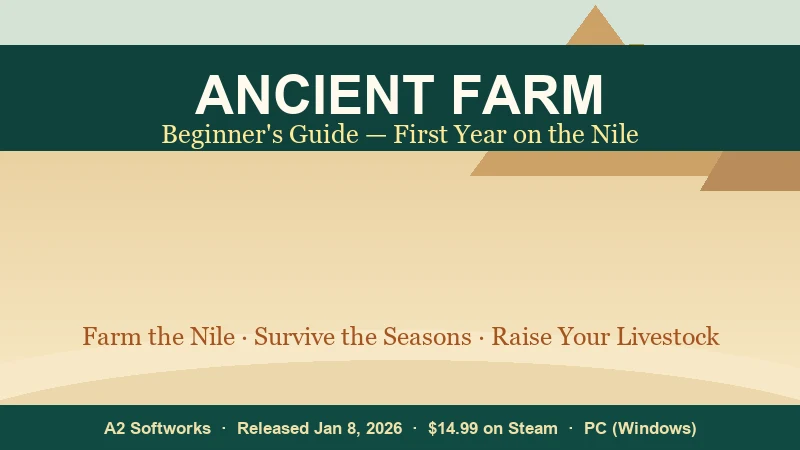
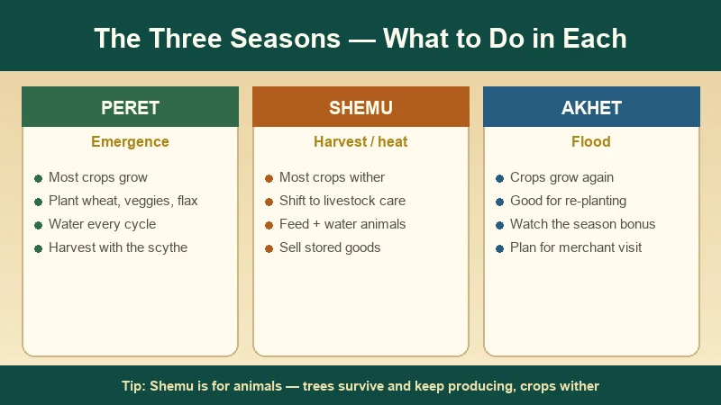
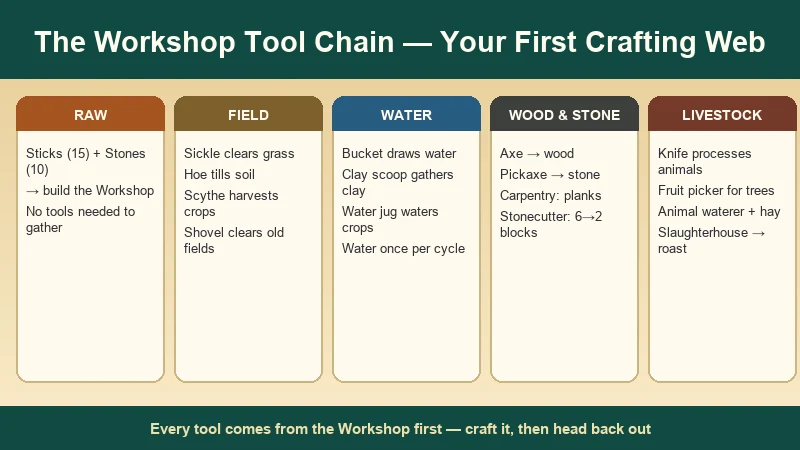
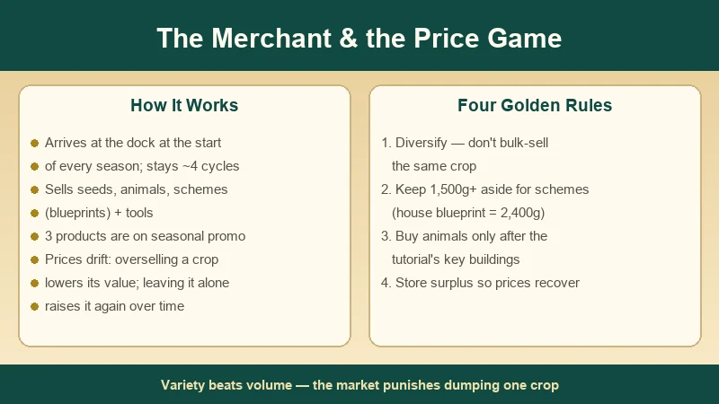
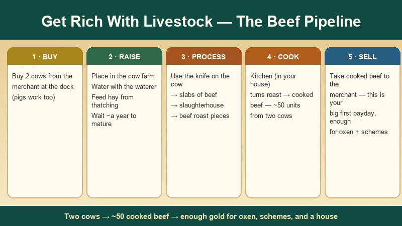

# Ancient Farm Beginner's Guide — First Year on the Nile

> Game: Ancient Farm (*古农庄* / *古代农场*) | Developer: A2 Softworks (Poland) | Publisher: Ultimate Games S.A., PlayWay S.A., Ultimate Publishing | Released: January 8, 2026 (Steam) | Price: $14.99 | Platforms: PC (Windows)

I picked up **Ancient Farm** shortly after its January 2026 release and put a full first in-game year into it, then went back and re-ran the tutorial a second time to write this guide. If you've ever wanted a farming sim with **zero automation** — no sprinklers, no tractors, no drones, just you, a hammer, and a river — this is it. You start on a patch of debris along the Nile in ancient Egypt, craft every tool by hand, and slowly turn scrubland into a working farm with wheat, coffee trees, and a herd of livestock.

This guide is built from my playthrough plus the Chinese video coverage on Bilibili (the *Saka-采采* full playthrough is the one I kept coming back to) and the community walkthroughs that followed launch. It covers the three seasons, the exact tool-crafting chain, how the merchant's price system actually works, and the livestock pipeline that turns two cows into your first big payday.

---

## What Is Ancient Farm?

**Ancient Farm** (Chinese titles: **古农庄**, **古代农场**) is a 3D cozy farming and building sim from Polish studio **A2 Softworks**, published by **Ultimate Games S.A.**, **PlayWay S.A.** and **Ultimate Publishing**. It launched on **January 8, 2026** on Steam for Windows. The hook is the setting and the hands-on loop: no modern tools, no automation — you clear land, craft tools from a workshop, plant and water crops by hand, raise livestock, and sell everything through a merchant who sails in each season.

| Fact | Detail |
|:-----|:-------|
| **Developer** | A2 Softworks (Poland) |
| **Publisher** | Ultimate Games S.A. · PlayWay S.A. · Ultimate Publishing |
| **Release date** | January 8, 2026 (Steam, PC/Windows) |
| **Price** | $14.99 USD base (regional pricing varies; frequent 40–50% sales) |
| **Steam rating** | "Mixed" — roughly 58% positive of ~180 reviews (mid-2026) |
| **Languages** | English, Simplified Chinese, Japanese, German, French, and more (no Traditional Chinese) |
| **Genre** | 3D cozy farming · crafting · building · no automation |
| **Minimum specs** | Windows 10 · i5-8400 / Ryzen 5 1600 · 8 GB RAM · GTX 1060 / RX 570 · 5 GB storage |
| **Pace** | Long, hand-holdy tutorial into a relaxed first-year loop; speed up time with F4 to move faster |

**The hook:** it's Stardew Valley stripped of all convenience. Crops grow in visible stages and rot if you miss a watering cycle, the three in-game seasons decide what you can even plant, and the only thing standing between you and a plow is an ox you have to feed, harness, and ride yourself.

> **First-person verdict:** the opening tutorial is genuinely good — it's long, but it teaches you the whole loop instead of dropping you in blind. The Mixed rating comes later, when the mid-game turns repetitive. I'll get to that honestly at the end.

---

## The Three Seasons — Peret, Shemu & Akhet

Ancient Farm borrows the real names of the ancient Egyptian seasons, but the game's own calendar runs in a cycle of **three seasons**, and knowing what each one allows is the single most important planning skill:

| Season | Real-world meaning | In-game behavior | What to do |
|:------|:-------------------|:-----------------|:-----------|
| **Peret** | "Emergence" (growing) | Main planting window — most crops grow | Plant wheat, vegetables and fiber crops; water every cycle |
| **Shemu** | "Harvest" / dry heat | **Dead season for most crops** — they wither if planted | Switch to livestock care; sell stored surplus |
| **Akhet** | "Flood" | Second growing window for most crops | Re-plant, chase the season yield bonus, restock before the merchant leaves |

Three things trip up new players here:

1. **Most crops, including wheat, simply will not grow in Shemu.** The walkthrough beats this into you because it's so easy to miss: if you plant wheat during Shemu, it withers away. Always check the crop's description before sowing — the game tells you the season compatibility right there.
2. **Crops grow slowly during Shemu even if they were planted earlier.** The beginner tip guides all say the same thing: **Shemu is the season for animals.** Feed and water your cows, expand your buildings, and wait it out.
3. **Some seasons give a percentage yield bonus.** You can see the active modifier in the bottom-right information panel while you interact with a plant. Harvesting during the bonus season returns more produce — the classic "plant in the off-season, harvest in the bonus" trick works if you read the panel.

**Trees break the rules.** The coffee tree you plant during the tutorial produces multiple times and keeps producing for years, and it survives long stretches without watering. Plants, by contrast, usually survive only a few cycles without water. If you want a set-and-forget income stream, trees are the answer; if you want a season's worth of produce, plants are better.

---

## The Workshop & the Tool Chain

Everything starts at the **workshop**. Your very first quest hands you a hammer, walks you to a golden circle, and has you place the workshop foundation — it costs **15 sticks and 10 stones**, and neither needs a tool to gather. That one building is the root of the whole crafting tree:

| Tool | What it does | When you'll want it |
|:-----|:-------------|:--------------------|
| **Hammer** | Builds foundations; the master build tool | From minute one |
| **Sickle** | Clears grass | First field |
| **Hoe** | Tills soil into farm plots | First field |
| **Bucket** | Draws water from the river | After the hoe |
| **Clay scoop** | Gathers clay from muddy deposits | For the water jug |
| **Water jug** | Waters crops (once per cycle) | As soon as crops are planted |
| **Axe** | Chops trees for wood | Planks and carpentry |
| **Pickaxe** | Breaks stone | Stone blocks |
| **Scythe** | Harvests mature crops | First harvest |
| **Shovel** | Clears old crop remains so a field can be replanted | After every harvest |
| **Knife** | Processes livestock into meat | First slaughter |
| **Fruit picker** | Harvests trees | Coffee tree onwards |

The tutorial makes you build the chain in exactly this order — and that's deliberate, because each tool unlocks the next material. A tip I wish I'd known: **once you craft a tool you don't have to stay in the workshop.** Craft it, walk back out, and get on with the task; the workshop isn't a menu you're stuck inside.

**Processing stations** take the chain further — the **carpentry station** turns wood into planks, the **stonecutter** turns 6 stone into 2 stone blocks, the **brickyard** turns clay into clay bricks, and the **mill** turns wheat into flour for bread. You'll notice the pattern: raw resource → workshop tool → processed material → bigger building.

---

## The First-Day Farming Loop

Here's the exact loop the tutorial walks you through, which is the same loop you'll run for the rest of the game:

1. **Clear the field** with the sickle.
2. **Till the soil** with the hoe.
3. **Sow seeds** — you start with carrot seeds; use them on the tilled soil.
4. **Craft the water chain**: bucket → clay scoop → water jug.
5. **Water every cycle** — plants need water once per cycle, or they start failing.
6. **Speed up time** with **F4** (and slow it with **F3**) while you wait.
7. **Harvest** with the scythe when the crop matures.
8. **Clear the field** with the shovel — a harvested plot can't be re-sown until you shovel the remains.

The bottom-right information panel is your best friend: it shows how many cycles remain until a crop is ready, the active season modifier, and the watering status. Check it before you walk away from a plot.

> **The one thing everyone forgets:** a used field must be **shoveled** before you can plant again. Buy or craft the shovel early — replanting onto uncleared soil is a classic first-week mistake.

**Carry weight matters more than you think.** Your inventory has a weight limit (the tutorial caps it at **1500**), and it shows in the corner of the inventory screen. Water is heavy; clay is heavy; a full stack of wheat adds up. Get over-encumbered and your movement slows to a crawl. Two early-return trips beat one overstuffed one — and that's exactly why the **storage building** (buildable from the hammer menu) is worth placing early.

---

## The Merchant & the Price Game

The merchant is the game's entire economy. He **arrives at the dock at the start of every season and stays for about four cycles** before sailing away. He sells seeds, animals, schemes (blueprints) and tools, and he buys your produce. If he's not there when you check, speed up time until the next cycle — he'll be back.

The part most guides bury, and the part that will make or break your first year, is **how prices move**:

- **Sell the same product repeatedly and its value drops** with each unit. Dump 100 of one crop and you'll be selling the tail of the stack at a fraction of the price.
- **Leave a product alone for a long time and its price climbs back up.** The market is a gentle supply-and-demand sim.
- **Three products are on seasonal promotion** — highlighted in the shop — so check which ones are boosted before you sell.
- **Some products are worth holding across seasons** for the price recovery. This is what the storage building is for.

**The four golden rules** (learned the expensive way):

1. **Diversify.** Plant several crops, not one giant field of the same plant. The bulk-sell penalty eats your margin otherwise.
2. **Keep gold in reserve.** The house blueprint alone costs **2,400g**, and the tutorial keeps asking for purchases. If you blow everything on a pig on day three, you'll be selling stuff back to afford the blueprint (I did exactly this — don't).
3. **Buy animals after the tutorial's key buildings, not before.** The tutorial flags specific purchases; follow that order.
4. **Store surplus in the storage building** so you can wait out price crashes instead of selling into them.

---

## Building Your Farm — the Progression Chain

Every structure comes from the hammer's build menu, and the more advanced ones need a **scheme** (blueprint) bought from the merchant's **"Other" tab**. The tutorial chain in order:

1. **Workshop** — 15 sticks + 10 stones. The root of all crafting.
2. **Carpentry station** — turns wood into planks.
3. **Stonecutter** — 6 stone → 2 stone blocks.
4. **Brickyard** — clay → clay bricks.
5. **House** — 20 grass + 6 planks + 9 stone blocks + 9 clay bricks + **house scheme (2,400g)**. The house gives you a kitchen (bread + cooked meat) and a cozy interior that's already furnished — a nice touch.
6. **Mill** — wheat → flour, for bread in the kitchen oven.
7. **Storage building** — worth placing as soon as you have spare materials.
8. **Cow farm, barn, coach house** — the livestock infrastructure (below).
9. **Bakery & advanced kitchen** — later, for multi-ingredient recipes.

> **Don't skip the mill-to-bread chain.** Wheat is one of the most reliable crops (plant it in Peret or Akhet), and bread sells for more than raw wheat. It's the first processing chain you can run, and it pays for the scheme grind.

---

## Livestock — the Road to Real Money

Here's the honest first-year economics: **crops are the cozy way to live, but livestock is how you get rich.** If you want the oxen, the schemes, and the temple on the hill, this is the pipeline:

**The cow pipeline (turn two cows into ~50 cooked beef):**

1. **Buy 2 cows** from the merchant and place them in the **cow farm** (the board near the gate is where you add animals to a structure). The tutorial gives you a young cow for free — it produces less meat than a purchased one, but it's a start.
2. **Keep them fed and watered.** The **animal waterer** handles water for all animals; the **thatching station** turns grass into **hay** for food. Feed the cows for several cycles until they fully mature — **expect roughly a year**.
3. **Process them.** Craft the **knife**, use it on a cow to get **slabs of beef** (this removes the animal from the farm), take the slabs to the **slaughterhouse** for **beef roast pieces**, then to the **kitchen** in your house for **cooked meat**.
4. **Sell.** Two mature cows produce on the order of **50 units of cooked beef** — that's your first real payday, enough to buy an ox, the barn scheme, and the next wave of seeds.

**Pigs work too** — the merchant sells them, and they follow the same shelter-and-process pattern (a pig farm site, then pork into the kitchen). The one rule across all livestock: **each animal type has its own shelter, and its produce is processed at a different structure.** Read the merchant's animal entries before you buy.

**Shemu is the season to lean into livestock** — crops wither, animals don't.

---

## Oxen & Plows — Farming Gets Faster

The ox is the biggest quality-of-life unlock in the first year, and it's the game's best use of all that livestock money:

1. **Build the small barn** (needs a scheme from the merchant) and buy an **ox**.
2. Add the ox via the wooden board near the barn entrance.
3. **Build the coach house** next to the barn (another scheme), then buy a **plow** — for the tutorial you only need the small plow.
4. Interact with the coach house's board to set the plow.
5. **Lead the ox** to the coach house, open the ox's action menu, and select **harness** — the ox attaches to the plow automatically.
6. **Ride the plow** and till large areas of land in one pass.

Ox-tilling is dramatically faster than the hand hoe, and it's the point where the farm stops being a chore and starts being a business. It's also a reminder of the game's whole design philosophy: even the "automation" is a manual, physical thing — you steer the ox yourself.

---

## The Golden Rules for Beginners

These are the tips that survive from the community guides and my own first year:

- **Don't bulk-grow one crop.** Ten of the same plant becomes a price-crash problem at the dock.
- **Build the storage building early.** Carry weight is brutal, and storage lets you wait out price drops.
- **Look up.** Quest locations are marked by **beams of light in the sky** — during the tutorial especially, stop running around and look up.
- **Keep money aside.** Schemes (2,400g for the house) and tutorial purchases will drain you; a reserve is not optional.
- **Use F4 aggressively.** Crop waiting is the game's idle time — speed it up.
- **Check the crop description before sowing.** Season compatibility is printed right there; Shemu eats careless planters.
- **Don't over-collect water or heavy resources.** Watch the 1,500 weight cap and your movement slows to a crawl.

---

## Is Ancient Farm Worth It? (An Honest Take)

Let me be straight, because the Steam rating deserves context. Ancient Farm sits at **"Mixed" — roughly 58% positive of ~180 reviews** as of mid-2026. That's not hype, and I'm not going to pretend otherwise.

**What it does well:**

- The **painterly Egyptian setting is genuinely pretty** — birds, moving scenery, a calm riverside world. Reviewers at *The Drastik Measure* (7.8/10) and *Simsational Char* (7/10) both call it out.
- The **tutorial is clear and complete.** It's long and hand-holdy, but it teaches the whole loop.
- The **economy is active and interesting.** Seasonal merchant, price drift, promotions — there's real thought here.
- It **runs smoothly** and the management loop is satisfying early on.

**Where it stumbles:**

- The **mid-to-late game gets repetitive** — the same gather → craft → build → sell loop, with the world staying a little empty.
- **Exploration is minimal** and the narrative is thin.
- The world can feel **lonely** early on; there aren't many characters around your farm.

**The comparison:**

| | Ancient Farm | Doloc Town | Stardew Valley |
|:--|:--|:--|:--|
| **Setting** | Ancient Egypt (Nile) | Post-apocalyptic wasteland | Cozy countryside |
| **Automation** | None — everything by hand (ox plow at best) | Full drone automation in 1.0 | Sprinklers + auto-petters |
| **Seasons** | 3 (Peret, Shemu, Akhet) — crops die in Shemu | 4 months, acid rain + scorching sun | 4 seasons, benign |
| **Economy** | Seasonal merchant with dynamic prices | Festivals + traders | Dynamic town economy |
| **Price** | $14.99 | $19.99 ($15.99 launch) | $14.99 |
| **Steam rating** | Mixed (~58%) | Overwhelmingly Positive (95%) | Overwhelmingly Positive |

**My verdict:** if you like *relaxed* farming sims — no survival pressure, no enemies, no hunger bar — Ancient Farm is worth its $14.99 on sale, especially if the "no automation, everything by hand" premise appeals to you. If you bounce off repetition quickly or need NPC-rich worlds, wait for a steeper discount or grab Doloc Town or Stardew first. For cozy-game fans who loved the manual grind in early Stardew, it's a genuinely pleasant afternoon-farm.

---

## FAQ

### When did Ancient Farm release?
It launched on **January 8, 2026** on Steam for PC (Windows), developed by A2 Softworks and published by Ultimate Games S.A., PlayWay S.A., and Ultimate Publishing.

### How much does Ancient Farm cost?
**$14.99** base on Steam. Regional pricing varies, and the game has gone 40–50% off in frequent sales — if you're on the fence, wishlist it and wait for a discount.

### What are the three seasons in Ancient Farm?
**Peret** (main planting season), **Shemu** (the "dead" season — most crops wither, so shift to livestock), and **Akhet** (the second growing window with a flood theme).

### How do I get rich in Ancient Farm?
Raise livestock. **Buy two cows**, feed and water them until they mature (roughly a year), process them through the knife → slaughterhouse → kitchen chain into **~50 units of cooked beef**, and sell it to the merchant. That bankrolls your ox, barn scheme, and next expansion.

### How does the merchant work?
The merchant **arrives at the dock at the start of each season and stays about four cycles**. Selling the same product repeatedly lowers its price; leaving it alone lets the price recover. Three products are on seasonal promotion each visit.

### How do I attach the plow to the ox?
Lead the ox to the **coach house**, make sure the small plow is set via the coach house's wooden board, then open the ox's action menu and choose **harness**. The ox attaches to the plow automatically and you can ride it to till large fields.

### Is Ancient Farm worth buying in 2026?
At **$14.99** (or on sale), it's a pleasant buy if you like slow, hand-crafted farming with no automation and a pretty Egyptian world. The Steam rating is Mixed (~58%) mostly because the mid-game gets repetitive — set your expectations to "cozy grind, not deep narrative" and you'll enjoy it more.

---

*Guide data gathered from the Steam store page, community walkthroughs and reviews (Into Indie Games, The Drastik Measure, Simsational Char), and Chinese video guide coverage on Bilibili (Saka-采采's full Ancient Farm playthrough, published January 2026). Prices and ratings reflect the August 2026 state and may change — always check the Steam page before buying.*
