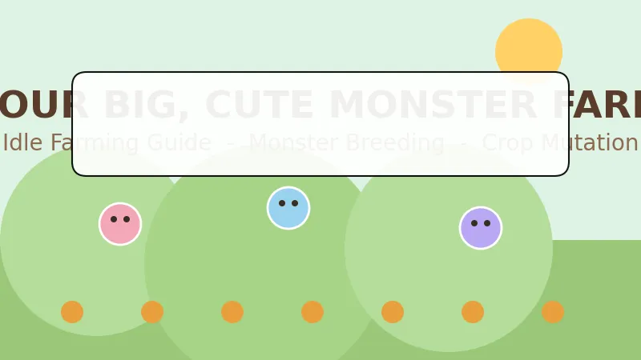
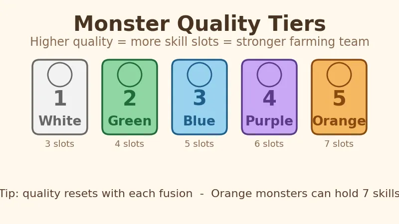
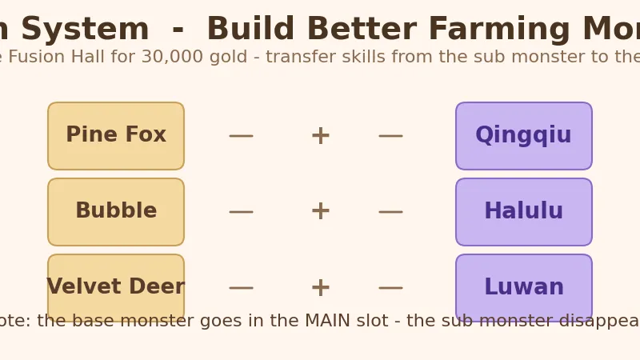
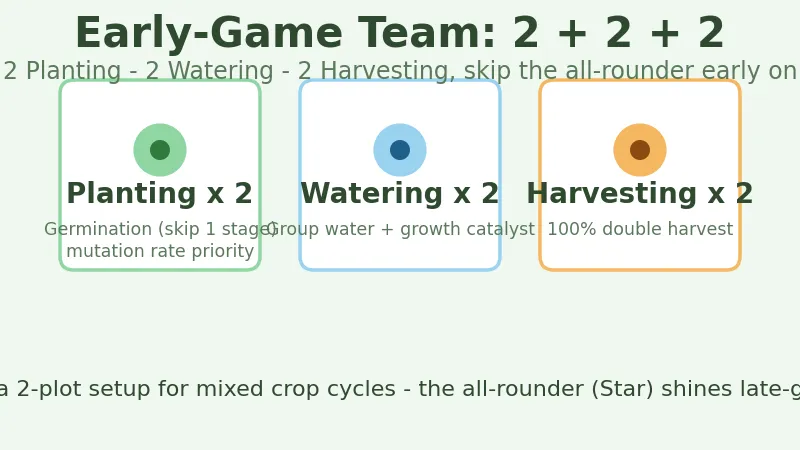
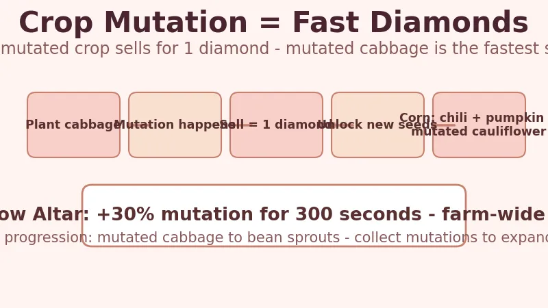

# Your Big, Cute Monster Farm Beginner's Guide — Grow an Idle Farm, Raise Cute Monsters, and Farm Diamonds

> Game: Your Big, Cute Monster Farm (*幻兽大农场：放置好时光*) | Developer: KaiPlay Studio | Publisher: Gamersky Games | Released: November 10, 2025 (Steam) | Price: $7.99 base (regularly on sale, historical low $4.79) | Platforms: PC (Windows)

I have spent dozens of hours with **Your Big, Cute Monster Farm** since it launched in November 2025, and I keep coming back for one simple reason: it respects your time. This is an idle farming game where the monsters do the work — they till, sow, water, and harvest on their own while the game sits quietly at the bottom of your screen. I run it in the corner of my second monitor during the workday, check in every couple of hours to sell crops and hatch eggs, and my farm keeps growing without me touching a hoe. It is genuinely one of the best farming games to play while working from home, and it holds a **79% "Mostly Positive" rating** on Steam for good reason.

This guide covers everything I wish I had known on day one: how idle farming actually works, what those first three eggs give you, how monster quality tiers work, which fusion formulas are worth chasing, the 2+2+2 team setup that carries the early game, and the crop mutation loop that turns a field of cabbage into your fastest diamond source.

---

## What Is Your Big, Cute Monster Farm?

**Your Big, Cute Monster Farm** (Chinese title: **幻兽大农场：放置好时光**) is a casual idle farming simulator from **KaiPlay Studio**, published by **Gamersky Games**. It launched on **November 10, 2025** on Steam and reached a peak of about **3,265 concurrent players** within its first week. The core idea is simple: you run a farm, and a team of cute "phantom beasts" (幻兽) handles every farming task automatically.

| Fact | Detail |
|:-----|:-------|
| **Developer** | KaiPlay Studio |
| **Publisher** | Gamersky Games |
| **Release date** | November 10, 2025 |
| **Platforms** | PC (Windows), Unity engine |
| **Price** | $7.99 base · regularly 40–50% off · historical low $4.79 |
| **Steam rating** | 79% positive ("Mostly Positive"), ~700 reviews |
| **Peak players** | 3,265 (November 16, 2025) |
| **Average playtime** | ~51 hours for a full playthrough |
| **Languages** | 10 — English, Simplified/Traditional Chinese, Japanese, Korean, French, German, Russian, Portuguese, Spanish |
| **Genre** | Idle farming · creature collector · simulation |

> **The hook:** unlike a traditional farming sim where *you* swing the hoe, here you build the team and let the monsters do the work. The game is explicitly designed to run in the background — there is even a built-in **boss key** that instantly hides the window, which tells you exactly who this game is for.

---

## How Idle Farming Works — The Core Loop

The game lives at the **bottom of your screen** as a compact pixel-art farm strip. You don't micro-manage every action; instead you:

1. **Assign monsters** to plots — each monster has a job (planting, watering, or harvesting).
2. **Plant seeds** and let the monsters water and tend them automatically.
3. **Harvest** when crops mature — monsters with harvest skills can even auto-collect.
4. **Sell produce** for gold, and **unlock land** to expand.
5. **Check in periodically** to hatch eggs, fuse monsters, and fulfill market orders.

Crops mature while you're away. The idle/offline design means a plot you planted in the morning is ready to harvest by lunch — no babysitting required. The game's "**boss key**" hides the whole window in one click, which makes it popular with people running it in the office or on the clock.

---

## Your First Three Eggs — The Starter Team

The game opens by giving you **three eggs**, each of which hatches a starter monster with one of the three core farm jobs:

| Starter egg | Job | What it does |
|:-----------|:----|:-------------|
| **Sprout-type** | Planting | Sows seeds into tilled soil |
| **Water-drop type** | Watering | Keeps crops irrigated |
| **Glove-type** | Harvesting | Picks mature crops |

These three cover the full farm loop from day one. Don't stress about optimizing them — the starter trio is a tutorial in disguise. The real progress comes from **hatching better monsters** and **fusing** them into specialists.

**Where to get more monsters:**

- **Hatching (孵化所):** spend **10 diamonds** for one egg, or **45 diamonds** for a multi-hatch (multiple eggs at once). Multi-hatch is better value per diamond.
- **Side plots:** when you unlock new land on either side of the farm, eggs spawn on the ground — and these commonly hatch **higher-quality monsters** than the gacha. Always clear the eggs when you expand.

---

## Monster Quality Tiers — White to Orange

Every monster has a **quality tier**, and this is the single most important stat in the game. There are five tiers, and **higher quality means more skill slots** — which is how a monster becomes genuinely powerful.

| Tier | Color | Skill slots | Notes |
|:----:|:-----:|:-----------:|:------|
| 1 | **White** | 3 | Starter tier |
| 2 | **Green** | 4 | Common hatch |
| 3 | **Blue** | 5 | Good all-rounder |
| 4 | **Purple** | 6 | Strong specialist |
| 5 | **Orange** | 7 | Endgame — max skill capacity |

With more slots, you can stack more of the **best skills** (mutation rate, germination, double harvest) onto a single monster. A purple or orange harvesting monster with four double-harvest skills will vastly outperform two green ones.

> 💡 **Quality resets on fusion.** When you fuse two monsters (below), the resulting monster's quality is re-rolled. This means fusion is how you *keep* upgrading toward purple and orange, not just how you transfer skills.

---

## The 4 Monster Types — And Why Type Limits Skills

Monsters come in **four body types**, and each type can only learn skills from its own job family:

| Type | Shape | Job family |
|:-----|:------|:-----------|
| **Star** | ⭐ Star | All-rounder (can cover any job) |
| **Water drop** | 💧 Droplet | Watering |
| **Glove** | 🧤 Glove | Harvesting |
| **Sprout** | 🌱 Sprout | Planting |

The key limitation: **a monster can only roll skills for its own work type.** A planting monster (Sprout) can never learn a watering skill, and a watering monster (Water drop) can never learn a planting skill. Only the **Star-type** all-rounders can branch across jobs — which is why they're valuable late-game but also why the early-game advice is to **avoid all-rounders** until you understand skill priority (more below).

There are also special visual variants — **shiny** (slightly different look), **alt-color** (different palette), and **shiny + alt** (both) — that show up with a different profile-frame color so you can spot them at a glance. They're collectible status pieces more than mechanical upgrades.

---

## Fusion — Build Better Monsters

**Fusion** is unlocked by paying **30,000 gold** at the Fusion Hall building. The mechanic: choose a **main monster** and a **sub monster**; the sub monster's skills transfer onto the main monster, and the **sub monster disappears**. This is how you stack the best skills onto one strong main.

> ⚠️ **Slot the base monster in the MAIN slot.** Several community-documented recipes require the base monster in the main position or they won't produce the special result.

### Special Fusion Formulas

Three special monsters are documented by the community (from the Bilibili guide coverage of the game):

| Base monster (main) | + Sub monster | = Result |
|:-------------------|:--------------|:---------|
| **Pine Fox** (松狐) | **Snail** (小蜗) | **Qingqiu** (青丘) — strong planting monster |
| **Bubble** (泡泡) | **Frozen Lemon** (冻冻柠) | **Halulu** (哈鲁鲁) — powerful watering monster |
| **Velvet Deer** (鹿茸茸) | **Patchy** (帕奇) | **Luwan** (鹿丸) — elite harvester |

These recipes are worth prioritizing because the result monsters come with high base quality and the exact skill families you need. Keep an eye out for the base monsters as you hatch — the game gives you more of these than you'd think.

---

## Best Team Composition — The 2 + 2 + 2 Setup

For most of the early game, the community-standard lineup is a **2 + 2 + 2 split**:

| Role | Count | Best skills to stack |
|:-----|:-----:|:---------------------|
| **Planting** (Sprout) | 2 | **Germination** (skip 1 growth stage) + mutation-rate skills |
| **Watering** (Water drop) | 2 | Group-watering + growth catalyst |
| **Harvesting** (Glove) | 2 | **100% double-harvest** |

**Why 2+2+2 instead of all-rounders?** For a single plot, this split covers long-grow crops (like dragon fruit, once unlocked) efficiently. For a **two-plot setup**, the same split becomes even more flexible because it handles both short and long crop cycles — the shared watering aura is the key.

**Skill priority rules (from the community guide):**

- **Planting monsters must carry Germination** — skipping one growth stage is the single biggest yield multiplier.
- **Prioritize mutation rate** on planting monsters — mutation = double profit **plus** diamonds (see below).
- **Watering monsters:** group-water + growth catalyst.
- **Harvesting monsters:** push toward **100% double-harvest**.
- **Do NOT use all-rounder (Star) monsters** in the early game — they dilute your skill budget.

---

## Crop Mutation — Cabbage Is Your Diamond Printer

Crop **mutation** is where Your Big, Cute Monster Farm gets surprisingly deep. When a crop matures, it has a chance to **mutate** into a special variant — a cabbage can become **rose cabbage**, a cauliflower can grow **cat ears**, and so on. Mutated crops are worth dramatically more, and — crucially — **every mutated crop sells for 1 diamond**.

### Why this matters

Diamonds are the game's premium currency (eggs, the Beauty Salon, the Rainbow Altar). The fastest reliable diamond source in the early game is **mutated cabbage**:

- Plant a field of **cabbage** (fast-growing).
- Stack **mutation-rate** skills on your planting monsters.
- Every time a cabbage mutates, it sells for **1 diamond**.
- **Mutated cabbage also unlocks new seeds** — collecting specific mutations is the game's progression system. For example, collecting mutated cabbage unlocks **bean sprouts**, and later crops (wheat, carrots, pumpkin) unlock by collecting their related plants.

### Unlocking corn

Corn requires growing **chili peppers, pumpkin, and mutated cauliflower** — so it's a mid-game target rather than a day-one crop.

### The Rainbow Altar boost

The **Rainbow Altar** building gives the whole farm a **+30% crop mutation rate for 300 seconds** when activated. If you're farming diamonds, trigger the altar right before a big cabbage harvest to maximize mutation rolls. (A separate feature lets you spend a large number of diamonds to convert one monster to shiny/alt-color form — a cosmetic flex, not a farming priority.)

### Community layout tip

One Steam reviewer shared a 6×6 layout optimized for cabbage mutation:

- Surround the cabbage with **Yingcao (莹草)** monsters, which **stack the cabbage mutation rate**.
- Center **water wells (水井)** cover the whole grid, so watering monsters can focus on the fields.
- Use **high double-drop chance** harvesting monsters to collect.
- The author estimated roughly **~100 draws per cell per 5 hours**, depending on double-collect and mutation probabilities.

This is the blueprint for a diamond-positive farm that funds all your hatching and expansion.

---

## Buildings — What to Unlock and When

The farm is dotted with buildings, and each serves a distinct part of the loop:

| Building | Unlock | Purpose |
|:---------|:-------|:--------|
| **Hatchery (孵化所)** | Early | Spend diamonds for random eggs |
| **Monster Exchange** | Early | Sell duplicate monsters for diamonds |
| **Fusion Hall** | **30,000 gold** | Fuse monsters, transfer skills, special recipes |
| **Rainbow Altar** | Mid | +30% crop mutation for 300 seconds |
| **Beauty Salon** | Mid/late | Convert a monster to shiny/alt form (cosmetic) |
| **Market** | Mid/late | Fulfill supply orders for big gold payouts |

**Market / bargaining mini-game:** when selling market orders, a moving cursor appears — stop it on the **green zone** to boost the order payout. You can bargain several times, though it speeds up with each attempt.

**The data center** shows farm stats, and the **money tree** produces gold but requires manual clicking (players estimate ~1,000 clicks to break even — skip it early).

---

## Economy & Progression — Gold, Diamonds, Land

- **Gold** comes from selling crops and market orders; it pays for **land expansion**, which is the biggest early money sink. **Prioritize unlocking plots** over cosmetic upgrades — more plots means more crops, more mutation rolls, more diamonds.
- **Diamonds** come from selling mutated crops and trading duplicate monsters at the Exchange. Spend them on **multi-hatches** first (45 diamonds for several eggs beats 10 for one).
- **Seeds are cheap; land is expensive.** In the early game, treat land as your primary investment.
- The **"Adopt 10,000 monsters"** achievement is famously grindy — most players just spam "hatch 5 → recycle all" to chip away at it. Don't chase it on purpose.

---

## Is Your Big, Cute Monster Farm Worth It?

Let me be direct about my verdict. At **$7.99 base** (and frequently on sale — the historical low is **$4.79**, and it's been bundled repeatedly), Your Big, Cute Monster Farm is one of the easiest "buy it on a whim" recommendations in the farming genre. The **79% "Mostly Positive" rating** undersells how *liked* this game is by people who actually enjoy idle games.

**Who it's for:**

- **Remote workers and desk workers** — the boss key and background design are literally built for you. This is the best farming game to run while you work.
- **Palworld / creature-collector fans** who want the collection + breeding loop without the combat.
- **Cozy-game players** who want a farming sim that never demands attention.
- **Mobile-game refugees** who are used to idle loops and gacha-style hatching.

**Who should skip it:**

- Players who want deep hands-on farming (go play Stardew Valley or Fields of Mistria instead).
- Anyone who dislikes gacha mechanics entirely — hatching is the core of monster acquisition.
- Players who want a game that ends. This one is designed to keep running.

**The honest comparison:**

| | Your Big, Cute Monster Farm | Stardew Valley | Rusty's Retirement |
|:--|:--|:--|:--|
| **Style** | Idle desktop companion | Full farm/RPG | Idle desktop companion |
| **Time required** | ~10 min/day check-ins | Hours per session | ~15 min/day |
| **Monster raising** | ✅ Core mechanic | ❌ (pets only) | ❌ |
| **Crop mutation** | ✅ Signature system | ❌ | ❌ |
| **Boss key (hide window)** | ✅ | ❌ | ✅ |
| **Price** | $7.99 (frequently ~$4–5) | $14.99 | $6.99 |

For my money, it sits comfortably next to **Rusty's Retirement** as the best-of-class "farm while you work" game — and it beats Rusty's on the creature-collection and mutation depth.

---

## FAQ

### When did Your Big, Cute Monster Farm release?
It launched on **November 10, 2025** on Steam for Windows. It peaked at ~3,265 concurrent players on November 16, 2025.

### Does it support English?
Yes — English is fully supported, along with 9 other languages including Simplified and Traditional Chinese, Japanese, Korean, French, German, Russian, Portuguese, and Spanish.

### How much does it cost?
**$7.99** base price, but it goes on 40–50% sales regularly. The historical low is **$4.79**, and it's appeared in several Gamersky bundle deals.

### Is it really an idle game?
Yes. Monsters automate planting, watering, and harvesting. Crops mature while you're away, and the game is designed to run at the bottom of your screen. There's a built-in boss key to hide the window instantly.

### What are the monster quality tiers?
White → Green → Blue → Purple → Orange. Higher tiers have more skill slots (3 → 7), letting you stack more powerful skills on a single monster.

### How do I get the special fusion monsters?
- **Pine Fox + Snail = Qingqiu** (planting)
- **Bubble + Frozen Lemon = Halulu** (watering)
- **Velvet Deer + Patchy = Luwan** (harvesting)

Unlock the **Fusion Hall** for 30,000 gold first, and always put the base monster in the main slot.

### What's the fastest way to earn diamonds?
**Mutated cabbage.** Plant cabbage, stack mutation-rate skills, use the Rainbow Altar's +30% boost before harvesting, and sell every mutated crop for 1 diamond. Mutated cabbage also unlocks bean sprouts.

### What are the system requirements?
Very low — it runs comfortably on modest hardware. The game targets Windows 10 64-bit with a dual-core CPU and 1 GB RAM, and needs roughly 500 MB of disk space.

---

*Guide data gathered from the Steam store page, SteamDB, community guides, and Chinese video guide coverage on Bilibili. Prices reflect the August 2026 sale state and may change — always check the Steam page before buying.*
