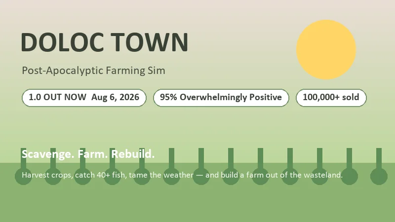
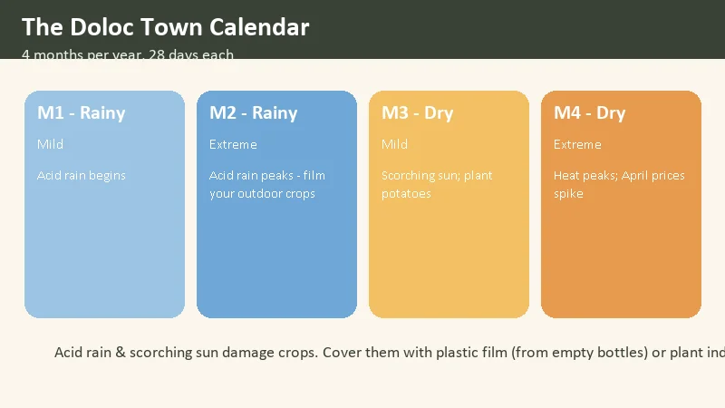
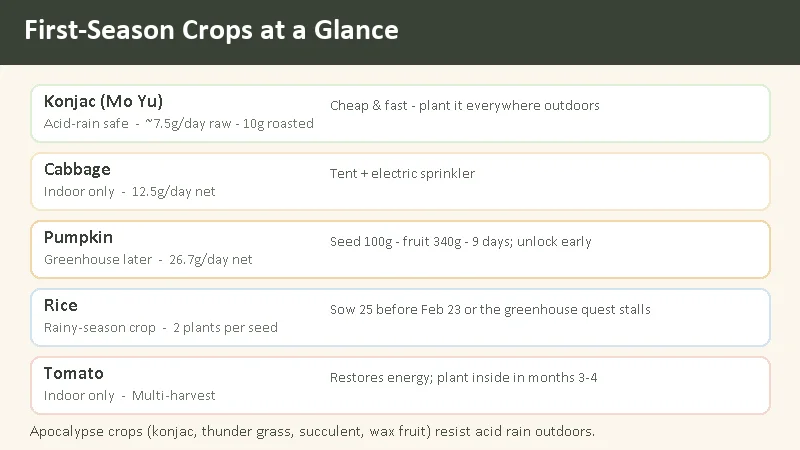
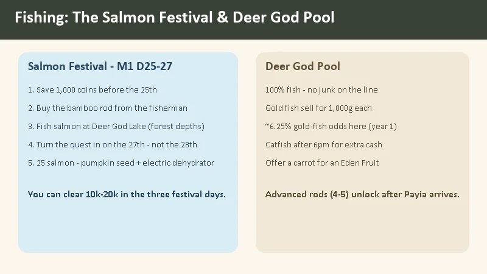
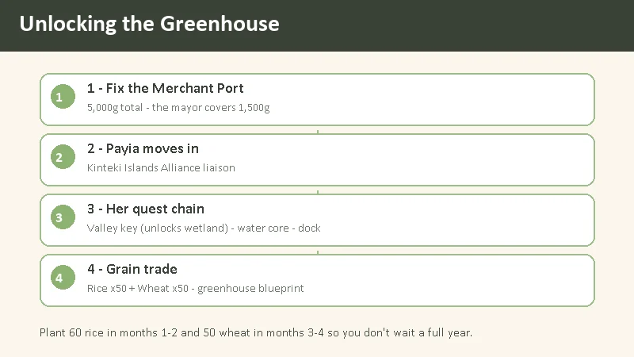

# Doloc Town Beginner's Guide — Farm the Wasteland, Survive the Weather

> Game: Doloc Town (*多洛可小镇*) | Developer: RedSaw Games Studio (虹视游戏工作室) | Publisher: Logoi Games | 1.0: August 6, 2026 (Steam) | Price: $19.99 base ($15.99 at launch) | Platforms: PC (Windows)

I picked up Doloc Town in early access last year and put dozens of hours into it, then came back for the 1.0 launch in August 2026. It's a side-scrolling farming sim set in a wasteland, and the twist is the weather: **acid rain** falls in the first half of the year and a **scorching sun** bakes the second half. Crops that would be routine in Stardew Valley need planning here, because the environment actively tries to kill them. The game holds a **95% "Overwhelmingly Positive" rating** on Steam, and after the 1.0 release that feels earned — the story now has a real ending, drones can automate your whole farm, and there's a third map of ruins to fight through.

This guide covers everything I wish I'd known before my first in-game day: how the calendar works, which crops are actually worth planting in season one, how to make money fast (the Salmon Festival is the answer), and the exact steps to unlock the greenhouse.

---

## What Is Doloc Town?

**Doloc Town** (Chinese title: **多洛可小镇**) is a post-apocalyptic farming and survival sim from **RedSaw Games Studio**, published by **Logoi Games**. It entered Early Access on **May 8, 2025** and launched as **1.0 on August 6, 2026**. You play a scavenger who finds a settlement called Doloc Town and decides to build a farm there — the game's own tagline is "from a scrap-gathering survivor into a farming tycoon."

| Fact | Detail |
|:-----|:-------|
| **Developer** | RedSaw Games Studio (虹视游戏工作室) |
| **Publisher** | Logoi Games |
| **Early Access** | May 8, 2025 |
| **1.0 release** | August 6, 2026 |
| **Platforms** | PC (Steam, Windows), Unity engine |
| **Price** | $19.99 base · 20% launch discount to $15.99 until August 19 |
| **Steam rating** | 95% positive ("Overwhelmingly Positive"), ~1,800–1,900 reviews |
| **Copies sold** | 100,000+ at 1.0 launch |
| **Playtime** | ~25–30 hours main story · 100+ hours total |
| **Languages** | 10+ — English, Simplified/Traditional Chinese, Japanese, Korean, French, German, Russian, Brazilian Portuguese |
| **Genre** | Farming sim · survival · side-scrolling pixel art |

**What the 1.0 update added:** the third map (**Old City Ruins**) and the end of the main story, a **farming automation system** (solar/wind power + agricultural drones), the **Mushroom Fest** festival, new NPCs (Abel and Helen) and quests, **titanium ore**, 10 new combat drone parts, 12 new fish, 15 accessories, and 37 new achievements (80 total). If you bounced off the early-access version because there was "nothing to do after season two," the 1.0 content fixes that.

> **The hook:** it's Stardew Valley, but the weather is a monster. You don't just plant seeds — you shield them from acid rain, water them through dry spells, and eventually build drones to do it all for you while you go fight robots in the ruins.

---

## The Calendar — Four Months, and the Weather Is the Boss

Doloc Town runs on a **4-month year**, and each month has **28 days**. The month *is* the season — crops, fish, wild forage, and some shop stock all rotate by month.

| Month | Season | Weather | What to plant |
|:-----:|:------|:--------|:--------------|
| **M1** | Rainy | Acid rain begins (mild) | Konjac, thunder grass, rice, cabbage indoors |
| **M2** | Rainy | Acid rain peaks — film outdoor crops | Rice (deadline ~Feb 23), thunder grass |
| **M3** | Dry | Scorching sun (mild) | Potatoes outdoors, tomatoes indoors, wheat |
| **M4** | Dry | Heat peaks — April prices spike | Wheat, hold stock to sell |

- **Months 1–2 are the rainy season.** Acid rain falls, and in **February** it gets much worse. Outdoor crops take damage unless they're **apocalypse crops** (below) or covered with **plastic film**.
- **Months 3–4 are the dry season.** A scorching sun dries out your soil and stresses crops. April is the harshest month — but it's also when **prices spike**, so stockpile in March and sell in April.
- Months 1 and 3 are relatively mild; months 2 and 4 are the extremes.

**The most important rule:** a small set of "apocalypse crops" — **konjac (末芋), thunder grass (霹雳草), succulent (多肉), and wax fruit (蜡果)** — are acid-rain resistant and can grow outdoors. Everything else needs to be **indoors** (a tent, container, or the greenhouse) or it will take weather damage. Vines specifically need the greenhouse.

Your starting date is **X31-01-01 (Monday)**, and there's no year limit — if you miss a crop window, you can always try again next cycle.

---

## First-Season Crops — What's Actually Worth Planting

Here are the crops I planted in season one, with the numbers that matter:

| Crop | Weather | Profit / notes |
|:-----|:--------|:---------------|
| **Konjac** (末芋) | Acid-rain safe | Cheap, fast, grows outdoors. ~7.5g/pot/day raw; ~10g/pot/day roasted |
| **Cabbage** | Indoor only | 12.5g/pot/day net, but needs a tent + electric sprinkler |
| **Pumpkin** | Greenhouse later | Seed 100g, fruit 340g, 9 days → 26.7g/pot/day. Unlock it early |
| **Rice** | Rainy season | 5 days, **each seed yields 2 plants**. Must sow before ~Feb 23 or the greenhouse quest stalls |
| **Tomato** | Indoor only | Multi-harvest, restores energy. Plant inside in months 3–4 |

**Konjac is your best friend in month one.** It's cheap, grows fast, survives acid rain, and sells for a reliable ~7.5g/pot/day raw. Roast it and that becomes ~10g/pot/day. If you set up 4 manual sprinklers over 32 pots, that's around **320g/day** from one crop with almost no risk — easily the best steady income in the early game.

**Plant rice on time.** In year one's rainy season, you need **25 rice seeds sown before roughly February 23** (they take 5 days and each yields 2 plants) or the greenhouse quest will stall while you wait a full year for the next rainy season. This is the single easiest thing to mess up. Mark it on a sticky note.

**Don't sleep on thunder grass.** In months 1–2, plant thunder grass in any spare outdoor space. It sells *and* generates electricity, which you need for machines. In months 3–4, swap to **potatoes outdoors** (they generate power too) and **tomatoes indoors** (multi-harvest, restores energy, and sells).

**The pumpkin/tomato duo.** Pumpkin (seed 100g → fruit 340g, 9 days, ~26.7g/pot/day) and tomato are the two best cash crops once you have their seed stock. Unlock pumpkin as soon as you can — it's the difference between scraping by and actually growing.

---

## Fishing — The Salmon Festival Is Your First Big Payday

Fishing is not a side activity in Doloc Town; it's the fastest early money in the game. The centerpiece is the **Salmon Festival** in **month 1, days 25–27**.

### The Salmon Festival (M1 D25–27)

1. **Save 1,000 coins before the 25th** and buy the **bamboo rod** from the fisherman (the "lantern man" / 灯男) — the starter rod can't catch salmon.
2. Head to **Deer God Lake** (鹿神湖) in the forest depths, down-left of your farm.
3. Fish salmon for the three festival days.
4. **Turn the quest in on the 27th — not the 28th.** The festival ends; if you wait, you lose the reward.
5. Catch **25 salmon** and you get the **pumpkin seed stock** plus an **electric dehydrator**.

Three days of salmon fishing can clear **10,000–20,000g** in your first year, and the pumpkin seed stock kick-starts your best crop. If you skip nothing else in this guide, don't skip this.

### The Deer God Pool — the best fishing spot

The **left pond by the Deer God statue** is the best fishing spot in the early game, for one simple reason: **you never pull junk.** Every cast is a fish. It's also one of the few places where you can catch **gold fish**, which sell for **1,000g each** (a quest version sells for 2,000g). In year one the odds at the Deer God are roughly **6.25%** per catch — you can pull 2–3 in a good day. After **6pm**, catfish also show up there and sell for more than most fish.

**Rod tiers:** rods 1–3 are bought at the fishing fort in the lower town early on. **Advanced rods (4–5)** unlock once the NPC **Payia** arrives in town, and they raise rare-fish odds and make the fishing mini-game more forgiving. If the mini-game is giving you trouble, you can lower the scroll speed in the settings.

**The Deer God statue itself:** interact with it to get **carrot seed stock**. Grow a carrot, then offer it to the statue for an **Eden Fruit** (restores HP and stamina).

---

## Early Money-Making — What the Community Does First

**Sell crops or cook first?** In the early game, direct crop sales often beat cooking — the cooking pot takes 30 minutes per dish, which is slow when you're scrabbling for seed money. Once you have stock, the good value-adds are:

- **Konjac → roasted konjac**: 7.5g → 10g per pot/day.
- **Cabbage + shrimp → stir-fried dish**: 240g.
- **Grass carp + bass → steamed fish**: 210g.
- **Shrimp + konjac / crimson caps → 85g**; **sardine or carp + kelp → 65g**.

Other early income that compounds:

- **Junk decomposition and smelting.** Run junk through the decomposer/smelter to get rubber, copper ingots, and iron ingots. A full stack of processed junk can yield **gold ore and old chips**.
- **Sunday stones.** Every Sunday, **Lika** (Kasha's sister) sells rare stones in town. Buy them — you'll need them for later quests.
- **New Year event.** Gifting villagers during the year-end event pays back **red envelopes** worth 666–888g (the richer villagers give 1,888g).
- **Blueberries:** keep some instead of selling them all. A later trading-post quest needs **blueberry preserves**, and blueberries don't grow wild in the dry season.

---

## The Cardboard Box — the Best Early Tool, No Contest

The **cardboard box** is easy to overlook and absolutely vital. It's a 5-slot box you make from 4 cardboard. Here's why it's a game-changer:

- **It holds almost any material** and has **no weight limit**.
- **Gathered materials auto-enter the box** when it's in your inventory — pickups go straight in without you sorting them.
- **Items in the box don't lose durability** while you're out gathering or fighting.
- Machines can **read materials from boxes within 3 tiles**, so you can set up a box next to a machine and never hand-feed it.
- A **box rack** holds 6 boxes.
- When a box breaks, the contents come back out (plus one cardboard back) — so just **rebuild it** rather than repairing it.

The one catch: when a quest needs you to *submit* items to an NPC, take them **out of the box first** — NPCs won't take items from a box.

---

## The Greenhouse — Full Unlock Chain

The **greenhouse** is the endgame farm hub: crops grow **+10% faster** there and it **ignores the season**, so you can grow anything in any month. Unlocking it is a chain, and here's the exact order:

1. **Fix the Merchant Port (商埠).** It costs **5,000g total**; the mayor subsidizes **1,500g**, so you fund **3,500g**. Once it's open, the first trade alliance — the **Kinteki Islands Alliance** — moves in.
2. **Payia arrives.** Payia (帕伊雅) is the Kinteki liaison who moves into town after the port is fixed.
3. **Complete her quest chain:** find her father's key at the valley mountaintop (this **unlocks the wetland**), then the **water quality core** quest, then build the **wetland dock**.
4. **Complete the grain trade.** The final step is the faction trade **"Kinteki — Material Exchange — Grain Trade"**: deliver **rice ×50 and wheat ×50** to unlock the greenhouse blueprint.

**Plan the grain ahead.** Rice grows in the rainy season (months 1–2), wheat in the dry season (months 3–4). Plant **60 rice** in months 1–2 and **50 wheat** in months 3–4 so you have the goods when the trade unlocks — otherwise you wait a full year.

**Greenhouse facts:** total area 16×7 (10×7 main plus 6×7 overlap), entrance 3×4, interior 20×8. Durability 500. Acid rain does 0.27 damage per 5 minutes and lightning 3 per hit — it can weather storms, but keep a repair hammer handy. It doesn't use electricity.

---

## The Tech Tree — Don't Waste Your Points

Doloc Town's tech tree has three branches — **Agriculture, Industry, and Life** — and you earn points by doing that kind of work.

| Branch | What it unlocks |
|:-------|:----------------|
| **Agriculture** | Planting equipment, growth accelerators (fertilizer machine, grow lights), gene modification |
| **Industry** | Processing machines, generator upgrades, **automation** |
| **Life** | Food processing — pickling, cooking, wine and aging, tea and coffee |

The community's #1 new-player warning: **don't spend points randomly.** Follow the main quest's needs and you'll have what you need when you need it; overspend on toys early and you can hit a wall with no points left. In the early game, prioritize the **junk smelter** in the Industry branch — it's the machine that turns garbage into the ingots and rare chips that unlock everything else.

**Other early tips that save real pain:**

- **Backpack:** you start with 1 row and can expand to 4. Spend your first 500g on the second row.
- **Infinite water:** a plastic bottle filled at any water source gives 10 stamina per drink and refills forever — carry one and you never run out of water (it also unlocks the "eight cups a day" achievement).
- **Old chips:** don't feed *all* of them to the robot — some machines need them too. Keep a few back, and keep waste engine cores as well.
- **Eden Fruits:** there are 3 total — one from the main-quest modifier, one in a treehouse to the right of the valley, and one from offering a carrot to the Deer God statue. Don't waste them.
- **Teleporting:** once you fix the bus station, teleports cost **30g** each. Cheap enough to use freely.
- **Combat:** the game is bullet-hell style with a **combat drone** you build and upgrade. Draw enemies to the map edge and jump over them to reset them if you're under-geared.

---

## Is Doloc Town Worth It?

At **$19.99 base** (and **$15.99** during the launch sale until August 19), Doloc Town is an easy recommendation if you like farming sims with an edge. The **95% "Overwhelmingly Positive"** rating and the **100,000+ copies** reported at 1.0 launch aren't hype — the game has genuinely deep systems and the weather mechanic makes every season feel different from the last.

**Who it's for:**

- **Stardew Valley veterans** who want the same loop with real difficulty.
- **Survival-game players** who want cozy farming plus a reason to fight.
- **Automation fans** — the drone system in 1.0 is satisfying to build out.
- **People who like fishing as a money engine** — the Salmon Festival is a blast.

**Who should skip it:**

- Players who want pure, low-stress cozy farming (the weather *will* stress you out).
- People who dislike side-scrolling 2D pixel art.
- Anyone who wants a short game — this is a 25–30 hour main story with a long tail.

**The honest comparison:**

| | Doloc Town | Stardew Valley | Fields of Mistria |
|:--|:--|:--|:--|
| **Perspective** | Side-scrolling 2D | Top-down 2D | Top-down pixel |
| **Weather threat** | Acid rain & scorching sun | Nothing (seasons only) | Mild |
| **Automation** | Full drone automation (1.0) | Sprinklers only | Sprinklers + some |
| **Combat** | Bullet-hell drone combat | Sword & slingshot | Action combat |
| **Price** | $19.99 ($15.99 launch) | $14.99 | $24.99 |

For my money, Doloc Town sits in a genuinely small niche: a farming sim that's also a survival game, where the weather is the antagonist and drones eventually win the day. If that sounds like your kind of cozy-with-teeth, the 1.0 release is the right time to jump in.

---

## FAQ

### When did Doloc Town release?
Early Access launched **May 8, 2025**. The **1.0 full release** came on **August 6, 2026** on Steam for Windows.

### Is it available in English?
Yes — English is fully supported. The 1.0 update also added Russian, Japanese, Korean, French, German, and Brazilian Portuguese.

### How much does it cost?
**$19.99** base price, with a **20% launch discount to $15.99** that runs until August 19, 2026.

### Is the weather really a problem?
Yes. Acid rain damages outdoor crops in months 1–2 and a scorching sun damages them in months 3–4. Apocalypse crops (konjac, thunder grass, succulent, wax fruit) resist acid rain; everything else needs indoor space or plastic film.

### What should I plant in my first month?
**Konjac** outdoors (acid-rain safe, fast, reliable income) and **cabbage** indoors. Sow **rice** by ~Feb 23. Buy the **bamboo rod** and fish the **Salmon Festival** on M1 D25–27 for your first big payday.

### How do I unlock the greenhouse?
Fix the **Merchant Port** (5,000g, mayor covers 1,500g) → **Payia** moves in → complete her quest chain (valley key → wetland, water core, dock) → complete the **grain trade** with rice ×50 and wheat ×50.

### What does the 1.0 update add?
A third map (Old City Ruins), the end of the main story, **farming automation** via drones, the Mushroom Fest festival, new NPCs and quests, titanium ore, 10 combat drone parts, 12 fish, 15 accessories, and 37 achievements (80 total).

---

*Guide data gathered from the Steam store page, SteamDB, the Doloc Town community wiki, and Chinese video guide coverage on Bilibili (1.0 full-walkthrough and beginner series). Prices reflect the August 2026 launch state and may change — always check the Steam page before buying.*
