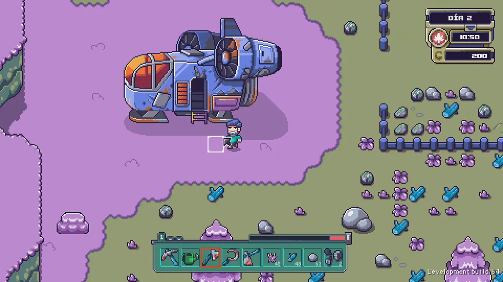
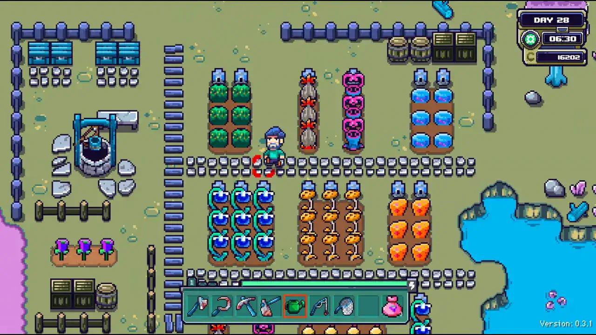
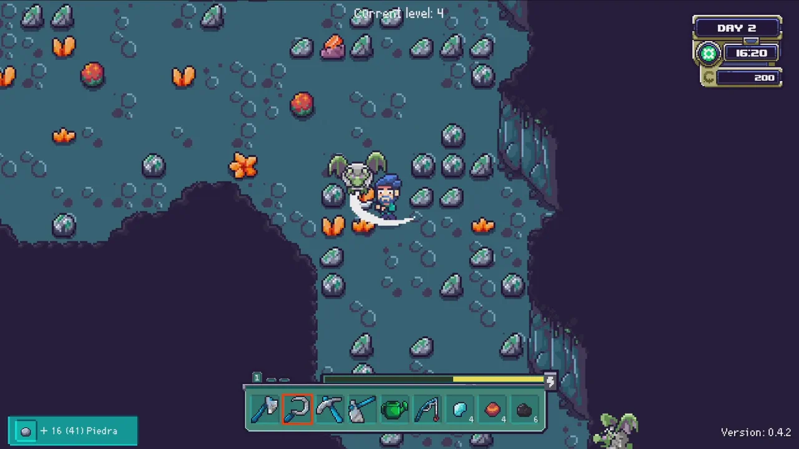
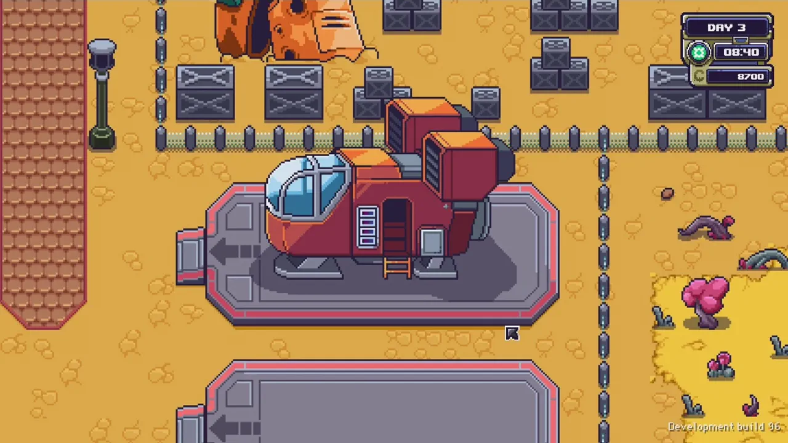
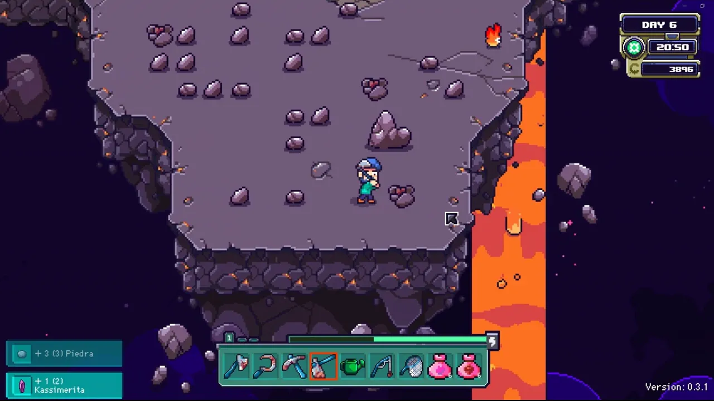

# Farlands Beginner's Guide — Buying a Planet and Space Farming

> Game: Farlands | Developer: JanduSoft & Eric Rodríguez | 1.0 Release: July 16, 2026 (Steam, Switch, PS4/5, Xbox One/Series) | Price: $17.99 | Platforms: PC, consoles, Steam Deck Verified

I have bought a planet. Not metaphorically — in **Farlands**, the pixel-art space farming sim that hit its full **1.0 release on July 16, 2026**, the whole hook is that you see an entire agricultural planet on sale for a suspiciously low price, say yes, and fly to the edge of the solar system with nothing but a rusty spaceship and a robot assistant. And then the game quietly reveals *why* the planet was so cheap.

It is, honestly, the most Stardew-coded setup in recent memory — but that's the point. Farlands takes the "escape the city, buy a farm" fantasy and pushes it as far as it can go. I've put about twenty hours into the 1.0 build, and this guide covers everything I wish someone had told me on day one: how the three seasons work, why you should upgrade the ship before the watering can, how fuel and interplanetary travel actually work, what's worth doing in the settlement of Terbin, how the Ark quest drives the whole game, and what the new 1.0 planet Darmstad is really about.

*Guide data gathered from the Steam store page, launch-week press coverage, the developer's 1.0 announcement, and community walkthroughs (including full-playthrough videos). Prices and details reflect the July 16, 2026 1.0 build — always check the Steam page before buying.*

---

## What Is Farlands?

**Farlands** is a farming-and-life sim set across a small solar system. You start on your own abandoned agrarian planet, restore it field by field, and then travel between planets to gather resources, meet a tiny cast of characters, and slowly uncover the mystery of why your "bargain" planet was abandoned in the first place. It's published by Barcelona-based **JanduSoft** alongside designer **Eric Rodríguez** (of Leyendas y Videojuegos), and it spent almost two years in Early Access before the full 1.0 launch.

| Fact | Detail |
|:-----|:-------|
| **Developer / Publisher** | JanduSoft (Barcelona) with Eric Rodríguez; Chinese release via Anotherindie |
| **1.0 release** | July 16, 2026 — Steam, Nintendo Switch, PS4/5, Xbox One, Xbox Series |
| **Price** | $17.99 (no subscription, no DLC-gated content) |
| **Early Access** | July 24, 2024 → July 2026, roughly two years and 10 major updates |
| **Steam rating** | Very Positive overall (90% of 1,592 all-time reviews); recent 30-day reviews Mixed (69% of 191) — Steam store page, Aug 2026 |
| **Seasons** | 3 — Hot, Temperate, Cold — each 28 days (an 84-day year) |
| **Romance** | 8 romanceable characters, marriage included |
| **Achievements** | 50 total (19 new with 1.0) |
| **Main story** | Roughly 20–30 hours; much longer for 100% |
| **Platforms** | PC (Steam Deck Verified), Switch, PS4/5, Xbox One, Xbox Series |

The pitch in one line: **Stardew Valley, but the farm is an entire planet and the "town" is spread across a solar system you travel between by spaceship.** Every core farming-sim system you expect is here — crops, seasons, tools, animals, fishing, bug-catching, cooking, crafting, mining, festivals, and romance — but the map is interplanetary instead of just a valley.

---

## The Story: Why Was This Planet So Cheap?

You see it in the opening: a planet for sale at a price that should be impossible. You're a city-dweller sick of the rat race, so you take the deal, board your old ship, and fly out to a "lost corner of the galaxy" to start again.

The setup is knowingly tropey, and that's part of the charm:

- **The planet is genuinely run-down.** It's an overgrown agrarian rock that's been abandoned for years. Previous owners all failed to turn a profit.
- **You're not alone.** A few stubborn residents still live on the planets of this solar system, and each has a reason for staying in the middle of nowhere.
- **Something is very wrong.** An evil corporation called **GorCorp** wants to strip-mine the whole region, and the local mayor — **Oola** of the settlement **Terbin** — has a plan.
- **The Empyrean quest.** An alien species called the **Empyrean** can place the solar system under their protection for research and preservation, but only if you gather samples of "one of everything" to fill their **Ark**. You only need to fill it to **70%**, but it's still the thread that pulls you through the whole game.

I found this the most endearing part of the game. The writing isn't going to win awards, but it's less trope-y than a lot of farming games, and it gives you a real reason to keep collecting beyond just "make money." There's even a mystery — the pyramids and the hidden reason your planet was cheap — that the 1.0 update digs into properly.

---

## Your Farm Planet: Clearing, Crops & the Three Seasons

Your first job is the most satisfying one in any farming game: take a ruined plot and make it yours. You'll **cut weeds, clear paths, reclaim overgrown fields, and repair** everything time has broken.

The tools are the classic set, and every one of them can be upgraded:

| Tool | Job |
|:-----|:----|
| 🪓 **Axe** | Chops wood |
| 🌿 **Scythe** | Clears grass and weeds (and, later, fights in caves) |
| ⛏️ **Pickaxe** | Breaks rocks |
| 🚜 **Hoe** | Tills ground for planting |
| 💧 **Watering can** | Keeps crops alive |
| 🥅 **Net** | Catches bugs and small wildlife |
| 🎣 **Fishing pole** | Fishing |

### The three seasons (and the seed-bag trap)

Farlands runs on **three seasons** — **Hot, Temperate, and Cold** — and each lasts **28 days**. The season is shown at the top of the screen alongside the time and date, and each crop only grows in the season it belongs to.

Here's the trap that tripped up both me and a lot of the reviews: **the game tells you a crop's season mainly by the color of the seed bag**, and it doesn't label it in the menu as clearly as it should. If you're colorblind, as the A-to-J review writer is, you can't reliably tell which seed is for which season. My advice: learn the crop-season pairs by name early (write them down if you have to), because buying seeds for the wrong season and watching them not grow is a brutal week-one money sink.

Crops themselves work the way you expect:

- **Each crop has a fixed number of days to grow.**
- **Some crops give a single yield; others produce repeatedly across the whole season.** Multi-yield crops are almost always the better money play in year one.
- **You can cook crops into food** to restore energy, **sell them** for money, or **save them for the Ark** — and by late game you'll be juggling all three uses for the same produce.

### Energy that doesn't punish you

The energy system is mercifully relaxed. You get tired, you eat to recover, but the game **doesn't drain your energy on wasted moves** — swing at nothing and it costs you time, not stamina. That single design choice makes the opening hours far more forgiving than most farming sims.

---

## Tools, Upgrades & the Crafting Chip Economy

Every tool can be upgraded, but the resource cost is the real hook: **the materials to upgrade your farm tools mostly come from *other* planets.** That's the game's clever way of forcing you to explore — you physically cannot max out your watering can while staying on your own planet.

Crafting works through recipes you unlock with **chips**:

- **Recipes are bought or gifted** as chips — you don't just learn them by grinding.
- Some crafted items are practical (food, fuel cells, upgrades); **others are purely cosmetic**.
- **Your farm itself can be upgraded** as the game goes on, and upgrades open up new building options.
- Beyond crops, you can go into **livestock** — build barns, raise animals, and collect the "finest products in the galaxy."

My early-game priority order, after testing it:

1. **Upgrade the spaceship once** (travel is the bottleneck — see below).
2. **A better watering can or hoe** to speed up the farm loop.
3. **Unlock recipes that produce fuel cells and food**, because both become your daily spend.
4. **Save rare ores for the Ark** — don't sell the weird stuff you find in caves. You'll need it.

---

## The Spaceship: Fuel, Travel & Why You Upgrade It First

Traveling between planets is Farlands' most original mechanic — and its biggest early-game frustration. Every trip starts at your spaceship, and here's what nobody tells you:

- **Your ship starts slow and thirsty.** The default ship consumes a lot of fuel and takes a while to get from planet to planet.
- **Some planets are outright unreachable** until you upgrade the ship at least once. That's not optional content — some of the best materials live behind those gates.
- **Fuel is made from biomass.** You can throw almost anything into the ship's fuel converter and burn it. You can also buy or craft **fuel cells**, which are more efficient but cost money.
- **The clock keeps moving while you fly.** Every journey is a real time investment, so a long round trip can eat half your day. Plan trips so you're not landing on a planet just as night falls.

**The golden rule:** before you leave your home planet, make sure you can afford the trip back. Early voyages can take nearly all your fuel in one direction. When I stopped treating travel as an afterthought and started packing fuel cells for the return leg, the game opened up completely.

Your **first destination is always Terbin**, the solar system's only major settlement.

---

## Terbin: The Settlement, the Shops & the Ark

**Terbin** is Farlands' "town," and it does everything a farming-sim town should:

- **Shops** sell seeds and recipes; **workshops** upgrade your farm and tools.
- **The teleporter to the Ark** is here — this is where you deposit your research samples as you fill the Empyrean quest.
- **The residents live here.** You can talk to them, learn their backstories, and build relationships — including **romance**.

### Romance & marriage

There are **eight romanceable characters**, and the social system runs on the familiar loop of **conversations and gift-giving**. It's a slow burn — expect to spend many in-game days on it — but it's rewarding, and **getting married is a real achievement** in 1.0. The romance pool leans on recognizable archetypes, but the characters are written with enough personality that I spent way too much early-game time wooing my favorites instead of farming.

### Seasonal festivals

Terbin has **seasonal holiday celebrations** that give the settlement culture and give you a reason to keep your social calendar. Between festivals, the romance system, and the shop economy, Terbin is the gravitational center of the whole game — it's worth treating it as home base.

---

## Exploration, Resource Planets & Mines

Beyond your planet and Terbin, the solar system is a handful of **resource planets** — small, visually distinct worlds used mostly for gathering plants, animals, and crafting materials you can't get anywhere else. This is where Farlands' biggest criticism lives, and I think it's fair: **planets are small boxed areas rather than true open worlds.** The game effectively slices a traditional farming map into zones and connects them with your ship. That fits the space-exploration fantasy, but don't expect No Man's Sky scale.

What the planets *do* offer:

- **Mine-and-cave dungeons.** Resource planets hide standard mines with enemies you fight using your scythe. Nothing too fancy, but the loot matters.
- **Teleporters** let you fast-travel to deeper areas, which saves huge time once a dungeon is unlocked.
- **Rare wood and ores** — the real reason you go. These feed the best recipes and the Ark quest.

**The collection angle:** every planet has unique plants, animals, and materials, and because the Ark quest wants *one of everything*, the game quietly turns into a collection marathon. If you like completionist hunting (fish, bugs, ores, recipes, NPC friendships), Farlands gives you plenty of checklists.

---

## The 1.0 Endgame: Darmstad, the Ark & the Pyramid Mystery

The 1.0 update is where the game gets its full second half, and it's worth planning for:

- **Darmstad is the new planet** in the **SR755 system**, and it's gated — you need an upgraded ship to reach it.
- **Darmstad has no breathable air.** You hop between **mushroom-lit safe zones** to avoid passing out while scavenging some of the game's best rewards. It's tense, glowing, and easily the most distinctive area in the game.
- **Completing Darmstad helps you top off the Ark to 100% capacity**, which unlocks the endgame push (the Ark quest itself only requires 70% to "finish" the main story).
- **Expanded post-story missions** send you roaming the whole system, introduce new characters, and dig into the **pyramid mystery** — one of the late-game goals.

For completionists, 1.0 added **19 achievements (50 total)**, covering everything from finishing the Ark to **hunting all the Robeets**, getting married, upgrading your house, and clearing the post-story content. There are also new furniture and items, quality-of-life tweaks, and a pass of bug fixes.

---

## Farlands vs Stardew Valley: A Data Comparison

Every farming sim gets compared to Stardew Valley, but with Farlands the comparison is unusually honest — it plays like Stardew's launch version scaled up. Here's the data:

| Dimension | Farlands | Stardew Valley |
|:----------|:---------|:---------------|
| **Price** | $17.99 | $14.99 |
| **Seasons** | 3 × 28 days (84-day year) | 4 × 28 days (112-day year) |
| **Main story** | ~20–30 hours | ~50–70 hours |
| **Map** | Small solar system, 5+ planets | Single valley + Ginger Island |
| **Romance** | 8 candidates, marriage | 12 candidates, marriage |
| **Travel** | Spaceship, fuel-based, real-time | Walking, instant warp |
| **Genre twist** | Space, corporations, aliens | Magic, junimos, community center |
| **Platforms** | PC + all consoles | PC + consoles + mobile |

**The honest verdict from my playtime:** Farlands is the shorter, tighter game. Its 20–30 hour main story is a feature, not a flaw — it respects your time the way Stardew's endless loops sometimes don't. Where Stardew wants you to live in its valley for years, Farlands wants you to feel like you've saved a solar system and can then keep farming forever if you want to. If you're burnt out on the "cozy game that demands 300 hours" trend, that's exactly what $17.99 buys you here.

---

## Farlands Steam Deck & Platform Notes

- **Steam Deck Verified** — it runs well on the Deck, which matters for an "explore a planet while lounging" game.
- **Console versions launched day-and-date** with 1.0, and the update brought better controller support and console polish.
- **The Nintendo Switch version is fine but has long load times** — several reviewers noted the loading screens add up over a full playthrough. If you're choosing between Switch and PC, the load-time difference is real.

---

## Pro Tips & Common Mistakes

### ✅ Do This

- **Upgrade the spaceship first.** Travel is the bottleneck in the opening hours; a better ship pays for itself instantly.
- **Always pack fuel for the return trip.** Leaving your planet without a way back is the #1 new-player mistake.
- **Learn the seed-season pairs by name.** The game color-codes seed bags, and that fails colorblind players — know your crops.
- **Plant multi-yield crops in year one.** They produce all season and vastly out-earn single-harvest crops.
- **Save rare ores and odd materials for the Ark.** Don't sell the weird stuff — you'll be hunting for it later.
- **Visit Terbin regularly.** Festivals, new recipes, and shop rotations reward checking in.
- **Unlock dungeon teleporters as soon as you can.** They turn repeat mining runs into quick trips.

### ❌ Do Not Do This

- **Do not ignore the ship to max out farm tools first.** Tool upgrades need off-planet materials anyway — travel unlocks both.
- **Do not leave at sunset for a long flight.** The clock runs while you fly; you'll land exhausted in the dark.
- **Do not sell everything you find.** The Ark wants one of everything, and some items only drop from specific planets.
- **Do not expect a quest journal.** Progression is mostly dialogue-driven — talk to everyone, and re-read what they say when things stall.
- **Do not expect true open-world planets.** They're small, purpose-built zones. Plan around that and it stops feeling like a flaw.

---

## FAQ

### What is Farlands?
A pixel-art space farming sim where you buy a run-down planet at the edge of the solar system, restore it as a farm, then travel between planets by spaceship to gather resources, meet residents, romance characters, and uncover why the planet was so cheap. It launched in 1.0 on **July 16, 2026** for **$17.99**.

### Is Farlands worth it in 2026?
For $17.99 and 20–30 hours of main story, it's one of the better-value cozy games of the year. If you specifically want a *shorter* farming game that respects your time, it's a strong buy — just temper expectations about planet size.

### How do seasons work in Farlands?
There are three seasons — **Hot, Temperate, and Cold** — each 28 days. Crops only grow in their own season, and the season is shown at the top of the screen. Watch out: seed bags are color-coded, which is tough for colorblind players.

### How do I get more fuel for the spaceship?
Throw almost anything into the ship's fuel converter to burn biomass, or buy/craft **fuel cells** for efficiency. Always budget fuel for the return trip.

### How many romanceable characters are there?
**Eight.** You raise affection through conversations and gifts, and **marriage is possible** (it's even an achievement).

### What is the Ark quest?
The **Empyrean** — an alien species — will protect the solar system if you fill their **Ark** with one sample of everything in the region. You need **70%** to finish the main story; 100% unlocks the endgame push tied to the new **Darmstad** planet.

### What's new in the 1.0 update?
The new **Darmstad** planet (mushroom safe zones, no air, top-tier loot), post-story missions, new characters, deeper pyramid lore, the 100%-capacity Ark endgame, **19 new achievements (50 total)**, new furniture/items, quality-of-life fixes, and full console launch with improved controller support.

### Does Farlands run on Steam Deck?
Yes — it's **Steam Deck Verified** and plays well on the Deck. The Switch version works but has notably long load times.

---

*Guide data gathered from the Steam store page, launch-week press coverage, the developer's 1.0 announcement, and community walkthroughs (including full-playthrough videos on Bilibili). Prices and details reflect the July 16, 2026 1.0 build and may change with updates — always check the Steam page before buying. This is not an affiliate link.*
