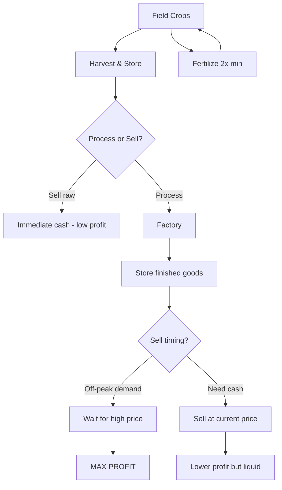

# 🏭 Farming Simulator 25 — Production Chains Guide

Processing raw crops into finished goods is how you go from broke farmer to agri-empire. This guide breaks down every production chain, its profit margin per step, factory placement strategy, and advanced optimization techniques.

---

## 📊 Complete Production Chain Profit Table

All figures per 1,000 L of input. Prices are mid-range — actuals fluctuate with market demand.

| Chain | Step 1 | Value Added | Step 2 | Value Added | Total Added |
|:------|:-------|:----------|:-------|:----------|:----------|
| 🌾 **Wheat → Flour → Bread** | Wheat ($260) → Flour ($550) | **+$290** | Flour ($550) + Water → Bread ($1,250) | **+$700** | **+$990** |
| 🌻 **Canola → Oil** | Canola ($610) → Canola Oil ($1,800) | **+$1,190** | — | — | **+$1,190** |
| 🌻 **Sunflower → Oil** | Sunflower ($610) → Sunflower Oil ($1,700) | **+$1,090** | — | — | **+$1,090** |
| 🧅 **Sugar Beet → Sugar** | Sugar Beet ($210) → Sugar ($1,400) | **+$1,190** | — | — | **+$1,190** |
| 🍇 **Grapes → Juice → Wine** | Grapes ($2,200) → Grape Juice ($3,960) | **+$1,760** | Juice ($3,960) + Aging → Wine ($8,800) | **+$4,840** | **+$6,600** |
| 🧵 **Cotton → Fabric → Clothing** | Cotton ($1,430) → Fabric ($3,640) | **+$2,210** | Fabric ($3,640) → Clothing ($6,500) | **+$2,860** | **+$5,070** |
| 🥔 **Potatoes → Chips** | Potatoes ($2,020) → Chips ($5,200) | **+$3,180** | — | — | **+$3,180** |
| 🥛 **Milk → Cheese → Butter** | Milk ($800) → Cheese ($2,400) | **+$1,600** | Milk ($800) → Butter ($3,200) | **+$2,400** | **+$2,400** |
| 🌽 **Corn → Silage → Biogas** | Corn ($504) → Silage ($1,100) | **+$596** | Silage → Biogas ($3,000/yr) | **+$1,900/yr** | **Recurring** |

> 💡 **Key Insight:** The Grapes → Juice → Wine chain has the highest value-add per liter in the game. A single vineyard + winery setup can generate $100K+/month.

---

## 💰 Profit Margin per Step: Raw vs Processed

### Grain Chain: Wheat → Flour → Bread

| Product | Sell Price/1,000L | Time to Produce | Profit/hr (1 plant) | Multiplier |
|:--------|:----------------|:---------------|:------------------|:----------|
| 🌾 Raw Wheat | $260 | 0 (harvest) | — | 1.0x |
| 🌾 Flour | $550 | 20 min | $870 | 2.1x |
| 🍞 Bread | $1,250 | 32 min (total) | $928 | 4.8x |

**Verdict:** Selling raw wheat is a 1x mistake. Flour doubles value. Bread nearly quintuples it.

### Canola & Sunflower → Oil Chain

| Product | Sell Price/1,000L | Time to Produce | Profit/hr | Multiplier |
|:--------|:----------------|:---------------|:---------|:----------|
| 🌻 Raw Canola | $610 | — | — | 1.0x |
| 🛢️ Canola Oil | $1,800 | 15 min | $2,380 | 2.95x |

**Verdict:** Oil presses have the fastest ROI of any processor. A canola field + oil mill pays for itself in 2 seasons.

### Grapes → Juice → Wine Chain

| Product | Sell Price/1,000L | Time to Produce | Profit/hr | Multiplier |
|:--------|:----------------|:---------------|:---------|:----------|
| 🍇 Raw Grapes | $2,200 | — | — | 1.0x |
| 🧃 Grape Juice | $3,960 | 25 min | $2,112 | 1.8x |
| 🍷 Wine | $8,800 | 45 min + aging | $4,400+ | 4.0x |

> ⚠️ **Note:** Wine requires aging time (in-game hours) before it reaches peak quality and price. Plan your wine cellar capacity accordingly.

### Sugar Beet → Sugar Chain

| Product | Sell Price/1,000L | Time to Produce | Profit/hr | Multiplier |
|:--------|:----------------|:---------------|:---------|:----------|
| 🧅 Raw Sugar Beet | $210 | — | — | 1.0x |
| 🍬 Sugar | $1,400 | 18 min | $2,367 | 6.7x |

**Verdict:** Sugar from sugar beets has the highest multiplier (6.7x) of any single-step chain. If you have a sugar mill, prioritize sugar beets over every other field crop.

---

## 🗺️ Factory Placement & Best Maps

### Production Chain Factory Locations

| Factory | Best Map | Proximity Strategy | Purchase Cost |
|:--------|:---------|:-----------------|:-------------|
| 🌾 **Grain Mill (Flour)** | Riverbend Springs | Near wheat fields and water | $85,000 |
| 🛢️ **Oil Mill** | Hutan Pantai | Center of map, near canola/sunflower | $120,000 |
| 🍞 **Bakery** | Riverbend Springs | Near grain mill (short wheat/flour haul) | $95,000 |
| 🍷 **Winery** | Zielonka | Vineyard-adjacent, hillside position | $180,000 |
| 🍬 **Sugar Mill** | Riverbend Springs | Near sugar beet fields | $110,000 |
| 🧵 **Spinning Mill** | Hutan Pantai | Near cotton fields, flat terrain | $130,000 |
| 🧀 **Dairy** | Riverbend Springs | Central, between pastures and town | $75,000 |
| 🏭 **Biogas Plant** | Any | Near corn/silage fields, edge of map | $500,000 |

### Best Map for Production Chains: Riverbend Springs 🌟

Riverbend Springs is the undisputed best map for production chains because:

1. **Central location** — All factories can be placed within 500m of each other
2. **Flat terrain** — Easier trailer logistics, fewer rollovers
3. **Pre-existing fields** — Large field sizes (F1–F10) near water
4. **Short road to sell points** — Bakery goods go to the restaurant in town
5. **Water access** — Grain mill requires water proximity

**Runner-up:** Hutan Pantai offers larger contiguous fields but longer road distances. Zielonka is best for vineyard-centric strategies.

---

## ⏱️ Time Investment: Manual vs AI Worker Processing

| Task | Manual Time (10ha) | AI Worker Time | AI Cost | Best For |
|:----|:-----------------|:--------------|:-------|:--------|
| 🌾 Harvest wheat | 25 min | 40 min | $1,200 | Let AI do it |
| 🚜 Transport to processor | 15 min | N/A (you drive) | — | Always manual |
| 🏭 Load processor | 5 min | N/A | — | Quick manual |
| 🍷 Collect wine product | 2 min | N/A | — | Quick manual |
| 📦 Deliver to sell point | 12 min | N/A | — | Always manual |
| 🌽 Silage harvesting | 30 min | 50 min | $2,500 | AI for first pass |
| 🧑‍🌾 Fertilizing | 20 min | 25 min | $800 | AI is cheaper |

**Strategy:** Use AI workers ONLY for field work (cultivating, seeding, fertilizing, harvesting). Always handle transport, processing, and selling yourself — those are high-value, low-time tasks.

---

## 🌦️ Seasonal Considerations

| Chain | Best Season | Worst Season | Seasonality Strategy |
|:------|:----------|:------------|:-------------------|
| 🌾 **Grain → Flour → Bread** | Harvest (Jul–Aug) | Winter | Process in fall/winter when prices are higher |
| 🌻 **Canola/Sunflower → Oil** | Post-harvest (Aug–Sep) | Spring | Store oil, sell before next harvest dip |
| 🍇 **Grapes → Juice → Wine** | Harvest (Aug–Sep) | Winter | Wine improves with aging; sell next summer |
| 🧅 **Sugar Beet → Sugar** | Harvest (Sep–Oct) | Spring | Sugar doesn't spoil — hold for best price |
| 🧵 **Cotton → Fabric** | Harvest (Sep–Oct) | Spring | Fabric prices stable year-round |
| 🥛 **Dairy processing** | Year-round | None | Steady daily income, no seasonality |

### Year-Round Production Strategy

| Production Type | Input Source | Winter Viable? | Requires |
|:--------------|:-----------|:-------------|:--------|
| 🏠 **Greenhouse vegetables** | Indoor planting | ✅ Yes | Heated greenhouse (FS25) |
| 🐄 **Dairy barn** | Hay, silage (stored) | ✅ Yes | Barn heater + stored feed |
| 🧀 **Cheese/Butter** | Milk from barn | ✅ Yes | Dairy + barns |
| 🏭 **Oil mill** | Stored canola/sunflower | ✅ Yes | Adequate silo storage |
| 🍞 **Bakery** | Stored flour | ✅ Yes | Grain mill + flour storage |
| 🌽 **Biogas** | Corn silage (stored) | ✅ Yes | Silage bunker + biogas plant |

> **Tip:** Build at least 2M L of silo storage before winter. Process throughout the cold months when field work is impossible — this turns idle time into $40K–$80K/month.

---

## 🌿 Advanced: Fertilizer & Production Chain Optimization

### Quality Bonuses from Precision Farming

With the Precision Farming DLC, fertilizer quality directly impacts processing yields:

| Fertilization Level | Yield Bonus | Processing Output Bonus | Total Chain Profit Impact |
|:-----------------|:----------|:---------------------|:------------------------|
| 0x (No fertilizer) | Base 100% | Base 100% | Baseline |
| 1x Fertilized | +15% yield | +5% processing output | +9–15% chain profit |
| 2x Fertilized | +30% yield | +10% processing output | +20–28% chain profit |
| 3x (Perfect) | +50% yield | +15% processing output | **+33–42% chain profit** |

### Optimal Fertilizer Strategy per Chain

| Chain | Recommended Fertilization | Why |
|:------|:------------------------|:----|
| 🌾 **Wheat → Bread** | 3x perfect | High-value end product; every quality point multiplies |
| 🍇 **Grapes → Wine** | 2x (optimal) | Grapes are perennial; third application has diminishing returns |
| 🌻 **Canola → Oil** | 2x (cost-effective) | Oil mill already doubles value; extra fert is lower priority |
| 🧅 **Sugar Beet → Sugar** | 2x | Sugar beet already high yield; 3rd pass marginal |
| 🧵 **Cotton → Fabric** | 3x perfect | Fabric price high enough to justify perfect fert |
| 🥔 **Potatoes → Chips** | 2x | Chips already 2.5x multiplier; fert at 2x is sweet spot |

### Integrated Farm Strategy

> **Pro Strategy:** Never sell raw crops after Year 1. By Year 2, every field should feed into at least one processing chain. The Grapes→Wine chain alone can generate $300K+/year from a single hectare of vineyard.

---

*Data source: Farming Simulator 25 gameplay data, community testing, precision farming DLC mechanics.*
