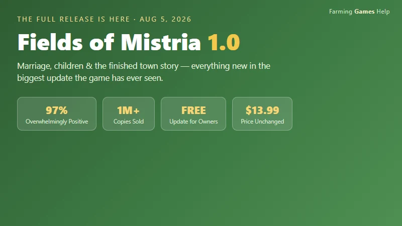
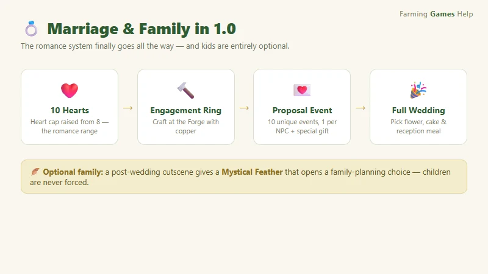
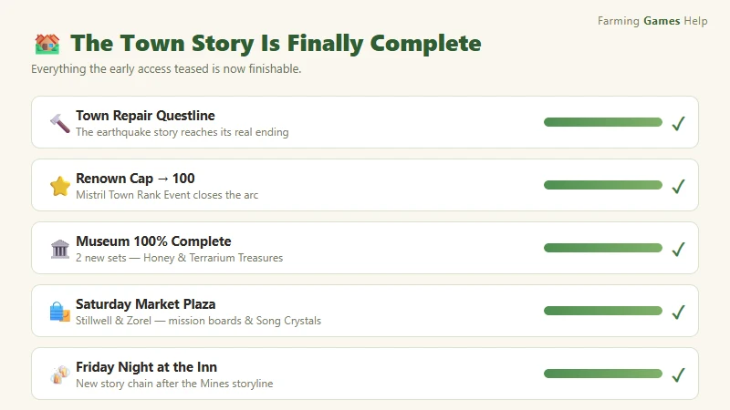
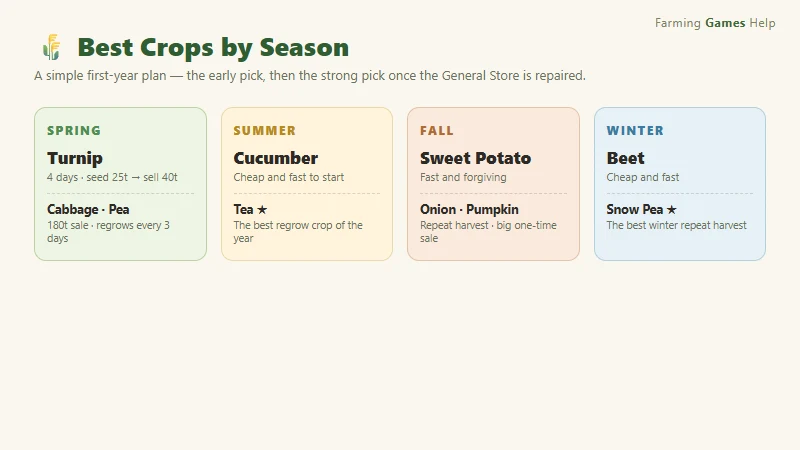
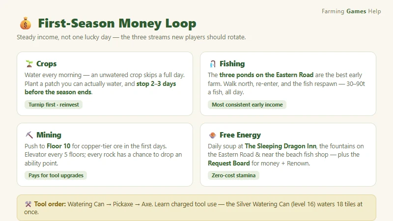

# Fields of Mistria 1.0 Update Guide — Everything New in the Full Release

> Game: Fields of Mistria | Developer: NPC Studio | 1.0 release: August 5, 2026 (Steam) | Free update · price stays $13.99 | Platforms: PC (Steam), Steam Deck verified | Rating: 97% "Overwhelmingly Positive" (1,000,000+ copies sold)

Fields of Mistria spent two years in early access building one of the friendliest farming RPGs around, and on **August 5, 2026** it crossed the finish line. The 1.0 update is free for every existing owner, and it is the biggest patch the game has ever seen — marriage with full weddings, an optional child system, the long-awaited ending of the town repair story, a fully completable museum, a rideable **Big Chicken**, new skill perks, new languages, and a long list of quality-of-life fixes. It also pushed the game past **one million copies sold**, with a near-flawless 97% "Overwhelmingly Positive" rating on Steam.

I've gone through the 1.0 release announcement, the community walkthroughs, and the update-overview videos that have been flooding the cozy-gaming side of YouTube and Bilibili since launch, and put together everything you need to know — what actually changed, what to do first if you're coming back to a year-one save, and a quick-start if you're brand new.

---

## What the 1.0 Update Is

**Fields of Mistria** is a farming simulation RPG from **NPC Studio** that blends Stardew-style farming with Rune Factory combat, a magic system, and a fully voiced cast of villagers. It entered Early Access on **August 5, 2024**, and 1.0 landed exactly two years later.

| Fact | Detail |
|:-----|:-------|
| **Developer** | NPC Studio |
| **Early Access** | August 5, 2024 |
| **1.0 release** | August 5, 2026 (12:00 PM EDT / 9:00 AM PDT) |
| **Platforms** | PC (Steam), Steam Deck verified |
| **Price** | $13.99 — unchanged; the 1.0 update is **free** for owners |
| **Copies sold** | 1,000,000+ at 1.0 launch |
| **Steam rating** | 97% positive ("Overwhelmingly Positive") |
| **Save compatibility** | Existing Early Access saves carry over directly |
| **Genre** | Farming sim · RPG · life sim · romance |

> **The hook:** 1.0 doesn't just add a final chapter — it closes the loop on the whole game. Every promise the early access made (romance your neighbor, repair the town, finish the museum) is now actually finishable. And if you've been waiting to start fresh, this is the version to start on.

---

## Marriage & Romance — the Heart System Goes to 10

The most-requested feature for two years is here. Relationships now go deeper than friendship, and romance is a complete system instead of a dead end.

- **Heart cap raised from 8 to 10.** The extra two hearts are the romance range — that's where the dating and proposal content lives.
- **Craft an Engagement Ring at the Forge.** Once you reach 10 hearts with a single NPC, the forge recipe for the ring unlocks.
- **10 new proposal events.** Each romanceable NPC has a unique 10-heart event, and they give you a special NPC-specific item when you propose.
- **Full weddings with your choices.** You pick the flower color, the cake flavor, and the reception meal — and the ceremony plays out with all your friends in town.
- **Multi-romance safety option.** A much-requested toggle lets you disable break-up letters and automatic relationship conversion when you marry one of several romantic interests, so your other friendships don't get punished.
- **12 romanceable characters — two of them new in 1.0.** The ten Early Access candidates are joined by **Caldarus**, the dragon guardian tied to your farm's shrine, who takes human form through a main-story quest (reach **Floor 60 of the mines**, complete the seal ritual, and restore him at his temple in the Deep Woods); and **Seridia**, the other previously-hidden candidate. Both unlock full 10-heart paths with their own proposal events and can marry you like the original ten.

> **Tip:** get to 10 hearts before the big in-game event calendar turns over. Proposal events are tied to each character's heart event, and the forge recipe needs copper — so keep a stack of copper ore on hand.

---

## Having Children (Completely Optional)

Marriage is one thing; a family is another — and 1.0 makes that a *choice* rather than a scripted checklist.

After your wedding, a cutscene hands you a **"Mystical Feather"** item. Using it opens an optional family-planning discussion with your spouse. The child system is fully opt-in: if you don't want kids, nothing forces them on you, and there's no time pressure to decide.

---

## The Town Story Is Finally Complete

The heart of 1.0 is the end of the town repair storyline. Mistria's recovery is now a finishable arc instead of an early-access cliffhanger.

- **Town Repair Questline — now completable.** The main narrative that starts with the earthquake finally reaches its conclusion.
- **Renown cap raised to 100.** Town rank (and the stamina rewards that come with it) now has a full endgame ceiling.
- **New "Mistril Town Rank Event."** A new town-level event marks the story's finale.
- **Two new questlines:** **"Saturday Market Plaza"** and **"Repair the Bell Tower."**
- **Stillwell and Zorel join the Saturday Market.** The new market stalls add mission boards, **Crystal Resonators**, and **Song Crystals**.
- **Museum fully completable.** All collection slots are now obtainable, with **2 new Museum Sets** — the **Honey Set** and the **Terrarium Treasures Set**.
- **"Friday Night at the Inn" storyline.** A new story chain that picks up after you finish the Mines storyline.

> **Tip for returning players:** if you had a museum at 80% and a town stuck at "not quite finished," 1.0 is the update you've been waiting for. Both the museum and the town story now have real endings, and the new Saturday Market items (Song Crystals especially) are worth checking out the first week back.

---

## The Big Chicken Mount & Other New Additions

- **🐔 The Big Chicken** — a rideable mount that has become the meme of the update. Unlock it by raising **all 6 chicken tiers** to max. Yes, it's exactly as absurd as it sounds, and yes, it's worth it.
- **🎵 Song Crystal system** — collect and place Song Crystals to customize the background music on your farm and in your home.
- **🏠 House exterior customization** — after the full house upgrade, you can finally change how your home looks from the outside.
- **🎮 Steam Achievements** — 1.0 adds the full achievement list, and it's **retroactive**, so your existing save instantly grants everything you've already earned.
- **🐾 Pet skins** — the new **"Friend-Shaped" combat perk** lets you earn pet skins from the monsters you befriend.

---

## New Perks, Languages & Quality of Life

### 7 new skill perks

| Perk | What it does (per the 1.0 notes) |
|:-----|:----------------------------------|
| **Espresso Yourself** | Coffee-related perk for energy management |
| **Playtime** | Pet/animal interaction perk |
| **Eggstra** | Egg-focused animal perk |
| **Close Bond II** | Deepens the existing bond line |
| **True Trust** | High-heart relationship perk |
| **Hammer Timing IV** | Mining/crafting efficiency extension |
| **Deliberate Debris II** | Debris-clearing efficiency extension |

### 7 new beta languages

Simplified Chinese, Traditional Chinese, Japanese, Korean, French, Russian, and Spanish joined the localization set. Some text may still show in English in places while translations get polished — that's expected in beta localizations.

### Quality of life

- **Character rotation** in the customization menu
- **Improved auto-care** for crops and animals
- **Cloud shadow** visual effects on sunny days
- A follow-up **v1.0.1 patch** fixed crash bugs tied to the new Ranching UI and a Harvest Festival invitation bug

---

## New Player? Your First Season Quick-Start

1.0 is bringing in a flood of first-time players, and the good news is the fundamentals haven't changed. Here's the fastest path from zero to a stable farm.

### Best crops by season

> **Note:** all prices in this guide use the game's currency, **Tesserae**, written as `t` (e.g. a turnip seed costs 25t and sells for 40t). Some older pages on this site write the same money as `g` — treat them as the same currency; this guide follows the in-game unit.

| Season | Best early pick | The strong pick once the General Store is repaired |
|:-------|:----------------|:---------------------------------------------------|
| **Spring** | Turnip — 4 days, seed 25t → sell 40t | Cabbage (9 days, sell 180t) · Pea (regrows every 3 days, sell 135t) |
| **Summer** | Cucumber — cheap and fast | **Tea** — the best regrow crop of the year |
| **Fall** | Sweet Potato — fast, forgiving | **Onion** (repeat harvest) · Pumpkin (big one-time sale) |
| **Winter** | Beet — cheap and fast | **Snow Pea** — the best repeat-harvest crop of winter |

**The three rules that matter most in season one:**

1. **Water before everything.** An unwatered crop skips a full day, and with 28-day seasons a few missed mornings snowball into a harvest that misses the season.
2. **Till a patch you can actually water.** Don't plant 40 tiles if your stamina runs out by 10 a.m. — a modest patch you fully water every day beats a big patch you half-water.
3. **Stop planting 2–3 days before the season ends.** Crops that aren't harvested by the season change die with no partial credit.

### Your first-week money loop

- **Fishing is the most consistent early income.** Before you can afford good seeds, fish the three ponds along the Eastern Road — then walk to the map north of your farm and come back. Re-entering **respawns the fish**, turning a 30–90t per fish loop into a reliable daily income.
- **Mining pays for tool upgrades.** Push to **Floor 10** of the mines in the first few days for copper-tier ore. An elevator activates every five floors, and each rock you break has a chance to drop an ability point, so mining is also the easiest way to level skills.
- **Free energy every day:** grab the free daily soup at **The Sleeping Dragon Inn** before a big run, and use the fountain on the Eastern Road and the fountain near the beach fish shop to top up.
- **Check the Request Board every morning.** Requests are the cleanest low-stress way to build Renown and earn money at the same time.

### Tool upgrade order

**Watering Can first** (makes daily crop care cheaper), then **Pickaxe** (speeds mining), then **Axe**, with Hoe/Shovel later. Learn **charged tool use** — hold the action button to cover multiple tiles, and higher metal tiers expand the charged area. About once a week, **Balor's Wagon** sells Silver Ingots for 500t each; at skill level 16 you can craft a **Silver Watering Can** that waters 18 tiles at once.

---

## Returning Player? What to Do First

If you're loading a year-one save into 1.0, the game does a good job of guiding you, but here's the priority order I'd use:

1. **Check your museum.** With the 2 new sets and full completion now possible, that's the most visible "you can actually finish this now" moment.
2. **Visit the Forge.** If you have a romanceable NPC at 8 hearts, the path to 10 (and the engagement ring recipe) is now open.
3. **Hit the Saturday Market.** Stillwell and Zorel's new stalls have the mission boards, Crystal Resonators, and Song Crystals — the Song Crystals especially are the update's sleeper hit.
4. **Claim your retroactive achievements.** If you're a completionist, 1.0 instantly grants everything your save has already earned.
5. **Ride a Big Chicken.** Priorities. The 6-tier chicken grind is the meme for a reason.

---

## FAQ

**Is the Fields of Mistria 1.0 update free?**
Yes. It's a free update for everyone who owns the game, and the base price stays at $13.99.

**Do my Early Access saves carry over to 1.0?**
Yes. Existing saves load directly into 1.0 with no conversion needed, and Steam Achievements are retroactive.

**Can I get married in Fields of Mistria now?**
Yes. Raise an NPC to 10 hearts, craft an Engagement Ring at the Forge, complete their proposal event, and you can hold a full wedding with your choice of flower color, cake flavor, and reception meal.

**Are children forced on you in 1.0?**
No. A post-wedding cutscene gives you a "Mystical Feather" item that opens an optional family-planning discussion. Having a child is entirely your choice.

**Is the town repair questline finishable now?**
Yes. The Town Repair Questline is completable in 1.0, the Renown cap is raised to 100, and the new "Mistril Town Rank Event" closes out the story. Two new questlines — Saturday Market Plaza and Repair the Bell Tower — expand it further.

**How do I unlock the Big Chicken mount?**
Raise all 6 chicken tiers to their max. The Big Chicken is a rideable mount that has become one of the most-loved additions in the update.

**What languages did 1.0 add?**
Seven beta localizations: Simplified Chinese, Traditional Chinese, Japanese, Korean, French, Russian, and Spanish.

---

*Guide compiled from the official 1.0 release announcement on Steam, Game8 and press coverage of the launch, community walkthroughs, and video guide coverage on YouTube and Bilibili. Prices and mechanics reflect the August 2026 1.0 state — check the Steam page before buying, and patch notes for the latest fixes.*

{{ affiliate_section("Fields of Mistria", "1929130") }}
