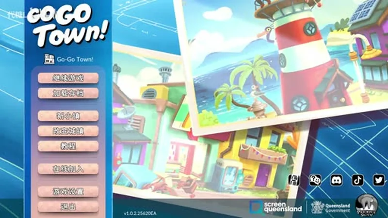
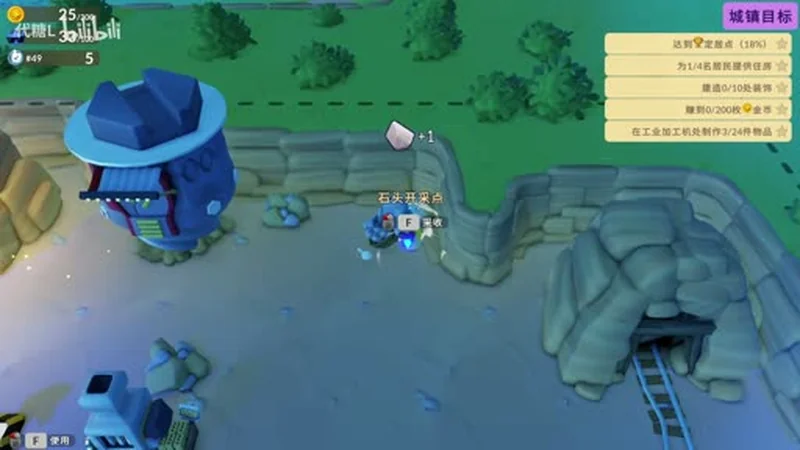
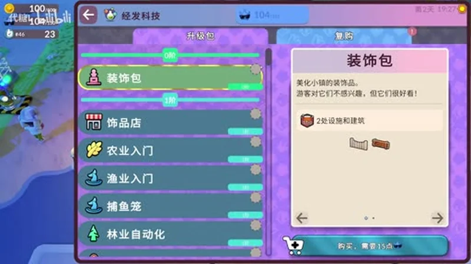
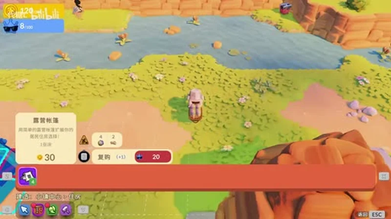
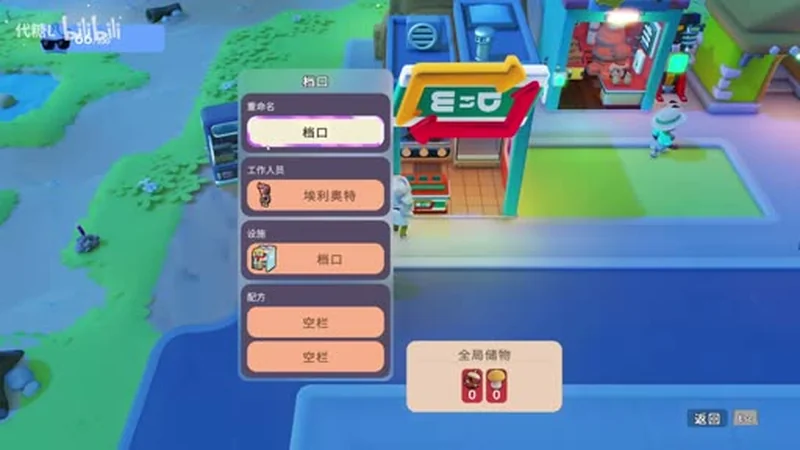

# Go-Go Town! Beginner's Guide — First Week Tips, Town Goals & Automation

> Game: Go-Go Town! (狗狗镇) | Developer: Prideful Sloth | Publisher: Prideful Sloth | Release: July 16, 2026 (Steam 1.0, after two years of Early Access) | Price: $27.99 base ($20.99 during the 1.0 launch discount) | Platforms: PC (Steam), Nintendo Switch, Switch 2

I was not prepared for how quickly my cozy town became a logistics problem. **Go-Go Town!** is Prideful Sloth's town-building + farming crossover that launched its **1.0 version on July 16, 2026** across PC, Switch and Switch 2 — and it is the rare cozy game that quietly turns into an automation puzzler the moment you hire a second worker. One minute you are placing a lamp post; the next you are staring at a delivery route that stalls because nobody is refining your planks.

This guide covers what I wish I knew in my first week — and it is based on the actual 1.0 build: the TownCo core loop, how the **Town Goals** system is the real tutorial, which **EGO Tech** unlocks to grab first, why recruiting a townie does *not* hire a worker, the exact moment to buy your first courier, and which early items are actually worth selling.

*Guide data gathered from the Steam store page and 1.0 patch notes, launch-week reviews, community walkthroughs, and the 1.0 flow playthrough by the Chinese community creator 代糖L on Bilibili (the 8-part 狗狗镇1.0正式版 流程合集). Prices and details reflect the July 2026 1.0 build — always check the Steam page before buying.*

---

## What Is Go-Go Town!?

**Go-Go Town!** is a cozy-but-deep city-building and life-sim game where you play a hands-on mayor rebuilding a derelict town for the mysterious **TownCo**. Unlike pure farming sims, most of the work on the map can be handed to NPC workers — so your real job is **designing production lines, routing resources, and laying out districts** rather than swinging a pickaxe forever. The community often calls it "Stardew's town, Anno's supply chains."

| Fact | Detail |
|:-----|:-------|
| **Developer / Publisher** | Prideful Sloth (Yonder, Grow: Song of the Evertree) |
| **Steam release** | July 16, 2026 (1.0) · Early Access from June 18, 2024 |
| **Price** | $27.99 base · **$20.99 during the 1.0 launch discount** (Switch ~$26.99 / Switch 2 ~$29.69) |
| **Rating** | "Very Positive" (~81% at launch, up to 93% positive reported) |
| **Co-op** | Online co-op up to **4 players** on Steam · local co-op on Switch 2 |
| **1.0 additions** | Tech tree · Creative Mode · Treasure Hunting · Import app · Rebuy system · off-road driving · Lost & Found · sprinklers |
| **Genre** | Town building · farming · life sim · cozy automation |

The 1.0 release is a big upgrade over Early Access. The refreshed **tech tree** gives you agency over what to unlock, **Creative Mode** is a separate sandbox map with no money or campaign limits, **Treasure Hunting** adds fish/insects/fossils/gems/relics to collect and display, and online **co-op for four** is the headline feature on Steam.

---

## The Core Loop — TownCo, Tourists and Townies

Every hour of Go-Go Town! circles the same loop:

**Manage town → attract tourists → recruit residents → assign them jobs → build more town → attract more tourists.**

The town is rated continuously, and the **TownCo rank** you climb by completing town goals is your progression key. More and better services bring more tourists (and rarer ones); tourists who stay happy become candidates to move in; residents you house and employ then run the services that attract the next wave. If you only remember one thing, remember this loop — every individual system (shops, couriers, decorations, farming) is a spoke feeding that wheel.

---

## Town Goals — the Real Tutorial

The game's tutorial is short, but the **Town Goals** app on your in-game phone is what actually teaches you the game. It always shows one headline goal plus sub-tasks with a completion percentage, and finishing a goal set triggers the next one. From my first 40 minutes in the 1.0 build, the goals walked me through, in order:

- **Build basic industry** — a gas station, a power station and a convenience store (the early service buildings that give tourists somewhere to go).
- **Construct the Town Hall** — this is your first "recipe quest": craft the required planks and processed items at an industrial processing machine, then place the shell.
- **Provide housing for residents** — 1/4, then 2/4 residents housed. Tents are your cheap first option; small houses come later.
- **Place decorations** — the goals ask for a target number (e.g. 0/10) of decorations around town.
- **Earn coins** — e.g. reach 200 coins collected, which nudges you to actually run your shops.

Two goal habits I'd build from day one:

- **Finish one required project before starting the next.** Unfinished buildings sit half-built, produce nothing, and clutter your construction menu.
- **Don't build a second copy of a goal object while the reward is unclaimed.** The game tracks goal objects; building ahead can leave you with an extra you didn't need.

The goals also introduce the **bulletin board** — a separate source of build orders, usually phrased as "tourist desire &gt; exploration" or similar. Read the desire tag before building; it tells you which visitor need that building serves.

---

## EGO Tech — What to Unlock First

**EGO** (economic development points) is the game's second currency, earned alongside coins. The **EGO Tech app** is a full tech tree where you spend EGO to unlock upgrades, buildings, and features. In the 1.0 build the tree is organized into packages — and the UI is explicit about what each does: upgrade packs, decoration packs ("tourists aren't interested in them, but they look nice!"), shop packages, and activity unlocks like farming, fishing and forestry automation.

My first-week unlock priority:

1. **Farming Introduction** — the tutorial zone already teaches you this, but the EGO unlock opens the farming economy properly. Forage **Seed Bushes** repeatedly in the Farming Zone to unlock more crop seeds.
2. **Fishing Introduction + Fish Trap** — fishing is a solid early side income, and the trap is passive.
3. **Forestry Automation** — the first real automation package; it starts turning wood gathering into a worker job.
4. **TownCo Exports (EGO Tech Tier 3, "Import and Export")** — completing tasks earns tickets you can redeem for decorations (lamp posts, fences, Gothic items, even vehicles). Grab this once you have a stable few-hundred-EGO surplus.

General rule: **unlock the package that removes your current bottleneck**, not the cheapest one. If your shops keep running out of ingredients, the food-processing unlock beats a pretty decoration pack every time.

---

## Housing & Residents — Recruit ≠ Hire

The single most common new-player mistake in Go-Go Town! is assuming a recruited resident automatically works. **Recruiting a townie does NOT create a worker.** To turn a tourist into a productive townie you must:

1. **Complete their personal recruitment request** (usually a small fetch or build task).
2. **Give them housing** — a tent or house placed somewhere in town.
3. **Open the management menu and assign an occupation.**

Housing has real costs: tents are your cheap early option, small houses are noticeably more expensive, and the menu shows a **rebuy** price for moving a building. Place housing close to the services the resident will work — walking distance is a real factor in how fast your shops restock.

When you open the management menu you'll see the occupations by sector:

- **Resource collection** — Lumberjack/Forester (wood), Miner (stone/ore), Farmer (crops/livestock), Fisherman (seafood)
- **Manufacturing / processing** — Brickmaker/Mason, Woodworker/Carpenter, Smelter/Blacksmith, Food Processor — *this is where bottlenecks happen* if nobody refines raw materials
- **Logistics** — Courier/Delivery Driver (moves products to shops), Warehouse Manager (balances inventory)
- **Maintenance / cleaning** — keeps streets clean; dirty streets tank tourist satisfaction fast

Some late-game residents are more efficient in specialized roles. Once you know a premium worker, put them in a busy shop like the Sushi Bar or Day Spa — not on chopping trees.

---

## Shops & Workers — Assigning Occupations

The shop loop is simple on paper: a shop needs a **stall**, a **worker**, **stock**, and a **path to the road**. When I assigned my first worker (the townie Elliott) to a stall, the real game clicked — the stall UI shows the worker, the global storage connection, and whether the shop has an active recipe.

Three things the game doesn't emphasize enough:

- **Shops are only useful if staffed.** An open shop with no worker produces nothing. Assign someone before you expect income.
- **Stock has to physically reach the shop.** The courier/warehouse system moves items from global storage to shop storage — if your raw materials are in the wrong storage, the shop stays empty.
- **Check the six tourist desires before building more of anything.** Tourists want Shopping, Hunger, Exploration, Entertainment, Rest and Health. Use the **Tourist Tracker app** to find the weakest service, then check the existing one: is it open, staffed, stocked, on a usable path, close to tourist routes, and on clean ground? Duplicating a service that fails any of those just doubles the problem.

---

## Automation — When to Buy Your First Courier

Automation is where Go-Go Town! stops being cozy and starts being satisfying. But the golden rule is strict:

**Automate a route only after you can complete it manually.**

My test chain: **Forestry worker → Storage → Courier → shop Storage → active recipe.** Before buying that first courier, confirm all five links exist: the source produces the correct item, the worker actually has demand, items reach usable storage, the shop has an active recipe, and the courier building connects to a road.

And once the first courier runs:

- **Buy another only when the first is moving almost continuously** and a destination still runs out of stock. That is a *capacity* problem. A courier that never moves is not a capacity problem — it's a routing problem, and a second courier won't fix it.

---

## Money in the First Week — What to Sell

Early coins are tight, and the **sale prices of raw finds** are not equal. The community consensus from launch week holds up:

| Item | Sell price | Verdict |
|:-----|:-----------|:--------|
| 💎 **Geode** (from mining ore) | **12 coins** | Best early find — needs Metal Ingots, but worth it |
| 🪨 **Pet Rock** | 10 coins | Fine fallback |
| 🪵 **Wood Trinket** | 10 coins | Fine fallback |

- **Don't rely on selling treasures as your main income.** Open the **Collections app** before selling a find: keep **at least one copy** of anything new for your collection or Town Hall display, and sell only the duplicates.
- **Import is a shortcut, not a strategy.** The Import app buys items/vehicles with coins — perfect for a single item blocking a Town Goal, or something you've already discovered. But if a shop needs the same ingredient daily, fix or automate the source instead of importing forever.
- **Watch the weather.** Windy days scatter leaf piles with seasonal decorations; after rain, a "golden hour" can literally make coins rain from the sky — on a timer, so collect fast.

### Storage sizes worth knowing

| Container | Slots |
|:----------|:------|
| 🎒 **Starting backpack** | 8 slots |
| 🧺 **Small storage basket** | 16 slots |
| 🚛 **Truck** | 48 slots |

Items take varying space (wood, bricks, planks and ingots take **2 slots each**), so those numbers go faster than they look.

---

## The Map — Where Things Live

The starting town is compact but the zones are spread out, so know your landmarks early:

- **Mine** — upper-right of the map
- **Forest** — lower-right
- **Train station** — center-upper (the train arrival is an early story beat — the goal UI announces "train's here!" when it arrives)
- **Truck** — on the road between mine and forest

Plan your early courier routes around those fixed points, and don't terrace over water: you **can't undo pathing placed over water** until you unlock Water Tiles via **Expanded Fishing Tier 5** in EGO Tech.

---

## Pro Tips & Common Mistakes

### ✅ Do This

- **Follow the Town Goals app** — it's the tutorial that doesn't say so, and it unlocks your town's rank, rewards and next goal set.
- **Complete recruitment requests + housing + occupation in that order** — recruit ≠ hire, every time.
- **Automate a route only after you can run it manually** — then add one courier at a time.
- **Check the Tourist Tracker before building** another service; duplication never fixes a routing problem.
- **Sell Geodes over Pet Rocks**, and keep one of every treasure for collections.
- **Forage Seed Bushes repeatedly** in the Farming Zone to expand your crop list.
- **Use Import for one-off Town Goal blockers** — never as a permanent supply line.

### ❌ Do Not Do This

- **Don't recruit a townie and assume they're working** — no housing, no occupation, no output.
- **Don't build a second goal building before claiming the reward** — you'll end up with unused stock.
- **Don't terrace/path over water early** — it's stuck until Expanded Fishing Tier 5.
- **Don't buy a second courier while the first sits idle** — that's a routing issue, not a capacity one.
- **Don't sell the first copy of a treasure** — collections and Town Hall displays want them.
- **Don't neglect cleaning/maintenance** — dirty streets silently kill tourist satisfaction.

---

## FAQ

### Is Go-Go Town! out of Early Access?
Yes. The **1.0 version launched July 16, 2026** on Steam, Switch and Switch 2, adding online co-op (up to 4 on Steam), the tech tree, Creative Mode, Treasure Hunting, the Import app, off-road driving and more.

### How much does Go-Go Town! cost?
**$27.99 base**, **$20.99 with the 25% 1.0 launch discount** (sale ran until July 30, 2026). Switch versions were ~$26.99 / Switch 2 ~$29.69 during the same sale.

### How do I make a resident actually work?
Recruit them (personal request), give them **housing**, then open the **management menu** and assign an **occupation**. Recruiting alone does nothing.

### What should I unlock first in the EGO Tech tree?
**Farming Introduction**, then **Fishing Introduction + Fish Trap**, then **Forestry Automation**, then **TownCo Exports** once you have an EGO surplus. Always unlock the package that removes your current bottleneck.

### What's the best early money maker?
Raw finds: **Geodes sell for 12 coins** vs **10 for Pet Rocks and Wood Trinkets**. Later, staffed shop recipes beat raw selling — the moment you have a worker and a stocked shop, that loop out-earns manual selling fast.

### How many players can play co-op?
**Up to 4 online on Steam**; Switch 2 supports local co-op. Sessions mix online and local players, with role-based permissions the host controls.

### What are the six tourist desires?
**Shopping, Hunger, Exploration, Entertainment, Rest and Health.** Use the Tourist Tracker app to find the weakest, then check the existing service before building another.

---

## 🔗 Related Guides

- 🌾 [Stardew Valley Complete Game Guide](/stardew/) — the cozy-farming benchmark for crop calendars and profit loops
- 🏝️ [Coral Island Guide](/coral-island/) — tropical farming, diving and town life
- ✨ [Fields of Mistria Guide](/fields-mistria/) — another 2026 farming sim with a fresh full release
- 🏝️ [Starsand Island Guide](/starsand-island/) — island farming, animals and community
- 🦊 [Tales of Seikyu Beginner's Guide](/tales-of-seikyu/) — the yokai farming sim with the no-hoe transformation system

---

*Guide data gathered from the Steam store page, the 1.0 patch notes, launch-week reviews, community walkthroughs, and the 1.0 flow playthrough by the Chinese community creator 代糖L on Bilibili (【Go-Go Town】狗狗镇1.0正式版 流程合集). Screenshots captured from the 1.0 build (v1.0.2). Prices and details reflect the July 2026 1.0 state and may change with updates — always check the Steam page before buying.*
