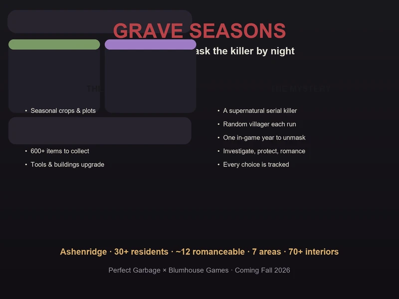
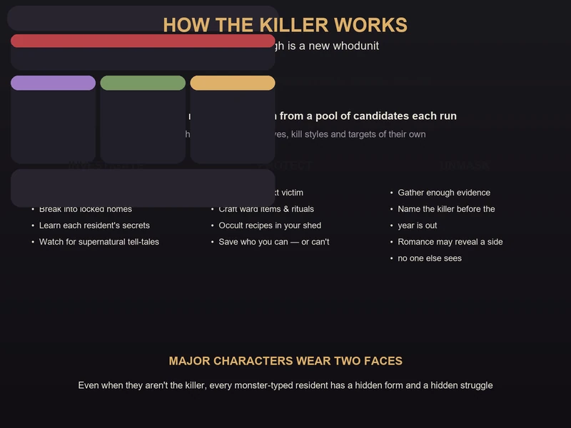
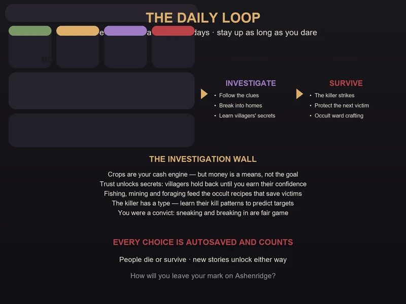
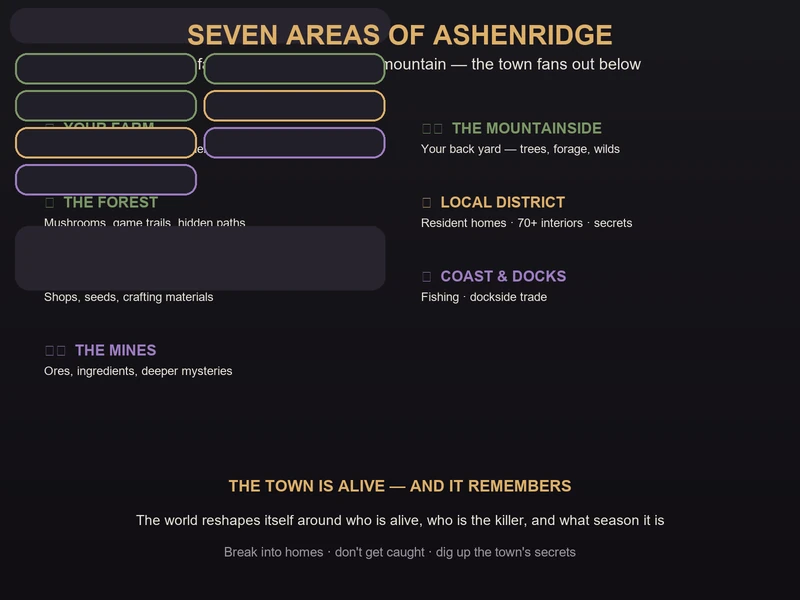
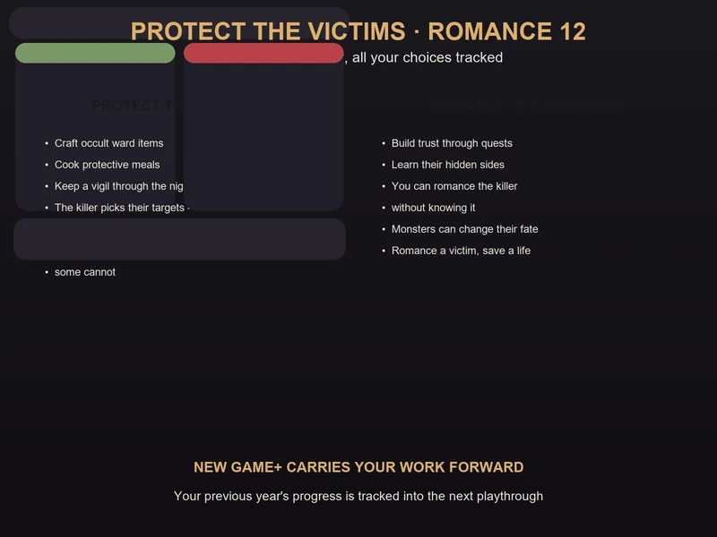

# Grave Seasons Preview Guide — Farm by Day, Unmask a Killer by Night

> Game: Grave Seasons (*埋谷季* / *送葬季*) | Developer: Perfect Garbage | Publisher: Blumhouse Games | Releasing: Fall 2026 — delayed from August 14, 2026 | Platforms: PC (Steam), PlayStation 5, Xbox Series X|S, Nintendo Switch · Xbox Game Pass day one

I have followed **Grave Seasons** since the IGN China 11-minute gameplay demo (*实机演示*) went up on Bilibili on March 30, and I went hands-on with the show build at PAX East before the delay news broke. It is the strangest thing to happen to the cozy-farming genre this year: a pixel-art Stardew-style farming sim — crops, fishing, mining, foraging, romance, festivals of small-town life — where **one of your neighbors is a supernatural serial killer**, and you have exactly one in-game year to figure out who.

**One important note before you read on:** this is a **pre-release preview guide**, not a review of the finished game. Grave Seasons was originally scheduled for **August 14, 2026**, but on **June 5, 2026** developer Perfect Garbage announced the game had been delayed to an undated **Fall 2026** window — the same announcement cancelled the planned June 15 public demo. The game is not out yet, so everything below is built from what's actually playable or shown so far: the official trailer, the IGN China 11-minute gameplay demo on Bilibili, the **PAX East 2026 hands-on demo** (the first public build), and the **Summer Game Fest 2026 press preview**, cross-checked against the Steam store page and developer interviews. I'll flag which details are confirmed by the developer and which come from preview hands-ons.

---

## What Is Grave Seasons?

**Grave Seasons** is an isometric pixel-art farming and life sim from indie studio **Perfect Garbage**, published by **Blumhouse Games** — the interactive division of Jason Blum's horror production company, in its most on-brand project yet. You play an escaped convict who settles in the small mountainside town of **Ashenridge** (灰岭镇). Your farm sits at the top of the mountain, the town fans out below, and everything is beautiful and quiet — until the murders start.

| Fact | Detail |
|:-----|:-------|
| **Developer** | Perfect Garbage (co-founders Emmett Nahil & Son M) |
| **Publisher** | Blumhouse Games |
| **Release window** | Fall 2026 — originally August 14, 2026, delayed June 5, 2026 (no exact date yet) |
| **Platforms** | PC (Steam), PS5, Xbox Series X\|S, Nintendo Switch |
| **Game Pass** | Included day one on Xbox Game Pass |
| **Genre** | Isometric pixel-art farming / life sim · murder mystery · supernatural horror |
| **Setting** | Ashenridge — a mountainside town; your farm is at the very top |
| **Playtime core** | One in-game year per playthrough |
| **Residents** | 30+ townsfolk, 70+ interior locations |
| **Major areas** | 7 — Your Farm, The Mountainside, The Forest, Local District, Commercial District, Coast & Docks, The Mines |
| **Romance** | Around a dozen romanceable characters (per preview reports) — some may be the killer |
| **Items** | 600+ to collect, discover or craft |
| **Killer** | Randomly assigned from a pool of candidates every playthrough |
| **Mode** | Single-player |
| **Announced** | First shown June 2024; August 14 date revealed at the March 2026 Xbox Partner Preview (later delayed) |

**The pitch in one line:** Stardew Valley if the town had a serial killer and the townsfolk were secretly monsters. You farm, you fish, you befriend and romance your neighbors — and you do all of it while investigating who among them is killing people after dark.

> **First-person take, up front:** from what's playable so far, the killer gimmick is not a skin over a normal farming game — it changes how you play *everything*, because every relationship you build and every choice you make can keep someone alive or get them killed. I'll get into the numbers and the honest trade-offs at the end.

---

## The Story: An Escaped Convict in Ashenridge

The opening is the genre hook, inverted. You're not an innocent city-dweller fleeing the rat race. You're **a recently escaped prisoner**, and the remote farm at the top of Ashenridge mountain is not a comfort — it's a necessity. The developers say that choice was deliberate: the cozy-genre protagonist is almost always a "good, innocent person with no secrets," and Grave Seasons immediately asks what happens when that assumption is gone.

The official summary sets the scene: *"After a treacherous escape from jail, you've made it to your new home in Ashenridge, an idyllic town with some seriously unsettling vibes. While trying to establish your new farming life and embed yourself in the neighborhood, murders start to occur in the town, putting your new peaceful life at risk."*

A few story beats worth knowing before you start:

- **The town is small and full of secrets.** Ashenridge's residents all have something to hide — and unlike some farming games, they won't confess their secrets just because you gifted them a strawberry. You have to earn knowledge, and even then people hold parts of themselves back.
- **The killer is supernatural.** This isn't a whodunit with a mundane motive. Each playthrough picks a supernatural serial killer from a pool of candidates, and every killer has their own campaign, their own reasoning, their own kill styles, and their own targets.
- **The monsters are metaphors.** The developers describe every major character as having a "dual monster identity" — even when they're not the killer, they're some kind of supernatural being whose form reflects their inner struggles. This is a game about trauma and moral change wearing a monster costume.
- **You're not a hero.** You can choose to participate in the town's larger conflict or not. The game actively asks why you want to succeed at farming — for yourself, or for something bigger.

---

## The One-Year Clock & How the Killer Works

The single most important mechanic in Grave Seasons is the **one-year time limit**. You have one in-game year to protect victims and unmask the killer. When the year ends, the game tallies what happened — who lived, who died, what you uncovered — and that outcome becomes the story of your time in Ashenridge.

Here's how the killer system actually works:

1. **The killer is chosen at random.** Every playthrough, one of the town's residents is secretly assigned the role of the supernatural serial killer. You do not know who it is at the start.
2. **Each killer has a full campaign.** The killer isn't a random event generator — they have a storyline, motives, specific kill styles, and preferred targets. Which killer is active changes the shape of the whole game.
3. **The world reacts to the killer.** Areas change depending on which killer is active, which residents are alive, and what season it is. A town with one victim missing plays differently than a town where everyone survived.
4. **Every choice is autosaved and tracked.** Decisions unlock new storylines — some unlock when characters die, others when they survive. The game deliberately doesn't punish you for "wrong" choices or hand you clean answers.
5. **The year ends, and it carries over.** Your work is tracked from one playthrough to the next, which is the game's answer to New Game+ — more on that in the replayability section.

The design team drew directly on the writing philosophy of *Scarlet Hollow*: they don't want to punish your choices, and they don't want to hand you a correct answer. People may die, or their lives may change in unexpected ways — whether that's right or wrong is up to you.

---

## The Daily Loop: Farm by Day, Investigate by Night

Grave Seasons keeps a **24-hour day/night cycle** — and yes, you can stay awake for 24+ hours if you want to push it. The loop is built so the cozy half of the game pays for the mystery half:

| Time of day | What you're doing |
|:------------|:------------------|
| **Morning** | Farm loop — water crops, harvest, tend the plots, check the calendar |
| **Afternoon** | Town loop — shops, seeds, errands, talking to residents and building trust |
| **Evening** | Investigation — follow clues, break into homes, learn villagers' secrets |
| **Night** | The danger window — the killer strikes, and protecting the next victim matters |

The rhythm is the whole point: crops are your cash engine, but money is a means, not the goal. The real resources are **information and trust**. The more you integrate into the neighborhood during the day, the more doors (literally and figuratively) open for your investigation at night.

Three things the demo footage makes clear about the loop:

- **Trust is the currency of the investigation.** Residents hold back secrets until you earn their confidence through quests and relationships. The game explicitly wants you to work for knowledge instead of buying it.
- **You can break into homes.** If you want someone's private secrets and they won't share them, breaking and entering is on the table — just don't get caught. Your backstory as an escaped convict makes this fair game narratively.
- **Staying up is a choice with a cost.** The day/night cycle is real, and so is the danger after dark. Pushing through the night to finish an investigation is possible, but it's exactly when the killer is most active.

---

## Your Farm: Crops, Crafting & the Occult Shed

The farming side of Grave Seasons is a full-featured cozy sim, with one crucial addition: **occult crafting**. The Steam feature list spells out the basics:

- **Seasonal crops and farm plots.** You farm seasonal crops using different types of farm plots. Seasons change and impact the world, so your planting calendar matters.
- **Two crafting stations.** Recipes are crafted in your **kitchen** or your **shed** — and the shed is where the mysterious **occult items** come from. These occult items are how you protect potential victims of the killer.
- **Tool and building upgrades.** Upgrade your tools and the buildings on your farm, and pick aesthetic customization options along the way.
- **Unearth pieces of history.** As you farm, harvest and forage, you dig up pieces of Ashenridge's history — which feeds both the story and the collection side of the game.
- **Fishing, mining and new ingredients.** Fish and mine to discover new ingredients that help unravel the town's mysteries.
- **600+ items.** Collect, discover or craft over 600 items, from crops and meals to wards and ritual components.

**The strategic takeaway from the demo:** your farm is not a decorative side activity — it's the economic engine that funds your investigation, and the ingredients you grow and fish and mine are literally the materials you need to save lives. An empty farm means an unprotected town.

---

## Exploring the Seven Areas of Ashenridge

Ashenridge is compact but dense — **30+ residents and 70+ interior locations** spread across **seven major areas**. Your farm at the top of the mountain anchors the map, and the town fans out below it:

| Area | What lives there |
|:-----|:-----------------|
| **Your Farm** | Seasonal crops, plots, kitchen, shed — home base at the top of the mountain |
| **The Mountainside** | The wilds right outside your door — trees, forage, the path down to town |
| **The Forest** | Mushrooms, game trails and hidden paths — classic investigation territory |
| **The Local District** | Resident homes and most of the 70+ interiors — where the secrets are locked away |
| **The Commercial District** | Shops, seeds, crafting materials — the town's economy |
| **The Coast & Docks** | Fishing and dockside trade — fresh ingredients and new leads |
| **The Mines** | Ores, rare ingredients, and the deeper mysteries the town keeps underground |

The key thing the demo emphasizes is that **the map is alive and reactive**. Ashenridge changes depending on which killer is active, which residents are alive, and what season it is. The same street plays differently in spring with everyone alive than it does by winter with a body count. Exploration isn't a checklist — it's how you track what the town is becoming.

---

## Investigation: Clues, Locked Doors & Villager Secrets

The mystery half of Grave Seasons is an investigation game layered on top of the life sim. You are looking for the one resident who is the supernatural serial killer, and the investigation has real structure:

- **Follow the clues.** The murders leave evidence across town, and the killer's patterns — their kill styles and targets — are readable once you start paying attention.
- **Learn each resident's secrets.** Every resident has a hidden side, and many are supernatural beings in their own right. Understanding what each person is hiding is how you narrow the field.
- **Break and enter.** Some secrets only open with a lockpick. Break into homes to search for evidence, but don't get caught — a town that trusts you is a town that lets you investigate.
- **Read the supernatural signs.** Because the killer is supernatural, the investigation isn't just forensic — it's occult. Recognizing the tell-tales of monster-typed residents is part of the puzzle.

The writing team was explicit about the design goal: the game wants you to genuinely interact with the community, walk down from your mountain farm, get to know people, and examine the isolation at the heart of the cozy-farming fantasy. You are farming and hitting goals — but the question the game keeps asking is *for whom*.

---

## Protecting the Next Victim

Here's where Grave Seasons goes somewhere almost no farming sim goes: **you can save people.** As you identify who the killer is likely to target next, you can take action:

- **Craft occult ward items.** The occult recipes in your shed are the primary protection tools — ward items and rituals that can deter the killer from a targeted victim.
- **Protect through relationships.** Getting close to a potential victim — even romancing them — can change whether they survive. The game tracks your choices and opens survival storylines for characters you protected.
- **The killer has a type.** Learning the killer's kill styles and target preferences lets you predict who is next, which turns protection from luck into strategy.
- **Some victims can't be saved.** Not every death is preventable, and the game is honest about that. Characters dying unlocks its own storylines.

The "both sides" design shows in the romance system too. You can **romance the killer without knowing it**, and uncovering a character's hidden side while they're a killer — or while they're a victim — is a core part of the storytelling. The game's monsters aren't all villains; they're people with their own struggles in both forms, and some of them can change their fate.

---

## Romance: Around a Dozen Candidates, Some of Them Killers

The social layer of Grave Seasons is standard-issue for the genre, but the stakes are anything but standard:

- **Around a dozen romanceable characters** across Ashenridge's 30+ residents — preview hands-ons consistently describe "wooing" a dozen or so of the townsfolk, though the developer hasn't pinned down an exact final roster yet.
- **Romance the killer?** Some of the candidates can be the killer in a given playthrough — which means you can unknowingly build a romance with the person murdering your neighbors.
- **Romance the victim?** Conversely, getting close to a target can be what saves them.
- **Dual identities.** Major characters have monster forms that reflect their inner struggles, and the game explores whether you can reach the person beneath the monster — in either role.

For relationship building, expect the familiar farming-sim loop of **quests, gifts and conversations** to earn trust — but remember the demo's warning: unlike some cozy games, residents don't open up just because you're nice. Knowledge has to be earned, and it may require breaking a door down.

---

## Replayability: New Game+ and the Random Killer

The single strongest argument for Grave Seasons' design is its replay structure, because the core mystery is randomized:

- **The killer is different every run.** Each playthrough draws a different supernatural serial killer from the pool of candidates, with their own campaign, motives, kill styles and targets. The "who is it?" question literally has a different answer each time.
- **Your work carries over.** Progress and decisions are tracked from your previous year into the next playthrough — the game remembers what you did, and the town reflects it.
- **The world branches on survival.** Which residents are alive, which storylines you unlocked by saving or losing people, and what season it is all reshape the map and the investigation.

That structure means one year is a complete, satisfying mystery — but the game is clearly built to be played again with fresh knowledge, carrying your previous year's legacy into a new whodunit.

---

## Grave Seasons vs Stardew Valley vs Village in the Shade

Every cozy game gets compared to Stardew Valley, and every horror-flavored farm game gets compared to Village in the Shade — so let's put all three side by side with the numbers:

| Dimension | Grave Seasons | Stardew Valley | Village in the Shade |
|:----------|:--------------|:---------------|:---------------------|
| **Developer** | Perfect Garbage | ConcernedApe | Nippon Ichi Software (Yomawari team) |
| **Publisher** | Blumhouse Games | ConcernedApe | NIS (JP launch) / NIS America (West) |
| **Release** | Fall 2026 (delayed from Aug 14) | Feb 2016 | Jul 30, 2026 (JP) / Fall 2026 (West) |
| **Price** | TBD · day one Game Pass | $14.99 | ¥8,200 (PS5/Switch 2/PC), ¥7,200 (Switch) |
| **Core loop** | Farm by day, investigate a serial killer by night | Farm, mine, fish, befriend | Farm by day, explore village secrets at night |
| **Time pressure** | One in-game year | None (relaxed) | Village rules & night dangers |
| **Killer / mystery** | Random supernatural serial killer every run | None | Haunted village with 8 taboo rules |
| **Residents** | 30+, 70+ interiors | ~30+ NPCs | A village full of secrets |
| **Romance** | ~a dozen (some are the killer) | 12 candidates + marriage | Romance + village life |
| **Collectibles** | 600+ items | Many | 80+ crops/flowers, 1,500+ craftables |
| **Map** | 7 areas of one town | Valley + Ginger Island | One mountain village |
| **Replayability** | Killer randomizes each playthrough | Mods & completionism | Story-driven |
| **Platforms** | PC, PS5, Xbox, Switch, Game Pass | PC + everything | PC, PS5, Switch, Switch 2 |

**The honest take:** Stardew is the relaxed sandbox you live in for years. Village in the Shade is the horror-flavored farm game about *not* breaking rules at night. Grave Seasons sits in its own lane — it's the one where a concrete, solvable mystery with real stakes (people die or live based on your choices) is baked into every run. If you want a cozy game that still has you on the edge of your seat, that's the whole pitch.

---

## Pro Tips & Common Mistakes

### ✅ Do This

- **Farm for the investigation, not for profit.** Crops fund your ward-crafting and town life — treat money as fuel for the mystery, not the goal.
- **Build trust during the day.** Errands, quests and conversations in the afternoon open the secrets you need by night.
- **Learn the killer's patterns early.** Kill styles and target preferences are your prediction tool for protecting the next victim.
- **Keep your shed stocked.** Occult ward items are the difference between a victim surviving and dying — craft them before you need them.
- **Investigate at night deliberately.** Night is the danger window, but it's also where the evidence is. Plan your late nights around protecting a specific target.
- **Break in smartly.** When a resident won't share their secret, the lockpick is an option — just don't get caught, because trust is your real armor.
- **Read the town's reactions.** The world changes with who's alive and what season it is — a changed street is a clue.
- **Don't be afraid to romance someone you suspect.** Uncovering a character's hidden side while they're a suspect (or a victim) is where the best writing lives.

### ❌ Do Not Do This

- **Do not ignore the farm.** An empty farm means no ingredients for the occult recipes that save lives.
- **Do not treat residents as gift-vending machines.** They won't open up just because you're nice — push for real engagement.
- **Do not expect a clean ending.** The game won't tell you whether your choices were "right." People may die anyway.
- **Do not play every night on empty.** Staying up 24+ hours is allowed, but it's exactly when the killer is most active — pace yourself.
- **Do not assume the friendly neighbor is innocent.** In this town, the nicest person can be the monster.
- **Do not expect a mundane whodunit.** The killer is supernatural, and the investigation is as much occult as forensic.

---

## FAQ

### What is Grave Seasons?
A pixel-art farming and life sim from **Perfect Garbage**, published by **Blumhouse Games**, where you play an escaped convict settling in the town of **Ashenridge**. You farm, fish, mine, forge relationships — and investigate which resident is a **supernatural serial killer**, with one in-game year to unmask them.

### When does Grave Seasons release?
**Fall 2026** on **PC (Steam), PlayStation 5, Xbox Series X|S and Nintendo Switch** — the original **August 14, 2026** date was delayed on **June 5, 2026**, and no exact replacement date has been announced yet. It's confirmed for day one on **Xbox Game Pass**.

### How does the killer work in Grave Seasons?
Each playthrough randomly assigns one resident the role of supernatural serial killer, chosen from a pool of candidates. Every killer has their own campaign, motives, kill styles and targets, so the mystery is different on every run.

### How long is a playthrough of Grave Seasons?
One **in-game year** per playthrough, with a 24-hour day/night cycle. The year's outcome — who lived, who died, what you uncovered — is tallied, and your work carries into the next playthrough.

### Can you romance the killer in Grave Seasons?
Yes. There are **around a dozen romanceable characters** (per preview hands-ons, the final roster isn't officially confirmed), and some of them can be the killer in a given playthrough — so you can build a relationship with the killer without knowing who they are.

### How do I protect victims in Grave Seasons?
Craft **occult ward items** in your shed, identify the killer's likely targets by learning their kill patterns, and build relationships with potential victims — your choices determine who lives and who dies.

### How many areas and residents are there?
**Seven major areas** (Your Farm, The Mountainside, The Forest, Local District, Commercial District, Coast & Docks, and The Mines), **30+ residents**, **70+ interior locations**, and **600+ items** to collect, discover or craft.

### Is Grave Seasons worth looking forward to in 2026?
If the premise — a full farming sim where you investigate a randomized supernatural murder mystery with real consequences — appeals to you, it's shaping up to be the most distinctive cozy-adjacent game of the year. The random-killer structure gives it strong replay value, and day one **Game Pass** will make it easy to try risk-free when it lands. If you want a purely relaxed, stakes-free farm sim, this is deliberately not that.

---

*This is a pre-release preview guide. Source material: the official announcement trailer and the March 30, 2026 IGN China 11-minute gameplay demo (实机演示) on Bilibili, the PAX East 2026 hands-on demo (the first public playable build), Summer Game Fest 2026 press preview coverage, the Steam store page, and developer interviews — including a Polygon interview translated by 17173 on May 26, 2026. Grave Seasons was delayed from August 14 to an undated Fall 2026 window on June 5, 2026; details reflect the build as shown so far and may change before launch. The game is not yet priced on Steam (only wishlistable) — always check the Steam page before release.*
