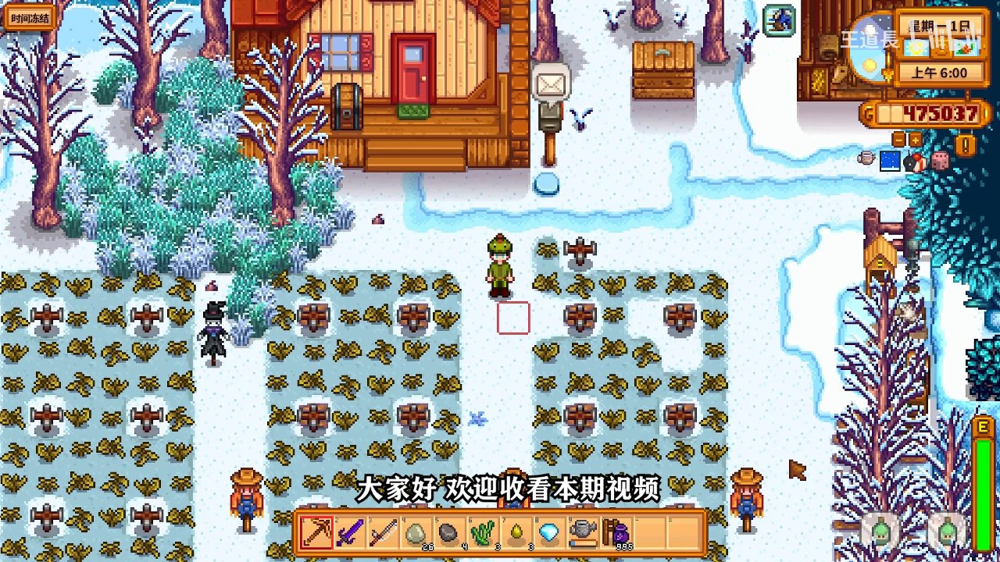
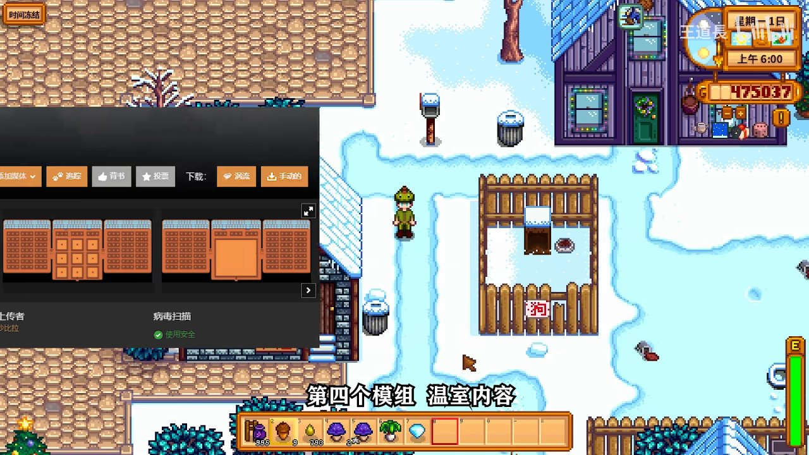

# 📦 【星露谷物语】12月份人气最高的五个mod（N网）

> 本攻略由 B站 UP主「王道長」视频教程整理生成
> 参考视频：https://www.bilibili.com/video/BV15b4y1H7G5
> 最后更新: 2026-07-13

---

Nexus Mods（N网）每个月都会涌现大量优质模组，本期视频精选了**12月份人气最高、质量过硬的五个模组**，涵盖库存管理、物品存储、温室扩展等实用功能，让你的星露谷体验更上一层楼。

---

## 📋 本篇涵盖

- ✅ **模组一：更方便的库存** — 便捷物品/储物箱管理
- ✅ **模组二：绿色储物箱** — 特殊物品分类存储
- ✅ **模组三：温室内容扩展** — 温室功能全面升级
- ✅ **模组四/五：更多实用功能** — 额外推荐模组
- ✅ **模组安装与N网使用技巧**

---

## 🎮 1. 模组一：更方便的库存（Better Inventory）


*更方便的库存模组，让物品管理变得轻松高效*

### 功能亮点

| 功能 | 说明 |
|:-----|:------|
| **智能分类** | 按物品种类自动归类，找东西不再翻遍背包 |
| **一键整理** | 点击按钮自动排序物品栏和储物箱 |
| **快速搜索** | 输入名称秒查物品，海量物品也不怕 |
| **批量操作** | 支持快速存/取/堆叠同类物品 |

### 使用场景

- 背包混乱时一键整理，节省日常管理时间
- 大量收获后快速分类存入对应储物箱
- 与储物箱模组配合使用效果更佳

> 💡 **实测体验**：这个模组非常适合中后期玩家——当农场规模大了、物品种类多了之后，库存管理效率提升非常明显。

---

## 📦 2. 模组二：绿色储物箱（Green Chest）


*绿色储物箱：可以存放橡子等特殊物品的专用分类箱*

### 独特功能

绿色储物箱是本期推荐的第二个热门模组，它的核心能力是**解决原版游戏中物品存储限制**：

| 功能 | 说明 |
|:-----|:------|
| **特殊物品存储** | 支持存储橡子等原版不可入箱的物品 |
| **分类管理** | 不同颜色箱子对应不同类别，一目了然 |
| **全局访问** | 可在远处访问箱子内容（可选配置） |

### 实用技巧

- 用绿色箱子专门存放种子类和材料类物品
- 不同颜色的箱子对应不同种类（红色→食材、蓝色→矿物等）
- 配合"更方便的库存"模组，实现全农场物品统一管理


*将身上的橡子等特殊物品存入绿色箱子，轻松解决存储难题*

> ⚠️ **注意事项**：模组默认不覆盖原版箱子，需要在设置中启用高级功能才能获得全部体验。

---

## 🌿 3. 模组三：温室内容扩展（Greenhouse Expansion）


*第四个模组——温室扩展，为你的温室增添全新内容*

### 温室模组功能

**温室内容扩展模组**为星露谷物语的温室系统带来了质的飞跃：

| 功能 | 说明 |
|:-----|:------|
| **温室扩建** | 扩大温室可用空间，种植更多作物 |
| **新种植机制** | 支持更多作物类型的温室种植 |
| **自动灌溉** | 智能灌溉系统，省去每日浇水的麻烦 |
| **装饰选项** | 新增温室装饰物，打造个性化温室 |

### 为何推荐

温室是星露谷物语中最重要的种植区域之一——可以无视季节全年种植高价值作物。这个模组将温室的潜力发挥到极致：

- 中后期上古果（Ancient Fruit）玩家必备
- 酿酒流玩家可以大幅提高产量
- 美观度极高，视觉体验优秀

> 💡 **小贴士**：温室模组对新手也很友好，初期即可获得更舒适的半自动化温室体验。

---

## 🚀 4. 模组四/五：其他推荐

视频中还介绍了N网12月榜单中其他高人气模组，这里一并总结：

### 额外推荐模组

| 模组 | 功能类别 | 推荐理由 |
|:-----|:---------|:---------|
| **各类辅助类模组** | UI优化 | 提供小地图、信息增强等 |
| **资源管理类** | 效率提升 | 自动化种植/收获/加工流程 |

### 组合使用建议

> 📌 **最佳组合**：本期推荐的五个模组可以**同时安装**，互相之间没有冲突，而且功能互补。搭配使用后，你的星露谷游戏体验将迎来质的飞跃。

---

## 🔧 附：N网模组安装指南

### 前置准备

```bash
1. 安装 SMAPI（Stardew Modding API）—— 所有模组的前置
2. 下载 Content Patcher —— 大部分模组需要
```

### 安装步骤

1. 打开 [Nexus Mods - Stardew Valley](https://www.nexusmods.com/stardewvalley)
2. 搜索模组名称或浏览热门榜单
3. 点击「Download」下载模组文件
4. 将解压后的文件夹放入 `Stardew Valley/Mods/` 目录
5. 通过 SMAPI 启动游戏

### 推荐设置

- **时间冻结功能**（左上角按钮）：可以在整理物品时暂停时间，避免手忙脚乱
- **库存自动排序**：开启后自动分类物品
- **全局箱子访问**：在农场任何地方都能访问储物箱

---

## ✅ 总结

| 模组 | 核心功能 | 适用玩家 |
|:-----|:---------|:---------|
| 📦 更方便的库存 | 智能物品管理 | 所有玩家 |
| 🟢 绿色储物箱 | 特殊物品分类存储 | 中后期玩家 |
| 🌿 温室扩展 | 温室内容升级 | 种植/酿酒流派 |
| 🔧 辅助模组 | UI/效率优化 | 追求完美体验的玩家 |

本期推荐的五款模组都是12月N网上**经过验证的高质量作品**，安装简单、运行稳定，能有效提升你的星露谷体验。

> 💡 **最后提示**：模组安装后建议先在新存档测试，熟悉功能后再应用到主力存档。享受模组带来的乐趣吧！

---

*本攻略由 Hermes Agent video2guide 流水线基于 B站 UP主「王道長」视频自动生成*
