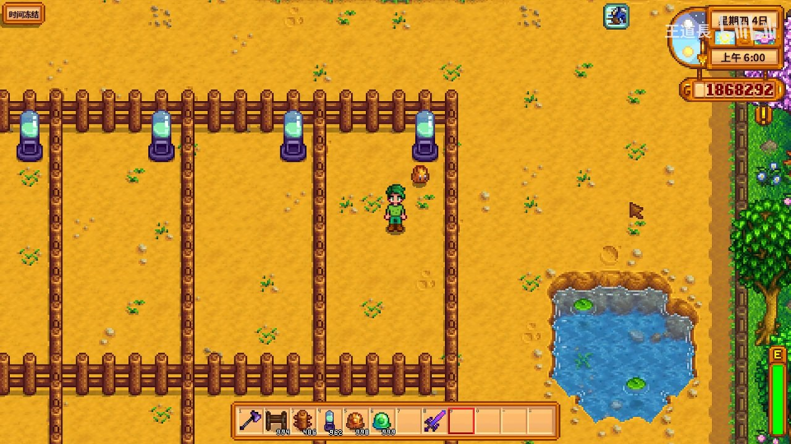
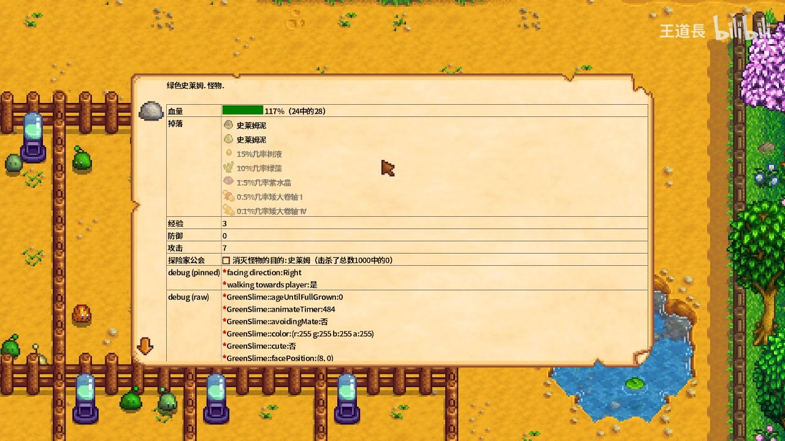
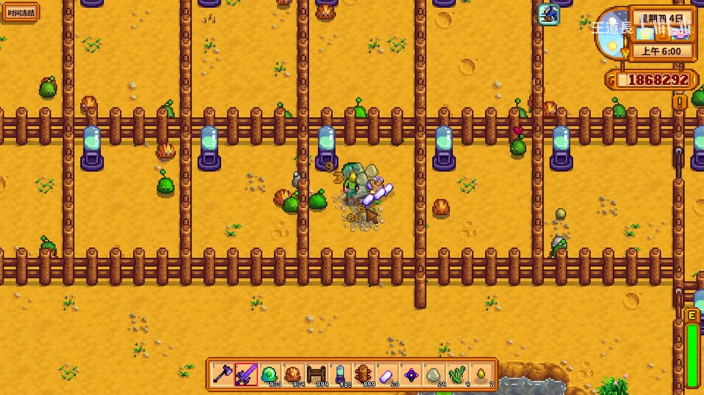
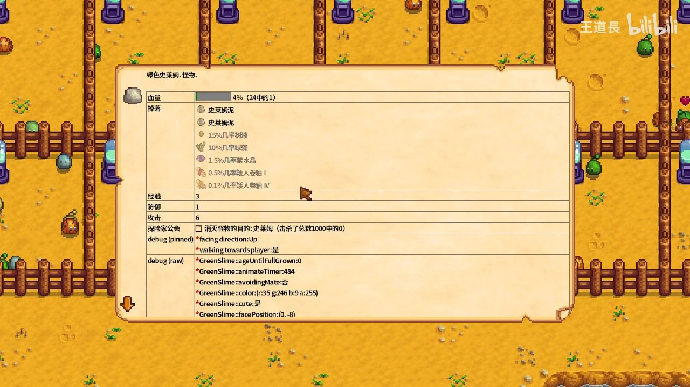

# 【星露谷物语】成功培育必爆钻石的白色史莱姆

> 本攻略由 B站 UP主 **王道長** 的视频教程整理生成
> 最后更新: 2026-07-10

---

## 🧬 原理概述

在《星露谷物语》中，通过特定 Mod 工具和游戏内部机制，可以将普通史莱姆**改造为必爆钻石的白色史莱姆**。核心原理是利用游戏调试面板（Debug Panel）修改史莱姆的掉落表（Drops）和颜色属性，实现"每次击杀必掉钻石"的效果。

---

## 🏗️ 第一步：搭建史莱姆养殖场

首先需要在农场中搭建史莱姆培育区域：



- **木栅栏**：用木栅栏围出一块区域，分隔成多个小格子，防止史莱姆逃逸
- **史莱姆培养罐（Slime Incubator）**：放置紫色底座的培养罐，用于孵化史莱姆蛋
- **水池**：设置水池供史莱姆活动，不同颜色的史莱姆可能在水池中自然生成

### 必备物资准备

| 物品 | 数量 | 用途 |
|:-----|:-----|:-----|
| 史莱姆蛋（各色） | 大量 | 孵化不同颜色史莱姆 |
| 培养罐 | 4+个 | 孵化用 |
| 木栅栏 | 若干 | 围栏隔离 |
| 时间冻结 Mod | 1个 | 暂停时间方便操作 |

> 💡 建议开启**时间冻结**功能（左上角按钮），这样可以在不受时间限制的情况下从容操作。

---

## 🥚 第二步：收集与孵化史莱姆蛋



不同颜色的史莱姆蛋可以通过以下途径获得：
- **击杀史莱姆掉落**：绿色、蓝色、红色、紫色史莱姆均有概率掉落对应颜色的蛋
- **史莱姆孵化器**：在史莱姆小屋中放置孵化器

### 史莱姆基础属性

| 属性 | 数值 |
|:-----|:-----|
| 生命值（HP） | 24 |
| 攻击力 | 6-7 |
| 防御力 | 0-1 |
| 经验值 | 3 |

### 标准掉落物

| 物品 | 概率 |
|:-----|:-----|
| 史莱姆泥（Slime Gel） | 必定掉落 |
| 树液（Tree Sap） | 15% |
| 绿藻（Green Algae） | 10% |
| 紫水晶（Amethyst） | 1.5% |
| 矮人卷轴 I | 0.5% |
| 矮人卷轴 IV | 0.1% |

> ⚠️ **注意**：标准绿色史莱姆的掉落物中**没有钻石**，这正是我们需要改造的原因。

---

## 🔧 第三步：用调试面板修改史莱姆属性



核心步骤是使用**调试/开发工具**（需要安装 Mod）调出史莱姆的详细信息面板，修改以下关键参数：

### 1️⃣ 修改颜色 → 白色

调试面板中的颜色参数：
```
GreenSlime::color: (r:255, g:255, b:255, a:255)
```

将 RGB 值全部设为 255，史莱姆就会变为**白色**。白色史莱姆外观更醒目，方便在农场中快速定位。

### 2️⃣ 修改掉落物 → 添加钻石

在 Drops（掉落物）列表中**添加钻石条目**，并设置掉落概率为 100%：

| 掉落物 | 概率 | 说明 |
|:-------|:-----|:-----|
| 钻石（Diamond） | 100% | 核心目标！每次击杀必掉 |
| 史莱姆泥 | 100% | 保留基础掉落 |

### 3️⃣ 其他可调参数

调试面板还提供了丰富的参数供调整：

| 参数 | 说明 |
|:-----|:-----|
| `facing direction` | 朝向方向 |
| `walking towards player` | 是否向玩家移动 |
| `ageUntilFullGrown` | 成长时间（0=已成年） |
| `animateTimer` | 动画计时器 |
| `avoidingMate` | 是否回避配偶（繁殖用） |
| `cute` | 可爱状态（影响AI行为） |

---

## 💎 第四步：验证成果——必爆钻石！



改造完成后，击杀白色史莱姆即可获得钻石！

### 操作验证流程

1. **选择目标**：找到改造后的白色史莱姆
2. **战斗**：使用武器攻击，白色史莱姆血量降到 4% 时即将被击杀
3. **收获**：击杀后必定掉落钻石 + 史莱姆泥

### 效率对比

| 对比项 | 普通史莱姆 | 改造白色史莱姆 |
|:-------|:----------|:--------------|
| 钻石掉落 | ❌ 无 | ✅ 100% |
| 每日预期钻石 | 0 | 20-50+ |
| 金币收益/只 | ~50 | ~750+ |

> 💎 钻石基础售价为 750 金币，**每击杀一只改造史莱姆 = 750 金币 + 史莱姆泥额外收益**。

---

## 🎯 效率最大化技巧

### 养殖场布局建议

```
┌─────────────────────┐
│  栅栏  │  栅栏       │
│  [培养罐] [培养罐]   │
│  栅栏  │  栅栏       │
│  [培养罐] [水池]     │
│  栅栏  │  栅栏       │
└─────────────────────┘
```

- 培养罐集中放置，方便批量孵化
- 水池区域保留，部分史莱姆喜欢在水域活动
- 围栏确保史莱姆不会跑出指定区域

### 批量生产流程

1. **批量孵化**：一次性放 4+ 个培养罐同时孵化
2. **统一改造**：孵出后用调试面板批量修改颜色和掉落
3. **定时收割**：每天去养殖场收割一次钻石
4. **补充种群**：击杀后立即补充新的史莱姆蛋孵化

### 推荐 Mod

| Mod 名称 | 用途 |
|:---------|:-----|
| Debug Mode | 调出史莱姆属性面板 |
| CJB Cheats Menu | 时间冻结、物品生成 |
| 任意掉落修改 Mod | 修改史莱姆掉落表 |

---

## ⚠️ 避坑提示

1. **不要修改过度**：攻击力改太高容易被史莱姆反杀
2. **备份存档**：修改前建议备份游戏存档，防止数据异常
3. **注意 Mod 兼容性**：不同版本星露谷物语对应的 Mod 版本不同，建议使用 1.5.6+
4. **围栏要牢固**：改造后的史莱姆可能有特殊AI行为，确保围栏没有缺口
5. **定期补充**：钻石史莱姆被击杀后不会自然再生，需要持续孵化补充

---

## 📝 总结

通过调试工具修改史莱姆的颜色和掉落物，可以轻松培育出**必爆钻石的白色史莱姆**，实现高效刷钻石。整个流程分为四步：

1. 🏗️ **搭建养殖场**：围栏 + 培养罐 + 水池
2. 🥚 **收集孵化**：获取各色史莱姆蛋并孵化
3. 🔧 **调试修改**：颜色改白色 + 添加钻石掉落
4. 💎 **验证收割**：每日稳定获取钻石

这套方案适合**游戏后期追求效率**的玩家，配合时间冻结功能，可在短时间内积累大量金币，轻松实现"财务自由"！
