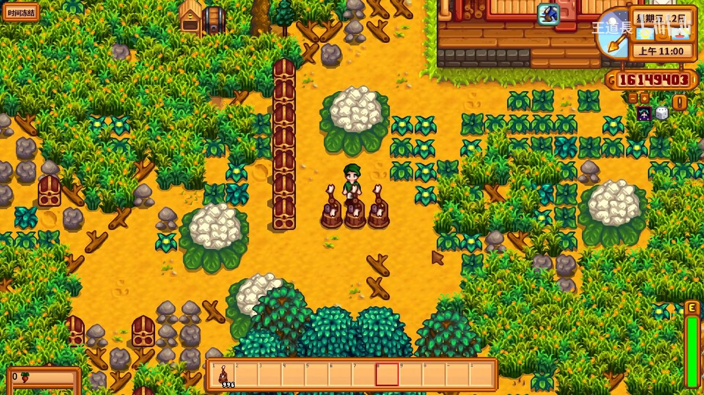
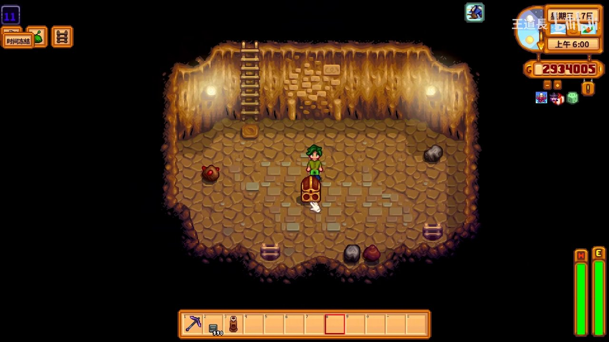
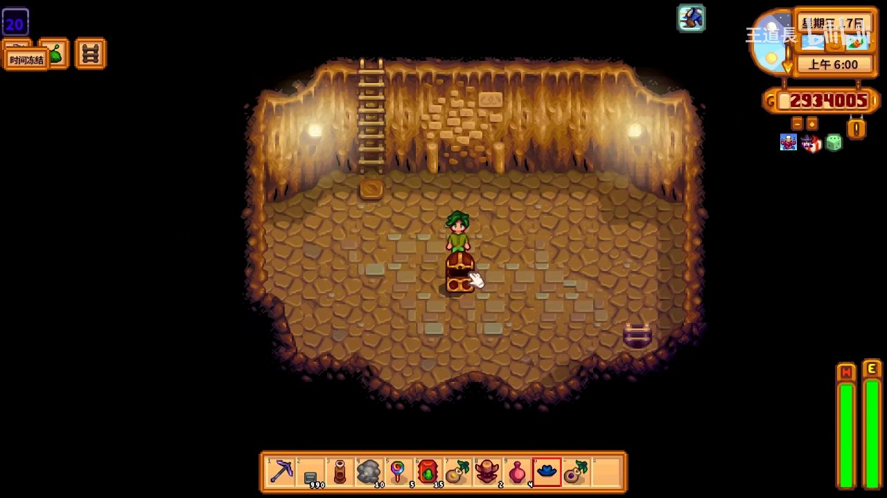
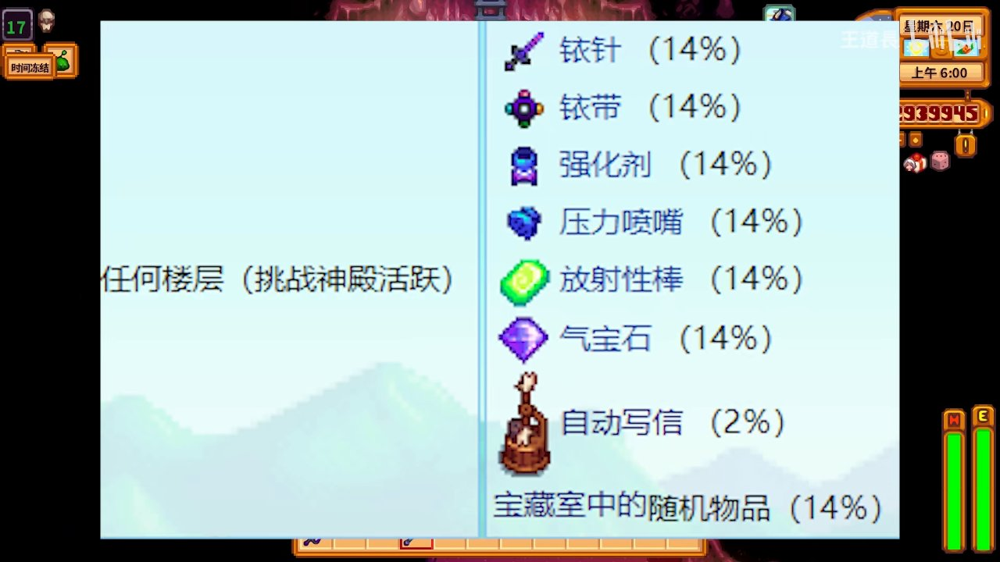
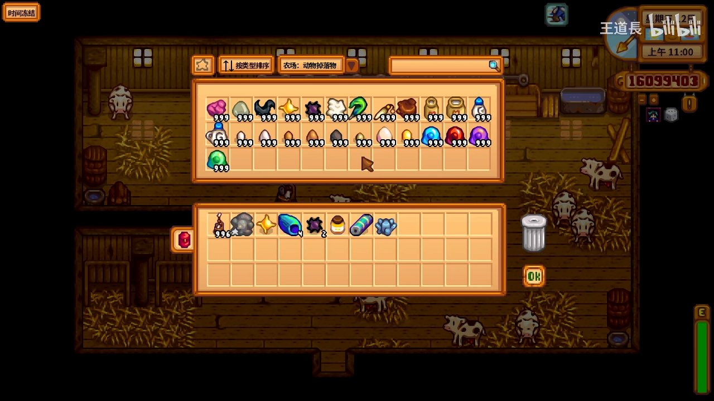

# 🌾 星露谷物语 自动抚摸机

> 本攻略由 B站 UP主「王道長」视频教程整理生成
> 最后更新: 2026-07-08

---

自动抚摸机（Auto-Petter）是星露谷物语中**极为稀有且实用的物品**，能每天自动抚摸畜棚或鸡舍内的所有动物。本攻略详细讲解自动抚摸机的获取方法、使用技巧和刷取策略。

---

## 📋 本篇涵盖

- ✅ 什么是自动抚摸机及其作用
- ✅ 获取方法一：骷髅洞穴宝箱层（14%概率）
- ✅ 获取方法二：挑战神殿激活后怪物掉落（2%概率）
- ✅ 自动抚摸机的放置与使用
- ✅ 刷取效率技巧与避坑

---

## 🎮 1. 什么是自动抚摸机？

自动抚摸机是一种**可放置的建筑设备**，将其放入畜棚（Barn）或鸡舍（Coop）后，它会**每天自动抚摸**里面的所有动物，无需玩家手动操作。

*自动抚摸机在农场中自动抚摸动物的效果演示*

### 自动抚摸机的主要作用

| 作用 | 说明 |
|:-----|:------|
| **自动提升动物好感度** | 每天自动抚摸，动物好感度稳步提升 |
| **节省大量时间** | 动物多时每天手动抚摸需5-10分钟，自动抚摸省去此步骤 |
| **提高产出品质** | 高好感度动物产出更高质量的蛋、奶等产品 |
| **多人游戏利器** | 多人存档中动物数量翻倍，自动抚摸优势更大 |

> 💡 **重要提示**：自动抚摸效果与手动抚摸一样，不会降低好感度提升速度。

---

## 🏆 2. 获取方法一：骷髅洞穴宝箱层

在原版游戏中，自动抚摸机最主要的获取途径是**骷髅洞穴（Skull Cavern）的宝箱层（Treasure Floors）**。

*在骷髅洞穴中获得自动抚摸机——这是最直接的获取方式*

### 宝箱层机制

| 项目 | 说明 |
|:-----|:------|
| **出现位置** | 骷髅洞穴（Skull Cavern）任何层数 |
| **宝箱层概率** | 每层约有 **2~4%** 概率为宝箱层（非固定） |
| **自动抚摸机概率** | 宝箱层中约 **14%** 概率出现 |
| **建议层数** | 越深层越容易遇到宝箱，100层以后效率更高 |

### 刷骷髅洞穴必备准备

- **大量楼梯**（Staircase）：用99个石头制作，快速下层寻找宝箱层
- **沙拉（Salad）或奶酪（Cheese）**：保持血量
- **咖啡（Coffee）+ 三倍浓缩咖啡（Triple Shot Espresso）**：提升移动速度
- **南瓜汤（Pumpkin Soup）**：增加运气和防御
- **幸运午餐（Lucky Lunch）或魔法糖冰棍（Magic Rock Candy）**：提高运气
- **超级炸弹（Mega Bomb）**：快速清场

> 💡 运气值越高，遇到宝箱层的概率越大。选择**运气最好的日子**（占卜显示" spirits are very happy"）前往。

---

## ⚔️ 3. 获取方法二：挑战神殿激活后怪物掉落（2%概率）

第二个获取方式来自于**挑战神殿（Shrine of Challenge）**机制。

*在挑战神殿激活后的骷髅洞穴中探索，寻找自动抚摸机掉落*

### 挑战神殿是什么？

挑战神殿位于**姜岛（Ginger Island）的核桃房（Walnut Room）**内。激活后，骷髅洞穴的怪物会被替换为更强大的变种，但也会掉落特殊物品。

### 激活挑战神殿后的掉落表

当挑战神殿激活时，**任何楼层**的怪物都有几率从以下特殊掉落表中掉落物品：

| 物品 | 概率 |
|:-----|:-----|
| 铱针（Iridium Needle） | 14% |
| 铱带（Iridium Band） | 14% |
| 强化剂（Enricher） | 14% |
| 压力喷嘴（Pressure Nozzle） | 14% |
| 放射性棒（Radioactive Bar） | 14% |
| 气宝石（Qi Gem） | 14% |
| **自动抚摸机（Auto-Petter）** | **2%** |
| 宝箱层随机物品 | 14% |

*挑战神殿活跃状态下，自动抚摸机的掉落概率为2%，需要注意这是概率最低的掉落项*

### 刷挑战神殿策略

| 策略 | 说明 |
|:-----|:------|
| **怪物种类** | 所有怪物均可掉落，但大群怪物群更有效率 |
| **效率核心** | 使用炸弹清场 + 快速下层刷新怪物 |
| **楼梯必备** | 快速到达100+层，怪物密度更高 |
| **推荐装备** | 吸血武器（如银河剑）、铱环、幸运戒指 |

> 💡 **两种方法对比**：宝箱层（14%但层数随机）适合深度刷楼梯打法；挑战神殿（2%但每层都刷）适合清场打法，推荐结合使用。

---

## 🏠 4. 放置与使用

*在畜棚内整理资源，准备放置自动抚摸机至畜棚或鸡舍*

### 放置步骤

1. **获得自动抚摸机**后，进入背包选中它
2. 走进你想放置的**畜棚（Barn）或鸡舍（Coop）**内部
3. 在空地上右键放置
4. **无需电力或维护**，放进去就自动工作

### 使用注意事项

| 要点 | 说明 |
|:-----|:------|
| **动物范围** | 对同一建筑内的所有动物生效 |
| **每天触发** | 每天早上动物醒来后自动触发 |
| **好感度上限** | 5心（满好感），与手动抚摸进度一致 |
| **多个同时使用** | 同一建筑放多个不会叠加效果 |
| **与手动抚摸关系** | 自动 + 手动不会叠加，自动后无需再手动 |
| **能否拆除** | 可以用斧头/镐子敲掉回收 |

---

## ✅ 目标清单

- [x] 了解自动抚摸机的功能和价值
- [x] 获得方法一：骷髅洞穴宝箱层刷取（14%概率）
- [x] 获得方法二：挑战神殿怪物掉落（2%概率）
- [x] 正确放置到畜棚或鸡舍
- [x] 享受每天自动抚摸带来的便利

---

## 🚫 新手避坑清单

| ❌ 不要做 | ✅ 正确做法 |
|:---------|:-----------|
| 以为自动抚摸机会降低效率 | 自动抚摸与手动抚摸**效果完全一样** |
| 只在矿井1-20层刷宝箱 | 骷髅洞穴**越深层**宝箱层概率越高 |
| 不打挑战神殿 | 挑战神殿激活后多一条获取途径 |
| 放完不检查动物状态 | 少量动物仍可以手动抚摸来加速好感 |
| 同一个建筑放多个自动抚摸机 | 一个建筑只需**一个**即可覆盖全部动物 |
| 忘记带楼梯下骷髅洞穴 | **至少50个楼梯**，否则效率极低 |

---

## 💡 小贴士

- **最大效率刷法**：准备200+楼梯 → 选运气最好的一天 → 吃幸运午餐 → 直奔200层 → 看到宝箱层就搜刮
- **中后期推荐**：解锁姜岛并激活挑战神殿后，日常刷矿时顺便刷自动抚摸机
- **多人游戏**：每个玩家都需要自己的自动抚摸机，建议一起刷骷髅洞穴
- **1.6版本更新**：自动抚摸机机制在1.6版本中未改变，本攻略适用于所有当前版本

---

## 📺 原视频参考

本攻略内容参考了 B站 UP主 **「王道長」** 的相关视频教程。如需更直观的演示，建议观看原视频：

[👉 前往 B站观看原视频](https://www.bilibili.com/video/BV1oU4y1x7cL)

---

*攻略由 Hermes Agent video2guide 流水线自动生成 | 游戏版本：星露谷物语 1.6+*
