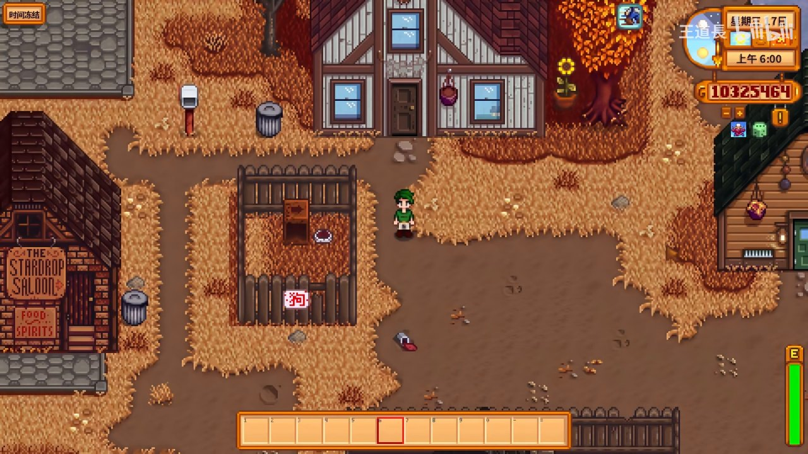
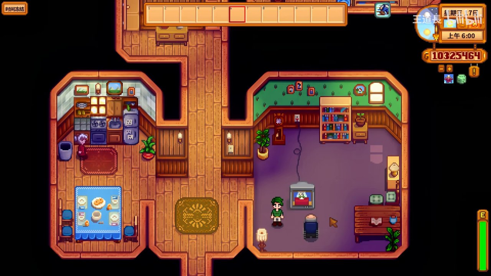
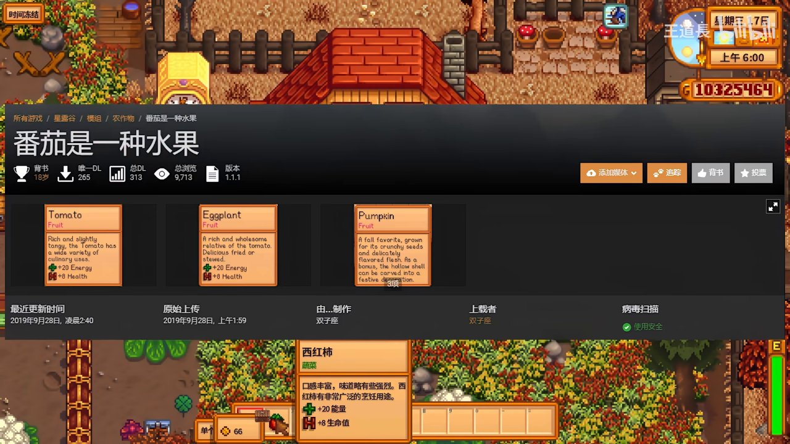
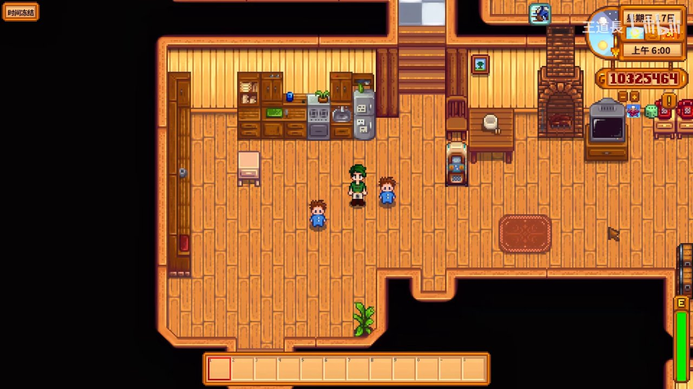
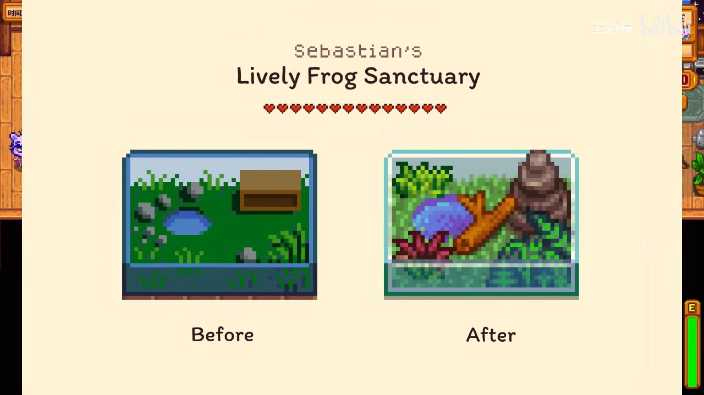
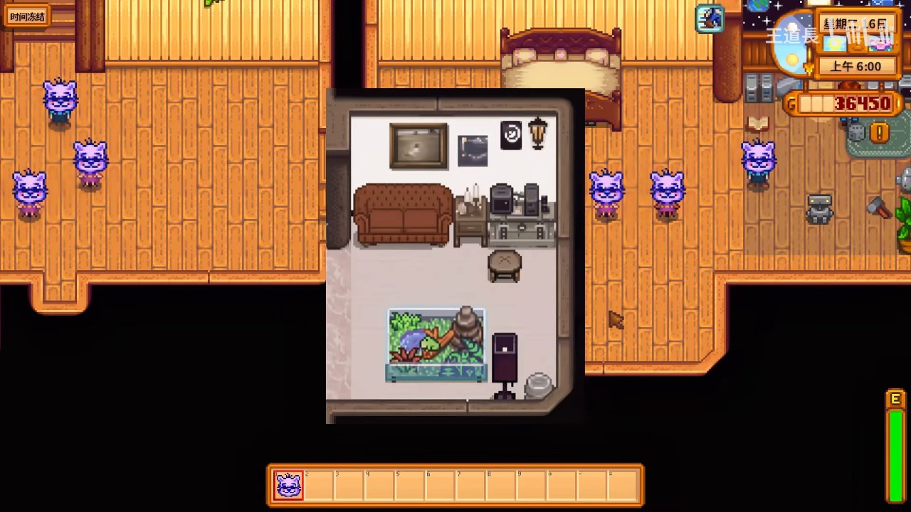
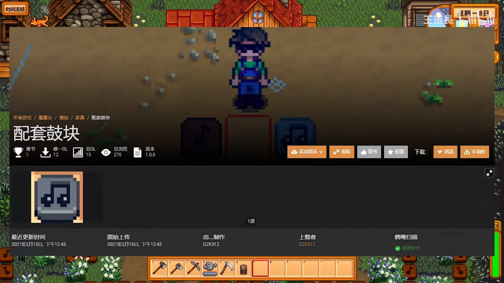

# 🌾 【星露谷物语】5个极其'伟大'的mod

> 本攻略由游戏视频教程整理生成，参考 B站 UP主 [王道長](https://space.bilibili.com/688870141) 攻略视频。
> **视频源**：[5个极其'伟大'的mod](https://www.bilibili.com/video/BV1PV411q7Nk)
> **系列**：Mod推荐
> **最后更新**：2026-07-15

---

各位新手农夫们，大家好！想让你的星露谷生活变得更有趣吗？这款游戏拥有海量的 **MOD**，可以改变游戏机制、美化你的家园，甚至加入全新的内容。今天，我们就来介绍王道長视频中提到的5个"极其伟大"的MOD，并手把手教你怎么安装和使用它们。

---

## 📋 MOD安装前的准备

在开始之前，你需要做一点准备工作。对于新手来说，最常用的MOD加载器是 **SMAPI（星露谷物语模组应用程序编程接口）**。

1. **下载SMAPI**：访问 [SMAPI官网](https://smapi.io/)，下载对应你游戏版本的SMAPI安装程序。
2. **安装SMAPI**：运行安装程序，选择你的游戏安装路径（通常在你的Steam库中右键点击《星露谷物语》 → 管理 → 浏览本地文件）。安装程序会自动完成设置。
3. **启动游戏**：安装完成后，以后请务必**通过SMAPI启动游戏**（Steam库中会多出一个SMAPI启动选项，或者在安装目录下运行 `StardewModdingAPI.exe`）。SMAPI会在启动时自动加载你放在特定文件夹里的MOD。

> **💡 关键位置**：MOD文件存放的文件夹。打开你的《星露谷物语》游戏安装目录，你会看到一个名为 **`Mods`** 的文件夹。**所有下载的MOD都需要解压后放入这个文件夹**。

*通过SMAPI启动游戏后，控制台窗口会加载所有已安装的MOD*

---

## 🎮 5个"伟大"MOD逐一介绍

### MOD 1："番茄是一种水果" (Tomato is a Fruit)

**这个MOD做什么？**
它改变了游戏中对番茄、茄子、南瓜等多种作物的分类，将它们从"蔬菜"重新归类为"水果"。同时，它们的食用恢复效果也得到了提升，每次食用增加20能量和8生命值。

**安装与使用步骤：**

1. **下载MOD**：前往 [Nexus Mods](https://www.nexusmods.com/stardewvalley)（N网）或其他MOD下载网站，搜索 "Tomato is a Fruit"。
2. **解压与放置**：将下载的压缩包解压，你会得到一个名为 `[CP] Tomato is a Fruit` 的文件夹（或类似名称）。将这个**完整的文件夹**复制到你的游戏目录下的 `Mods` 文件夹中。
3. **进入游戏**：通过SMAPI启动游戏。当你再次收获番茄、茄子等作物时，它们的描述将发生变化，显示为"水果"。
4. **如何查看效果**：
   - 鼠标悬停在背包或箱子的物品上，查看物品描述。如果显示为"水果"，则证明MOD生效。
   - **技巧**：这个MOD主要影响烹饪和送礼。送给喜欢"水果"但不喜欢"蔬菜"的NPC（例如塞巴斯蒂安、阿比盖尔），这些作物将更受欢迎。

*在厨房中查看MOD信息，注意物品分类已改为"水果"*

**技巧与注意事项：**
- 这个MOD**只**改变了分类、描述和食用恢复值，**不会改变**这些作物的价格、生长周期或任何其他机制。
- 截图中的厨房场景只是演示者展示MOD信息的地方，你只需要关注MOD描述即可。

---

### MOD 2：塞巴斯蒂安的生机勃勃的青蛙生态缸 (Sebastian's Lively Frog Sanctuary)

**这个MOD做什么？**
这是一个纯粹的**装饰性MOD**。它会将NPC塞巴斯蒂安房间里平淡无奇的普通水族箱，替换成一个充满各种青蛙、紫色植物和蜗牛的生机勃勃的生态缸。

**安装与使用步骤：**

1. **下载MOD**：在N网搜索 "Sebastian's Lively Frog Sanctuary"。
2. **解压与放置**：和上一个MOD一样，将解压后得到的文件夹放入 `Mods` 文件夹。
3. **进入游戏**：找到塞巴斯蒂安的房间（位于山上木匠商店旁边，通常需要与他好感度达到一定级别才能进入）。
4. **欣赏变化**：直接查看房间内的水族箱，你会惊喜地发现它已经"大变样"了！

*原来的普通水族箱变成了充满青蛙和绿色植物的生态缸*

*近距离观察生态缸里的青蛙和植物细节*

**关键位置：** **塞巴斯蒂安的房间**。这个位置在Robby和Demetrius家（木匠商店）的地下室。

**技巧与注意事项：**
- 这个MOD完全不会影响游戏的任何数值或剧情，适合喜欢沉浸式体验的玩家。
- 视频中出现的**紫色小猫NPC**，很可能是另一个独立的MOD（如宠物替换MOD）的效果，和"青蛙生态缸"MOD本身无关。

---

### MOD 3："配套鼓块" (Matching Drum Block)

*房间中新增的音乐主题装饰方块——配套鼓块*

**这个MOD做什么？**
这是一个**家具美化MOD**，为游戏添加一种带有音乐主题风格的装饰性方块（"鼓块"），属于某套家具主题风格的组成部分，你可以放在你的房间里。

**安装与使用步骤：**

1. **下载MOD**：在N网搜索 "Matching Drum Block" 或对应主题的中文名。
2. **解压与放置**：将解压后的文件夹放入 `Mods` 文件夹。
3. **进入游戏并获取**：这种类型的MOD通常需要你**制作**或者**从商店购买**。检查以下途径：
   - **木匠罗宾的商店**：看看她的家具目录里有没有新增这个物品。
   - **旅行商人**：周日和周一在猪车处可能会出售。
   - **制作配方**：可能通过某个NPC或活动获得制作配方。

*鼓块与其他音乐主题家具的组合效果*

**技巧与注意事项：**
- 这个MOD的下载量显示为12，是一个比较小众的MOD，可能更新不及时。
- 如果你安装了却找不到这个家具，可以：
  1. 检查MOD作者在发布页面的说明，寻找获取方式。
  2. 使用 **"CJB Cheats Menu"** 作弊MOD（仅测试用），开启"获得所有物品"功能，看看物品列表中是否出现这个鼓块。
  3. 如果找不到，有可能是该MOD作者未明确提供获取方式，或者因版本更新失效了。

---

### (推测) MOD 4 & 5：另外两个"极其伟大"的MOD

根据视频标题，还有两个MOD未在截图中展示。基于星露谷MOD社区的热门程度，推测可能是以下类型：

#### 推测MOD 4：自动化/便捷化MOD
- **例子**：`Automate`（自动化）、`CJB Item Spawner`（物品生成器）。
- **作用**：极大简化重复性劳动。自动化MOD可以让你将箱子、机器（如熔炉、罐头瓶）等自动连接，实现自动生产和收集。
- **新手建议**：早期建议先体验原版，熟悉后再使用此类MOD，否则会失去很多探索的乐趣。

*类似自动抚摸机这样的便利设施展示——自动化MOD能极大提升游戏体验*

#### 推测MOD 5：核心/大修MOD
- **例子**：`Stardew Valley Expanded`（星露谷物语扩展）、`Ridgeside Village`（岭山村）。
- **作用**：添加全新的地图、NPC、剧情、作物、物品等，相当于一个庞大的DLC。
- **新手建议**：**不建议**新手从一开始就使用这类MOD！它们会极大地改变游戏内容，容易让你迷失方向。最好先通关原版游戏的主要剧情（如完成社区中心献祭）再体验。

---

## ⚠️ 最后的注意事项

1. **备份存档**：在安装任何MOD之前，**强烈建议备份你的游戏存档**。存档文件位于 `%appdata%\StardewValley\Saves` 目录下。
2. **MOD冲突**：不同的MOD可能会产生冲突。如果游戏在安装MOD后出现闪退、贴图错误或功能异常，可以尝试禁用或移除部分MOD来排查问题。SMAPI在启动时会提示冲突信息。
3. **版本兼容**：确保MOD版本与你当前的游戏版本和SMAPI版本兼容。大多数MOD作者会在页面标注兼容版本。
4. **享受游戏**：MOD只是锦上添花。如果你的游戏能稳定运行，并且给你带来了快乐，那就是最好的MOD组合。祝你在星露谷玩得开心！

---

## 🔗 相关链接
- [王道長B站空间](https://space.bilibili.com/688870141)
- [星露谷物语N网MOD主页](https://www.nexusmods.com/stardewvalley)
- [SMAPI官网](https://smapi.io/)
- [系列其他攻略：12月份人气最高的五个mod](../guides/12月份人气最高的五个modn网.md)
