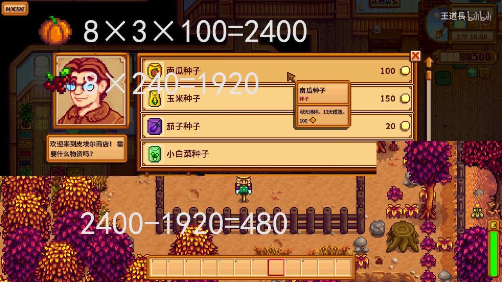
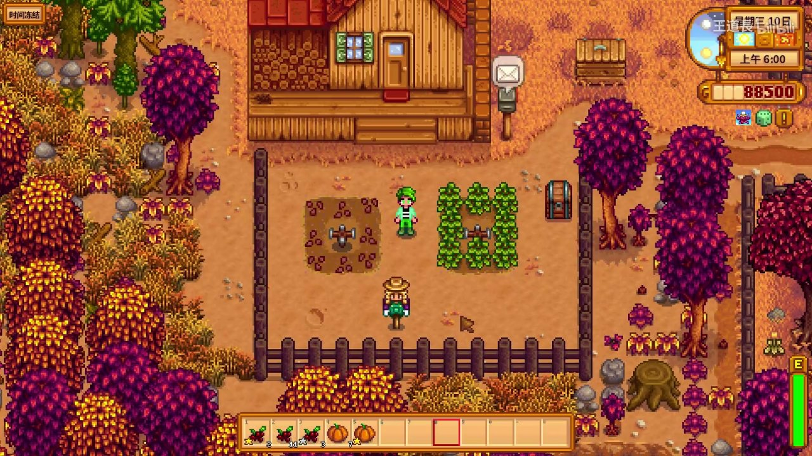
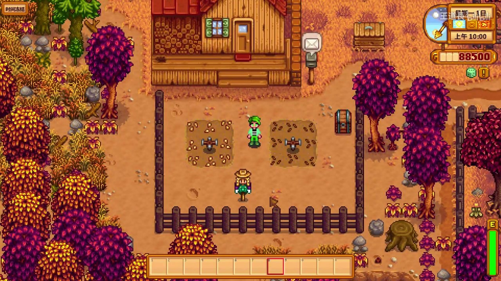

# 🎃 星露谷物语秋季种什么最赚钱？南瓜 vs 蔓越莓全面对比

> **原视频**：[【王道长】星露谷物语攻略（第三期）南瓜or蔓越莓](https://www.bilibili.com/video/BV1zt411u777)
> **适用版本**：Stardew Valley 1.6+
> **秋季攻略** | **新手必看**

秋季是星露谷物语中最重要的种植季节之一。南瓜和蔓越莓作为秋季的两大主力作物，哪个更赚钱？本期视频为你详细拆解。

---

## 🌱 作物基础数据对比

| 项目 | 🎃 南瓜 | 🍒 蔓越莓 |
|:-----|:---------|:-----------|
| **种子价格** | 100g | 100g |
| **生长周期** | 13天 | 7天 → 每5天复收 |
| **单次收获价** | 100g | 100g |
| **单株总收获** | 1次 | 4~5次 |
| **单株总收入** | 100g | 400~500g |
| **净利润/株** | 0g（种子成本=售价） | 300~400g |



> 图中为皮埃尔商店的种子价格。南瓜种子100g，右下角还有玉米、茄子等秋季作物可选。

---

## 💰 利润详细计算

### 南瓜利润（8块地示例）

以8块耕地为例：

```
收入：8株 × 1个/株 × 100g = 800g
种子成本：8 × 100g = 800g
净利润：800g - 800g = 0g 💀
```

⚠️ **南瓜的坑：** 单季只能收获1次，种子价格等于售价，如果不考虑品质加成，**纯利润为0**。

### 蔓越莓利润（8块地示例）

```
收入：8株 × 4次收获 × 100g = 3200g
种子成本：8 × 100g = 800g
净利润：3200g - 800g = 2400g ✅
```

### 最终对比



> 同一块地，蔓越莓收获了20个（多批次），南瓜只收获了7个。库存差异一目了然。

---

## 📊 进阶分析：品质加成后的差距

当使用**高级肥料（Quality Fertilizer）**后，两种作物都有概率产出银星（×1.25）、金星（×1.5）甚至铱星（×2）品质。

| 品质 | 南瓜售价 | 蔓越莓售价 |
|:-----|:---------|:-----------|
| 普通 | 100g | 100g |
| 银星 | 125g | 125g |
| 金星 | 150g | 150g |
| 铱星 | 200g | 200g |

但关键在于：**蔓越莓复收特性让品质加成的作用面积是南瓜的4~5倍**。同样8块地，蔓越莓可能有32~40次品质判定机会，而南瓜只有8次。

---

## 🏆 结论

| 维度 | 胜出者 | 说明 |
|:-----|:-------|:-----|
| **总利润** | 🍒 蔓越莓 | 复收特性让总利润碾压 |
| **单次售价** | 🎃 南瓜 | 单个售价相同，但南瓜没有复收 |
| **新手友好度** | 🍒 蔓越莓 | 种下后持续收获，不用反复买种子 |
| **技能升级** | 🍒 蔓越莓 | 更多收获次数=更多耕种经验 |

**🏆 秋季最佳选择：蔓越莓！**



> 秋季第一天种下蔓越莓，肥料用上，整个秋季就是自动印钞机。

---

## 💡 实用小贴士

1. **秋季第一天（Fall 1）**就把地翻好、撒好肥料、种上蔓越莓，最大化收获次数
2. 如果想冲耕种等级，蔓越莓因为复收次数多，**经验值是南瓜的4倍**
3. 南瓜并不是完全没用——做成南瓜汤（Pumpkin Soup）可以+2防御和+2运气，打矿洞很有用
4. 两者搭配：主力种蔓越莓赚钱，留一小块种南瓜做料理

## ❌ 避坑提醒

- ❌ **不要**在秋季中后期才种南瓜——13天生长周期，晚于Fall 15种下去就来不及收获
- ❌ **不要**把所有地都种南瓜——如上所述，南瓜几乎是零利润作物
- ❌ **不要**忽视肥料——高级肥料能让蔓越莓的利润再提升30%~50%

---

*以上就是本期南瓜 vs 蔓越莓的全面对比。秋天到了，快去种蔓越莓吧！有疑问欢迎在评论区留言~*
