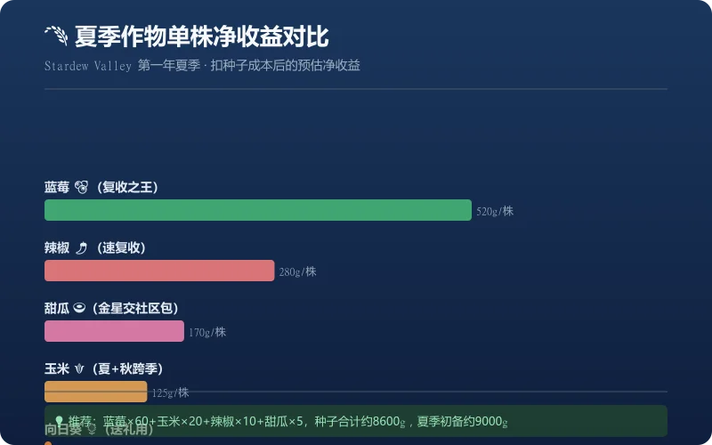
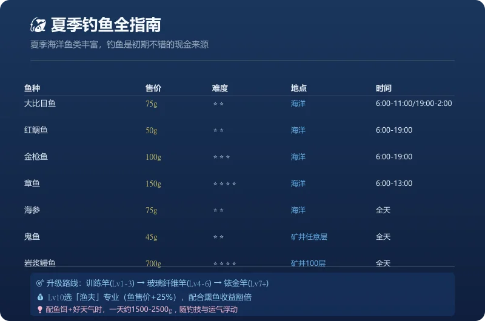
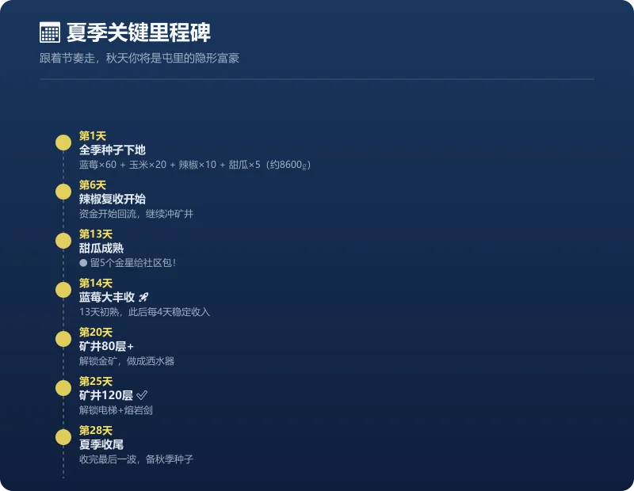

# 星露谷物语第一年夏季高效经营全攻略

> 夏季是《星露谷物语》第一年最关键的季节——这里有全游戏收益最高的蓝莓，也是解锁矿井和社区包的关键窗口。本篇攻略从**作物规划、矿井攻略、钓鱼致富、社区包完成**四个维度，帮你把第一个夏天变成经济起飞的原点。

---

## 一、夏季作物规划：蓝莓为王

### 为什么首选蓝莓？

| 作物 | 种子价格 | 生长周期 | 每次收获 | 单株净收益（预估） |
|------|---------|---------|---------|-----------------|
| 蓝莓 🫐 | 80g | 13天初熟→每4天复收 | 3颗/株 | **≈520g**（夏季约4次收成） |
| 辣椒 🌶️ | 40g | 5天初熟→每3天复收 | 1颗 | ≈280g（夏季约8次收成） |
| 甜瓜 🍈 | 80g | 12天单季 | 1颗 | ≈170g（金星品质更高） |
| 玉米 🌽 | 150g | 14天初熟→每4天复收 | 1颗 | ≈125g（夏收4次+秋收7次） |
| 向日葵 🌻 | 200g | 8天 | 1颗 | 基本持平（主要为送礼/留种） |

**推荐种植方案（假设第一年夏季初已有约9000g资金，春季靠钓鱼和卖防风草攒下）：**

| 作物 | 数量 | 单价 | 小计 |
|------|------|------|------|
| 蓝莓 | 60株 | 80g | 4800g |
| 玉米 | 20株 | 150g | 3000g |
| 辣椒 | 10株 | 40g | 400g |
| 甜瓜 | 5株 | 80g | 400g |
| **合计** | | | **8600g** |

> 💰 **预算不够怎么办**：若夏季初不足9000g，可先按「蓝莓30株+玉米10株」（约4000g）起步，蓝莓首次收获（第14天）回本后再逐步补种到目标规模。

> 💡 **小技巧**：夏季第一天就去皮埃尔的杂货店买种子，别忘了先浇完水再去。蓝莓种得越多，中后期越轻松。

---

## 二、矿井攻略：冲到120层

夏季是攻克矿井的最佳时机。春季攒的**野山莓和矿石**这时候派上用场了。

### 下矿准备清单

| 装备/道具 | 最低要求 | 推荐配置 |
|-----------|---------|---------|
| 武器 | 木剑 | 从矿洞宝箱拿的钢刀或骨剑 |
| 镐子 | 铜镐 | **钢镐**（敲大块石头不费劲） |
| 食物/补给 | 野山莓 20+ | 幸运午餐（+3运气）或沙拉 |

### 刷层技巧

1. **只找楼梯，不挖矿**：目标是冲到120层解锁电梯，矿石之后可以慢慢回来刷
2. **利用木梯快速下楼**：如果觉得该层矿太少，带足木头做木梯直接跳层
3. **注意时间**：下午12:00前可以认真探索，12:00后只管找楼梯
4. **80层以后怪物变强**：建议带足食物，幽灵和骷髅伤害不低

> **🎯 目标**：夏季15日前冲到80层（解锁金矿），夏季结束前冲到120层（解锁骷髅钥匙和电梯）

---

## 三、钓鱼致富：夏季是不错的收入来源

夏季海洋鱼类丰富，钓鱼是第一年夏天稳定且低门槛的现金来源。

### 夏季常见鱼种

| 鱼种 | 出没地点 | 时间 | 售价（普通） | 难度 |
|------|---------|------|------------|------|
| 大比目鱼 | 海洋 | 6:00-11:00 / 19:00-次日2:00 | 75g | 中 |
| 红鲷鱼 | 海洋 | 6:00-19:00 | 50g | 中 |
| 金枪鱼 | 海洋 | 6:00-19:00 | 100g | 高 |
| 章鱼 | 海洋 | 6:00-13:00 | 150g | 极高 |
| 海参 | 海洋 | 全天 | 75g | 中 |
| 鬼鱼 | 矿井任意层 | 全天 | 45g | 中 |
| 岩浆鳗鱼 | 矿井100层 | 全天 | 700g | 极高 |

> *售价为普通品质基础价，金星/铱星品质与「渔夫」职业加成后更高。*

### 钓鱼升级路线

1. **Lv 0-3**：去矿洞湖/小镇河流刷经验，用训练钓竿（25g，杂货店有售）
2. **Lv 4-6**：换玻璃纤维钓竿+鱼饵，去海边钓金枪鱼和红鲷鱼
3. **Lv 7-9**：用铱金钓竿+鱼饵+浮标，去矿井100层刷岩浆鳗鱼
4. **Lv 10**：选择**渔夫**专业（鱼类售+25%），配合后期熏鱼赚翻

> **💰 收入参考**：钓鱼4级后，配上鱼饵、挑好天气的日子，一天可入账**1500-2500g**（视钓技和运气浮动）。

---

## 四、社区包关键提醒

夏季社区包如果错过了，就要等整整一年，千万要注意以下节点：

→ **金星甜瓜 ⭐🍈（×5）**—— **必须留5个金星甜瓜不卖**，否则要等明年！
→ **彩虹贝壳**—— 夏季限定，海滩拾取，看到就捡
→ **红蘑菇**—— 矿井/秘密森林，如果看到记得收

可以在旅行商人的猪车（周五&日）购买难钓的鱼来完成鱼饵包。

---

## 五、日程管理：完美夏季的一天

> 这只是一个参考作息，可以根据自己的节奏调整。

| 时间 | 活动 | 说明 |
|------|------|------|
| 6:00-7:30 | 浇水+收作物 | 先把作物收拾好 |
| 7:30-12:00 | 下矿/钓鱼 | 根据当天需求选一个 |
| 12:00-13:00 | 送礼+吃饭 | 给喜欢的人送礼（推荐：塞巴斯蒂安、黑利、莉亚） |
| 13:00-18:00 | 继续下矿/钓鱼 | 高效率产出时间 |
| 18:00-20:00 | 去海边捡贝壳+聊天 | 顺便收一收海滩的贝壳和珊瑚 |
| 20:00-22:00 | 熔炼矿石/整理背包 | 晚上干不了农活，搞手工 |
| 22:00-次日 | 睡觉 💤 | 别熬夜，早睡早起身体好 |

---

## 六、关键里程碑清单

- [ ] **夏季第1天** → 买蓝莓种子×60+玉米×20+辣椒×10+甜瓜×5，全部种下（共8600g）
- [ ] **夏季第6天前后** → 辣椒开始复收，资金开始回流
- [ ] **夏季第13天** → 甜瓜成熟（注意留5个金星给社区包）
- [ ] **夏季第14天** → 蓝莓开始复收（13天初熟），经济彻底起飞 🚀
- [ ] **夏季中旬** → 勤下矿刷金矿，做出高质量洒水器
- [ ] **夏季第20天前** → 冲到矿井80层以上
- [ ] **夏季第28天** → 最后一波！收完所有复收作物，为秋季做准备

---

## 总结

夏季是星露谷物语第一年的**分水岭**——做得好的话，秋天的启动资金至少5-8万g，配合洒水器可以实现规模化种植。记住三句话：

> **蓝莓种越多，秋天越轻松。**
> **矿井冲到底，解锁金矿是关键。**
> **钓鱼来钱快，社区包别错过。**

祝你在鹈鹕镇的夏天充实又丰收！🌞🌾
