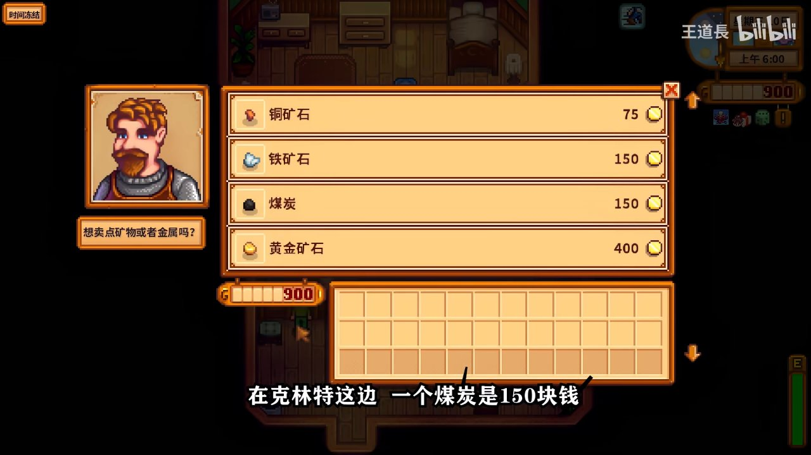
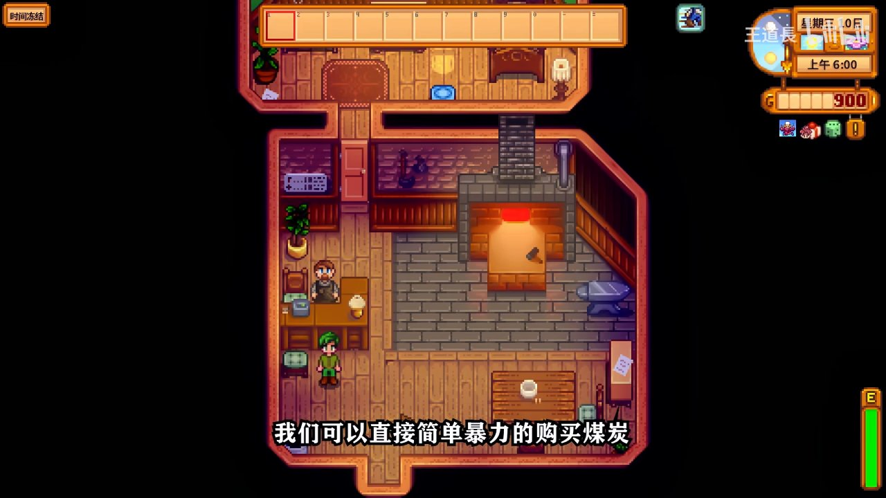
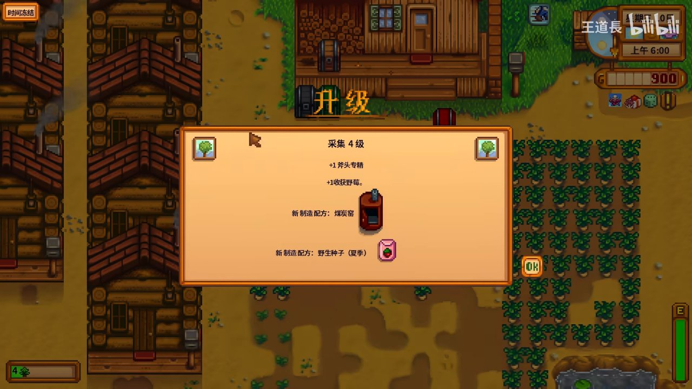
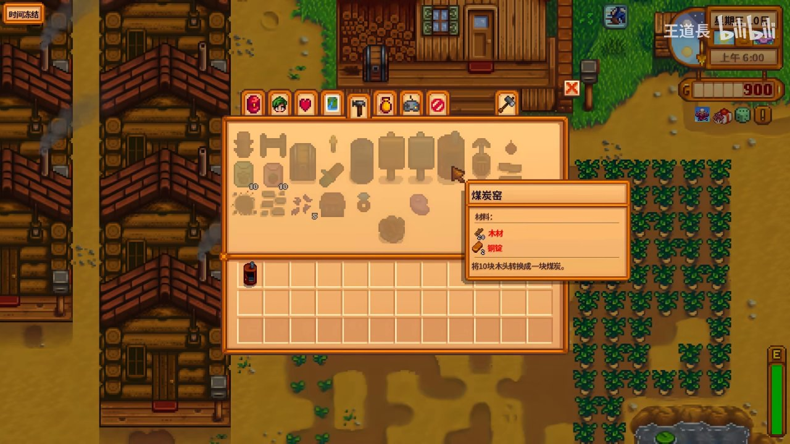
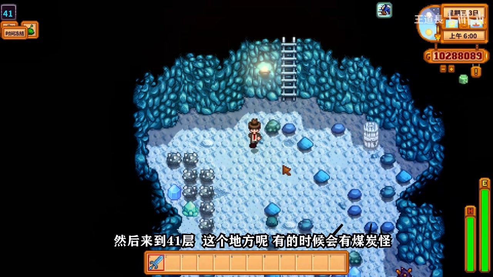
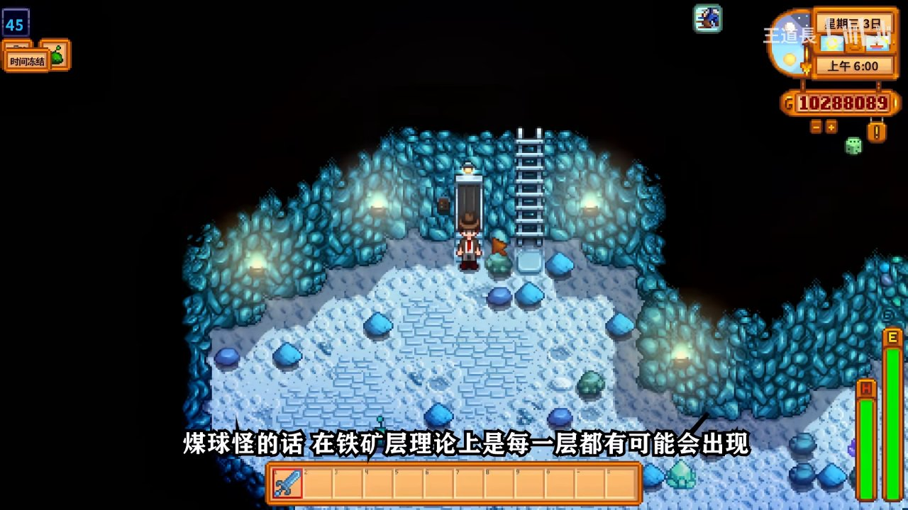
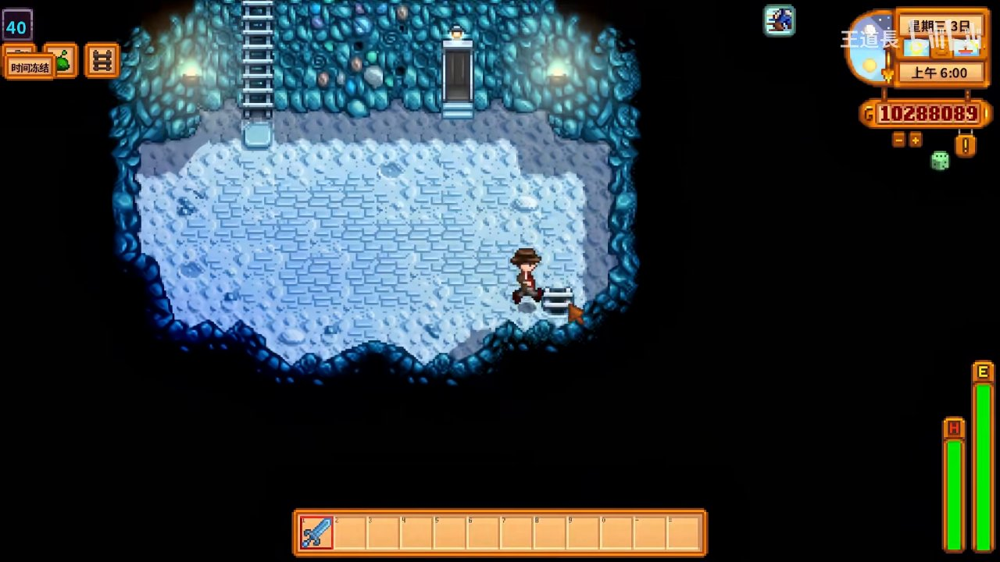

# 🌾 萌新如何获得大量的煤炭

> 本攻略由 B站 UP主「王道长」的视频教程整理生成
> 原视频：[星露谷物语萌新如何获得大量的煤炭](https://www.bilibili.com/video/BV12F41187D2)
> 最后更新: 2026-07-06

---

## 📋 本篇涵盖

- ✅ **方法一：直接购买** — 从克林特铁匠铺购买煤炭（简单暴力但费钱）
- ✅ **方法二：煤炭窑转化** — 升级采集4级解锁，木头变煤炭（性价比之王）
- ✅ **方法三：击杀煤球怪** — 铁矿层刷怪掉落（可持续产出）
- ✅ **新手避坑提示**

---

## 方法一：直接购买煤炭 👛

对于急需煤炭的萌新，最简单直接的方法就是**去克林特的铁匠铺购买**。煤炭单价 **150金/个**，虽然不算便宜，但在第一年资金紧张的情况下，少量购买解决燃眉之急是可行的。

*在克林特这边，一个煤炭是150块钱*

*我们可以直接简单暴力的购买煤炭 — 省时省力*

> **💡 提示：** 购买适合急用少量煤炭的情况。如果想大量获取，建议用下面的方法。

---

## 方法二：煤炭窑转化 🔥

### 第一步：升级采集技能到4级

煤炭窑的制造配方在**采集（Foraging）技能达到4级**时解锁。前期多砍树、采集野果，很快就能升到4级。

*采集4级奖励：解锁煤炭窑（Charcoal Kiln）制造配方*

### 第二步：制作煤炭窑

解锁配方后，打开**制作菜单**即可制作煤炭窑。所需材料：

| 材料 | 数量 |
|:-----|:----:|
| 木材（Wood） | 10 |
| 铜锭（Copper Bar） | 8 |

*煤炭窑制作界面 — 10块木头 → 1块煤炭*

### 第三步：使用煤炭窑

煤炭窑的功能：**将10块木头转化成1块煤炭**。

- 木头在游戏中非常容易获取（砍树即有）
- 可以放置多个煤炭窑同时工作
- 这是**大量稳定获取煤炭**的首选方法

> **⚠️ 注意：** 前提是先去克林特那里购买足够的铜矿石，熔炼成铜锭，才能制作煤炭窑。前期需要一些小投入。

---

## 方法三：击杀煤球怪获取 ⚔️

### 什么是煤球怪？

煤球怪（Coal Slime）是在**铁矿层（矿洞40层以上）** 随机生成的怪物，击败后会掉落煤炭。

*来到41层，这个地方有的时候会有煤炭怪*

### 刷怪要点

| 要点 | 说明 |
|:----|:----|
| 🏗️ 地点 | 矿洞第 **41层** 及周边（铁矿层，40层以上） |
| 👾 怪物 | 煤球怪（Coal Slime）— 黑色史莱姆状 |
| 📦 掉落 | 必定掉落煤炭，有时还掉落铁锭/铜锭 |
| 🗡️ 建议 | 带好武器（铁剑或以上），穿好护甲 |

*煤球怪的话，在铁矿层理论上是每一层都有可能会出现*

*在矿洞深层直接用镐子挖掘煤炭矿石，也能获得大量煤炭*

> **💡 提示：** 如果脸黑找不到煤球怪，也可以直接用镐子挖矿洞里的煤炭矿石。在深层矿洞（特别是冰冻层附近），煤炭矿石的分布密度更高。

---

## 🚫 新手避坑清单

| ❌ 不要做 | ✅ 正确做法 |
|:---------|:-----------|
| 前期花光所有钱买煤炭 | 先做几个煤炭窑，用木头换煤炭更划算 |
| 只依赖一种方法 | **组合使用**：煤炭窑持续产出 + 矿洞刷怪补充 |
| 忘记升级采集技能 | 采集4级才能解锁煤炭窑，前期多砍树 |
| 在浅层矿洞盲目挖矿 | 去40层以上的铁矿层，煤炭矿石更多 |

---

## ✅ 总结：三种方法对比

| 方法 | 成本 | 产出效率 | 适合阶段 |
|:----|:----|:--------|:--------|
| 👛 购买（150金/个） | 高 | 即时 | 急用少量 |
| 🔥 煤炭窑 | 低（只需木头+铜锭） | 持续稳定 | 中期主力 |
| ⚔️ 击杀煤球怪 | 中（需武器+下矿） | 中高 | 中后期补充 |

**推荐路线：** 前期多砍树升采集4级 → 做煤炭窑 → 后期去矿洞41层刷煤球怪。三条路线结合，煤炭再也不愁！
