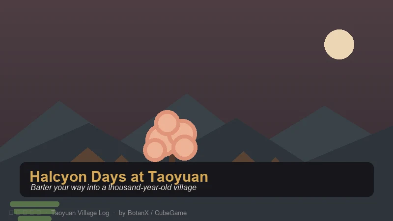
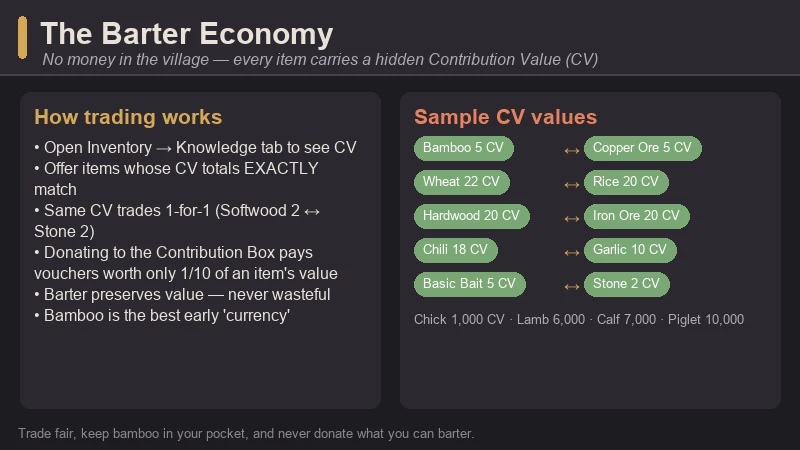
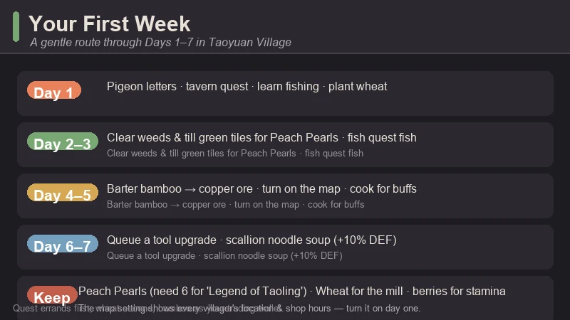
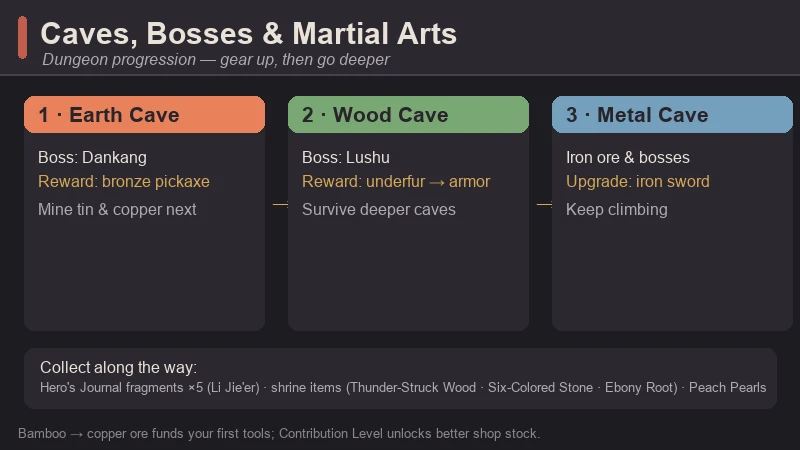
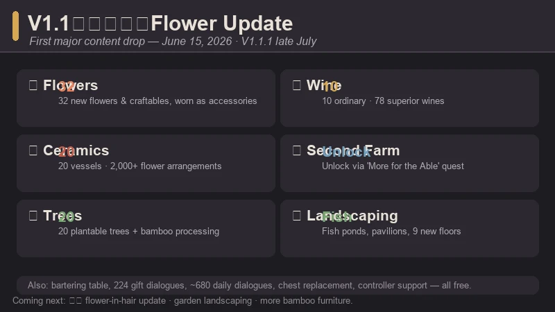

# Halcyon Days at Taoyuan Beginner's Guide — Trade, Farm, and Fall Into a Hidden Village

> Game: Halcyon Days at Taoyuan (*桃源村日志*) | Developer: BotanX | Publisher: CubeGame (方块游戏) | Released: January 20, 2026 (Steam) | Price: $11.99 | Platforms: PC (Windows)

I stumbled onto Halcyon Days at Taoyuan while looking for something cozy with a little culture to it, and the first thing that threw me was that **the village has no money**. You don't sell your crops to a shipping bin; you trade them to villagers for the things you need, and every single item in the game carries a hidden value that decides how fair the swap is. It's Stardew Valley's loop — farm, fish, mine, befriend, date — wrapped in the warmest Chinese folklore setting I've played, and sitting at a **"Very Positive" ~87% rating on Steam** with more than a thousand reviews. After the V1.1 flower update landed this summer, it's easy to see why people keep coming back.

This guide covers the stuff I wish someone had told me on day one: how the barter economy actually works, what to do in your first week, which caves to tackle when, and how to stop being the village's clumsy new arrival and start being the person who shows up to the Dragon Boat Festival with a plan.

---

## What Is Halcyon Days at Taoyuan?

**Halcyon Days at Taoyuan** (Chinese title: **桃源村日志**) is a farming and life sim from **BotanX**, published by **CubeGame (方块游戏)**. It released on **January 20, 2026**, and its hook is the setting: Taoyuan Village is inspired by the classical Chinese tale *Peach Blossom Spring* (桃花源记) — a hidden village that has been sealed off from the outside world for a thousand years. You are the outsider who walks into it, and the game's job is making you feel welcomed, useful, and eventually at home.

| Fact | Detail |
|:-----|:-------|
| **Developer** | BotanX |
| **Publisher** | CubeGame (方块游戏) |
| **Release** | January 20, 2026 |
| **Platforms** | PC (Steam, Windows) |
| **Price** | $11.99 base · occasional 10% sales (historical low $10.79) |
| **Steam rating** | "Very Positive" (~87%), 1,000+ reviews |
| **Genre** | Farming sim · life sim · RPG · creature collecting |
| **Style** | Chinese folklore pixel art |
| **Occupations** | 9 — farming, forestry, animal husbandry, fishing, tailoring, cooking, construction, mining, martial arts |
| **Creatures** | 60+ befriendeable animals and mounts |
| **Languages** | English, Simplified Chinese, Traditional Chinese, and more |
| **Performance** | Runs on very modest hardware (2 GB RAM minimum) |

**What it's really about:** it's a "one-hundred-year village" simulator. You farm, forage, fish, mine, and fight your way through caves; you earn **Contribution Level** by giving back to the community; and you unlock everything from better tools to new farm plots and even a second farm by deepening your place in village life. There are romanceable NPCs, full Chinese-style weddings, and two different story endings depending on how you play.

> **The hook:** it's Stardew Valley in a thousand-year-old hidden village, where instead of gold you trade by value — and where the community chest (the Contribution Box) is more important than any wallet.

---

## The Barter Economy — No Money, Just Values

Taoyuan Village has **no currency**. Every tradable item carries a hidden **Contribution Value (CV)**, and trading works by equivalent exchange: you offer items whose CV totals exactly match the value of what you want. There's no haggling and no haggling menu — just clean, fair swaps.

**How to see an item's value:** open your inventory and go to the **Knowledge** section, then hover over any item you own (for example, Wheat shows **22 CV**). The catch is that items you don't own yet — like shop seeds — won't show their value, which is why the community keeps shared value lists.

**The rules that matter:**

- **Equivalent exchange.** Two items with the same CV trade one-for-one (Softwood 2 CV ↔ Stone 2 CV, for example). Mixed stacks work too — any combination that adds up to the target CV is accepted, and you can bulk-trade by multiplying.
- **Donating is a tenth-rate deal.** Giving items to the Contribution Box earns **Contribution Vouchers** worth **1/10 of the item's CV**. Some items can *only* be bought with vouchers, but for anything tradable, **barter is always better value** than donating.
- **Hold the +/- buttons.** When you're in a trade screen, the quantity buttons can be held down to scroll fast — a lifesaver when you're trading 20 items at once.
- **Bartering doesn't cost value.** Unlike selling to a shop (which usually gives you less than an item is worth), a fair barter keeps your value intact — so hoarding trade goods is never wasteful.

**Bamboo is your first currency.** Chop one bamboo tree and you get **10 bamboo**, and bamboo is the community's go-to early trade good: it's everywhere, it stacks in a single inventory slot, and the blacksmith takes it for the copper ore you need to upgrade tools. Treat bamboo like pocket money and you'll never be stuck.

### Quick CV Reference (Early Game)

Values verified in-game via the Knowledge tab; shared community lists fill in the rest.

| Category | Item → CV |
|:---------|:----------|
| **Seeds** | Garlic 10 · Chili 18 · Rice 20 · Wheat 22 · Tomato 45 · Corn 55 · Watermelon 99 |
| **Forestry** | Softwood 2 · **Bamboo 5** · Hardwood 20 |
| **Mining** | Stone 2 · **Copper Ore 5** · Tin Ore 10 · Iron Ore 20 |
| **Livestock** | Hay 2 · Chick 1,000 · Lamb 6,000 · Calf 7,000 · Piglet 10,000 |
| **Fishing** | Basic Bait 5 · Intermediate Bait 15 · Premium Bait 25 |

**Early rule of thumb:** keep an eye on anything with a low CV that's easy to gather (bamboo, softwood, stone) — those are your trade fuel. Hold onto high-CV items like iron ore and fish until you actually need something big, because value is preserved in barter.

---

## Your First Week — A Day-by-Day Plan

The opening days are gentle if you know the shape of them. Here's the route that worked for me:

**Day 1 — run the errands, plant wheat.**
- Check the **carrier pigeon letters** at your door — you get the **Golden Snake Pack** (a DLC bonus), some **Worn Clothes**, and your first quests.
- Head to the **tavern** and pick up the **"A Grumbling Stomach"** quest, then visit **Liu Chulan** for **"A New Look."**
- Meet **Xiao Yuanyi** to learn fishing — you'll get the **Novice Fishing Rod** and **10 Fish Bait**.
- **Plant wheat.** It feeds the early "The Art of Cooking" quest, which needs **10 Wheat Flour and 5 Fish**. Use the **mill** just outside **Jiang Zhengyang's** shop (click and hold the handle, then move it clockwise) to turn wheat into flour.
- Eat the **berries** on your farm to keep your stamina up while you clear space.

**Days 2–5 — farm, fish, clear.**
- **Clear the weeds on your farm** — they regrow unless you till the land or dig up the green tile patches. Tilling those patches can also dig up **Peach Pearls**, which you'll need six of for the **"Legend of Taoling"** quest (they also drop from mining and fishing).
- Farm your wheat, fish the village pond for the quest fish, and start bartering bamboo with the blacksmith for copper ore.
- Turn on the **map feature** in settings — it shows every villager's location and their shop opening hours, and it's genuinely worth doing on day one.

**Days 6–7 — first upgrades.**
- Barter for a **copper pickaxe** or invest in your fishing rod. Tool upgrades cost **Contribution Vouchers plus resources** and take two in-game days, so get them queued early rather than when you need them.
- **Cook once you have a kitchen.** Cooked dishes grant real buffs — for example, **Scallion Noodle Soup** (Wheat Flour + Scallion + Chef's Arsenal) gives **+10% DEF for 4 hours**. Buffs like crop-drop bonuses and move speed are the difference between a good day and a great day.

> **First-week priorities in one line:** quests first, wheat second, bamboo as your trading wallet, and a tool upgrade queued before the weekend.

---

## Farming, Cooking & the Nine Occupations

Taoyuan tracks **nine occupations**: farming, forestry, animal husbandry, fishing, tailoring, cooking, construction, mining, and martial arts. You're never locked into one — you raise each as you do the work, and the skills feed into what you can craft and how well.

**Early farming tips that actually matter:**

- **Stamina is your real limit early on.** Berries restore a little; cooked dishes restore more and add buffs. Don't clear your whole farm on day one — clear what you can plant, then rest.
- **Wheat is the gateway crop.** It's cheap, quick, and the cooking quest chain wants it. Beyond that, plant a little of everything at first so you can see which crops the villagers value, then specialize once the CV numbers are visible in your Knowledge tab.
- **Fertilize.** You can fertilize before planting, and it makes a real difference to growth — same trick as Stardew, same payoff.
- **Don't sell to a bin — trade.** There is no shipping bin. Produce sits in your inventory until you barter it or cook it, and since barter preserves value, holding onto goods is never a mistake.

**Cooking is the quiet money-maker.** Dishes sell-trade for more than their ingredients and hand you combat, speed, and gathering buffs. The cooking NPC (Long Xizhi) buys recipes and ingredients by value, and as you unlock better recipes the buffs get genuinely strong. A full belly is a buff; a buff is a better farming day.

---

## Mining, Caves & Martial Arts

This is where the "martial arts" occupation comes in. Caves are real dungeons — monsters, bosses, and loot — and combat is one of the nine occupations you'll raise by fighting.

**The cave order that works:**

1. **Earth Cave — boss: Dankang (当康).** Early mining is rough because your gear is bad. A neat trick the community uses: walk in and out of the mine repeatedly to finish the beginner mining quest, then use **bamboo → copper ore** trades to get better tools before you push deep. Beat Dankang and you unlock the **bronze pickaxe**, which lets you mine tin and copper — the next rung of tool upgrades.
2. **Wood Cave — boss: Lushu (鹿蜀).** With a **practice sword** (fine for the first two caves) and better gear, clear the Wood Cave. Defeating **Lushu** gives you its **underfur**, which you craft into **armor** that lets you survive the deeper caves.
3. **Metal Cave — boss and beyond.** Mine iron ore with the bronze pickaxe, upgrade to an **iron sword** for the metal cave, and keep climbing.

**Things to collect as you go:**

- **Hero's Journal fragments** — there are **5** scattered across caves (monsters and chests), and **Li Jie'er** collects them.
- **Shrine repairs** — repairing shrines advances the story and needs special items like **Thunder-Struck Wood**, **Six-Colored Stone**, and **Ebony Root** (found deep in the Wood Cave / around Lushu).
- **Peach Pearls** — six total, for the "Legend of Taoling" quest. They drop from tilling, mining, and fishing.

**Combat advice:** keep your weapon one tier above "borrowed" — the practice sword stops being enough once you're in the metal cave. And if you ever feel stuck, remember that a better **Contribution Level** unlocks richer merchant stock (the blacksmith sells more ore types and quantities), so progress in the village and progress in the caves feed each other.

---

## Creatures & Mounts

Taoyuan is full of creatures you can befriend — **60+ animals**, from chickens and goats to pandas, golden pigs, and even phoenixes. Befriending takes feed, patience, and the right approach per animal.

- **The panda is the prize mount.** It adds **+25% move speed**, and the community's capture guide is a famous one: upgrade your copper axe and hoe, clear the bamboo grove, and watch for the panda's spawn conditions (weather and time matter).
- **Golden pigs and goats** make excellent early mounts and companions — easier to get, still useful.
- **Phoenixes** come later and are tied to the main-story/boss progression.

Mounts change how the village feels to cross — the difference between a 5-minute walk and a 3-minute one is real when you're running errands every day.

---

## Festivals & Social Life

The calendar is packed with festivals straight out of the traditional Chinese year, and they're the heart of the community:

| Festival | Season / Timing | What happens |
|:---------|:---------------|:-------------|
| **Spring Festival (春节)** | Winter | The big one — gift-giving, feasts, red envelopes, family vibes |
| **Yuanxiao / Lantern Festival** | Early spring | **Lantern riddles** in the square; answer them for prizes |
| **Qingming (清明)** | Spring | Tomb-sweeping festival with a quieter, reflective tone |
| **Dragon Boat Festival (端午)** | Summer | **Dragon boat racing** — a genuinely fun mini-game |
| **Mid-Autumn Festival (中秋)** | Autumn | Mooncakes, family time, and seasonal rewards |

Beyond festivals, the social layer goes deep: **romanceable NPCs**, gift-giving with 600+ dialogue reactions after the recent updates, and full **Chinese-style weddings**. Raising relationships unlocks story, buffs, and the alternate ending — the "two worlds complete" (两全) perfect ending is one of the game's most satisfying goals.

---

## The V1.1 Flower Update — What's New in 2026

The game's first major content drop, **V1.1《花千树》** (roughly "A Thousand Trees of Blossoms"), landed **June 15, 2026**, with a follow-up patch **V1.1.1** in **late July**. If you've been waiting for a reason to return, this is it.

**V1.1《花千树》(June 15, 2026):**
- **Flower system** — 32 new flowers and craftables, unlocked through the "Side Path of Flowers" (旁门花道) quest line
- **Tree planting** — 20 plantable trees (blossom trees, fruit trees, timber trees)
- **Ceramics** — 20 new ceramic vessels with **2,000+ flower-and-vessel arrangement combinations**
- **A second farm**, unlocked via the "More for the Able" (能者多劳) quest — a serious late-game goal
- **Wine-making** — 10 ordinary wines and 78 superior wines, a strong new money-maker
- **Bartering table** — a physical station that lets you exchange items anywhere, anytime
- New achievements, dialogue, and polish

**V1.1.1 (late July 2026) — the polish pass:**
- **Flower accessories** — a dedicated clothing slot for wearing the flowers you grew
- 20 more trees, 20 more ceramic vessels, and **plantable bamboo** with a bamboo processing table for furniture
- New large landscaping furniture — **fish ponds, pavilions**, and 9 new interior floors
- **224 new gift-giving dialogues** and ~680 new daily villager dialogues
- QoL: replace low-tier chests directly with better ones, improved controller support, and mini-game logic updates

The dev team has also teased a **"簪花" (flower-in-hair) update** next, with garden landscaping and more bamboo furniture. The roadmap is alive — which is a good sign for a $11.99 game.

---

## Is It Worth It?

At **$11.99** (and frequently on 10% sale down to ~$10.79), Halcyon Days at Taoyuan is one of the best value farming sims out right now. The **"Very Positive" ~87% rating** with over a thousand reviews, the free content updates through the summer, and the genuinely unique barter economy all justify the price. It's also wonderfully accessible — it runs on hardware most modern cozy games laugh at.

**Who it's for:**

- **Stardew Valley fans** who've 100%-ed everything and want a new village to love.
- **Players who like culture in their cozy games** — festivals, weddings, and folklore woven into the loop.
- **Barter/puzzle-economy lovers** — if "what's the fair trade" sounds fun, this is your game.
- **Low-end hardware players** — 2 GB RAM minimum, no excuses.

**Who should skip it:**

- Players who want a **currency-based economy** and hate tracking values (the barter system is charming but it *is* the game).
- People who prefer **combat-light** cozy games — the caves have real bosses.
- Anyone who bounced off **pixel-art life sims** before.

**The honest comparison:**

| | Halcyon Days at Taoyuan | Stardew Valley | Doloc Town |
|:--|:--|:--|:--|
| **Setting** | Chinese folklore village (Peach Blossom Spring) | American small town | Post-apocalyptic wasteland |
| **Economy** | Pure barter (Contribution Value) | Gold currency | Gold currency |
| **Combat** | Martial arts, cave dungeons with bosses | Sword & slingshot, mines | Bullet-hell drone combat |
| **Unique hook** | Culture, festivals, weddings, barter | The genre-defining loop | Weather as the boss |
| **Price** | $11.99 | $14.99 | $19.99 |

For my money, Halcyon Days at Taoyuan earns its "cozy-with-culture" tag honestly. The barter economy makes every day a small puzzle, the festival calendar gives the year a rhythm, and the V1.1 update turned a good game into a great one. If you like Stardew Valley and you've never played anything set in this world, it's an easy recommendation.

---

## FAQ

### When did Halcyon Days at Taoyuan release?
It launched **January 20, 2026** on Steam for Windows. The first major content update, **V1.1《花千树》**, came **June 15, 2026**, with a polish patch (**V1.1.1**) in **late July 2026**.

### Is it available in English?
Yes — English is fully supported alongside Simplified and Traditional Chinese.

### How does trading work without money?
Every item has a hidden **Contribution Value (CV)**. You barter items whose CV totals match exactly what you want. Donating items to the Contribution Box gives vouchers worth 1/10 of their value, so bartering is almost always better.

### What should I do on day one?
Check your pigeon letters, start the tavern and quest errands, learn fishing from Xiao Yuanyi, and **plant wheat** for the cooking quest. Treat **bamboo** as your starter currency for tool upgrades.

### Is there combat?
Yes — caves are dungeons with monsters and bosses. Progression goes **Earth Cave (Dankang)** → **Wood Cave (Lushu)** → deeper caves, and the martial arts occupation levels up as you fight. Defeating Lushu unlocks underfur armor that lets you go deeper.

### How do I get the panda mount?
It's the community's favorite project: upgrade your copper axe and hoe, clear the bamboo grove, and watch for the panda's spawn conditions (weather and time of day matter). The panda adds **+25% move speed**.

### Is it worth the price?
At **$11.99** (frequently ~$10.79 on sale), yes — especially with the free V1.1 and V1.1.1 updates adding flowers, wine-making, a second farm, and a huge amount of new dialogue.

---

*Guide data gathered from the Steam store page, SteamDB, English community wikis (Neoseeker, Magic Game World, Kos Guides), and Chinese video guide coverage on Bilibili (full-playthrough, beginner, cave-progression, and V1.1-experience series). Prices reflect the August 2026 state and may change — always check the Steam page before buying.*
