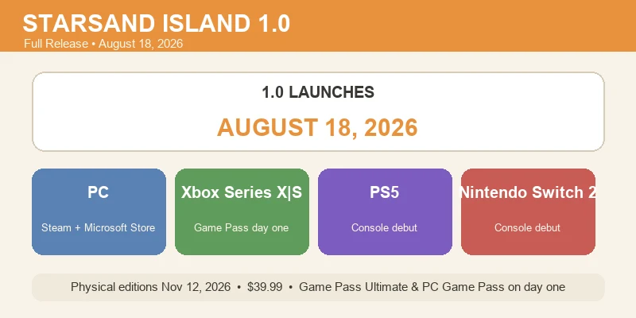
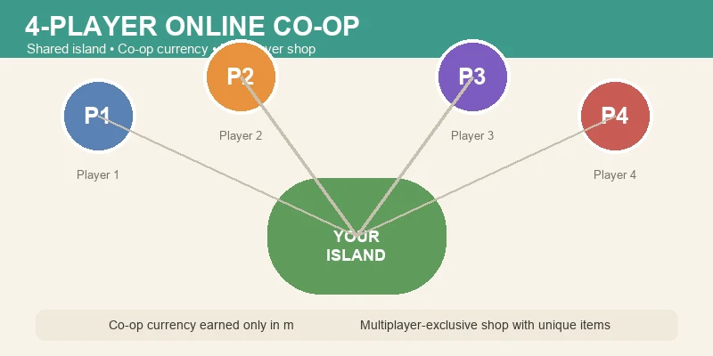
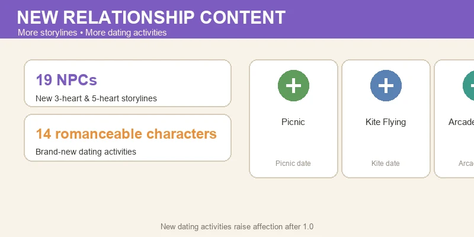
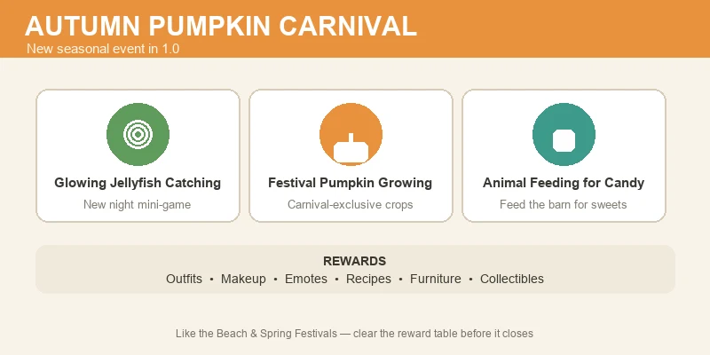

# 🚀 Starsand Island 1.0 Update Guide — Everything New on August 18

> Game version: 1.0 full release (Aug 18, 2026) | Focus: Update Breakdown, 4-Player Co-op, New Story & Festival Content

After months of Early Access (the game launched on **February 12, 2026**), Starsand Island (星砂岛) is getting its full 1.0 release on **August 18, 2026** — and it is a big one. The devs at Seed Sparkle Lab are shipping **4-player online co-op**, a brand-new **Autumn Pumpkin Carnival**, **19 NPC storylines**, new **dating activities** for romanceable characters, and a simultaneous **console launch** on PS5, Xbox Series X|S, and Switch 2. Oh, and it is coming to **Xbox Game Pass Ultimate and PC Game Pass on day one**.

I've covered the game's crops, animals, mining, romance, and building in earlier guides — this one is the *launch-day briefing*: what actually changes on August 18, what you get for playing 1.0 as an EA player, and what to do before the update lands.

*Data sourced from the official 1.0 announcement and developer communications, plus in-game EA 0.4.x testing. The 1.0 release date and feature list reflect the developers' official announcement as of August 7, 2026 — check the in-game news board or the Steam page for any last-minute changes.*

---

## 📋 Table of Contents

1. [Release Date & All Launch Platforms](#release-date-all-launch-platforms)
2. [4-Player Online Co-op](#4-player-online-co-op)
3. [New Storylines — 19 NPCs & 14 Romanceable Characters](#new-storylines-19-npcs-14-romanceable-characters)
4. [Autumn Pumpkin Carnival](#autumn-pumpkin-carnival)
5. [EA Save Carryover & What You Keep](#ea-save-carryover-what-you-keep)
6. [Pre-Launch Checklist for EA Players](#pre-launch-checklist-for-ea-players)
7. [What Comes After 1.0](#what-comes-after-10)
8. [FAQ](#faq)

---

## Release Date & All Launch Platforms

**1.0 goes live on August 18, 2026** — the same day across every platform. Here is the full launch picture:

| Platform | Release | Notes |
|:---------|:--------|:------|
| **PC (Steam + Microsoft Store)** | Aug 18, 2026 | Existing EA players update in place |
| **Xbox Series X\|S** | Aug 18, 2026 | Day-one on **Xbox Game Pass Ultimate** |
| **PS5** | Aug 18, 2026 | Console debut |
| **Nintendo Switch 2** | Aug 18, 2026 | Console debut |
| **Physical editions (all consoles)** | Nov 12, 2026 | **$39.99** |

A few things worth calling out:

- **It is a simultaneous global launch.** No platform gets the update early, and console players jump straight into the full 1.0 game — they never see Early Access.
- **Game Pass players get it free on day one.** If you already subscribe to Xbox Game Pass Ultimate or PC Game Pass, that is the cheapest way to try 1.0 without buying the game.
- **Physical copies come later.** The boxed editions land **November 12, 2026** at **$39.99** — a collectors' item rather than the fastest way in.
- **EA players get everything for free.** The 1.0 update itself costs nothing if you already own the Early Access version.

> 💡 **Why this matters:** August 18 is also the update's 20:00 Beijing-time unlock window. If you are in a time zone far from UTC+8, "launch day" may actually land on the 18th or 19th for you depending on when the servers flip. Watch the official social channels for the exact hour.

---

## 4-Player Online Co-op

The headline feature of 1.0: **4-player online multiplayer**. Starsand Island has always been a single-player island-farming sim, and co-op is the feature EA players asked for the most — so it's the centerpiece of the full release.

**How it works (per the official announcement):**

- **Up to 4 players** can join one island online and farm, build, fish, mine, and run festivals together.
- Progress is **host-driven**: the world owner's island is the shared one, and their progression gates what visitors can build and unlock.
- There is a **dedicated co-op currency** earned only through multiplayer play.
- That currency is spent in a **multiplayer-exclusive shop** — so co-op isn't just a social feature, it has its own gear, cosmetics, and items you can only get by playing with friends.

**What to expect on day one:**

| Co-op Feature | Detail |
|:--------------|:-------|
| Max players | 4 |
| Shared world | Host's island; host progression applies |
| Co-op currency | Earned via multiplayer activities only |
| Multiplayer shop | Exclusive items, cosmetics & gear |
| Festival co-op | Festivals run with multiple players on the island |

> ⚠️ **A word for EA veterans:** expect some early co-op quirks on launch week — any online system this size ships with rough edges. If you plan a big group session, give it a few days for the first stability patch rather than cancelling a weekend over a launch-day desync.

> 💡 **Plan your group now.** Decide who hosts before launch. The host's island is the world everyone plays in, so the host should be the player with the most built-up farm — or the one whose save everyone agrees to live on.

---

## New Storylines — 19 NPCs & 14 Romanceable Characters

The other big pillar of 1.0 is story. The developers are expanding the island's social layer with a large batch of new relationship content:

- **19 NPCs** receive new **3-heart and 5-heart storylines** — that is more than half of the island's cast getting new personal quests, backstory, and relationship milestones.
- **14 romanceable characters** get brand-new **dating activities**: think **picnics**, **kite flying**, and **arcade games** at the Chrono Arcade. These are proper date outings with their own scenes, not just extra dialogue lines.

**What this means for your relationships:**

| Content | Who Gets It | What's New |
|:--------|:------------|:-----------|
| **3-heart & 5-heart quests** | 19 NPCs | New personal storylines, dialogue, and milestones |
| **Dating activities** | 14 romanceable characters | Picnics, kite flying, arcade dates |
| **Affection cap** | Romanceable NPCs | More ways to raise hearts = faster to cohabitation |

> 📌 **Roster note:** the official 1.0 announcement names **14 romanceable characters** with the new dating content. Our Early Access [Community & Romance Guide](community-romance) lists 15 romanceable NPCs — the roster number is one to re-check after launch, and we'll update the romance guide once 1.0 is live. If a character was on the edge of the romance list for you, verify their heart menu after the update.

> 💡 **Raise hearts now.** If you have romanceable NPCs sitting at 4 hearts, the new 5-heart content is a good reason to finish their gift loop before August 18 — but don't stress about maxing everyone. The new dating activities give you an extra path to raise affection after 1.0, so late relationships get easier, not harder.

---

## Autumn Pumpkin Carnival

The new seasonal event in 1.0 is the **Autumn Pumpkin Carnival** — and it looks like the most elaborate festival the game has shipped. It sits alongside the existing Beach Festival and Spring Festival as the third major seasonal event, with its own mechanics:

**The three carnival activities:**

1. **Glowing jellyfish catching** — a new mini-game that fits the island's nighttime fishing vibe. Catch glowing jellyfish as they drift across the island for carnival points.
2. **Festival pumpkin growing** — carnival-exclusive pumpkin crops with their own growth cycle. Plant and tend them during the event window.
3. **Animal feeding for candy** — you can feed your farm animals during the carnival to earn candy, making the event a reason to check on the whole barn, not just the crops.

**Reward pool:**

| Reward Type | Examples |
|:------------|:---------|
| **Outfits** | Carnival-exclusive clothing |
| **Makeup** | New cosmetic options |
| **Emotes** | Character animations |
| **Recipes** | Cooking recipes from the event |
| **Furniture** | Carnival-themed decor for your home |
| **Collectibles** | Event-tied collection items |

> 💡 **Treat it like the other festivals.** Starsand Island's seasonal events run on a timer, and the rewards are often exclusive to that run. Stock the same festival-prep you'd do for the Beach Festival — saved ingredients, a fed-and-happy animal roster, and free time during the event window — so you can clear the full reward table before it closes.

---

## EA Save Carryover & What You Keep

The most common question from EA players is whether their farm survives the jump to 1.0. Per the developers, **your Early Access save carries over into the full release** — you do not start over.

**What carries over:**

- Your farm and all property progress (Hopeland expansions and beyond)
- Your animal collection, crops, and inventory
- Your NPC relationships and hearts
- Your progression ranks and unlocked content

**What may shift:**

- Balance changes can alter prices, growth times, and rewards — treat old numbers as out of date after 1.0.
- The new systems (co-op, carnival, dating activities) layer on top of existing content, so your save is compatible, not identical.
- If you've been playing an older EA build, expect a one-time update migration on first launch.

> ⚠️ **Back up your save before launch day.** Save-carryover migrations are exactly where things can go wrong. Make a manual copy of your save files a day or two before August 18, and let the game run its migration without quitting mid-process.

---

## Pre-Launch Checklist for EA Players

If you have an active Early Access farm, here is the checklist to walk before 1.0 drops:

### ✅ Do This Before August 18

- **Back up your save files.** The #1 rule for any big update.
- **Finish in-progress festivals and quests.** Event rewards that are leaving with the EA season are worth clearing while they are still available.
- **Stockpile the expensive stuff.** Crafting and building materials hold value; if 1.0 rebalances prices, a stocked warehouse cushions the change.
- **Decide your co-op host.** If you have a group planned, agree on whose island becomes the shared world.
- **Raise key relationships to a heart milestone.** New 5-heart content waits for you, but crossing 4 hearts now saves a gift loop later.
- **Update your game the day of launch** and read the patch notes — 1.0's changelog will be long.

### ❌ Don't Bother

- **Don't restart your farm.** Save carryover means your progress is safe — starting fresh is a choice, not a requirement.
- **Don't hoard the old festival currency** in case it converts — treat EA festival currency as ending with the EA event.
- **Don't worry about a "best" 1.0 start.** The update adds systems; it doesn't reset the game. Jump in with your existing farm and explore the new content.

---

## What Comes After 1.0

The 1.0 announcement closed with a line worth taking seriously: **"1.0 is only the beginning."** The developers have been running a steady content cadence through Early Access — crops, animals, festivals, and a major story layer in 1.0 — and the co-op infrastructure opens up a lot of future direction.

What we'd expect to watch after launch:

- **Post-1.0 seasonal content** following the existing festival pattern
- **Co-op-expanding features** (more players? shared-progress modes?)
- **New NPCs or romanceable characters** once the 19-storyline batch settles in

Nothing beyond the 1.0 feature set is officially confirmed yet — treat this as a watchlist, not a roadmap. When the developers announce the first post-launch update, this guide will get a follow-up.

---

## FAQ

### When does Starsand Island 1.0 release?
**August 18, 2026** on PC (Steam + Microsoft Store), Xbox Series X|S, PS5, and Nintendo Switch 2 — a simultaneous global launch. Physical editions follow on **November 12, 2026** at $39.99.

### Is 1.0 free for Early Access owners?
Yes. The 1.0 update is free for everyone who owns the Early Access version.

### Is Starsand Island on Game Pass?
Yes — **Xbox Game Pass Ultimate and PC Game Pass** include Starsand Island on day one of the 1.0 launch.

### How many players in co-op?
**4 players** online on the host's island, with a dedicated co-op currency and a multiplayer-exclusive shop.

### Does my Early Access save carry over?
**Yes.** The developers have confirmed EA saves carry over into 1.0. Back up your save files before launch anyway.

### What's new in relationships in 1.0?
**19 NPCs** get new 3-heart and 5-heart storylines, and **14 romanceable characters** get new dating activities — picnics, kite flying, and arcade dates. (The EA romance guide lists 15 romanceable NPCs; we'll re-check the roster after 1.0.)

### What is the Autumn Pumpkin Carnival?
The new autumn seasonal event with **glowing jellyfish catching**, **festival pumpkin growing**, and **animal feeding for candy**, rewarding outfits, makeup, emotes, recipes, furniture, and collectibles.

### Do I need to restart my farm for 1.0?
No. Save carryover means your farm, animals, inventory, and relationships all carry into 1.0.

---

*Guide prepared for the Starsand Island 1.0 release (August 18, 2026). Feature details are from the developers' official 1.0 announcement as of August 7, 2026; the game's Early Access content is covered in our [Crop Profit](crops), [Animals & Pets](animals), [Fishing & Gathering](fishing-gathering), [Mining & Crafting](mining-crafting), [Community & Romance](community-romance), and [Base Building & Home](building-home) guides.*
