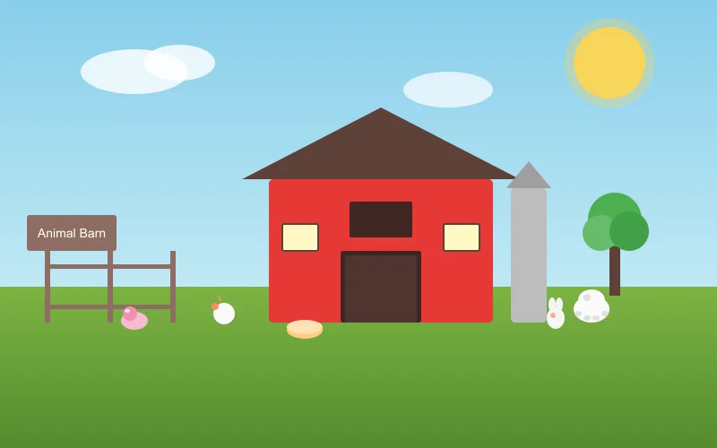
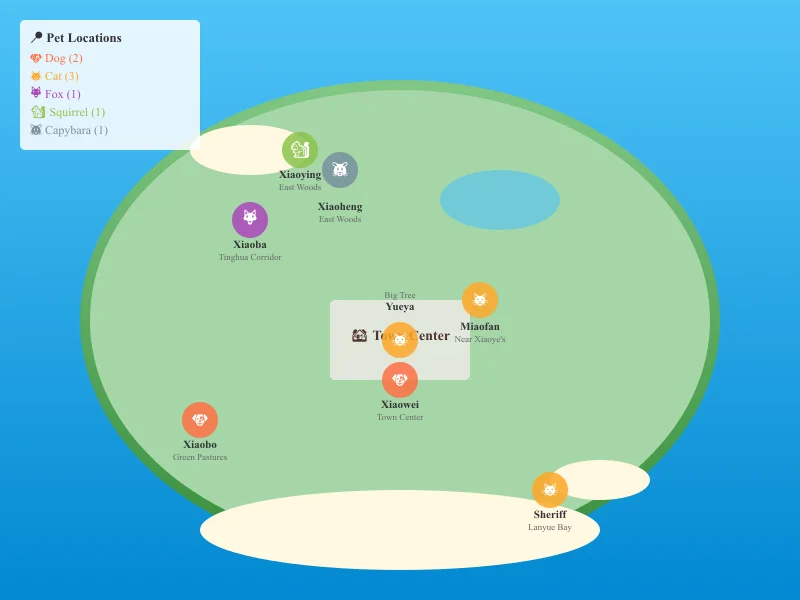
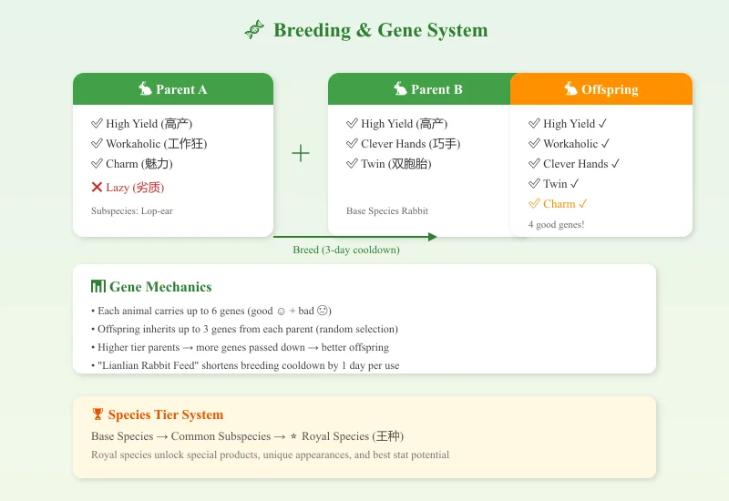
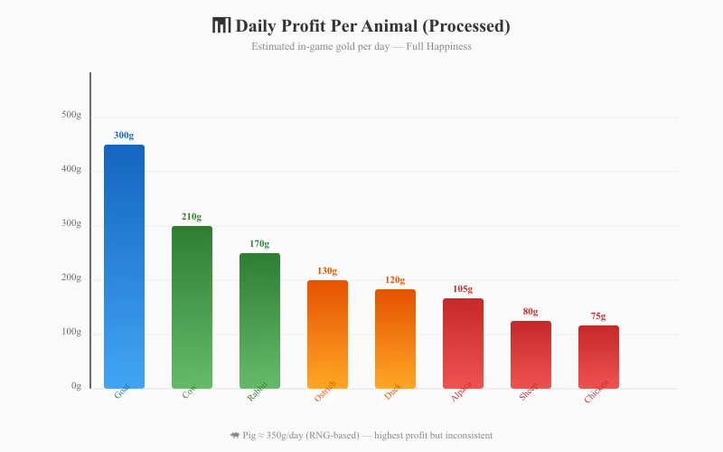

# 🐾 Starsand Island Complete Animal & Pet Guide

> Game version: Early Access (Feb 12, 2026 launch) | Focus: Animals, Pets, Breeding & Gene Systems

I've spent over 80 hours exploring Starsand Island's animal systems since the EA launch, and I can confidently say — this is one of the deepest animal husbandry systems I've seen in any farming sim. With **10+ base animal types**, **40+ subspecies**, a **six-gene inheritance system**, and **8 adoptable wild pets**, there's a staggering amount of content here.

This guide covers everything I've learned about the animal side of Starsand Island — from petting your first rabbit to engineering a 5-gene super-animal.

*Data sourced from official Bilibili Wiki, in-game testing, and community research. Prices in in-game gold.*

---

## 📋 Table of Contents

1. [Quick Start: First Steps with Animals](#quick-start-first-steps-with-animals)
2. [Wild Pet Adoption Guide (8 Unique Pets)](#wild-pet-adoption-guide-8-unique-pets)
3. [Farm Animals & Subspecies](#farm-animals--subspecies)
4. [Breeding & Gene System](#breeding--gene-system)
5. [Best Gene Traits & Optimization](#best-gene-traits--optimization)
6. [Animal Husbandry Career Path (5 Stages)](#animal-husbandry-career-path-5-stages)
7. [Animal Products & Estimated Profit](#animal-products--estimated-profit)
8. [Riding & Racing Mechanics](#riding--racing-mechanics)
9. [Pro Tips & Common Mistakes](#pro-tips--common-mistakes)

---

## Quick Start: First Steps with Animals



When I first started Starsand Island, I was a bit overwhelmed by the sheer scope of its animal system. Here's what I wish I'd known from day one:

### Get Your First Animals ASAP

Unlike some farming sims where animals are a mid-game investment, Starsand Island lets you **start with animals very early**:

1. **Talk to Ding Xiaokui (丁小葵)** — she's the Animal Husbandry mentor near the town center. She'll give you your first rabbit-raising quest
2. **Build a basic animal shelter** — you start with basic enclosure blueprints. Place it anywhere on your farm
3. **Buy starter animals** — rabbits and chickens are the cheapest entry points (around 500–800g each)
4. **Stock up on feed** — purchase hay/fodder from the general store or grow your own wheat to process into animal feed

### Daily Animal Care Routine

Every in-game day, I do this to keep my animals happy:

| Task | Effect | Time Needed |
|:-----|:-------|:------------|
| Pet/brush each animal | Boosts mood | ~2 min for 10 animals |
| Refill food troughs | Prevents hunger | ~1 min |
| Refill water bowls (water can) | Prevents thirst | ~1 min |
| Play music (ukulele) | Mood boost for nearby animals | ~30 sec |
| Collect products (eggs, milk, wool) | Income | ~2 min |
| Open pasture gates (good weather) | Saves feed, boosts mood | ~30 sec |

> **Pro tip:** Animals that are brushed and hear music produce **higher-quality products**. A fully happy animal (4+ hearts) has a chance to produce upgraded versions of their products.

### Mood System Explained

Animal mood works on a hidden 0–150 scale. The key thresholds:

| Mood Value | Effect |
|:-----------|:-------|
| 0–30 | Sad — minimal products, base quality |
| 31–60 | Neutral — normal output |
| 61–100 | Happy — increased quality, occasional large products |
| 101–130 | Very Happy — consistent large/gold products |
| 131–150 | Ecstatic — max quality, rare special drops |

**Mood boosters:** Petting (+5), brushing (+8), music (+3 per nearby animal), grazing outside (+2 per hour), favorite treat (+10)
**Mood penalties:** No food (-15), rain without shelter (-10), uncollected products (-5 per day)

---

## Wild Pet Adoption Guide (8 Unique Pets)



One of my favorite features is the **8 wild pets** you can befriend and bring home. Each has a unique personality, favorite foods, and different interaction animations. Here's the complete guide:

### Adoption Requirements

- **3 hearts minimum** before you can adopt
- **Feed only once per day** — patience is key; rushing won't help
- Track them on your map once you've met them (they show as paw-print icons)

### The 8 Wild Pets

#### 🐶 Dogs (2)

| Name | Breed | Location | Favorite Food | Personality |
|:-----|:------|:---------|:--------------|:------------|
| **Xiaobo (小波)** | Black Shiba Inu ♂ | Green Pastures / Daily Buzz Cafe | Meat, animal products, meat pet food | Super friendly but **freaks out at his own reflection** |
| **Xiaowei (小伟)** | Black & White Shiba ♂ | Starsand Town Center | Meat, animal products, meat pet food | Helps redecorate your home — saves renovation fees! |

#### 🐱 Cats (3)

| Name | Breed | Location | Favorite Food | Personality |
|:-----|:------|:---------|:--------------|:------------|
| **Yueya (月牙)** | Orange Tabby ♂ | Under the big tree, Town Center | Fish, meat, shrimp | Picky eater — only wants high-protein food. Secretly works out to be a "cat Schwarzenegger" |
| **Miaofan (喵矾)** | Siamese ♀ | Near Xiaoye's House | Fish, meat, shrimp | Beautiful and elegant. Playing with her "purifies your soul" |
| **Sheriff (警长)** | Black Cat ♂ | Lanyue Bay Beach | Fish, meat, shrimp | Dignified and independent. Patrols the waterfront late into the night |

#### 🦊 Fox

| Name | Location | Favorite Food | Personality |
|:-----|:---------|:--------------|:------------|
| **Xiaoba (小八)** ♀ | Tinghua Corridor (west side of island) | Fish, snacks, drinks | Mysterious — secretly gathers intel on who's nice to her. Birthday: Winter 26 |

#### 🐿️ Squirrel & 🐹 Capybara

| Name | Species | Location | Favorite Food | Personality |
|:-----|:---------|:---------|:--------------|:------------|
| **Xiaoying (小莹)** | Squirrel | East woods (near your starter home) | Insects, snacks, fruit, berries | Loves dragon fruit, dreams of becoming a detective |
| **Xiaoheng (小恒)** | Capybara (Capibara) | East woods (near Xiaoying) | Fruit, berries, veggies, giant crops | Zen master — has memorized every dragon fruit location on the island |

### Interaction Progression

Each pet has a unique interaction chain as hearts increase:

| Hearts | Dog (Xiaobo/Xiaowei) | Cat (Yueya/Miaofan/Sheriff) | Fox (Xiaoba) | Squirrel (Xiaoying) | Capybara (Xiaoheng) |
|:-------|:---------------------|:----------------------------|:-------------|:--------------------|:--------------------|
| ❤️ | Play | Circle around | Poke | Play | Rub |
| ❤️❤️ | Spin | Cat wand toy | Belly rub | Spin | Snuggle |
| ❤️❤️❤️ | **Adopt & Follow** | **Adopt & Follow** | **Adopt & Follow** | **Adopt & Follow** | **Adopt & Follow** |
| ❤️❤️❤️❤️ | Hug | Hug | Hug | Squish | Performance |

### Post-Adoption Care

Once adopted, you'll need:

- **Pet bed/sleeping mat** — buy the blueprint from the pet shop
- **Water bowl** — refill daily with your watering can
- **Pet food** — buy meat-based or plant-based pet food from the store
- **Pet outfits** — cosmetic only, but adorable (lion suit, flower hat, etc.)

> **Note:** The two pandas at Panda House in the back mountain CANNOT be adopted yet — you can only feed them bamboo shoots for special rewards. The devs have teased more pets (otters, red pandas) for the full 1.0 release.

---

## Farm Animals & Subspecies

Now let's talk about **productive farm animals** — the ones that generate income and resources.

### Animal Tier System

Starsand Island uses a three-tier rarity system:

```
Base Species → Common Subspecies → Royal Species (王种)
```

Higher-tier parents dramatically increase the chance of producing high-tier offspring. Here's the complete list:

| Animal | Base Species | Subspecies Variants | Royal Species |
|:-------|:-------------|:--------------------|:--------------|
| 🐔 Chicken | Default chicken | Silkie, Pearl Chicken | Golden Chicken (金鸡) |
| 🦆 Duck | Default duck | Mallard, White Duck | Glazed Duck (琉璃鸭) |
| 🐇 Rabbit | Default rabbit | Lop-ear, Dumpling Rabbit | Moon-Gazing Rabbit (衔月兔) |
| 🐄 Cow | Default cow | Long-hair, Horn Cow | Fire Ox (火牛) |
| 🐑 Sheep | White/Black face | 7-color sheep (red, orange, yellow, green, cyan, blue, purple) | Cloud-Deer Sheep (云麓羊) |
| 🐖 Pig | Default pig | Spotted Pig, Tusked Pig | Fluffy Pig (蓬蓬猪) |
| 🐎 Horse | Default horse | White Horse, Black Horse | Ink Horse (墨马) |
| 🦌 Deer | Default deer | Red Deer, White Deer | Forest King (森林王) |
| 🦙 Alpaca | Default alpaca | Middle-part Alpaca, Punk Alpaca | Cotton Candy Alpaca (棉花羊驼) |
| 🦩 Ostrich | Default ostrich | Golden Ostrich, Snow Ostrich | Phoenix Ostrich (凤鸵鸟) |

### Animal Products by Tier

Each animal produces different resources based on their tier:

| Animal | Base Product | Subspecies Perk | Royal Species Perk |
|:-------|:-------------|:----------------|:-------------------|
| Chicken | Egg | Colored eggs (higher sale price) | Golden eggs — best profit |
| Rabbit | Wool/fur | Premium fur | Moonlight fur (rare crafting material) |
| Cow | Milk | Quality milk (better cheese) | Fire milk (unique cooking ingredient) |
| Sheep | Wool (4-day cycle) | Colored wool (separate dyes) | Cloud wool (lightweight, high-value) |
| Alpaca | Premium wool | Fashion-grade fiber | Cotton candy fluff (crafting specialty) |
| Pig | Truffles (forage) | Spotted truffles | Fluffy pork (rare) |
| Horse | — (riding only) | Faster base speed | Best speed + aesthetics |

---

## Breeding & Gene System



This is where Starsand Island truly shines. The **gene system** is more detailed than any other farming sim I've played.

### How Breeding Works

1. **Build a Breeding House** — craft it from the Animal Husbandry workbench
2. **Select compatible pair** — male + female of the same base species
3. **Wait for cooldown** — base cooldown is ~3 in-game days (shortened with special feed)
4. **Offspring inherits genes** — each parent contributes up to 3 genes

### Gene Basics

Every animal can carry up to **6 genes** in total:

| Gene Type | Symbol | Effect |
|:----------|:-------|:-------|
| ✅ **Good Gene (优质)** | ☺ | Positive effect (speed, output, etc.) |
| ❌ **Bad Gene (劣质)** | ☹ | Negative effect (longer cooldown, can't be petted, etc.) |

**Gene inheritance rules:**
- Offspring randomly inherits genes from BOTH parents (up to 3 from each)
- Higher-tier parents = more genes passed down
- Genes occupy slots — 6 slots max, mixing good and bad
- You CAN selectively breed to eliminate bad genes by pairing a good-gene animal with a fresh wild-type

### Breeding Cooldown Shortcuts

| Method | Effect |
|:-------|:-------|
| "Lianlian Rabbit Feed" (恋恋兔饲料) | -1 day cooldown |
| Parent with "Strong" (强壮) gene | Breeding cooldown reduced |
| Luxury Breeding House upgrade | Permanent cooldown reduction |

---

## Best Gene Traits & Optimization

From my testing, here are the **best gene traits** ranked by priority:

| Priority | Gene | Category | Effect | Why It's Good |
|:---------|:-----|:---------|:-------|:--------------|
| ⭐⭐⭐ | **High Yield (高产)** | Good | 20%–40% chance to double output | Direct profit multiplier |
| ⭐⭐⭐ | **Workaholic (工作狂)** | Good | +2~5 daily work cycles | More products per day |
| ⭐⭐⭐ | **Twin (双胞胎)** | Good | 10%–30% chance of extra offspring | Accelerates herd growth |
| ⭐⭐ | **Clever Hands (巧手)** | Good | +1~3 product quantity | Reliable output boost |
| ⭐⭐ | **Charm (魅力)** | Good | Easier to attract mates | Faster breeding |
| ⭐⭐ | **Good Attitude (好心态)** | Good | Mood gains boosted 15%–50% | Better quality products |
| ⭐ | **Strong (强壮)** | Good | Reduced breeding cooldown | Speeds up generations |

### Example Breeding Path: Ultimate Rabbit

Here's the strategy I used to breed a 5-good-gene rabbit:

1. **Start with base rabbits** — breed until you get a rabbit with at least 1 good gene
2. **Pair with another 1-good-gene rabbit** — aim for 2 different good genes
3. **Continue pairing** — each generation merges gene pools
4. **Cull bad genes** — if a rabbit has a bad gene, DON'T use it for breeding
5. **Use Lianlian Feed** — speeds up the cycle so you can iterate faster
6. **Achieve 5 good genes** — this unlocks the "Gene Doctor" achievement

> **Time investment:** From scratch, expect about 10–15 in-game seasons to reach a 5-good-gene animal. The Luxury Breeding House reward at the end is worth it though — it **automates gene optimization**.

---

## Animal Husbandry Career Path (5 Stages)

The Animal Husbandry career is one of **5 professions** in Starsand Island. I recommend picking it as your main or secondary profession if you enjoy the animal systems.

### Career Progression

| Stage | Title | Requirements | Key Reward |
|:------|:------|:-------------|:-----------|
| 1 | Apprentice | Complete intro quest from Ding Xiaokui | Basic breeding knowledge |
| 2 | Junior Breeder | Breed your first **Lop-ear Rabbit** (subspecies) | Royal-grade rabbit reward |
| 3 | Intermediate Breeder | Collect **4 types of colored wool** from sheep | New crafting recipes |
| 4 | Advanced Breeder | Breed a rabbit with **4 different genes** | Advanced breeding house |
| 5 | Gene Doctor (Expert) | Breed a rabbit with **5 good genes** | **Luxury Breeding House** — auto-genetic optimization |

### Stage 2: Breed Your First Subspecies

The **Intermediate Breeder** promotion requires a Lop-ear Rabbit. Here's how I did it:

- **Parent setup:** Use two base rabbits with high mood (100+)
- **Feed quality:** Give them favorite treats before breeding
- **Genetics:** Even base × base can produce subspecies, but higher-tier parents = better odds
- **Expected attempts:** 2–4 tries on average

The reward royal-grade rabbit is a great early-game animal that produces valuable fur.

### Stage 3: Collect 4 Colored Wool

There are **7 colored sheep variants** in the game: red, orange, yellow, green, cyan, blue, purple.

| Variant | How to Get | Note |
|:--------|:-----------|:-----|
| White-face (base) | Purchase | Common |
| Black-face (base) | Purchase | Common |
| Colored variants | Breed from base sheep | Random color at birth |

**Strategy:** Breed 7–8 sheep and keep breeding. You'll naturally get colors. Trade extras with other players if you're unlucky with one color.

### Stage 5: Gene Doctor

This is the **endgame of animal husbandry**. The Luxury Breeding House you unlock is incredible — it automatically pairs animals to optimize gene combinations, saving hours of manual management.

---

## Animal Products & Estimated Profit

Based on my gameplay and community data, here are the estimated daily profits:

### Daily Profit Per Animal (Full Happiness)

| Animal | Base Product | Raw Sale | Processed | Daily Avg (Processed) | Notes |
|:-------|:-------------|:---------|:----------|:---------------------|:------|
| 🐔 Chicken | Egg | 50g | 80g (mayo) | ~75g/day | Cheap startup, fast ROI |
| 🦆 Duck | Duck Egg | 85g | 130g | ~120g/day | Slightly better than chicken |
| 🐇 Rabbit | Fur | 120g | 180g (yarn) | ~170g/day | Good early income |
| 🐄 Cow | Milk | 160g | 220g (cheese) | ~210g/day | Reliable mid-game earner |
| 🐐 Goat | Goat Milk | 190g | 310g (cheese) | ~300g/day | Highest milk profit |
| 🐑 Sheep | Wool | 240g | 330g (cloth) | ~80g/day | 4-day cycle — lowest daily avg |
| 🐖 Pig | Truffles | 400g | — | ~350g/day | Forage-based, RNG dependent |
| 🐑 Alpaca | Premium Wool | 300g | 420g | ~105g/day | Fashion crafting niche |
| 🦩 Ostrich | Feather | 280g | 380g (quill) | ~130g/day | Good for decorations |

> **Profit rankings:** Goat > Pig > Cow > Rabbit > Ostrich > Duck > Chicken > Alpaca > Sheep

### Daily Profit Comparison Chart



### Herd Expansion Strategy

| Phase | Herd Size | Recommendation | Est. Daily Income |
|:------|:----------|:---------------|:------------------|
| Early (Days 1–30) | 4–6 animals | Chickens + rabbits | ~500–800g |
| Mid (Season 2–3) | 12–20 animals | Add cows, goats | ~3,000–6,000g |
| Late (Season 4+) | 30+ animals | Full diversity + breeding | ~15,000–25,000g |
| Endgame | 60+ animals | Gene-optimized herds | ~40,000g+ |

---

## Riding & Racing Mechanics

One unique feature in Starsand Island is **animal riding and racing**:

### Mountable Animals

Over **20 rideable animals** including:
- Horses (fastest base speed)
- Ostriches (decent speed + style points)
- Deer (balanced, good for forest terrain)
- Pigs (slower but funny — mud-splashing animation)
- Sheep & Cows (comically slow — mostly for racing events)

### Racing Events

Races are held periodically in town:
- **Rain increases difficulty** — muddy tracks reduce handling
- **Mood affects performance** — bring happy animals
- **Genes matter** — Speed genes are critical for competitive racing
- **Betting** — NPCs bet on races; you can earn bonus money

### Vehicle Comparison

| Mount | Speed | Terrain | Best For |
|:------|:------|:--------|:---------|
| Horse (Royal) | ⭐⭐⭐⭐⭐ | All | Best all-around mount |
| Ostrich (Royal) | ⭐⭐⭐⭐ | Grassland | Racing specialist |
| Motor Scooter | ⭐⭐⭐⭐ | Paved only | Fast travel on roads |
| Hoverboard | ⭐⭐⭐⭐⭐ | All | Late-game mobility |
| Animal mount | ⭐⭐~⭐⭐⭐ | Varied | Early/mid-game, fun factor |

---

## Pro Tips & Common Mistakes

### 🟢 Do's

- **Pet and brush every single day** — consistency is the #1 factor for happy animals
- **Use music** — the ukulele upgrade lets you buff multiple animals at once
- **Graze in good weather** — saves feed AND boosts mood. Only takes a minute to open the gate
- **Breed for genes early** — don't wait until late game; each generation takes time
- **Keep 4+ of each base animal** — you need breeding pairs plus product animals
- **Build multiple barns** — one for products, one for breeding is an efficient split
- **Check the pet shop regularly** — new outfits and blueprints rotate in stock

### 🔴 Don'ts

- **Don't ignore the water bowl** — a thirsty pet loses mood fast and can't recover until you refill
- **Don't upgrade spirits/animals too early** — some combat spirit upgrades lock you out of late-game talents. Wait until they're fully grown
- **Don't over-invest in one animal type** — diversify for seasonal quests and events
- **Don't use the Chain Harvest talent near King of Seasons crops** — it destroys the 9x9 grid
- **Don't skip the career quests** — the Luxury Breeding House from Gene Doctor is insane for automation

### Optimization Checklist for New Players

- [ ] Day 1: Talk to Ding Xiaokui, start animal husbandry career
- [ ] Week 1: Buy 2 rabbits, build shelter
- [ ] Week 2: Get chickens, collect eggs for mayonnaise
- [ ] Season 1 Goal: 6 animals total, unlock apprentice → junior breeder
- [ ] Season 2 Goal: 12 animals, get your first subspecies (Lop-ear Rabbit)
- [ ] Season 3 Goal: 20 animals, start gene optimization
- [ ] Season 4+ Goal: 30+ animals, gene-doctor level, luxury breeding house

---

## FAQ

### How many pets can I adopt?
All 8 wild pets can be adopted. They don't count against your farm animal limit.

### Can I breed two different species?
No — breeding pairs must be the same base species (rabbit × rabbit, cow × cow, etc.).

### Do animals die?
Yes, in Story of Seasons-style games in the same genre some have aging, but in Starsand Island EA version, animals do not die of old age. They just stop producing if neglected.

### Can I sell animals?
Yes, through the animal dealer NPC. Higher-tier animals sell for more.

### What's the best money-making animal?
**Goats** produce the highest daily profit when their milk is processed into cheese. Pigs are close behind but their truffle foraging is RNG-dependent.

### Will there be more animals in the full release?
The developer (Seed Sparkle Lab) has confirmed: **otters and red pandas** are coming in the 1.0 full release, along with **4-player co-op** this summer.

---

> **Guide updated:** July 27, 2026 | Starsand Island EA v0.x | Written from 80+ hours of gameplay
>
> Have questions or found a new breeding combination? Share it in the comments below!
