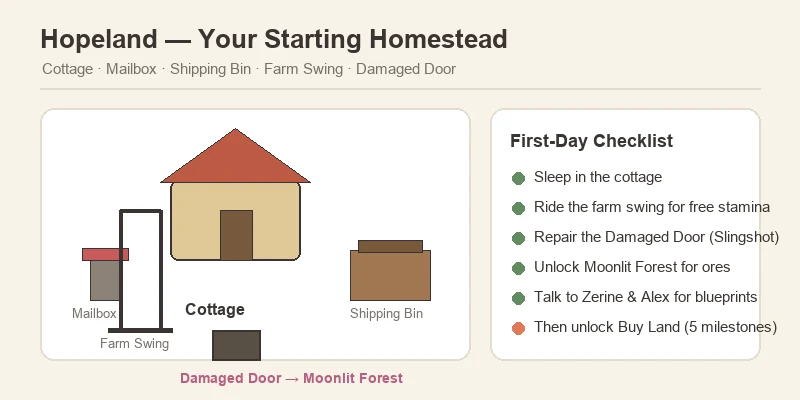
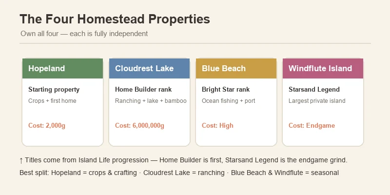
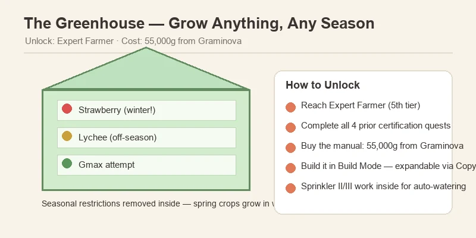
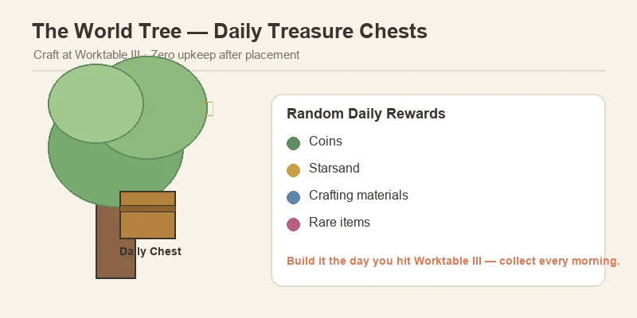

# 🏠 Starsand Island Complete Base Building & Home Design Guide

> Game version: Early Access (Feb 12, 2026 launch) | Focus: Land Expansion, Building, Home Design & Farm Layout

After 90+ hours with Starsand Island (星砂岛), I can tell you the building system is the sleeper hit of the game. The farming, fishing, and mining guides I wrote earlier cover the *income* side — but this is the guide for the *spending* side. There are nearly **1,000 placeable items**, **4 buildable properties**, **8 land expansion plots**, a **Blueprint Library** for sharing designs, and a paint system that lets you restyle every wall, floor, and roof you place. It's genuinely one of the deepest building systems in any farming sim this year.

The catch: almost none of it is handed to you. Land expansion is locked behind a five-step quest chain, the greenhouse costs 55,000 coins, and the best properties sit behind endgame titles. This guide walks the whole progression — from your first night in the starter cottage to the private island endgame — and shows you the layouts that actually work.

*Data sourced from in-game testing, the official Chinese strategy handbook (Bilibili Wiki), and community research. Prices in in-game Coins and Starsand (星砂币). Verified for EA version 0.4.x. Where community sources disagree on numbers, I flag both and note what to check in-game.*

---

## 📋 Table of Contents

1. [Your Starting Base: Hopeland](#your-starting-base-hopeland)
2. [How to Unlock Land Expansion](#how-to-unlock-land-expansion)
3. [Hopeland's 8 Expansion Plots — Costs](#hopelands-8-expansion-plots-costs)
4. [The Four Homestead Properties](#the-four-homestead-properties)
5. [Build Mode — Controls & Camera Views](#build-mode-controls-camera-views)
6. [Building Materials — What You Need & Where](#building-materials-what-you-need-where)
7. [Worktable Tiers & What They Unlock](#worktable-tiers-what-they-unlock)
8. [Farm Structures — Coops, Barns, Greenhouse & More](#farm-structures-coops-barns-greenhouse-more)
9. [The World Tree — Best Passive Income in the Game](#the-world-tree-best-passive-income-in-the-game)
10. [House Layouts & the Blueprint Library](#house-layouts-the-blueprint-library)
11. [Decoration & the Paint System](#decoration-the-paint-system)
12. [Optimal Farm Layouts — Zones That Work](#optimal-farm-layouts-zones-that-work)
13. [Pro Tips & Common Mistakes](#pro-tips-common-mistakes)
14. [FAQ](#faq)

---

## Your Starting Base: Hopeland

Hopeland (启程之地) is your starting farm, sitting in the southwest corner of the map near Starsand Town (星砂镇). You start with a small plot and a tiny cottage, and unlike most farming sims, that cottage is not a fixed pre-rendered house — it is **fully customizable piece by piece**: walls, flooring, roofing, windows, doors, even exterior siding. You can rebuild it from scratch, replace it with a prefab layout, or expand it room by room as you progress.

**Everything that comes with the plot:**

| Feature | What It Does |
|:--------|:-------------|
| **Cottage** | Your home — sleeping saves and restores stamina; fully customizable |
| **Mailbox** | Receives letters, gifts, and task notices from NPCs |
| **Shipping Bin** | Sell items overnight; payment arrives next morning |
| **Farm Swing** | Free stamina recovery — slower than food or medicine, but costs nothing |
| **Damaged Door** | South exit to the **Moonlit Forest (荧月之森)** — repair it early, it is the gate to ore and advanced building materials |

**What to do in your first days:**

1. **Sleep in the cottage** to learn the save/sleep loop and get your bearings.
2. **Use the farm swing** for free stamina recovery instead of spending coins on food in week one.
3. **Repair the Damaged Door as soon as you can.** It is locked behind the Apprentice Explorer quest, but breaking through with a Slingshot opens the Moonlit Forest — and that is where iron, copper, gold, quartz, and every advanced building material live.
4. **Talk to the mentors.** Zerine (百里零) at the General Store and Alex at Lex Woodworks both sell early blueprints and furniture.

> 💡 **Why this matters:** the starter plot is small — roughly enough for a few crop rows and a worktable. Treat Hopeland as a *base to grow out of*, not a permanent home. Your expansion choices in the first month set up everything after.

---

## How to Unlock Land Expansion

Land expansion lives in the **Buy Land app** on your in-game phone, and it does **not** unlock on its own. You have to complete five **Island Life** milestone challenges **in strict order**:

| Step | Challenge | What You Actually Do |
|:----:|:----------|:---------------------|
| 1 | **Long Time No See** | Auto-completed on arrival |
| 2 | **Apprentice Talent** | Reach Apprentice rank in *any* profession |
| 3 | **Decorate Your Home** | Place 6+ furniture items inside your house |
| 4 | **First Pot of Gold** | Accumulate 2,000 Coins **and** meet 10 Islanders |
| 5 | **Junior Talent** | Reach Junior rank **and** complete 5 Bulletin Board requests |

Only after all five does the **Buy Land app** appear on your phone. From there, purchases are permanent and non-refundable — so read the plot map before you click.

> ⚠️ **Two common soft-locks:** (1) Step 4 requires *both* the coins and the 10 Islanders — meeting people via story quests counts, but you must actually unlock their profiles. (2) Step 5's Bulletin Board requests refresh daily and often require profession goods — keep a small stock of ore, fish, and crops ready so you can clear them the day they appear.

---

## Hopeland's 8 Expansion Plots — Costs

Once Buy Land is unlocked, Hopeland itself offers **8 expansion plots** arranged around your starter plot. All plots are the same size, and the price climbs steeply:

| Plot | Coins | Starsand | Value Verdict |
|:----:|:---------:|:--------:|:-----------------------:|
| 1 | 2,000 | 50 | Best value on the map |
| 2 | 15,000 | 75 | Excellent |
| 3 | 30,000 | 90 | Good |
| 4 | 50,000 | 130 | Fair |
| 5 | 75,000 | 160 | Expensive |
| 6 | 100,000 | 200 | Expensive |
| 7 | 130,000 | 250 | Very expensive |
| 8 | 160,000 | 300 | Endgame |

**Total for all eight: 562,000 Coins + 1,255 Starsand.** (A separate community source lists lower mid-tier costs — Plot 2 at 5,000, Plot 4 at 20,000, etc. The figures above come from the dedicated Land Expansion guide and Hopeland wiki page, which are the most consistently updated. Trust the in-game price before you commit.)

**How to buy them:**

1. Open the **Buy Land app** (Tab on PC / Y on controller).
2. Select a plot — the map shows your starter plot in the center and the 8 expansion tiles around it.
3. Confirm the price. **No refunds**, and each plot unlocks the same size footprint regardless of cost.

> 💡 **Buy Plots 1–2 immediately.** At 2,000 + 15,000 coins and 125 Starsand combined, they more than double your buildable area for pocket change — and they unlock long before you'll earn real money. Hold Plots 5–8 until you have **Sprinkler II+ and a stable income loop** (the fishing and crop guides cover both).

---

## The Four Homestead Properties

Beyond Hopeland's 8 plots, the game offers **3 more full properties**, each gated behind an Island Life title. You can own all four simultaneously, and each is independent — crops at Hopeland are unaffected by what you do at the others.

| Property | Unlock Title | Cost | Why You Want It |
|:---------|:-------------|:-----|:----------------|
| **Hopeland (启程之地)** | Starting property | Free | Central base; crops + first home |
| **Cloudrest Lake (栖云湖)** | Home Builder rank | 6,000,000 Coins + 750 Starsand | Lakeside property ideal for **ranching** — has a fishable lake, bamboo groves, beehives, and a panda NPC |
| **Blue Beach (蓝滩)** | Bright Star rank | High (unconfirmed exact) | Coastal property with **ocean fishing** and port access; Beach Festival site |
| **Windflute Island (风笛岛)** | Starsand Legend rank | High (unconfirmed exact) | Largest endgame property on a private offshore island — full terrain editing and the most beehive banyan trees |

**How titles rank up:** titles come from Island Life progression, not a single checklist. **Home Builder** is the first building title you'll realistically hit (tied to expanding Hopeland and placing structures); **Bright Star** and **Starsand Legend** are deep endgame grinds.

> 💡 **Divide the labor across properties.** The community consensus: keep **Hopeland as your crop-and-crafting hub**, move **ranching to Cloudrest Lake** (the pasture is bigger and the lake gives you a second fishing spot), and treat **Blue Beach / Windflute** as seasonal or collection properties once you can afford them. Because each property is independent, you don't have to tear down anything to start fresh somewhere else.

---

## Build Mode — Controls & Camera Views

Press **C** while standing on any owned property to open Build Mode. This is the heart of the system, and it is worth understanding the three camera modes before you place a single wall.

| Mode | View | Best For |
|:-----|:-----|:---------|
| **Free-View** | Top-down/isometric, grid-aligned | Structural placement — walls, foundations, roofs, stairs, fencing |
| **Character Perspective** | First/third-person | Interior furnishing and decoration placement |
| **Local View** | Zoomed close-up | Small spaces — shelves, fishtanks, corner details |

**Core rules of Build Mode:**

- **Structural pieces (walls, floors, roofs) consume raw materials directly on placement** — no pre-crafting required. Have the materials in your inventory or home chest and the game deducts them as you build.
- **Furniture and decorations must be crafted at a Worktable or purchased first**, then placed from the build menu.
- **Buildings support up to 3 stories**, and interiors/exteriors are **seamless — no loading screens** between inside and out.
- **8 paint textures** (wood grain, brick, stone, gloss, matte, metallic, rough cement, ceramics) apply to walls, floors, and ceilings, each with multiple colors. Painting is free once materials are placed — you can restyle your whole house for nothing.
- **Demolishing** returns furniture to storage; structural demolition returns a portion of materials.

**Placement shortcuts worth knowing:**

- **Rotate:** scroll wheel (PC) or bumpers (controller)
- **Grid snap** is on by default; toggle free placement for fine positioning
- **Allow overlap** lets you stack items (great for shelves and counters)
- **Resize** items with the yellow arrow handles or Alt + Scroll
- **Wall items** (paintings, shelves, clocks) snap automatically to walls
- **The copy tool** duplicates placed items — and copies their paint job

> 💡 **Blueprint before you build big.** If you're about to lay out a multi-room house, save a blank blueprint of the plot first so you can experiment without risk. Loading a blueprint *replaces everything on your land*, so never load one over a design you love without backing it up.

---

## Building Materials — What You Need & Where

Almost everything you build pulls from the same core material pool, gathered across the island and processed at crafting stations:

| Material | Where to Get It | Processed Into |
|:---------|:----------------|:---------------|
| **Softwood / Hardwood** | Chopping trees | Planks at the Cutter |
| **Premium Wood** | White Fig trees (needs a Machete) | Premium Wood Planks — required for Worktable II+ |
| **Bamboo** | Bamboo groves | Bamboo Boards |
| **Stone** | Rocks across the island | Stone Bricks at the Furnace |
| **Iron / Copper / Gold Ore** | **Moonlit Forest (荧月之森)** — brownish/orange rocks | Ingots (Furnace) and Sheets (Cutter) |
| **Quartz** | Moonlit Forest caves | Glass Panes (Furnace + Cutter) |
| **Fiber** | Plants across the island | Charcoal (with Softwood) at the Charcoal Kiln |

**The Moonlit Forest is the keystone.** Nearly every advanced material — ore, quartz, and the rarer building components — lives there, and you can only reach it by repairing the Damaged Door (Slingshot, Apprentice Explorer quest). If you find yourself blocked on a build recipe, the missing ingredient is almost always an ore or processed wood from the forest.

> ⚠️ **Don't sell your first ores.** The mining guide covers this, but it bears repeating for builders: copper, iron, and gold ingots plus premium wood planks are consumed in huge quantities by Worktable II and III recipes. Stockpile before you spend.

---

## Worktable Tiers & What They Unlock

The **Worktable** is your crafting station for everything non-structural. It comes in three tiers, and **higher tiers include all lower-tier recipes** — so upgrade your existing Worktable rather than building new ones.

| Tier | Key Recipes | Upgrade Requirements |
|:-----|:------------|:---------------------|
| **Worktable I (Starter)** | Basic tools, furniture, storage; Chicken Coop, Duck Coop, Rabbit Hutch, Trellis, Planting Box, Small/Stone Fish Pond, Storage Boxes, Charcoal Kiln, Furnace I, Cutter I | Built with early materials |
| **Worktable II (Mid-game)** | Beehive, Breeding House, Cattle Barn, Pigsty, Sheep Barn, Stable, Deer Barn, Musk Deer Barn, Medium Fish Pond, Poultry Egg Station, Feeding Trough, Mega Feeder | Iron Sheet, Premium Wood, Alloy, Gold Ingot |
| **Worktable III (Endgame)** | Highest-tier machinery, **World Tree**, advanced decor | Deep endgame materials |

> 💡 **Upgrade the Worktable before spending on land.** The compounding rule of Starsand Island's economy: tools and stations pay back every day, while raw land just sits until you build on it. Buy Plots 1–2 early, but pour your next chunk of coins into Worktable II — it unlocks the barns, beehive, and breeding house that turn animals from a hobby into an income stream.

---

## Farm Structures — Coops, Barns, Greenhouse & More

The **Farm Structures** build category covers every production building, from the first chicken coop to the endgame greenhouse:

### Animal Housing (Worktable I & II)

| Structure | Tier | Materials | Notes |
|:----------|:-----|:----------|:------|
| **Chicken Coop** | Worktable I | Softwood ×5, Flannel ×3, Fiber ×10 | Unlock via **Junior Rancher** quest (raise a Rabbit's Happiness to 150+) |
| **Duck Coop** | Worktable I | Softwood ×5, Flannel ×3, Fiber ×10 | Same unlock path as the Chicken Coop |
| **Rabbit Hutch** | Worktable I | — | Your first animal structure; rabbits also remove weeds |
| **Cattle Barn** | Worktable II | 4 Feathers + materials | Cows need the larger barn |
| **Pigsty** | Worktable II | 4 Feathers + materials | Pigs |
| **Sheep Barn** | Worktable II | Feathers + materials | Sheep |
| **Stable / Deer Barn / Musk Deer Barn** | Worktable II | Feathers + materials | Mounts and deer |
| **Breeding House** | Worktable II | — | For the gene/breeding system (see the Animals guide) |

> **Feathers are the gate:** nearly every Worktable II barn needs 4 Feathers, which only drop from chickens and ducks. Build your Chicken Coop first, let the flock grow, and the barns will follow.

### Production & Farming Structures

| Structure | Unlock | What It Does |
|:----------|:-------|:-------------|
| **Trellis** | Apprentice Farmer quest ("Natural Delicacies") | Vertical trellis for Cucumbers, Grapes, Tomatoes — place on *untilled* ground |
| **Planting Boxes** | Junior Farmer | Portable indoor containers; no tilling; no sprinkler support |
| **Sprinkler I / II / III** | Intermediate / Senior / Expert Farmer | Automatic watering; sits *between* crop tiles, not on them |
| **Paddy Fields** | Farming profession progression | For water crops — Rice, Sugarcane, Water Caltrop |
| **Beehive** | Intermediate Rancher | 13 bee slots, 800 honey capacity; Queen breeding, Royal Jelly, crop pollination bonuses |
| **Greenhouse** | Expert Farmer + 55,000 Coins from Graminova | **Year-round crops regardless of season**; expandable with the Copy feature; Sprinkler II/III work inside |
| **Fish Ponds** | Worktable I (small) / II (medium) | Fish breeding — see the Fishing guide |
| **Fertilizer Boxes I–V** | Farmer progression | Growth-time reductions and yield bonuses |
| **World Tree** | Worktable III | Daily treasure chests — see below |

### 🌱 The Greenhouse Is the Real Prize

The Greenhouse (温室) is the single most valuable farm structure in the game. Unlock requires **Expert Farmer** — the fifth and final Farmer tier — and then **55,000 coins** for the manual from Graminova (顾禾) at the Happiness Seed Shop. Inside, **seasonal restrictions disappear**: spring-only strawberries grow in winter, and off-season fruit trees keep producing. Pair it with the **Starsand Grinder** and you get a self-sustaining seed-replant-sell loop that runs year-round.

**Greenhouse tricks worth knowing:**

- **Expand with the Copy feature** — place copies side-by-side for a wider area instead of building separate greenhouses.
- **Sprinkler II or III work inside**, so you can fully automate watering.
- **Use it to protect Gmax 3x3 attempts** from season changes (see the crop guide) and to keep high-value off-season crops like Lychee producing.

---

## The World Tree — Best Passive Income in the Game

The **World Tree** is a special structure crafted at **Worktable III**. Plant it on your farm and it **generates a daily treasure chest** with random rewards — coins, Starsand, materials, and occasionally rare items.

**Why it is the best passive income source:**

- **Zero input after placement** — no feeding, no watering, no repairs.
- **Daily chests compound** into a meaningful income stream by mid-game.
- It's the community's single most recommended Worktable III build — build it the moment you hit tier III.

> 💡 **Make it a daily habit.** Add "collect the World Tree chest" to the same morning loop as checking the mailbox and your farm animals. The chests stack up fast.

---

## House Layouts & the Blueprint Library

### Preset House Layouts

If free-building is not your thing, **Lex Woodworks** (Alex's shop) sells **preset house layouts** that place an entire furnished home in one step. Known presets include:

- **Countryside Haven** — classic cottage/rural style
- **Retreat** — modern/minimal
- **Classic Courtyard** — courtyard-centered layout
- **Floating Oasis** — a houseboat layout

There are **8 pre-designed templates** total. Two warnings before you buy:

1. **Check the plot space and unlock requirements first.** Some players bought layouts they couldn't place because the plot was too small.
2. **Loading a layout replaces everything on your land.** Save a blueprint of your current build first.

### The Blueprint Library

The **Blueprint Library** lets you save, share, and download community designs — including full furnished houses. Loading a community blueprint still requires all the materials, but it saves you the trial-and-error of designing from scratch.

> 💡 **Use it for inspiration before building.** Browse a few community designs early to learn what layouts work at each plot size — then build your own with the Blueprint Library as a safety net.

---

## Decoration & the Paint System

With roughly **1,000 placeable decorative items**, decoration is half the game's building appeal. Items fall into themed **sets** — a few of the big ones:

| Set | Pieces | Sources |
|:----|:------:|:--------|
| **Sylvan Home** | 50 | Collection Album, Exploration, Lex Woodworks, Requests, Starsand Manual |
| **Wild Horizon** | 50 | Exploration, Lex Woodworks, festivals |
| **Rhythm Charm** | 39 | Lex's Showroom, Lex Woodworks |
| **Millenium Eve** | 30 | Island Life, Gacha, Lex Woodworks, Exploration, Drift Bottle |
| **Cream Wood** | 29 | Lex Woodworks, progression |
| **Fun Party** | 29 | Festivals, Gacha |
| **Cozy Bits** | 19 | Various |

**Furniture blueprint sources:** Lex Woodworks rotating stock (befriending Alex unlocks more), quest rewards, Glowing Shell exchanges, Island Life progression, treasure chests, drift bottles, festivals, and the **Gacha Machine at the Chrono Arcade**.

**The paint system** is free after materials are placed — 8 textures with multiple colors each, applied to walls, floors, and ceilings. Use it to zone rooms before you place furniture: paint the kitchen floor one color, the bedroom another, and the layout reads at a glance.

**Three decoration achievements to chase:**

- **Not Empty Walls** — craft 10 furniture pieces
- **Not a Shabby Room** — place 50 unique furniture items
- **Renovated Home** — unlock 100 unique furniture pieces (hit all seven sources; the Gacha Machine is a big help)

---

## Optimal Farm Layouts — Zones That Work

Layout is where builders win or lose in Starsand Island. Here's the community-verified zone system that scales from the starter plot to a full expansion:

### The Zone Map

| Zone | What Goes There | Placement |
|:-----|:----------------|:----------|
| **Staple Income** | Wheat, Corn, Potato, Tomato | Large sprinkler fields, grouped by growth time |
| **Cooking Ingredients** | Garlic, Leek, Pepper, Cabbage, Pumpkin | Near the kitchen/processing area |
| **Trellis Crops** | Cucumber, Grapes (Red/Green) | Dedicated trellis rows on untilled ground |
| **Fruit Trees** | Apple, Lychee, Orange, Star Mango, Coconut | Along farm edges; long-term investment |
| **Flowers** | Orchid, Rose, Tulip, Moonrise | Cross-breeding zone |
| **Gmax Grid** | Watermelon, Pumpkin | Reserved flat 3×3 for mutation attempts |
| **Processing Hub** | Separator, Charcoal Kiln, Furnace, Cutter, 2–3 campfires/stoves | Central, clustered, next to storage |
| **Animal Zone** | Coops, barns, beehives, breeding house | One corner, away from crops |

### Golden Rules

1. **Group crops by growth time and season** so they mature together and you harvest in one pass.
2. **Cluster processing stations centrally** — Separator, Charcoal Kiln, Furnace, and Cutter near each other to minimize running.
3. **Keep 1-tile walking paths** between crop sections to avoid trampling and accidental harvesting.
4. **Reserve space for sprinklers and trellises early.** A sprinkler sits between crop tiles and waters surrounding plots — leave room for the coverage circles.
5. **Place trellises on untilled ground.** Tilling first can bug out tiles so they can't be replanted.
6. **Put the Greenhouse near the Starsand Grinder** for the seed-replant-sell loop.

> 💡 **A proven early layout (starter plot + Plot 1):** processing stations + storage in the center, staple crops east, mixed vegetables west, one row of cucumber trellises on the south edge, a reserved 3×3 corner for Gmax attempts, and a single 1-tile north-south path down the middle.

---

## Pro Tips & Common Mistakes

### ✅ Do This

- **Buy Plots 1–2 immediately.** 2,000 + 15,000 coins more than doubles your buildable space for pocket change.
- **Upgrade the Worktable before buying expensive land.** Tools and stations pay daily returns; raw land just sits.
- **Repair the Damaged Door early.** The Moonlit Forest is where every advanced building material comes from.
- **Build the Chicken Coop before the barns.** Feathers gate nearly every Worktable II barn.
- **Place the World Tree the day you hit Worktable III.** It's the best passive income in the game.
- **Save blueprints before loading community designs.** Loading a layout replaces everything on your land.
- **Use the paint system to zone rooms.** It's free and makes layouts instantly readable.
- **Open Buy Land with the phone app and read plot costs twice.** No refunds.

### ❌ Don't Do This

- **Buy all 8 plots early.** The back-half plots cost 100k+ coins each and do nothing until you build on them.
- **Sell your first ores.** Copper, iron, gold ingots, and premium wood are consumed by the hundreds in Worktable II/III recipes.
- **Place trellises on tilled soil.** It can permanently bug the tile.
- **Load a community blueprint over a design you love.** It replaces everything — save your build first.
- **Buy a preset layout without checking plot size.** Some layouts won't fit your current plot.
- **Ignore the farm swing.** Free stamina recovery in week one saves real money.

---

## FAQ

### How do I unlock land expansion?
Complete the five Island Life challenges in order — Long Time No See, Apprentice Talent, Decorate Your Home (6 furniture), First Pot of Gold (2,000 Coins + 10 Islanders), and Junior Talent (Junior rank + 5 Bulletin Board requests). Then the Buy Land app appears on your phone.

### How much does all of Hopeland cost?
All 8 expansion plots total **562,000 Coins + 1,255 Starsand**. Some community sources list lower mid-tier costs, so verify the in-game price before buying.

### Can I own more than one property?
Yes — all four homesteads (Hopeland, Cloudrest Lake, Blue Beach, Windflute Island) can be owned simultaneously, and each is fully independent.

### How do I build in Build Mode?
Press **C** on owned property. Use Free-View for structures, Character Perspective for furniture, and Local View for fine details. Structures consume raw materials on placement; furniture must be crafted or purchased first.

### What's the best farm structure in the game?
The **Greenhouse** (55,000 Coins, Expert Farmer) for year-round crops, and the **World Tree** (Worktable III) for daily passive income. Build both as soon as you can.

### Can I share my builds?
Yes — the **Blueprint Library** lets you save, share, and download community designs. Materials are still required to place them.

### Is there a way to restyle my house for free?
Yes — the **paint system** (8 textures, multiple colors each) is free once materials are placed. Repaint walls, floors, and ceilings any time.

### Do interiors have loading screens?
No. Interiors and exteriors are seamless — you can build up to 3 stories with no loading screens between inside and out.

---

*Guide updated for Starsand Island EA 0.4.x (August 2026). The full 1.0 release is expected August 18, 2026 with 4-player co-op and save carryover — building and land systems may expand. Prices and unlock requirements may change with future patches.*
