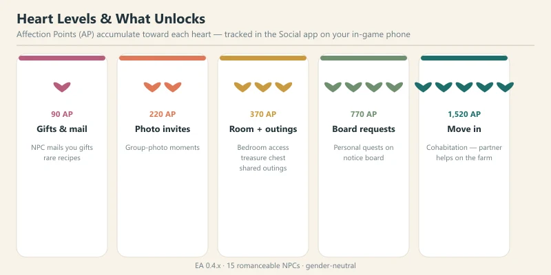
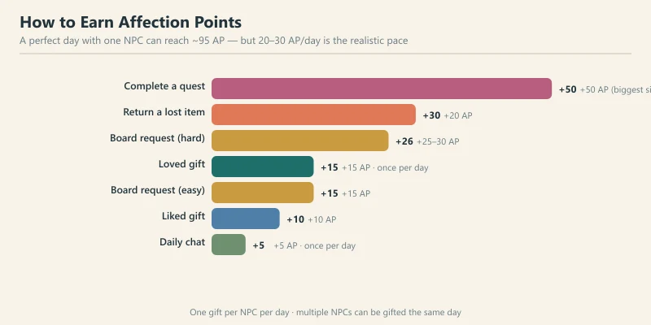
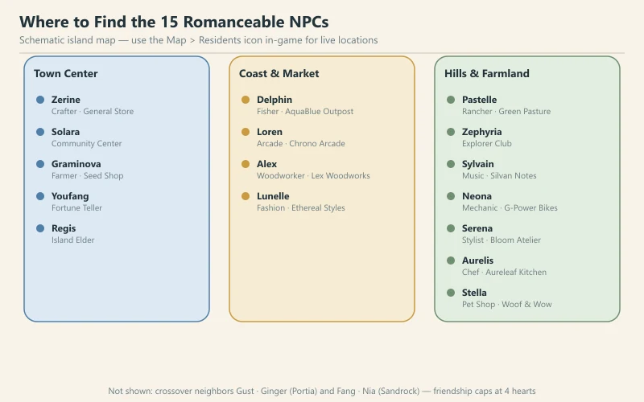
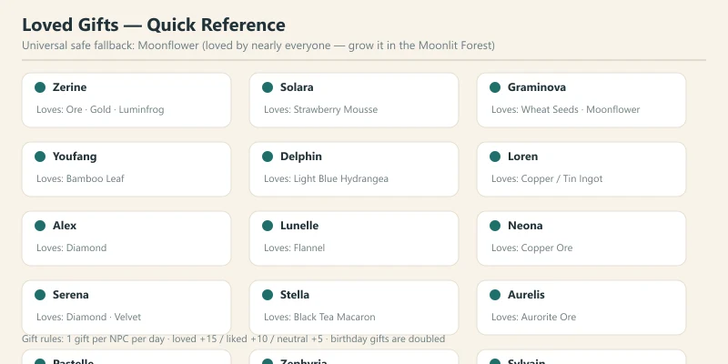
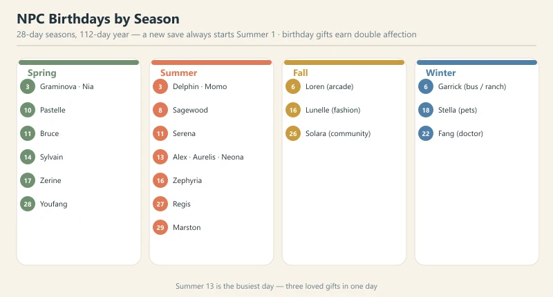
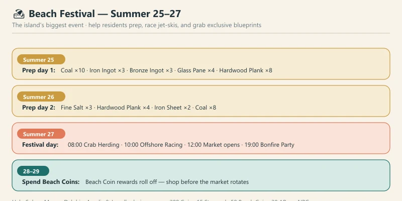
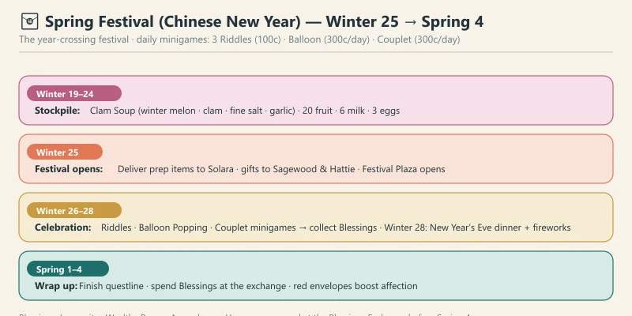
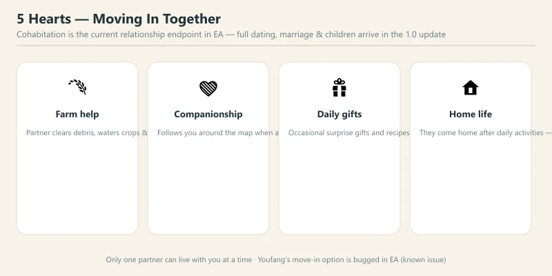

# 🏝️ Starsand Island Community & Romance Guide

> Game version: Early Access (Feb 12, 2026 launch) | Focus: NPC Relationships, Gifts & Festivals

A farming sim's heart is its people, and Starsand Island (星砂岛) has one of the friendliest casts in the genre. There are **15 romanceable NPCs** — 8 bachelorettes and 7 bachelors — and romance is **fully gender-neutral**: anyone can court anyone, regardless of how you shape your avatar. Raise affection to 5 hearts and your chosen partner will move into your farm and help you run it.

There's a catch worth knowing up front: the full dating content — dates beyond shared outings, marriage, and children — is **not in Early Access yet**. What you *can* do today is push a relationship all the way to 5 hearts and start living together. Everything else is on the roadmap for the Summer 2026 full release (which also brings 4-player co-op).

This guide covers the entire community layer: how affection works, every NPC's loved gifts, birthdays, the two big festivals, outings, and the move-in system.

*Data sourced from in-game testing, the official Chinese strategy handbook (Bilibili Wiki), and community research. Prices in in-game gold (g). Verified for EA version 0.4.x.*

---

## 📋 Table of Contents

1. [How Relationships Work](#how-relationships-work)
2. [Heart Levels & Unlocks](#heart-levels-unlocks)
3. [How to Earn Affection Points](#how-to-earn-affection-points)
4. [The 15 Romanceable NPCs & Their Loved Gifts](#the-15-romanceable-npcs-their-loved-gifts)
5. [The Best Gifts — Universal Strategy](#the-best-gifts-universal-strategy)
6. [NPC Birthdays Calendar](#npc-birthdays-calendar)
7. [Festivals & Seasonal Events](#festivals-seasonal-events)
8. [Shared Outings & Dates (3 Hearts)](#shared-outings-dates-3-hearts)
9. [Moving In Together (5 Hearts)](#moving-in-together-5-hearts)
10. [Why the Mentors Are Easiest to Romance](#why-the-mentors-are-easiest-to-romance)
11. [Pro Tips & Common Mistakes](#pro-tips-common-mistakes)
12. [FAQ](#faq)

---

## How Relationships Work

Every NPC carries a **5-heart affection meter**, tracked in the **Social app** on your in-game phone. The phone also shows each NPC's live location, their discovered gift preferences, and your pending requests — make a habit of opening it every morning.

A few ground rules:

- **One gift per NPC per day.** You can gift as many different NPCs as you like, but each individual NPC only takes one gift a day.
- **Talk before you gift.** Chatting first gives you a small affection bonus on top of the gift.
- **Affection is a two-way street.** As your bond deepens, NPCs start sending you gifts, mail, and occasionally recipes — not just you doing all the running.
- **You can romance everyone at once.** There's no jealousy system in EA, so feel free to spread the love while you decide who to settle down with.

---

## Heart Levels & Unlocks

Affection Points (AP) accumulate toward each heart. The community-verified thresholds and what they unlock:

| Heart | Cumulative AP | What Unlocks |
|:-----:|:-------------:|:-------------|
| ❤️ 1 | 90 AP | NPC starts mailing you gifts — occasionally rare recipes |
| ❤️❤️ 2 | 220 AP | Group-photo invitations |
| ❤️❤️❤️ 3 | 370 AP | **Bedroom access** (hidden treasure chest inside), **shared outings** unlock |
| ❤️❤️❤️❤️ 4 | 770 AP | NPC posts **personal requests** on the bulletin board; personal story quests |
| ❤️❤️❤️❤️❤️ 5 | ~1,520 AP | **Move-in / cohabitation** option |

> **Note on the 4–5 heart thresholds:** community sources disagree — the relationship-system article lists 500 and 750 AP while the dedicated romance guide lists 770 and ~1,520. The developer hasn't officially confirmed the exact values, so treat these as ballpark targets. The unlock *types* at each heart are consistent across sources.

The chest inside an NPC's bedroom (3 hearts) is the real prize — it holds **exclusive decor** and refreshes weekly, so check it every Sunday alongside your other chores.

---

## How to Earn Affection Points

Every positive interaction feeds the same pool. Here's everything that awards AP:

| Activity | AP | Notes |
|:---------|:--:|:------|
| Daily chat | +5 | Once per day per NPC — talk to everyone, it's free |
| Neutral gift | +5 | Wastes the daily gift slot; avoid if you can |
| Liked gift | +10 | Solid, repeatable daily income |
| **Loved gift** | **+15** | The best daily lever — plan your gifts around these |
| Bulletin board request (easy) | +15 | Refresh daily |
| Bulletin board request (hard) | +25–30 | Worth prioritizing |
| Return a lost item | +20 | Pick up lost items you find around the island |
| Complete a quest (story / profession) | +50 | The single biggest boost in the game |

A **perfect day** with one NPC — loved gift + chat + their board request + a quest — can hit roughly **95 AP** in one go. Realistically, most players settle into a 20–30 AP/day rhythm per NPC, which puts a 5-heart romance at roughly **6–9 weeks of daily play**. That sounds long, but the mentor characters (see [§10](#why-the-mentors-are-easiest-to-romance)) get there in half the time.

---

## The 15 Romanceable NPCs & Their Loved Gifts

Each character has a **loved gift** worth +15 AP and a set of liked gifts worth +10. Two characters can share a loved gift, and a few gifts are loved by multiple people — which is exactly what you want to optimize around.

### Bachelorettes (8)

| NPC | Role / Location | Loved Gift | Notes |
|:----|:----------------|:-----------|:------|
| **Alex** | Woodworker · Lex Woodworks | Diamond | Late-game gift; hold on to your first diamonds |
| **Lunelle** | Fashion designer · Ethereal Styles | Flannel | Easy to source from cloth crafting |
| **Neona** | Mechanic · G-Power Bikes | Copper (also Tin / Copper Ore) | Copper is everywhere in the Moonlit Forest |
| **Pastelle (丁小葵)** | Rancher mentor · Green Pasture Ranch | Rabbit Feed | If you raise rabbits, you already have a supply |
| **Serena** | Stylist · Bloom Atelier | Diamond (also Velvet, Starflare Core) | Shares Diamond with Alex |
| **Solara (初夏)** | Community assistant · Community Center | Strawberry Mousse | Cooked dish — make it at a kitchen |
| **Stella** | Pet shop owner · Woof & Wow Pets | Black Tea Macaron | Cooked dish |
| **Zerine (百里零)** | Crafter mentor · General Store | Stone, Quartz, Gold Ore, Luminfrog Fragment | Extremely easy — she loves basic ore |

### Bachelors (7)

| NPC | Role / Location | Loved Gift | Notes |
|:----|:----------------|:-----------|:------|
| **Aurelis** | Chef · Aureleaf Kitchen | Aurorite Ore | Endgame ore — plan ahead |
| **Delphin (德尔芬)** | Fishing mentor · AquaBlue Outpost | Light Blue Hydrangea | A flower you can grow or forage |
| **Graminova (顾禾)** | Farming mentor · Happiness Seed Shop | Wheat Seeds (also Cucumber, Moonflower) | Seeds are trivially cheap |
| **Loren** | Arcade owner · Chrono Arcade | Copper Ingot / Tin Ingot | The one character who dislikes flowers — give him metal |
| **Sylvain** | Music shop owner · Silvan Notes | Blue Hydrangea | Grow hydrangeas in bulk |
| **Youfang (道士)** | Fortune teller · Barston Heights | Bamboo Leaf | Foraged near Barston Heights |
| **Zephyria (岚)** | Explorer mentor · Exploration Club | Moonflower (also Moondew Shroom, Mirthshroom) | Moonflower is her favorite *and* the universal gift |

> **Crossover characters:** Gust and Ginger (*My Time at Portia*) plus Fang and Nia (*My Time at Sandrock*) appear as special neighbors. They're **not romanceable** — their friendship caps at 4 hearts, so don't waste your loved gifts on them past that point.

---

## The Best Gifts — Universal Strategy

The single best gift in the game is **Moonflower (荧月花)**. It's loved or liked by nearly every NPC, and you can grow it in the Moonlit Forest (荧月之森). The only exception is **Loren**, who prefers metals and coffee over flowers — give him Copper or Tin Ingots instead.

Other broadly safe gifts:

- **Chilled Twilight Salad** (冰暮沙拉) — liked by almost everyone
- **Coconut** and **Dragon Fruit** — liked by most
- **Plain Noodles** — a cheap cooked fallback
- **Pasture Grass** — easy to collect in bulk
- **Celeste Berry (星莓)** — liked by most

**Golden rules for gifting:**

1. **Frequency beats rarity.** A liked gift every single day beats a loved gift once a week. Daily +10s compound into hearts far faster than occasional +15s.
2. **Cook when you can.** Cooked dishes almost always score higher than their raw ingredients.
3. **Track preferences in the Social app.** Discovered tastes stay recorded, so you never have to guess twice.
4. **Always deliver a loved gift on birthdays.** Birthday gifts earn **double affection** — a loved gift on a birthday is worth +30 AP.
5. **Return lost items immediately.** +20 AP for something you'd otherwise ignore.

---

## NPC Birthdays Calendar

A year is **112 days** — four 28-day seasons — and a new save always starts on **Summer 1**. Missing a birthday costs you a free double-affection day, so mark these down. (Dates are community-verified and may shift between EA patches.)

| Season | Birthday | NPC |
|:-------|:---------|:----|
| **Spring** | 3 | Graminova (顾禾) · Nia |
| | 10 | Pastelle (丁小葵) |
| | 11 | Bruce (Garrick's son) |
| | 14 | Sylvain |
| | 17 | Zerine (百里零) |
| | 28 | Youfang (道士) |
| **Summer** | 3 | Delphin (德尔芬) · Momo |
| | 8 | Sagewood (Graminova's father) |
| | 11 | Serena |
| | **13** | **Alex · Aurelis · Neona** ⚠️ |
| | 16 | Zephyria (岚) |
| | 27 | Regis (island elder) — same day as the Beach Festival |
| | 29 | Marston (coast guard) |
| **Fall** | 6 | Loren |
| | 16 | Lunelle |
| | 26 | Solara (初夏) |
| **Winter** | 6 | Garrick (bus driver / rancher) |
| | 18 | Stella |
| | 22 | Fang (crossover doctor) |

> **⚠️ Summer 13 is the busiest day of the year** — Alex, Aurelis, and Neona all share a birthday. Stock three loved gifts in advance, because the triple birthday falls right in the middle of the Beach Festival's prep week.

---

## Festivals & Seasonal Events

Starsand Island currently has **two big festivals** — the **Beach Festival** in summer and the **Spring Festival** (Chinese New Year) that bridges winter into spring. Both are shown on the in-game phone calendar.

### 🏖️ Beach Festival — Summer 25–27

The island's largest event, and — since a new save starts on Summer 1 — likely the first festival you'll experience.

- **Summer 25–26 (prep phase):** Help Solara (初夏), Momo, Delphin, Aurelis, and Lunelle gather materials. Each completed prep quest pays **200 Coin, 15 Starsand, 50 Beach Coin, and +20 AP per NPC** — free relationship progress while you're at it.
  - **Summer 25 materials:** Coal ×10+, Iron Ingot ×3+, Bronze Ingot ×3+, Glass Pane ×4+, Hardwood Plank ×8+
  - **Summer 26 materials:** Fine Salt ×3, Hardwood Plank ×4, Iron Sheet ×2, Coal ×8
- **Summer 27 (festival day):**
  - **08:00 — Crab Herding:** Drive crabs into glowing squares, +15 Beach Coins per round (repeatable)
  - **10:00 — Offshore Racing:** Jet-ski checkpoint racing. Medals scale with time (e.g. gold under 1:30, silver under 1:40, bronze under 1:50). Best rewards-per-minute activity — prioritize it
  - **12:00 — Market opens:** Ye Xinglan sells food and recipes; Yu Hua sells clothes, hair, and blueprints; Luo Taotao sells photo frames and blueprints
  - **19:00 — Bonfire Party:** Performance (with a rhythm-game segment). After it starts, market stalls close for good
- **Summer 28–29:** Beach Coins **do not expire**, but the market rotates — spend your remaining coins at Lex Woodworks and the beach market before the inventory changes.

**Pro tip:** the Beach Festival rewards **treasure maps** with very wide search areas. Don't feel pressured to dig them during the festival — they stay usable afterward, so save them and dig them all together when you have free time.

### 🧧 Spring Festival (Chinese New Year) — Winter 25 → Spring 4

The year-crossing festival, running from **Winter 25 at 6:00 AM through Spring 4 at 2:00 AM**. It's a longer, richer event than the Beach Festival, built around collectible **Blessings** (Longevity, Wealth, Peace, Ascendance, Harmony) that you trade at the Blessings Exchange.

- **Winter 19–24 (stockpile):** Prep ingredients early — clam soup ingredients (Winter Melon, Clam, Fine Salt, Garlic), **20 fruit** for a Fruit Basket, **6 Milk, 3 Eggs**. Save Coins for the daily minigames.
- **Winter 25 (festival opens):** Deliver prep items to Solara, gifts to Sagewood and Hattie, and the Festival Plaza opens.
- **Winter 26–28 (celebration):** Daily minigames — **3 Riddle attempts (100g each), Balloon Popping (300g/day), and Couplets (300g/day)**. Winter 28 evening hosts the **New Year's Eve communal dinner** and a midnight fireworks countdown.
- **Spring 1–4 (wrap-up):** Finish the festival questline and spend remaining Blessings at the Exchange.

**Key mechanics:**

- **Riddles are the most efficient Blessing source** — never skip your three daily attempts.
- **Red envelope exchanges with NPCs** are a strong affection booster *on top of* regular gifting, so use them on the characters you're courting.

---

## Shared Outings & Dates (3 Hearts)

At **3 hearts**, you unlock shared outings — the closest thing to dating currently in the game:

- **Hot springs** (Maple Reed area) — needs a Hot Spring Ticket (100g)
- **Bike rides** around the island
- **Backyard swing** at your farm
- **Drinks** at social spots around town
- **Watching TV together**
- **Sleepovers**

Outings are the main way to "do something" with a partner in EA, and they're a nice recurring source of flavor and small AP gains. Use them as a reason to spend time with your target character while you grind toward 5 hearts.

---

## Moving In Together (5 Hearts)

Hit 5 hearts and you can invite your chosen partner to **move in** — the current relationship endpoint (the equivalent of marriage in this build). It's a genuinely good deal:

- **Daily farm help:** your partner clears debris, waters crops, and tends animals
- **Companionship:** they follow you around the map when asked
- **Surprise gifts:** they occasionally give you gifts and recipes
- **Home life:** they come home after their daily activities

**Two things to know:**

- **Only one partner can live with you at a time.** Cohabitation is exclusive.
- **Youfang (道士) has a known EA bug:** his 5-heart move-in option doesn't trigger. It's believed to be a bug rather than a design choice, but if you're courting him specifically, be aware it may not fire until a patch.

---

## Why the Mentors Are Easiest to Romance

The five **profession mentors** — Zerine (crafting), Delphin (fishing), Pastelle (ranching), Graminova (farming), and Zephyria (exploration) — are the fastest characters to romance by a wide margin, for three reasons:

1. **Their profession quests award +50 AP** as a natural part of levelling up. You're going to do these quests anyway to progress your skills.
2. **Two of them love trivially cheap gifts.** Zerine loves basic ore; Graminova loves wheat seeds.
3. **They're always findable.** Mentors stick to their shops and guilds on predictable schedules.

If your goal is a quick 5-heart cohabitation, pick a mentor who matches the profession you're already grinding. If your goal is a *character* (say, the arcade owner Loren), accept that it'll take a few extra weeks and lean hard on his bulletin-board requests.

---

## Pro Tips & Common Mistakes

### ✅ Do This

- **Talk to everyone every day.** Chatting is free — +5 AP × 15 NPCs = +75 free AP per day across the whole cast.
- **Focus on 2–3 NPCs at a time.** Spreading gifts across all 15 slows every single relationship dramatically.
- **Plan around loved gifts.** +15 vs +10 per day compounds into weeks of saved time.
- **Do your target's board requests.** +15–30 AP with no material cost.
- **Return lost items on sight.** Free +20 AP.
- **Use the phone calendar.** Check festival dates and birthdays at the start of every season.

### ❌ Don't Do This

- **Gift neutral items every day.** You waste the daily slot and starve a relationship that could be growing at +15/day.
- **Ignore prep days before festivals.** Festival prep quests are secretly relationship quests — +20 AP per NPC.
- **Chase the diamond lovers early.** Alex and Serena both love Diamond, but you won't have spares in year one; grow Moonflowers instead.
- **Give Loren flowers.** He's the one character who hates them — hand him Copper or Tin Ingots.
- **Waste gifts on crossover characters past 4 hearts.** Gust, Ginger, Fang, and Nia cap at 4 hearts and can't move in.

---

## FAQ

### How many NPCs can I romance?
All 15 characters — 8 bachelorettes and 7 bachelors — are romanceable by any avatar, regardless of gender.

### How long does a 5-heart romance take?
At 20–30 AP/day, roughly 6–9 weeks of daily play for most characters. Mentor characters are significantly faster thanks to their +50 AP profession quests.

### Can I marry or have kids in EA?
Not yet. Cohabitation (move-in at 5 hearts) is the current endpoint; dating expansion, marriage, and children are planned for the Summer 2026 full release.

### Can I date multiple people at once?
Yes — there's no jealousy system in the current build. Only the final move-in is exclusive (one partner at a time).

### What's the best universal gift?
**Moonflower** — loved or liked by almost everyone, and growable in the Moonlit Forest. The lone exception is Loren, who prefers ingots.

### Do NPCs react to disliked gifts?
In EA, a disliked gift just wastes the daily slot (no penalty), but the NPC will comment on it. Some community guides list −5; trust the in-game result.

### Will the cast grow at full release?
Very likely — the 1.0 update is expected to expand the festival and relationship systems alongside 4-player co-op. Watch the official patch notes.

---

*Guide updated for Starsand Island EA 0.4.x (August 2026). The game is in active Early Access — NPC data and festival details may change with future patches.*
