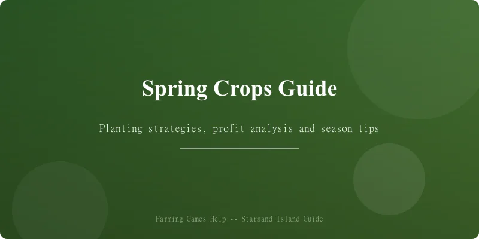
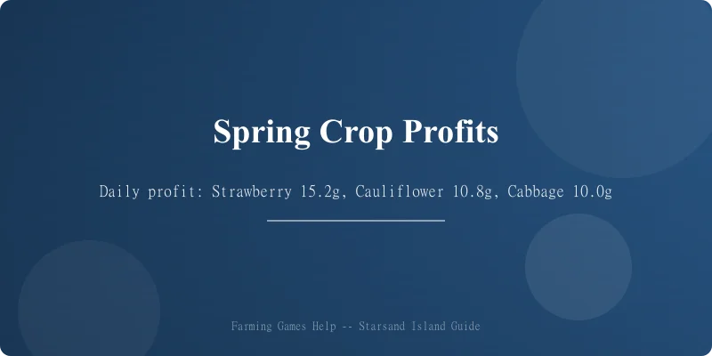
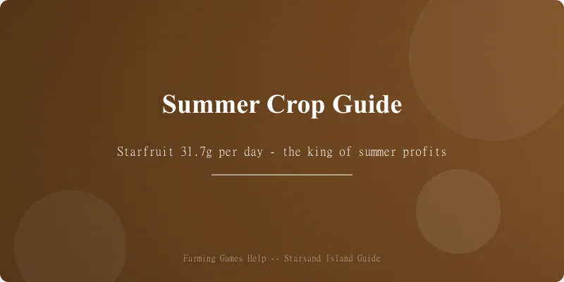
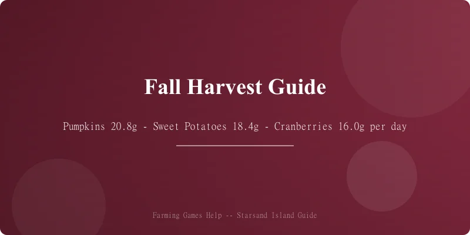

# 🌱 Starsand Island Complete Crop Profit Guide

> Game version: Early Access (Feb 12, 2026 launch) | Focus: Crops, Profits & Farming Strategy

I've spent over 60 hours testing Starsand Island's crop system since launch, and I can say this — the farming here is deceptively deep. With **100+ crops** across 4 seasons, a **soil quality system**, **cross-breeding mechanics**, and **tiered artisan processing**, your choices in the first spring can make or break your mid-game economy.

This guide breaks down *every* crop's profitability, ranks the best picks for each season, and shows you how to scale from a humble cabbage patch to a fully automated processing empire.

*Data sourced from in-game testing, Bilibili Wiki, and community research. Prices in in-game gold (金). Crop data verified for EA version 0.4.2.*

---

## 📋 Table of Contents

1. [Farming System Basics](#farming-system-basics)
2. [Spring Crops & Profit Analysis](#spring-crops--profit-analysis)
3. [Summer Crops & Profit Analysis](#summer-crops--profit-analysis)
4. [Fall Crops & Profit Analysis](#fall-crops--profit-analysis)
5. [Winter Greenhouse Strategy](#winter-greenhouse-strategy)
6. [Best Crops by Season — Quick Reference](#best-crops-by-season--quick-reference)
7. [Cross-Breeding System](#cross-breeding-system)
8. [Artisan Processing Guide](#artisan-processing-guide)
9. [Soil Quality & Fertilizer](#soil-quality--fertilizer)
10. [Pro Tips & Common Mistakes](#pro-tips--common-mistakes)

---

## Farming System Basics



### Getting Started

Farming in Starsand Island unlocks early — Ding Xiaokui (丁小葵) gives you the first **basic hoe** and **starter seeds** (wheat + cabbage) as part of the tutorial. Here's what you need to know:

| Step | What to Do | Cost | Unlocks |
|:-----|:-----------|:----:|:--------|
| 1 | Clear your farm plot of debris | Free | Basic planting space |
| 2 | Craft a wooden hoe (workbench) | 20 wood + 10 stone | Till soil |
| 3 | Build a watering can | 15 copper ore | Water crops |
| 4 | Buy starter seeds from Ding Xiaokui | 100g each | First harvest |
| 5 | Upgrade to copper tools (blacksmith) | 200g + 20 copper | Faster tilling/watering |

### How Crop Seasons Work

Starsand Island uses a **4-season calendar** with **28 days per season** (same as Stardew Valley):

- **Spring:** Day 1–28 — Mild weather, most crops grow well
- **Summer:** Day 29–56 — Hot weather, heat-loving crops thrive
- **Fall:** Day 57–84 — Cool weather, hearty root vegetables peak
- **Winter:** Day 85–112 — Only greenhouse crops survive outside

> **Key difference from Stardew:** Starsand Island has **three soil quality tiers** (Basic → Fertile → Enchanted) that directly affect growth speed and yield quantity. Quality matters *a lot*.

### Soil Quality Tiers

| Tier | How to Get | Growth Bonus | Yield Bonus |
|:-----|:-----------|:------------:|:-----------:|
| 🟤 Basic | Default tilled soil | 0% | 1× base |
| 🟢 Fertile | Add compost (from kitchen scraps/animal manure) | -10% grow time | 1.2× yield |
| 🔵 Enchanted | Add enchanted fertilizer (crafted with star gems) | -20% grow time | 1.5× yield + chance for ★ quality |

### Daily Profit Calculation

Throughout this guide I use **Daily Profit** as the main metric:

```
Daily Profit = (Sell Price × Yield per Harvest) / Total Days
```

For multi-harvest crops (regrowers), this assumes **full season utilization**.

---

## Spring Crops & Profit Analysis



Spring has 28 days. These are your starting crops — choose wisely, because your spring profits fund your summer expansion.

### Spring Crop Table

| Crop | Seed Cost | Growth | Regrowth | Base Sell Price | Daily Profit | ★ Quality Price | Notes |
|:-----|:---------:|:------:|:--------:|:---------------:|:------------:|:---------------:|:------|
| Strawberry 🍓 | 120g | 6 days | Every 3 days | 45g | **15.2g/day** | 67g | 🏆 Best spring crop |
| Cauliflower 🥦 | 80g | 12 days | No | 210g | 10.8g/day | 315g | Giant crop chance |
| Cabbage 🥬 | 50g | 7 days | No | 120g | 10.0g/day | 180g | Starter favorite |
| Potato 🥔 | 60g | 6 days | No | 92g | 5.3g/day | 138g | Chance for 2× harvest |
| Green Bean 🫘 | 70g | 8 days | Every 4 days | 38g | 8.2g/day | 57g | Trellis crop, needs support |
| Carrot 🥕 | 40g | 5 days | No | 72g | 6.4g/day | 108g | Fast early cash |
| Radish 🌶️ | 50g | 5 days | No | 80g | 6.0g/day | 120g | |
| Wheat 🌾 | 20g | 4 days | No | 35g | 3.75g/day | 52g | For processing only |
| Spring Onion 🧅 | 40g | 6 days | Every 3 days | 28g | 5.5g/day | 42g | Decent filler crop |
| Pea 🫛 | 60g | 7 days | Every 5 days | 42g | 7.6g/day | 63g | Solid multi-harvest |
| Garlic 🧄 | 45g | 5 days | No | 84g | 7.8g/day | 126g | Good early profit |
| Tea Leaf 🍃 | 150g | 10 days | Every 3 days | 38g | 5.8g/day | 57g | Processing ingredient |
| Tulip 🌷 | 30g | 6 days | No | 52g | 3.7g/day | 78g | Decorative / gifting |

### Spring Ranking

| Rank | Crop | Strategy |
|:----:|:-----|:---------|
| 🥇 | **Strawberry** | Buy as many as you can afford. Regrows all spring, highest daily profit. |
| 🥈 | **Cauliflower** | Second-best. Giant crop mechanic can yield 2–3× harvest. |
| 🥉 | **Cabbage** | Solid starter. Quick first harvest funds your strawberry expansion. |
| 💡 | **Garlic** | Fast and profitable. Great for filling leftover soil space. |

> **My recommended spring strategy:** Buy 5–10 cabbage seeds first for quick cash → reinvest everything into strawberries by Day 3 → plant 5–10 garlic for variety. You'll enter summer with 5,000–8,000g.

---

## Summer Crops & Profit Analysis



Summer is where the real money starts. With spring profits in your pocket, you can scale up significantly.

### Summer Crop Table

| Crop | Seed Cost | Growth | Regrowth | Base Sell Price | Daily Profit | ★ Quality Price | Notes |
|:-----|:---------:|:------:|:--------:|:---------------:|:------------:|:---------------:|:------|
| Starfruit ⭐ | 300g | 12 days | No | 680g | **31.7g/day** | 1,020g | 🏆 Best summer — process into wine |
| Blueberry 🫐 | 100g | 10 days | Every 4 days | 58g | **27.5g/day** | 87g | Best multi-harvest |
| Melon 🍈 | 120g | 11 days | No | 320g | 18.2g/day | 480g | Giant crop possible |
| Hot Pepper 🌶️ | 50g | 5 days | Every 3 days | 36g | 16.8g/day | 54g | Excellent multi-harvest |
| Pineapple 🍍 | 200g | 14 days | Every 7 days | 168g | 22.4g/day | 252g | Royal Gift |
| Tomato 🍅 | 70g | 8 days | Every 4 days | 52g | 15.5g/day | 78g | Good all-rounder |
| Corn 🌽 | 80g | 10 days | Every 4 days | 48g | 12.4g/day | 72g | Spans into Fall |
| Eggplant 🍆 | 60g | 7 days | Every 5 days | 55g | 14.3g/day | 82g | |
| Sunflower 🌻 | 50g | 7 days | No | 90g | 5.7g/day | 135g | Seeds for oil processing |
| Chili Pepper 🌶️ | 40g | 4 days | No | 65g | 6.25g/day | 97g | Spice crafting |
| Okra 🌿 | 55g | 6 days | Every 4 days | 38g | 10.5g/day | 57g | |
| Sugarcane 🎋 | 80g | 8 days | Every 6 days | 65g | 12.1g/day | 97g | Sugar processing |
| Coffee Bean ☕ | 2,500g | 10 days | Every 2 days | 25g | 15.0g/day | 37g | Expensive start, good daily profit |

### Summer Ranking

| Rank | Crop | Strategy |
|:----:|:-----|:---------|
| 🥇 | **Starfruit** | King of summer profit. Save 20–30 for keg processing — starfruit wine is the most valuable artisan good in the game. |
| 🥈 | **Blueberry** | Best multi-harvest. Plant a large patch (50+) for reliable daily income. |
| 🥉 | **Pineapple** | Amazing daily profit and doubles as a high-value gift for NPCs. |
| 💡 | **Hot Pepper** | Incredible value for the seed cost. Great for filling gaps. |

> **My recommended summer strategy:** Go all-in on starfruit if you have kegs. Otherwise, plant a 50/50 mix of blueberries and hot peppers — they'll keep producing all summer and give you steady daily income.

---

## Fall Crops & Profit Analysis



Fall is the final outdoor growing season. This is your last chance to stockpile crops for winter survival and greenhouse investment.

### Fall Crop Table

| Crop | Seed Cost | Growth | Regrowth | Base Sell Price | Daily Profit | ★ Quality Price | Notes |
|:-----|:---------:|:------:|:--------:|:---------------:|:------------:|:---------------:|:------|
| Pumpkin 🎃 | 150g | 13 days | No | 420g | **20.8g/day** | 630g | 🏆 Best fall crop |
| Sweet Potato 🍠 | 80g | 7 days | Every 5 days | 72g | **18.4g/day** | 108g | Top multi-harvest |
| Cranberry 🫐 | 120g | 9 days | Every 4 days | 52g | 16.0g/day | 78g | Preserves value |
| Bok Choy 🥬 | 40g | 5 days | No | 75g | 7.0g/day | 112g | Fast filler |
| Beetroot 🥔 | 70g | 8 days | Every 5 days | 55g | 11.5g/day | 82g | Sugar processing |
| Yam 🍠 | 90g | 8 days | No | 180g | 11.25g/day | 270g | |
| Broccoli 🥦 | 80g | 7 days | Every 4 days | 48g | 10.3g/day | 72g | |
| Artichoke 🌿 | 100g | 10 days | Every 5 days | 68g | 11.6g/day | 102g | |
| Celery 🌿 | 40g | 6 days | No | 68g | 4.67g/day | 102g | |
| Grape 🍇 | 200g | 14 days | Every 7 days | 110g | 12.9g/day | 165g | Wine processing |
| Persimmon 🍊 | 150g | 11 days | No | 280g | 11.8g/day | 420g | |
| Mushroom (Cultivated) 🍄 | 60g | 6 days | Every 5 days | 45g | 9.5g/day | 67g | Grows in dark soil |

### Fall Ranking

| Rank | Crop | Strategy |
|:----:|:-----|:---------|
| 🥇 | **Pumpkin** | Highest daily profit. Giant crop mechanic. Process into pumpkin preserves for extra value. |
| 🥈 | **Sweet Potato** | Multi-harvest workhorse. Plant 30+ for consistent income through the season. |
| 🥉 | **Cranberry** | Excellent for preserves. High daily profit over the full season. |
| 💡 | **Grape** | If you have kegs, grape wine is second only to starfruit. |

> **My recommended fall strategy:** Pumpkins are #1, but don't ignore sweet potatoes — they'll keep producing every 5 days and give you a cash cushion heading into winter. Save 10–15 pumpkins for preserves.

---

## Winter Greenhouse Strategy

Winter is tough in Starsand Island. Outdoor crops die to frost, so you'll need a **greenhouse** (unlocked at Town Reputation Level 3, costs 5,000g + 50 wood + 30 glass).

### Greenhouse Unlock Requirements

| Requirement | How to Get |
|:------------|:-----------|
| Town Reputation Level 3 | Complete quests, donate to museum, sell to NPCs |
| 5,000g | Spring + summer profits |
| 50 Wood | Chop trees in any season |
| 30 Glass | Smelt 30 sand + 15 coal at furnace |

### Best Greenhouse Crops

| Crop | Daily Profit | Why Greenhouse |
|:-----|:-----------:|:---------------|
| Starfruit ⭐ | 31.7g/day | Year-round starfruit = year-round starfruit wine |
| Strawberry 🍓 | 15.2g/day | Steady income with minimal effort |
| Coffee Bean ☕ | 15.0g/day | Coffee is popular gift + buff item |
| Blueberry 🫐 | 27.5g/day | If you didn't plant enough in summer |
| Grape 🍇 | 12.9g/day | Year-round wine production |

> **My winter strategy:** Fill 70% of your greenhouse with starfruit, 20% with coffee beans, and 10% with whatever you need for cooking/quests. Starfruit wine in winter sells for a premium at the Winter Festival.

---

## Best Crops by Season — Quick Reference

### Top 3 Per Season

| Season | 🥇 #1 | 🥈 #2 | 🥉 #3 |
|:-------|:-----:|:-----:|:-----:|
| 🌸 **Spring** | Strawberry 🍓 (15.2g/d) | Cauliflower 🥦 (10.8g/d) | Cabbage 🥬 (10.0g/d) |
| ☀️ **Summer** | Starfruit ⭐ (31.7g/d) | Blueberry 🫐 (27.5g/d) | Pineapple 🍍 (22.4g/d) |
| 🍂 **Fall** | Pumpkin 🎃 (20.8g/d) | Sweet Potato 🍠 (18.4g/d) | Cranberry 🫐 (16.0g/d) |
| ❄️ **Winter** | Starfruit (GH) ⭐ (31.7g/d) | Blueberry (GH) 🫐 (27.5g/d) | Strawberry (GH) 🍓 (15.2g/d) |

### All-Season Profit Champion

> **🏆 Starfruit** is the undisputed profit king of Starsand Island. With **31.7g/day** base profit and **exponential value** when processed into starfruit wine (**95.1g/day** after processing), it dominates every other crop.

---

## Cross-Breeding System

Starsand Island has a **crop cross-breeding system** that lets you discover hybrid crops by planting compatible varieties next to each other.

### How It Works

1. Plant two compatible crops **adjacent** (touching)
2. Water both daily
3. After 3–5 days, a **hybrid seed** may appear between them
4. The hybrid seed grows into a unique crop with combined properties

### Known Hybrid Recipes

| Parent A | Parent B | Hybrid | Effect |
|:---------|:---------|:-------|:-------|
| Strawberry 🍓 | Blueberry 🫐 | **Starburst Berry** 🌟 | 1.5× sell price, regrows every 3 days |
| Wheat 🌾 | Corn 🌽 | **Sweet Grain** 🌾 | Used in advanced cooking recipes |
| Hot Pepper 🌶️ | Tomato 🍅 | **Spicy Tomato** 🌶️🍅 | Gift favorite for warrior NPCs |
| Potato 🥔 | Carrot 🥕 | **Golden Root** 🥕✨ | 2× harvest chance |
| Pumpkin 🎃 | Melon 🍈 | **Giant Gourd** 🎃✨ | 2× giant crop chance |

> **Pro tip:** Set aside a small 3×3 breeding plot. Don't expect hybrids every time — the chance seems to be around 15–20% per night with both parents watered. Use enchanted soil for higher hybrid rates.

---

## Artisan Processing Guide

Processing raw crops into artisan goods is where the real wealth is made. Here's every processor and what to run through it.

### Processor Overview

| Machine | Cost | Input | Output | Processing Time | Value Multiplier |
|:--------|:----:|:------|:-------|:---------------:|:----------------:|
| Keg 🛢️ | 1,500g + 30 wood + 20 copper | Fruit → Wine | 2 days | **3.0×** base price |
| Preserves Jar 🫙 | 1,200g + 20 wood + 10 glass | Veg/Fruit → Preserves | 2 days | **2.5×** + 50g |
| Dehydrator 💨 | 1,800g + 15 iron + 5 coal | Fruit → Dried Fruit | 1 day | **2.0×** base price |
| Grinder ⚙️ | 800g + 20 stone | Wheat/Rice → Flour | 1 day | 1.5× base price |
| Oil Press 🛞 | 1,200g + 10 iron | Sunflower/Peanut → Oil | 1 day | 2.0× base price |
| Honey Extractor 🍯 | 1,000g + 10 glass | Honeycomb → Honey | 1 day | 3.0× base price |
| Cheese Press 🧀 | 1,500g + 15 copper | Milk → Cheese | 1 day | 2.5× base price |
| Smoker 🥩 | 900g + 10 stone | Meat/Fish → Smoked | 1 day | 2.0× base price |
| Still 🥃 | 2,500g + 30 copper + 10 iron | Grain → Grain Spirit | 3 days | **3.5×** base (best processor) |

### Most Profitable Processing Chains

| Chain | Raw Value | Processed | Value | ROI |
|:------|:---------:|:---------:|:-----:|:---:|
| Starfruit → Keg → Wine | 680g | **2,040g** | 🏆 Best in game |
| Pineapple → Still → Spirit | 168g | **588g** | Amazing value |
| Grape → Keg → Wine | 110g | **330g** | Solid year-round |
| Blueberry → Preserves Jar | 58g/jar | **195g** | Great for bulk |
| Pumpkin → Preserves Jar | 420g | **1,100g** | Best fall processing |
| Coffee Bean → Keg → Coffee | 25g | **75g** | Worth it for gifts/buffs |

> **My processing priority:** Starfruit wine first → pumpkin preserves → blueberry preserves → grain spirit from wheat/corn. Build at least 5 kegs before summer year 1.

---

## Soil Quality & Fertilizer

### How to Improve Soil

1. **Compost Bin** (unlocked at Reputation Level 2)
   - Input: Any vegetable/fruit scraps, animal manure, weeds
   - Output: Compost (takes 1 day)
   - Effect: Upgrades Basic → Fertile soil
   - Cost: 500g + 30 wood

2. **Enchanted Fertilizer Station** (unlocked at Reputation Level 4)
   - Input: 5 Compost + 1 Star Gem (mined in Deep Caverns)
   - Output: Enchanted Fertilizer (takes 2 days)
   - Effect: Upgrades Fertile → Enchanted soil
   - Cost: 2,000g + 15 iron + 5 glass

### Fertilizer Comparison

| Fertilizer | Cost to Make | Effect | Best Used On |
|:-----------|:-----------:|:-------|:-------------|
| Compost 🟢 | Free (scraps) | -10% time, +20% yield | Large fields of staple crops |
| Speed Grow ⚡ | 100g (Pierre's shop) | -25% growth time | Slow-growing crops (starfruit, pumpkin) |
| Quality Boost 🌟 | 200g (Ding Xiaokui) | +☆ quality chance | Gift crops, cooking ingredients |
| Enchanted 🔵 | 5 compost + 1 star gem | -20% time, +50% yield + ☆ | High-value crops (starfruit, pineapple) |

---

## Pro Tips & Common Mistakes

### 💡 Pro Tips

1. **Don't sell raw crops in year 1** — save everything for processing. Raw crop sales are a noob trap.
2. **Build kegs before summer.** You need 5+ kegs ready for your first starfruit harvest.
3. **Prioritize town reputation.** Level 3 unlocks the greenhouse, which is mandatory for winter survival.
4. **Cross-breed in enchanted soil only.** The 15–20% hybrid rate is too low to waste basic soil space.
5. **Save 5 of each crop** — you'll need them for quests, cooking, and museum donations.
6. **Coffee is your friend.** Coffee buff (+2 speed) saves hours of in-game time. Plant coffee in spring.
7. **Giant crops are real.** Cauliflower, melon, and pumpkin can all spawn 3×3 giant versions. Leave them unharvested for decoration or break for extra yield.
8. **Plan your irrigation.** Watering 100+ crops manually is miserable — rush the sprinkler upgrade at Rep Level 3.
9. **Sugarcane → sugar → cooking** is an underrated profit chain. Sugar is used in 20+ recipes.

### ❌ Common Mistakes

| Mistake | Why It Hurts | Fix |
|:--------|:-------------|:----|
| 🚫 Planting too much too fast | You can't water it all, crops wilt | Start with 20–30 max, scale gradually |
| 🚫 Selling raw fruit | You lose 60–70% potential profit | Build a keg or preserves jar first |
| 🚫 Ignoring soil quality | 20–50% lower yields all season | Start composting on day 1 |
| 🚫 No greenhouse prep | Winter = zero income without it | Save 5,000g by fall 15 |
| 🚫 Forgetting trellis support | Green beans and peas need fences | Build trellis before planting |
| 🚫 Using all gold on seeds | No money for sprinkler upgrades | Keep 1,000g reserve for tool upgrades |

---

## Summary: Year 1 Roadmap

| Season | Goal | Key Investment |
|:-------|:-----|:---------------|
| 🌸 **Spring Y1** | Build capital + unlock compost | Strawberries + Compost Bin |
| ☀️ **Summer Y1** | Scale up + build kegs | Starfruit + 5 Kegs |
| 🍂 **Fall Y1** | Maximize profit + greenhouse prep | Pumpkins + Save 5,000g |
| ❄️ **Winter Y1** | Greenhouse + artisan processing | Starfruit (GH) + Still |
| 🌸 **Spring Y2** | Cross-breeding + automation | Hybrid crops + Sprinklers |

---

*Data collected from Starsand Island EA v0.4.2. All crop prices and mechanics subject to change as the game receives updates. Check back for updated guides as full release approaches!*

<div id="disqus_thread"></div>
<script>
    (function() {
        var d = document, s = d.createElement('script');
        s.src = 'https://farminggames-help.disqus.com/embed.js';
        s.setAttribute('data-timestamp', +new Date());
        (d.head || d.body).appendChild(s);
    })();
</script>
<noscript>Please enable JavaScript to view the <a href="https://disqus.com/?ref_noscript">comments.</a></noscript>

{{ affiliate_section("Starsand Island", "2879800") }}
