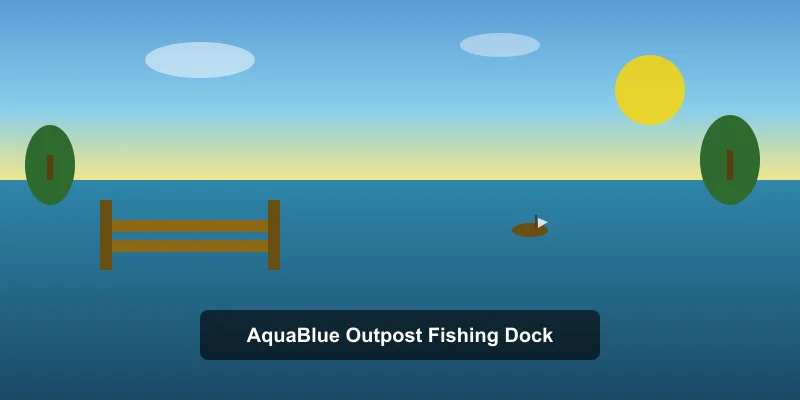
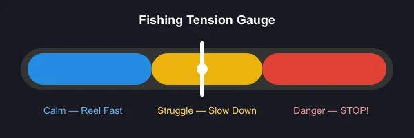
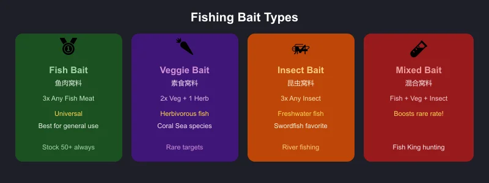
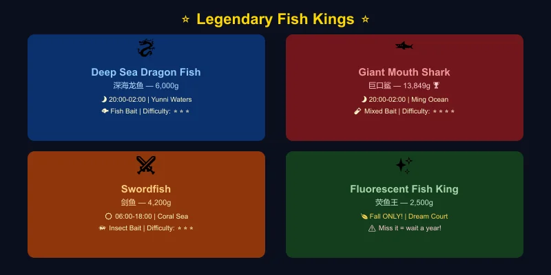
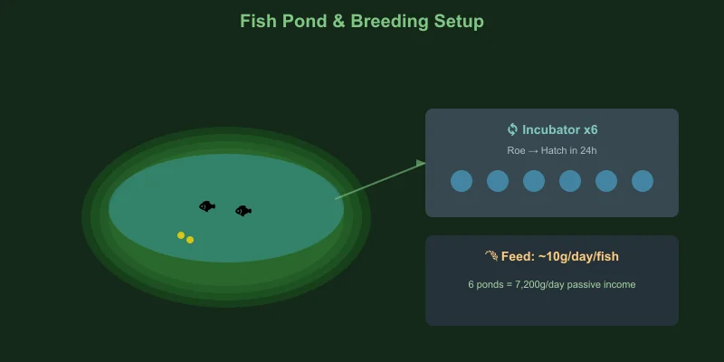
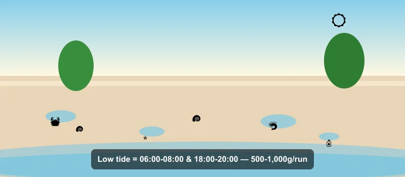
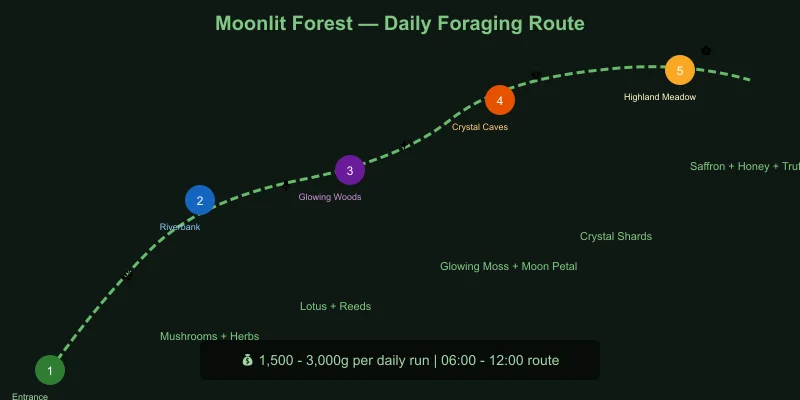
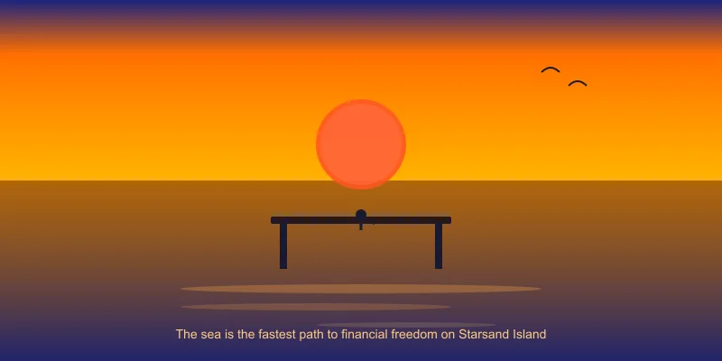

# 🎣 Starsand Island Complete Fishing & Gathering Guide

> Game version: Early Access (Feb 12, 2026 launch) | Focus: Fishing, Foraging & Ocean Gathering

I've spent over 50 hours fishing every corner of Starsand Island — from the AquaBlue pier to the deep waters of Yunni — and I can tell you without hesitation: fishing is the fastest route to financial freedom on this island. It uses less stamina than mining or logging, and a single Fish King sells for over 13,000 gold. But the system runs deep: with **100+ fish species**, **4 legendary Fish Kings**, a **fish breeding/pond system**, and a **multi-stage fishing profession quest chain**, there is a lot to learn.

This guide covers everything I've learned along the way — from casting your first line to breeding legendary fish for passive income.

*Data sourced from in-game testing, Bilibili Wiki, and community research. Prices in in-game gold. Verified for EA version 0.4.2.*

---

## 📋 Table of Contents

1. [Getting Started: How to Unlock Fishing](#getting-started-how-to-unlock-fishing)
2. [Fishing Mechanics & Controls](#fishing-mechanics--controls)
3. [Rod Upgrades & Progression](#rod-upgrades--progression)
4. [Bait Guide — What to Use & When](#bait-guide--what-to-use--when)
5. [Seasonal Fish Tables](#seasonal-fish-tables)
6. [Legendary Fish Kings — Location & Strategy](#legendary-fish-kings--location--strategy)
7. [Fish Pond & Breeding Guide](#fish-pond--breeding-guide)
8. [Beach Foraging & Tidepool Collecting](#beach-foraging--tidepool-collecting)
9. [Forest Foraging & Gathering Routes](#forest-foraging--gathering-routes)
10. [Fishing Profession — Quests & Perks](#fishing-profession--quests--perks)
11. [Profit Analysis — Best Fish for Money](#profit-analysis--best-fish-for-money)
12. [Pro Tips & Common Mistakes](#pro-tips--common-mistakes)

---

## Getting Started: How to Unlock Fishing

Fishing is not available from day one — you need to unlock it through a short quest chain:

### Unlock Steps

| Step | What to Do | Requirements |
|:-----|:-----------|:------------|
| 1 | Repair the bridge to **AquaBlue Outpost (碧蓝哨站)** | 15 Stone + 15 Softwood |
| 2 | Talk to **Delphin (德尔芬)** — the fishing mentor | — |
| 3 | Accept the tutorial quest **"A Fisher's First Catch"** | — |
| 4 | Craft a basic fishing rod at the workbench | 10 Softwood + 5 Fiber |
| 5 | Catch your first fish near the Outpost pier | Any fish in the marked area |
| 6 | Report back to Delphin to unlock the Fishing skill tab | — |

> **Tip:** Unlock fishing as early as possible — even before investing in farm upgrades. A single afternoon of fishing can fund your first backpack upgrade and tool enhancement.

### Where to Fish

Starsand Island has **5 main fishing zones**:

| Zone | Type | Access | Best For |
|:-----|:-----|:-------|:---------|
| **AquaBlue Outpost (碧蓝哨站)** | Pier / Coastal | Unlocked via bridge repair | Early-game, basic fish |
| **River Systems (河流)** | Freshwater | Always open | Seasonal river fish, Arapaima |
| **Coral Sea (珊瑚海)** | Ocean | Rent boat from port | Swordfish, Napoleon fish, daytime fish |
| **Ming Ocean (明洋海域)** | Deep Ocean | Rent boat from port | Tuna, Sunfish, nighttime fish kings |
| **Yunni Waters (云霓海域)** | Deep Ocean | Rent boat from port | Deep-sea species, rare fish kings |

> **🚤 Boat Access:** After repairing the **harbor** (Port Reconstruction quest — 15 Stone + 15 Softwood), you can rent a yacht for **150g/hour** or hire a parrot boat to reach deep-sea fishing grounds.

---

## Fishing Mechanics & Controls

The fishing mini-game is **tension-based**, similar to *Animal Crossing* but with a visual twist:

### How It Works

1. **Cast your line** near a fish shadow (ripple/hitbox in the water)
2. **Wait for a bite** — the float dips underwater and splashes
3. **Reel in** using the tension gauge:
   - 🔵 **Blue zone** — fish is calm, reel in quickly
   - 🟡 **Yellow zone** — fish is struggling, slow down or pause
   - 🔴 **Red zone** — fish is fighting hard, STOP reeling or line breaks
4. **Land the catch** — keep tension in the blue/yellow zone until the fish is pulled in

### Key Mechanics

| Mechanic | Detail |
|:---------|:-------|
| **Stamina cost** | 10 stamina per cast |
| **Cast range** | Determined by rod tier — longer range = access to deeper fish |
| **Fish shadows** | Larger shadows = bigger fish (often higher rarity) |
| **Weather effect** | Rain increases rare fish spawn rates by ~30% |
| **Time effect** | Night (20:00–02:00) unlocks exclusive nocturnal species |
| **Bait consumption** | 1 bait per catch (when bait is equipped) |

> **Beginner tip:** Do not try to force the reel when the gauge hits red. Just let go — the line cools down fast, and you waste less stamina than fighting a losing battle.

---

## Rod Upgrades & Progression

| Rod | Cost | Materials | Cast Range | Bait Slots | Unlock |
|:----|:----|:----------|:----------:|:----------:|:------|
| Basic Rod (基础鱼竿) | — | 10 Softwood + 5 Fiber | Short | 0 | Tutorial quest |
| Fiber Rod (纤维鱼竿) | 500g | 15 Fiber + 5 Copper Ore | Medium | 1 | Fishing Lv 2 |
| Bamboo Rod (竹制鱼竿) | 1,200g | 20 Bamboo + 5 Iron Ore | Long | 1 | Fishing Lv 5 |
| Carbon Rod (碳素鱼竿) | 3,500g | 10 Carbon Fiber + 5 Gold Ore | Very Long | 2 | Fishing Lv 10 |
| Mythic Rod (传说鱼竿) | 8,000g | 5 Rainbow Ore + 3 Moonlight Stone | Maximum | 2 | Fishing Lv 15 + quest |

**Recommended upgrade path:** Skip the Fiber Rod if you can save up for Bamboo directly. The Carbon Rod is the first major power spike — the extra cast range opens up deeper waters where Fish Kings spawn.

---

## Bait Guide — What to Use & When

Bait is essential for targeting specific fish families. Without bait, you will catch mostly common fish.

| Bait Type | Crafting Recipe | Attracts | Best Use |
|:----------|:---------------|:---------|:---------|
| **Fish Bait (鱼肉窝料)** 🥇 | 3 Any Fish Meat | Most fish (universal) | All-purpose, farm this in bulk |
| **Veggie Bait (素食窝料)** 🥕 | 2 Any Veg + 1 Herb | Herbivorous fish, rare species | Coral Sea fish, special targets |
| **Insect Bait (昆虫窝料)** 🦗 | 3 Any Insect | Freshwater fish, some ocean | River fishing, Swordfish |
| **Mixed Bait (混合窝料)** 🧪 | 1 Fish + 1 Veg + 1 Insect | All types, boosts rare rate | Fish King hunting |

### Bait Strategy by Target

| Target | Best Bait | Why |
|:-------|:----------|:----|
| General money farming | Fish Bait | Cheap, effective, catches sell well |
| Legendary Fish Kings | Mixed Bait | Highest rare-rate boost |
| Swordfish & Coral species | Insect Bait | Preferred by high-value coral fish |
| River/seasonal collection | Veggie Bait | Targets specific species for encyclopedia |
| Night fishing (general) | Fish Bait | Consistent deep-sea catches |

> **Pro tip:** Keep your bait hot. Cast near a clustered fish shadow and use bait immediately — the scent trail attracts multiple fish in the area, giving you 3–4 fast catches before it fades.

---

## Seasonal Fish Tables

Starsand Island has a **rich seasonal rotation**. Some fish only appear in specific seasons, and missing them means waiting a full in-game year.

### 🌸 Spring Fish

#### Ocean & Sea

| Fish | Location | Time | Bait | Sell Price | Notes |
|:----|:---------|:----|:----|:----------:|:------|
| Clownfish (小丑鱼) | Any ocean | All day | Any | 80g | Common, everywhere |
| Blue Tang (蓝倒吊) | Coral Sea | 08:00–18:00 | Veggie | 150g | Easy catch |
| Napoleon Fish (拿破仑鱼) | Coral Sea | 08:00–18:00 | Fish | 320g | Good early profit |
| Tuna (金枪鱼) | Ming Ocean | 08:00–18:00 | Fish | 280g | Spring–Fall only |
| Red Snapper (红鲷鱼) | AquaBlue Pier | All day | Fish | 120g | Consistent |

#### River & Lake

| Fish | Location | Time | Bait | Sell Price | Notes |
|:----|:---------|:----|:----|:----------:|:------|
| Koi (锦鲤) | River | 06:00–18:00 | Veggie | 200g | — |
| Pond Loach (泥鳅) | River | All day | Insect | 60g | Common, good for bait |
| Red Carp (红鲤鱼) | River | 06:00–02:00 | Any | 110g | Spring–Summer only |

### ☀️ Summer Fish

#### Ocean & Sea

| Fish | Location | Time | Bait | Sell Price | Notes |
|:----|:---------|:----|:----|:----------:|:------|
| Sunfish (翻车鱼) | Ming Ocean | 08:00–18:00 | Fish | 450g | Summer only |
| Tuna (金枪鱼) | Ming Ocean | 08:00–18:00 | Fish | 280g | Continues from spring |
| Blue Tang (蓝倒吊) | Coral Sea | 08:00–18:00 | Veggie | 150g | Continues |
| Parrotfish (鹦鹉鱼) | Coral Sea | All day | Veggie | 230g | Summer only |

#### River & Lake

| Fish | Location | Time | Bait | Sell Price | Notes |
|:----|:---------|:----|:----|:----------:|:------|
| Tilapia (罗非鱼) | River | 10:00–22:00 | Insect | 180g | Summer only |
| Striped Bass (十道黑) | River | All day | Veggie | 150g | All seasons |
| Red Carp (红鲤鱼) | River | 06:00–02:00 | Any | 110g | Continues |

### 🍂 Fall Fish

Fall is the **most critical fishing season** — two exclusive species only appear now.

#### Ocean & Sea

| Fish | Location | Time | Bait | Sell Price | Notes |
|:----|:---------|:----|:----|:----------:|:------|
| Tuna (金枪鱼) | Ming Ocean | 08:00–18:00 | Fish | 280g | Last season until next spring |
| Mola Mola (曼波鱼) | Ming Ocean | 08:00–18:00 | Fish | 520g | Fall only |
| Blue Tang (蓝倒吊) | Coral Sea | 08:00–18:00 | Veggie | 150g | Last season |

#### River & Lake

| Fish | Location | Time | Bait | Sell Price | Notes |
|:----|:---------|:----|:----|:----------:|:------|
| **Arapaima (巨骨舌鱼)** 🚨 | River | All day | Insect/Veggie/Fish | 1,200g | **⚠️ Fall ONLY — miss it, wait a year!** |
| Giant Siamese Carp (巨暹罗鲤) | River | All day | Any | 350g | All seasons |
| Striped Bass (十道黑) | River | All day | Veggie | 150g | All seasons |

#### Special Area

| Fish | Location | Time | Bait | Sell Price | Notes |
|:----|:---------|:----|:----|:----------:|:------|
| **Fluorescent Fish King (荧鱼王)** 🚨 | Dream Court (悬梦庭) | All day | Any | 2,500g | **⚠️ Fall ONLY** — secret area fish |

### ❄️ Winter Fish

Winter has fewer species, but the ones available include valuable deep-water catches.

#### Ocean & Sea

| Fish | Location | Time | Bait | Sell Price | Notes |
|:----|:---------|:----|:----|:----------:|:------|
| Cod (鳕鱼) | Ming Ocean | All day | Fish | 350g | Winter only |
| Snow Crab (雪蟹) | Coral Sea | All day | Fish | 420g | Winter only, caught with rod |
| Viperfish (毒蛇鱼) | Ming Ocean | 20:00–24:00 | Fish | 680g | All seasons, nocturnal |

#### River & Lake

| Fish | Location | Time | Bait | Sell Price | Notes |
|:----|:---------|:----|:----|:----------:|:------|
| Icefish (银鱼) | River | All day | Insect | 280g | Winter only |
| Giant Siamese Carp (巨暹罗鲤) | River | All day | Any | 350g | All seasons |

---

### 📊 Quick Season Comparison — Best Fish Per Season

| Season | Best Money Fish | Sell Price | Location |
|:-------|:---------------|:----------:|:---------|
| 🌸 Spring | Napoleon Fish | 320g | Coral Sea |
| ☀️ Summer | Sunfish | 450g | Ming Ocean |
| 🍂 Fall | Arapaima ⭐ | 1,200g | River (exclusive!) |
| ❄️ Winter | Viperfish (night) | 680g | Ming Ocean |

---

## Legendary Fish Kings — Location & Strategy

The **4 Fish Kings** are the crown jewels of Starsand Island fishing. Each sells for **1,200g–13,849g** and requires specific conditions.

### Fish King Comparison

| Fish King | Sell Price | Weather | Time | Zone | Bait | Difficulty |
|:----------|:----------:|:-------:|:----|:----|:----|:----------:|
| **Deep Sea Dragon Fish (深海龙鱼)** 🐉 | 6,000g | Any | 20:00–02:00 | Yunni Waters | Fish Bait | ⭐⭐⭐ |
| **Giant Mouth Shark (巨口鲨)** 🦈 | 13,849g | Any | 20:00–02:00 | Ming Ocean | Fish Bait | ⭐⭐⭐⭐ |
| **Swordfish (剑鱼)** ⚔️ | 4,200g | Any | 06:00–18:00 | Coral Sea | Insect/Veggie/Fish | ⭐⭐⭐ |
| **Fluorescent Fish King (荧鱼王)** ✨ | 2,500g | Any | All day | Dream Court (Fall only) | Any | ⭐⭐ |

### Deep Sea Dragon Fish (深海龙鱼) — Yunni Waters

- **Conditions:** Night only (20:00–02:00), Yunni Waters zone
- **Recommended setup:** Carbon Rod, Fish Bait
- **Strategy:** Take a parrot boat to Yunni Waters after 20:00. Cast toward the darker, deeper water patches. The Dragon Fish shadow is noticeably larger than regular fish. The fight takes 15–25 seconds of careful tension management — it spikes into the red zone frequently but for short bursts.
- **Tip:** Eat +Stamina food before heading out — you will need 15+ casts minimum.

### Giant Mouth Shark (巨口鲨) — Ming Ocean 🏆 Most Valuable

- **Conditions:** Night only (20:00–02:00), Ming Ocean zone
- **Recommended setup:** Carbon Rod, Fish Bait (Mixed Bait recommended for higher spawn rate)
- **Strategy:** The Giant Mouth Shark is the hardest catch in the game. Its shadow is **huge** — you cannot miss it. The fight is a marathon: the shark makes long red-zone runs lasting 3–5 seconds. Let go of the reel completely during these bursts. Reel hard during blue windows. Bring at least 200 stamina worth of food.
- **Sell Price:** 13,849g — the single most valuable fish in the game.

### Swordfish (剑鱼) — Coral Sea

- **Conditions:** Daytime only (06:00–18:00), Coral Sea zone
- **Recommended setup:** Bamboo Rod, Insect Bait preferred
- **Strategy:** The easiest Fish King to target. Cruise the Coral Sea during daylight hours. The Swordfish shadow is long and distinct. The fight is moderate — it prefers yellow-zone pressure, so maintain steady tension without pushing into red.
- **Sell Price:** 4,200g. Decent money, but the real value is completing the Fish King collection for the fishing quest chain.

### Fluorescent Fish King (荧鱼王) — Dream Court

- **Conditions:** 🍂 **Fall only**, Dream Court (secret area), any time
- **Recommended setup:** Any rod will do, but longer range helps
- **Strategy:** The Dream Court area has a unique fishing spot only accessible during Fall. The Fluorescent Fish King has a distinctive glowing shadow. Easy fight — short blue-zone windows make it quick to reel in.
- **⚠️ CRITICAL:** This fish is **Fall-exclusive**. If you miss it, you wait a full in-game year. Save before attempting and reload if you fail the catch.
- **Sell Price:** 2,500g.

---

## Fish Pond & Breeding Guide

Once you reach **Fishing Lv 8**, you unlock the **Fish Pond** system — passive income and quest resource generation.

### Getting Started

| Step | What to Do | Cost |
|:-----|:-----------|:----:|
| 1 | Build a Fish Pond on your farm | 500g + 30 Stone + 20 Softwood |
| 2 | Place 2 of the same species in the pond | — |
| 3 | Wait for them to produce Roe (卵) | 24 hours |
| 4 | Collect Roe and place in Incubator | — |
| 5 | Hatch new fish in 24 hours | — |

### Breeding Mechanics

- **Requirement:** Exactly **2 same-species fish** in one pond produce Roe
- **Roe production:** Every 24 hours (in-game), a pair produces 1 Roe
- **Hatching:** Place Roe in Incubator → 24 hours → new fish
- **Capacity:** Base pond holds 10 fish; upgrade to hold 20 (1,500g + 10 Iron Bars)
- **Feeding:** Fish consume 1 Fish Feed/day each (crafted from Wheat + Any Fish at the Mill)

### Best Fish for Breeding

| Fish | Roe Sell Price | Hatch Value | ROI | Notes |
|:-----|:--------------:|:-----------:|:---:|:------|
| Deep Sea Dragon Fish | 1,200g | 6,000g | ⭐⭐⭐⭐⭐ | Best long-term investment |
| Swordfish | 800g | 4,200g | ⭐⭐⭐⭐ | Easier to catch, good returns |
| Arapaima | 500g | 1,200g | ⭐⭐⭐ | Fall-only, but breeds year-round |
| Napoleon Fish | 200g | 320g | ⭐⭐ | Quick starter for learning the system |

> **Breeding tip:** Build **6–8 small fish ponds** instead of one large one. Each pond can host a different breeding pair, and multiple incubators let you hatch roe in parallel. This dramatically accelerates your fish empire.

### Fish Pond Profit Calculator

With 6 ponds, each holding a Dragon Fish pair, your roe (鱼籽) can follow **one of two mutually exclusive paths** — sell it directly, or hatch it into fish and sell those. You cannot do both with the same roe.

**Option A — Sell the roe directly (no incubator needed):**
- 6 pairs × 1 Roe/day = 6 Roe/day × 1,200g = **7,200g/day**

**Option B — Hatch and sell the fish (recommended for late game):**
- 6 pairs produce 7 Roe each per week = **42 Roe/week**
- Incubate all 42 → 42 new Dragon Fish
- 42 × 6,000g = **252,000g/week**
- Minus feed: ~6 × 10g × 7 days = 420g/week
- **Net profit: ~251,000g/week**

The hatch route earns roughly 35× more than selling roe, but it takes 24 hours per batch and requires incubator space. Pick the path that fits your setup — both far outpace crop farming in the late game.

---

## Beach Foraging & Tidepool Collecting

Besides active fishing, the **beach and tidepool system** provides a steady supply of free resources.

### Beach Foraging Overview

Every morning, the beaches around Starsand Island regenerate with collectibles. Walk the shoreline and look for sparkling spots.

| Item | Sell Price | Use |
|:-----|:----------:|:----|
| Seashell (贝壳) | 15g | Crafting, gifts |
| Starfish (海星) | 30g | Gift (liked by Delphin) |
| Sand Dollar (沙币) | 25g | Crafting |
| Pearl (珍珠) ⭐ | 200g | Rare, gift, crafting |
| Driftwood (浮木) | 10g | Building material |
| Seaweed (海带) | 20g | Cooking (Seaweed Salad) |
| Coral Fragment (珊瑚碎片) | 45g | Crafting, fishing rod upgrades |
| Message in a Bottle (漂流瓶) ⭐ | 100g | Contains recipes or maps |

### Tidepool Mechanics

At **low tide** (06:00–08:00 and 18:00–20:00 in-game), tidepools open along the shore:

- **Crab (螃蟹):** Catch by hand — 50g each, or use for crab bait
- **Sea Urchin (海胆):** 80g — requires Gloves tool
- **Anemone (海葵):** 35g — used in some crafting recipes
- **Small Octopus (小章鱼):** 120g — rare tidepool catch

> **Route tip:** Start at AquaBlue Outpost at 06:00, walk north along the beach to the river mouth, then loop back through the tidepool area. This 10-minute route collects 20–35 items worth 500–1,000g daily.

---

## Forest Foraging & Gathering Routes

The **Moonlit Forest (荧月之森)** is the primary foraging zone, shared with the mining/combat area. Resources regenerate daily.

### Foraging Items by Zone

| Zone | Collectibles | Uses |
|:-----|:------------|:-----|
| **Entrance Area** | Wild Mushroom (野生蘑菇), Herb (草药), Berry (野果) | Cooking, healing items |
| **Riverbank** | Lotus Root (莲藕), Water Chestnut (菱角), Reeds (芦苇) | Cooking, crafting |
| **Glowing Woods** | Glowing Moss (荧光苔藓), Moon Petal (月瓣花), Spirit Herb (灵草) | Brewing, rare recipes |
| **Crystal Caves** | Crystal Shard (水晶碎片), Mineral Water (矿泉) | Upgrading, stamina recovery |
| **Highland Meadow** | Saffron (藏红花), Wild Honey (野蜂蜜), Truffle (松露) ⭐ | High-value, rare cooking |

### Best Foraging Route

1. 🕐 **06:00** — Start at Moonlit Forest entrance (mushrooms + herbs)
2. 🕐 **07:00** — Riverbank loop (lotus root, reeds)
3. 🕐 **08:30** — Glowing Woods (moss, moon petals — use bug net for floating spores)
4. 🕐 **10:00** — Crystal Caves entrance (crystal shards)
5. 🕐 **11:00** — Highland Meadow (saffron, wild honey, occasional truffle)
6. 🕐 **12:00** — Back to camp, cook/process, sell by 13:00

**Daily foraging value:** ~1,500–3,000g depending on rare spawns.

### Gathering Tools

| Tool | Use | Upgrade Path |
|:-----|:----|:-------------|
| **Basket (篮子)** | Basic pickup, 10 slots | 15 → 25 slots (Farming Lv 3) |
| **Sickle (镰刀)** | Cut herbs, reeds, tall grass | Stone → Copper → Iron → Gold |
| **Bug Net (捕虫网)** | Catch insects, floating spores | Basic → Reinforced → Advanced |
| **Gloves (手套)** | Pick up sharp/thorny items | Leather → Reinforced → Insulated |

> **Cross-skill synergy:** Insects caught while foraging double as fishing bait. Dedicate one foraging run per week to insect hunting — stockpiling 100+ insects saves you from crafting Fish Bait when you would rather be fishing.

---

## Fishing Profession — Quests & Perks

Fishing is one of **5 core professions** in Starsand Island, each with its own quest chain. Delphin at AquaBlue Outpost guides you through 5 tiers.

### Profession Tiers

| Tier | Title | Fishing Lv | Key Perk Unlocked |
|:----|:------|:----------:|:------------------|
| 1 | Apprentice Angler | Lv 1–3 | Basic fishing rod, 10% less stamina per cast |
| 2 | Skilled Fisher | Lv 4–7 | **Treasure Chest chance** (5%) — catch extra loot |
| 3 | Expert Angler | Lv 8–11 | **Fish Pond unlock**, 15% less stamina |
| 4 | Master Fisher | Lv 12–15 | **Night Mastery** — 50% higher rare rate at night |
| 5 | **Legendary Angler** | Lv 16+ | **Double Catch** — 10% chance to catch 2 fish at once |

### Perk Priority

| Priority | Perk | Why |
|:---------|:-----|:----|
| 🥇 **1st** | Treasure Chest chance | Passive income boost — chests contain 200–1,000g + rare items |
| 🥇 **2nd** | Night Mastery | Unlocks the best farming window (Fish Kings are nocturnal) |
| 🥈 **3rd** | Double Catch | Late-game scaling, amazing with Fish Kings |
| 🥉 **4th** | Stamina reduction | Nice quality-of-life, but food is cheap |

### Advanced Fishing Quest: The "Oceanarium" (高级渔趣师)

At **Fishing Lv 10**, Delphin gives you a special quest:

- **Goal:** Collect **20 unique fish species** for the Oceanarium (海缸)
- **Reward:** Mythic Rod blueprint, +1 permanent luck buff
- **Tip:** Start tracking this from day one. The 20 species requirement spans seasons and zones, so you cannot rush it. Use the Islandpedia (phone → Bio Research → Aquatic Life) to track your collection.

---

## Profit Analysis — Best Fish for Money

| Method | Time Investment | Daily Profit | Effort |
|:-------|:---------------:|:------------:|:------:|
| 🎣 Casual fishing (pier) | 1 in-game hour | 500–800g | Very low |
| 🎣 Coral Sea daytime | 2 in-game hours | 2,000–4,000g | Low |
| 🎣 Night Fish King hunt | 3–4 in-game hours | 6,000–20,000g | Medium |
| 🐟 Fish pond breeding (passive) | Setup once | 7,000–15,000g/day | None (passive) |
| 🌊 Beach foraging | 10 min (real) | 500–1,000g | Very low |
| 🌲 Forest foraging run | 1 in-game hour | 1,500–3,000g | Low |

### Early-Game Money Plan (Year 1, Spring–Summer)

1. **Days 1–5:** Unlock fishing → spend mornings beach foraging, afternoons pier fishing → save 5,000g
2. **Days 6–15:** Upgrade to Bamboo Rod → rent boat for Coral Sea → target Napoleon Fish/Sunfish → save 15,000g
3. **Days 16–30:** Upgrade to Carbon Rod → night Fish King hunting in Ming Ocean → Giant Mouth Shark (13,849g each!)
4. **By Summer:** Build 2–3 fish ponds with captured Fish Kings → passive income takes over

---

## Pro Tips & Common Mistakes

### ✅ Do This

- **Fish at night.** The 20:00–02:00 window is when Fish Kings and rare deep-sea species spawn. Daytime is for casual farming.
- **Always carry 3 bait types.** You never know when a rare shadow will appear with a specific bait preference.
- **Save before Fish King fights.** If you break your line on a Giant Mouth Shark, reload and try again.
- **Breed Fish Kings.** Even a single Dragon Fish pair generates 6,000g/week in hatchlings — better than most crops.
- **Use the Islandpedia.** Track your catch progress and check which fish you are missing by season.

### ❌ Do Not Do This

- **Do not sell all your Fish Kings.** Keep at least 2 of each for breeding and quest requirements. Quests frequently demand Fish King deliveries.
- **Do not ignore bait.** Fishing without bait is 3× slower for rare fish. Always keep 50+ Fish Bait in stock.
- **Do not skip the Oceanarium quest.** The Mythic Rod is the best in the game, and the permanent luck buff applies to ALL activities.
- **Do not waste premium bait on common fish.** Use Fish Bait for general farming, save Mixed Bait for Fish King sessions.
- **Do not skip Fall fishing.** Arapaima and Fluorescent Fish King are Fall-exclusive. Missing them means a full year of waiting.

---

> **Bottom line:** Fishing is the **best early-game moneymaker** and fish ponds provide the **best late-game passive income**. Start early, hunt Fish Kings at night, and build your pond empire. The sea is the fastest path to financial freedom on Starsand Island.

---

*Guide updated for EA version 0.4.2. Fish spawn data verified through in-game testing and community research. Prices subject to change with game updates.*
