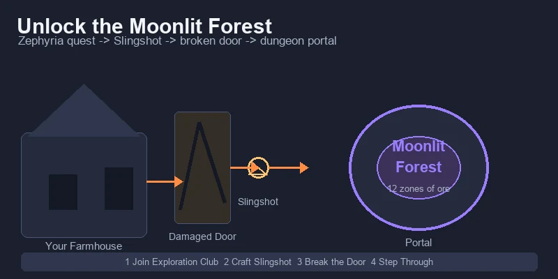
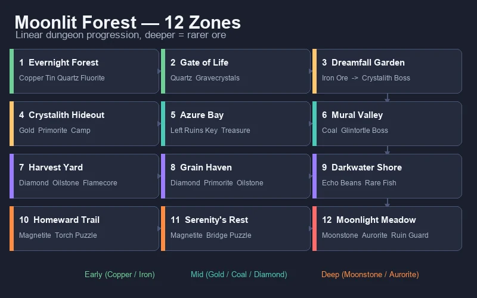
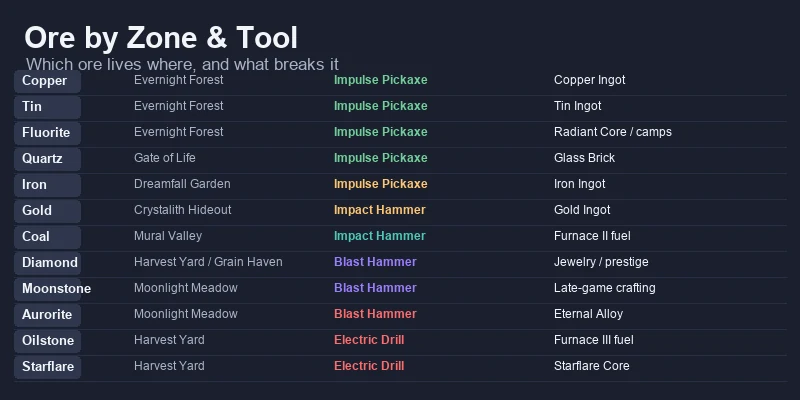
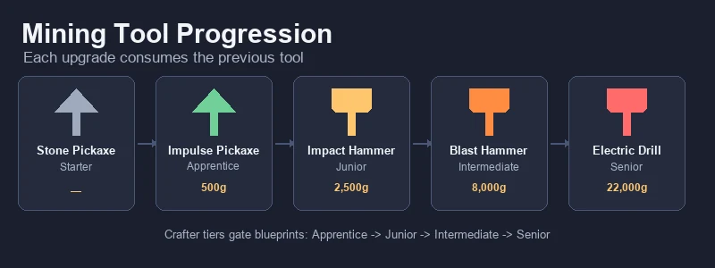
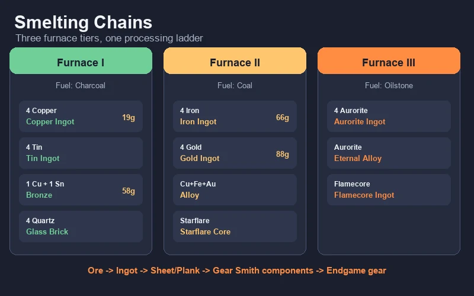
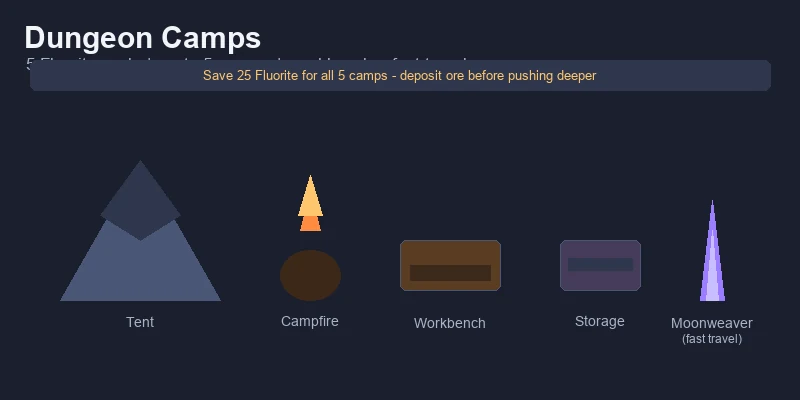
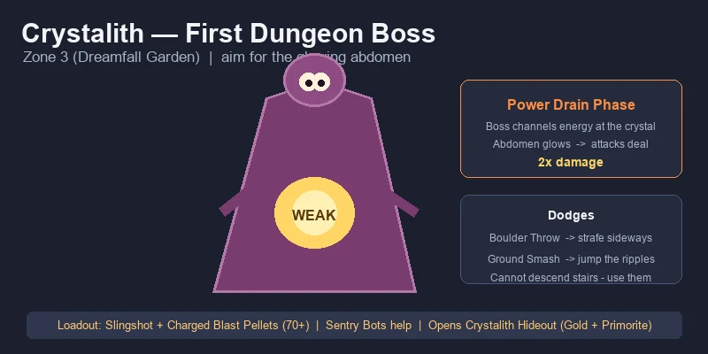
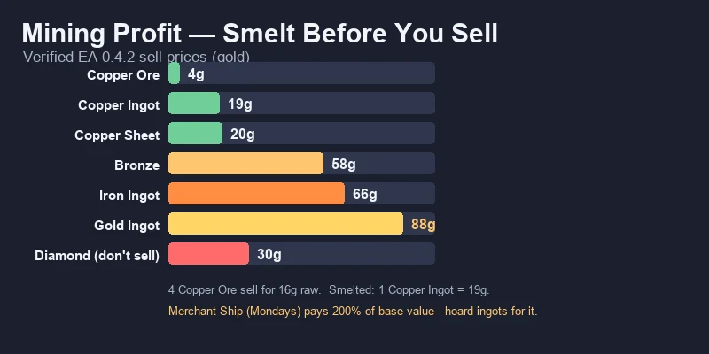
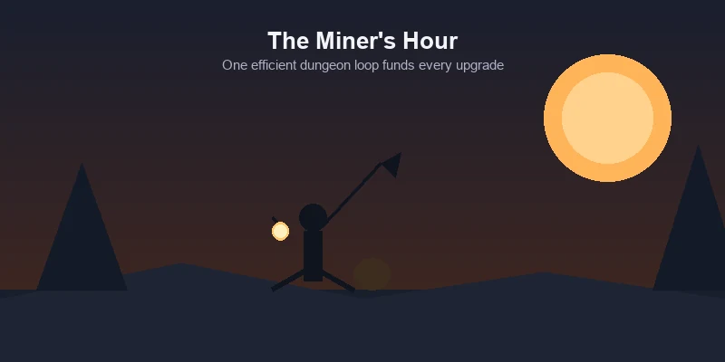

# ⛏️ Starsand Island Complete Mining & Crafting Guide

> Game version: Early Access (Feb 12, 2026 launch) | Focus: Mining, Smelting & Tool Progression

I've spent over 70 hours underground in Starsand Island since the EA launch, and mining is where this game quietly turns into a money printer. Farming gets all the attention, but the **Moonlit Forest dungeon** — 12 zones of ores, puzzles, and bosses tucked behind your own house — is the real engine room. Copper and Tin fund your first week, Iron and Gold carry your mid-game, and by the time you're smelting Aurorite at Furnace III, you're effectively self-funding every upgrade in the game.

This guide covers the entire mining pipeline: unlocking the dungeon, what ore spawns where, every tool tier and what it unlocks, all furnace recipes, and how to turn raw stone into steady gold.

*Data sourced from in-game testing, the Bilibili Wiki, and community research. Prices in in-game gold (金). Verified for EA version 0.4.2.*

---

## 📋 Table of Contents

1. [How to Unlock Mining](#how-to-unlock-mining)
2. [Moonlit Forest — 12-Zone Dungeon Walkthrough](#moonlit-forest--12-zone-dungeon-walkthrough)
3. [All Ores by Zone & Tool Requirement](#all-ores-by-zone--tool-requirement)
4. [Tool Progression — Pickaxe to Electric Drill](#tool-progression--pickaxe-to-electric-drill)
5. [Furnace & Smelting Guide](#furnace--smelting-guide)
6. [Processing Chains — Cutter, Gear Smith & Ore Analyzer](#processing-chains--cutter-gear-smith--ore-analyzer)
7. [Camps & Fast Travel](#camps--fast-travel)
8. [Crystalith Boss Strategy](#crystalith-boss-strategy)
9. [Mining Profit Analysis](#mining-profit-analysis)
10. [Crafter Profession & Blueprints](#crafter-profession--blueprints)
11. [Pro Tips & Common Mistakes](#pro-tips--common-mistakes)
12. [The Efficient Daily Mining Routine](#the-efficient-daily-mining-routine)

---

## How to Unlock Mining

Mining proper doesn't start with a pickaxe in hand — the real content lives behind a short exploration quest chain. Here's the unlock path:

### Unlock Steps

| Step | What to Do | Requirements |
|:-----|:-----------|:------------|
| 1 | Join the **Exploration Club** and talk to **Zephyria** (above Green Pasture Ranch) | — |
| 2 | Accept her tutorial quest and craft a **Slingshot** | Slingshot blueprint (workbench) |
| 3 | Find the **Damaged Door** behind your farmhouse | Walk around the back of your starting plot |
| 4 | Break the door with the Slingshot | Slingshot + ammo |
| 5 | Step through the portal in the cavern | — |
| 6 | Report to Zephyria to unlock the **Exploration skill tab** | — |

> **Tip:** The exploration path also unlocks your first **camp** and the **Moonweaver fast-travel network**. Do this quest before your first winter — the Furnace and tool upgrades it feeds become your most reliable income source once crops slow down.

### What You Actually Need for the First Mine Run

- A **Stone Pickaxe** (starter tool) to clear surface rocks and path debris
- At least **15 Stamina-restoring food** — early mining eats stamina fast
- The **Impulse Pickaxe blueprint** (500 coins from Zerine's shop) once you reach **Apprentice Crafter**

---

## Moonlit Forest — 12-Zone Dungeon Walkthrough

The Moonlit Forest is a long, largely linear dungeon under the island. It is split into **12 named zones**, each with its own ores, enemies, and puzzles. You never need to memorize the whole thing — just follow the zone order and you will naturally collect the ores you need next.

| # | Zone | Key Resources | Enemies / Puzzle | Milestone |
|:-:|:-----|:--------------|:-----------------|:----------|
| 1 | **Evernight Forest** | Copper, Tin, Quartz, Fluorite | Minimal | First ore nodes |
| 2 | **Gate of Life** | Quartz, Gravecrystals | Runebird elite, gate puzzles | Gravestar collection |
| 3 | **Dreamfall Garden** | **Iron Ore** | Luminpath butterfly puzzle | **Crystalith boss** |
| 4 | **Crystalith Hideout** | **Gold**, Primorite | 3 hidden Gravestars | Camp + fast travel |
| 5 | **Azure Bay** | (fishing, treasure) | Luminfrog, elevator | Left Ruins Key |
| 6 | **Mural Valley** | **Coal** | Glintortle boss, Bronze Gate | Right Ruins Key |
| 7 | **Harvest Yard** | Diamond, Oilstone, Flamecore | Fire/Water arrow barriers | Late-game ore zone |
| 8 | **Grain Haven** | Diamond, Oilstone, Primorite | Calm mining zone | Deep mining hub |
| 9 | **Darkwater Shore** | Echo Beans, rare fish | — | Unique farm crops |
| 10 | **Homeward Trail** | Magnetite | Torch-lighting puzzle, Runebirds | Puzzle zone |
| 11 | **Serenity's Rest** | Magnetite | Bridge puzzle (Gravecrystals) | Transition zone |
| 12 | **Moonlight Meadow** | **Moonstone, Aurorite** | **Ruin Guard final boss** | Deepest ore veins |

> **Progression note:** you do not need to clear every zone in one day. The critical early gates are **Zone 3** (Iron for the Impact Hammer) and **Zone 4** (Gold + Primorite for mid-game crafting). Push to Zone 7–8 only after you have the **Blast Hammer** or **Electric Drill**.

---

## All Ores by Zone & Tool Requirement

Every ore in Starsand Island has a home zone and a minimum tool tier. If your pickaxe is too weak, the node simply won't break — so the tool table in the next section is your real map.

| Ore | First Found In | Tool Required | Smelts Into |
|:----|:---------------|:--------------|:------------|
| **Stone** | Surface / everywhere | Stone Pickaxe | Stone Brick |
| **Clay** | Surface / Evernight Forest | Stone Pickaxe | — (crafting) |
| **Copper** | Evernight Forest (Zone 1) | Impulse Pickaxe | Copper Ingot → Copper Sheet / Bronze |
| **Tin** | Evernight Forest (Zone 1) | Impulse Pickaxe | Tin Ingot → Bronze |
| **Fluorite** | Evernight Forest (Zone 1) | Impulse Pickaxe | Radiant Core; repairs camps (5 per camp) |
| **Quartz** | Gate of Life (Zone 2) | Impulse Pickaxe | Glass Brick → Glass Pane / Prism |
| **Iron** | Dreamfall Garden (Zone 3) | Impulse Pickaxe | Iron Ingot → Iron Sheet / Alloy |
| **Gold** | Crystalith Hideout (Zone 4) | Impact Hammer | Gold Ingot → Gold Sheet / Alloy / jewelry |
| **Primorite** | Crystalith Hideout (Zone 4) | Impact Hammer | Late-game crafting |
| **Coal** | Mural Valley (Zone 6) | Impact Hammer | Fuel for Furnace II / III |
| **Magnetite** | Homeward Trail (Zone 10) | Blast Hammer | Magnet / Alloy |
| **Moonstone** | Moonlight Meadow (Zone 12) | Blast Hammer | Late-game jewelry / crafting |
| **Aurorite** | Moonlight Meadow (Zone 12) | Blast Hammer | Aurorite Ingot / Eternal Alloy |
| **Oilstone** | Harvest Yard (Zone 7) | Electric Drill | Fuel for Furnace III |
| **Starflare Crystal** | Harvest Yard (Zone 7) | Electric Drill | Starflare Core |
| **Diamond** | Harvest Yard / Grain Haven / Moonlight Meadow | Blast Hammer (Aurorite Pickaxe for Meadow) | Ultimate-tier jewelry, prestige recipes |

> **Key takeaway:** the game funnels you through the dungeon exactly as your tools improve. If you feel stuck on progression, the answer is almost always "your pickaxe is one tier behind the zone you are trying to clear."

---

## Tool Progression — Pickaxe to Electric Drill

Mining tools follow a single upgrade chain: **Stone Pickaxe → Impulse Pickaxe → Impact Hammer → Blast Hammer → Electric Drill**. From the Impulse Pickaxe onward, each tool **consumes the previous one** as a crafting ingredient — so do not sell or toss your old pickaxe.

All blueprints come from **Zerine's shop** and only appear once you hit the matching **Crafter certification tier**. You cannot skip tiers.

| Tool | Crafter Tier | Blueprint Cost | Crafting Materials | Worktable | Mines |
|:-----|:-------------|:--------------|:-------------------|:----------|:------|
| **Stone Pickaxe** | Starter | — | Given at start | — | Stone, Clay, surface rocks |
| **Impulse Pickaxe** | Apprentice | 500 coins | 10 Copper + 10 Fluorite + 5 Softwood + 5 Quartz + 1 Stone Pickaxe | I | Copper, Tin, Quartz, Fluorite, Clay, Gravecrystals |
| **Impact Hammer** | Junior | 2,500 coins | 4 Hardwood Planks + 4 Iron Sheets + 2 Radiant Crystals + 3 Bronze + 1 Impulse Pickaxe | II | Gold, Primorite, Coal (+ all previous, incl. Iron) — **AoE swing** |
| **Blast Hammer** | Intermediate | 8,000 coins | 20 Premium Wood + 5 Alloy + 5 Starflare Crystals + 5 Rubber + 1 Impact Hammer | II | Magnetite, Moonstone, Aurorite, Flamecore, Diamond (+ all previous) — larger AoE |
| **Electric Drill** | Senior | 22,000 coins | 6 Meteor Planks + 5 Chips + 6 Eternal Alloy + 8 High-Performance Wire Sets | III | **All ores** — unlocks Oilstone & Starflare Crystal, mines nearly instantly |

> **Note on Iron:** Iron Ore is listed under the Impulse Pickaxe because the Impact Hammer's own recipe needs **4 Iron Sheets** — the first Iron you gather (from Dreamfall Garden) has to come from Impulse-tier nodes. The Impact Hammer then turns Iron mining into an AoE sweep. Sources vary on the exact threshold between patches, so if a node refuses to break, that is your tool tier talking.

### Upgrade Priorities

- **Impulse Pickaxe first — always.** It is cheap (500 coins), unlocks the entire early dungeon, and lets you break **Gravecrystals**, which you need to progress the main story.
- **Impact Hammer is the biggest single power spike.** The AoE swing clears ore clusters in one hit instead of one node at a time, and it unlocks Gold and Primorite — while turning Iron mining into a fast sweep. Gold is the ore that pays for everything after it.
- **Blast Hammer is the point of no return for deep mining.** It consumes your Impact Hammer, so build your **second Impact Hammer before upgrading** if you want to keep one as a melee weapon.
- **Electric Drill shares its recipe with the Chainsaw** (same materials). If you want both tools, gather the materials **twice**.

> **Materials sourcing:** every high-tier tool needs processed materials — Hardwood Planks and Iron Sheets need upgraded Furnace + Cutter, Alloy needs Furnace II, Premium Wood comes from White Fig trees (Machete), and Rubber is tapped from Rubber Trees.

---

## Furnace & Smelting Guide

The **Furnace** is where raw ore becomes valuable metal. There are three tiers, and each one keeps all earlier recipes while adding new ones. Every batch takes roughly **6 seconds** and consumes one unit of fuel.

### Fuel by Furnace Tier

| Furnace | Fuel | Unlocks |
|:--------|:-----|:--------|
| **Furnace I** | Charcoal (from the Charcoal Kiln) | Copper, Tin, Bronze, Glass Brick, Stone Brick, Radiant Core |
| **Furnace II** | Coal | Iron, Gold, Magnet, Alloy, Starflare Core |
| **Furnace III** | Oilstone | Aurorite Ingot, Eternal Alloy, Flamecore Ingot, Lunar Core |

### Core Smelting Recipes

| Output | Recipe | Furnace | Uses |
|:-------|:-------|:--------|:-----|
| **Copper Ingot** | 4 Copper Ore + 1 Charcoal | I | Bronze, Copper Sheet, Impulse Pickaxe, Ore Analyzer, tools |
| **Tin Ingot** | 4 Tin Ore + 1 Charcoal | I | Bronze |
| **Bronze** | 1 Copper Ingot + 1 Tin Ingot + 1 Charcoal | I | Impact Hammer, Impact Axe, Furnace II upgrade |
| **Glass Brick** | 4 Quartz + 1 Charcoal | I | Glass Pane (Cutter I), Prism (Gear Smith) |
| **Iron Ingot** | 4 Iron Ore + 1 Coal | II | Iron Sheet, Alloy, tools, vehicle parts |
| **Gold Ingot** | 4 Gold Ore + 1 Coal | II | Gold Sheet, Gold Wire, Worktable III, jewelry |
| **Alloy** | 1 Copper Ingot + 1 Iron Ingot + 1 Gold Ingot + 1 Coal | II | Blast Hammer, Worktable III, Furnace III, Energy Converter |
| **Aurorite Ingot** | 4 Aurorite + 1 Oilstone | III | Eternal Alloy, endgame gear |
| **Eternal Alloy** | Aurorite Ingot + ingredients | III | Electric Drill, prestige recipes |

> **Bottleneck warning:** a single Furnace cannot keep up once you are smelting Copper, Tin, Fluorite, Quartz, and Iron in the same day. Build **at least two Furnace I units early**, and upgrade both to Furnace II together. Stockpile Wood for the Charcoal Kiln — charcoal demand is constant.

---

## Processing Chains — Cutter, Gear Smith & Ore Analyzer

Smelting is only the first step. The full processing ladder looks like this:

**Ore → (Furnace) → Ingot → (Cutter) → Sheet / Plank → (Gear Smith) → Advanced components**

| Station | Crafter Tier | What It Does | Examples |
|:--------|:-------------|:-------------|:---------|
| **Cutter I–III** | Junior+ | Ingots → sheets/planks | Copper Sheet, Iron Sheet, Glass Pane |
| **Gear Smith** | Senior | Advanced parts | Gears, Crystals, Wires, Springs, Nails |
| **Ore Analyzer** | Junior | Processes random **Ore Chunks** (Common/Uncommon/Rare) | Ancient Precision Parts, Spirit Cube Fragments |

The **Ore Analyzer** is an underrated money-maker: build it with **8 Hardwood + 2 Copper Sheets**, feed it the Ore Chunks you find while mining, and it converts them into rare parts that sell well and feed endgame crafting.

> **Rule of thumb:** each extra processing step adds a small premium. Ore → Ingot → Sheet typically adds 1–3 coins per step. The exception is the **Separator**, which *decreases* value — always check shop prices before running items through it.

---

## Camps & Fast Travel

Camps are the dungeon's checkpoint system, and they make deep mining sustainable.

| Feature | Detail |
|:--------|:-------|
| **Repair cost** | 5 **Fluorite** per camp |
| **Max camps** | 5 total |
| **What they provide** | Respawn point, tent, campfire, workbench, storage |
| **Fast travel** | Repair the **Moonweaver crystal** at each camp to teleport between camps and back to the surface |

### Camp Strategy

- Repair camps **as soon as you reach a new zone's camp marker** — the workbench lets you craft and smelt on-site, which doubles the ore you can haul out per trip.
- Save **Fluorite specifically for camps** (25 total for all 5). It is plentiful in Zones 1–2 but annoying to re-farm later.
- Always deposit ore at a camp chest before pushing deeper — dying in the dungeon is punishing, and a full inventory is the #1 reason miners lose a day's haul.

---

## Crystalith Boss Strategy

The **Crystalith** is the first major boss of the Moonlit Forest, guarding Zone 3 (Dreamfall Garden). Beating it opens **Crystalith Hideout** — your first Gold and Primorite source.

### Pre-Fight Checklist

| Item | Recommendation |
|:-----|:---------------|
| **Weapon** | Slingshot with **Charged Blast Pellets** — 60 minimum, 70+ for safety |
| **Passive damage** | Sentry Bots help a lot during the long fight |
| **Food** | Full stamina bar + 10+ recovery food |
| **Positioning** | It cannot descend stairs — use the staircase as an escape line |

### Attack Patterns

| Attack | Dodge |
|:-------|:------|
| **Boulder Throw** | Strafe / sprint sideways |
| **Ground Smash** | Jump over the outward shockwave ripples |

### The Kill

The Crystalith periodically walks to the central **Moonweaver crystal** and channels energy — its **abdomen glows bright yellow/orange**. This is your window: attacks deal **double damage** during the Power Drain phase. Circle at medium range, dodge the two telegraphed attacks, and unload everything into the glowing abdomen during the channel. It does **not** actually heal from the crystal, so you never need to interrupt the channel — just punish it.

**After the fight:** the Crystalith Hideout opens with Gold and Primorite deposits, 3 hidden Gravestars, and a repair-able camp (5 Fluorite).

---

## Mining Profit Analysis

Mining is the most consistent **mid-to-late game** income source, and the numbers reward processing. Here is what I have verified:

| Item | Sell Price | Notes |
|:-----|:-----------|:------|
| Copper Ore | **4g** | Raw sell is almost never worth it |
| Copper Ingot | **19g** | 4 ore (16g) + 1 charcoal (2g) = 18g input → **~1g profit per ingot** |
| Copper Sheet | **20g** | +1g over the ingot, at Cutter time |
| Charcoal | **2g** | Better used as fuel than sold |
| Iron Ingot | **66g** | Core mid-game seller |
| Iron Sheet | **69g** | Thin margin over ingot |
| Bronze | **58g** | Good value; keep some for crafting |
| Gold Ingot | **88 coins** | The reliable mid-game money-maker |
| Diamond | **30 coins** | **Do not sell** — use for crafting/gifts |

### The Three Mining Income Levers

1. **Smelt your high-value ores, especially Gold and Iron.** Gold Ingots sell for **88 coins** each and Iron Ingots for **66 coins** — far above the raw ore. Copper's processing margin is thin (~1g per ingot after charcoal), so treat Copper mainly as crafting material rather than an income source.
2. **Gold is your mid-game cash cow.** Once the Impact Hammer unlocks Gold in Zone 4, smelt every Gold Ore into **Gold Ingots (88 coins each)**. This single habit funds the Blast Hammer, which is the most expensive purchase on your early list.
3. **Hoard for the Merchant Ship.** The Merchant Ship visits Starsand Port on Mondays and pays **200% of base value**. Save your smelted ingots (especially Gold and Iron) across the week and sell them in one trip.

### What NOT to Do

- **Never sell Diamonds** (30 coins) — they are extremely rare and worth far more as crafting material and gifts.
- **Do not overcraft early.** Burning ore and charcoal to rush a sale delays your tool upgrades, and better tools speed up every other income source.
- **Skip Ingot → Sheet processing for bulk.** The +1–2g margin is real but slow for large volumes; sheet-making is best when you actually need sheets for crafting.

---

## Crafter Profession & Blueprints

Tool and station progression is gated by the **Crafter profession**, mentored by **Zerine**. You rank up by completing her quests, which unlocks new blueprint tiers in her shop.

| Crafter Tier | What It Unlocks |
|:-------------|:----------------|
| Apprentice | Impulse Pickaxe, Furnace I, Worktable I recipes |
| Junior | Impact Hammer, Furnace II, Cutter I, Ore Analyzer |
| Intermediate | Blast Hammer, Cutter II |
| Senior | Electric Drill, Furnace III, Gear Smith, Cutter III |
| Expert | Mining Robot (automated mining) |

> **Efficiency tip:** the Crafter quests mostly ask for processed materials you already have or can make in minutes. Do not hoard Bronze and Iron Sheets "just in case" — spend them on the quests, because every tier you clear permanently raises your income ceiling.

---

## Pro Tips & Common Mistakes

### ✅ Do This

- **Build multiple Furnaces.** One furnace cannot handle a full mining day; two Furnace I units (then two Furnace II) keep your smelting queue clear.
- **Stock up on Wood and Charcoal.** Fuel is the silent bottleneck of the entire mining economy.
- **Repair camps with Fluorite immediately.** The on-site workbench is the difference between a 3-node trip and a 20-node trip.
- **Bring stamina-restoring food on every run.** Mining stamina cost is the real gate, not damage.
- **Mine the dungeon for fast respawns.** Moonlit Forest nodes reset **daily at 20:00**; overworld nodes take **2–3 in-game days** to respawn.
- **Use the bulletin board for mining requests.** Ore-based requests (Copper, Iron, Gold) are among the easiest 1–2 star requests to fulfill and pay 1,500–2,000g/day combined.

### ❌ Avoid This

- **Mining past your tool tier.** Wasted stamina on unbreakable nodes is the most common newbie drain.
- **Selling raw ore.** The smelted product is always worth more; raw is only for emergency cash.
- **Ignoring Zephyria and Zerine.** Their background buffs (Exploration and Crafting) permanently speed up your runs.
- **Upgrading the Blast Hammer before keeping a spare Impact Hammer.** The upgrade consumes it, and the Impact Hammer is the best melee-cum-mining tool until late game.
- **Using the Separator blindly.** Some processing steps *lower* value — check prices first.

---

## The Efficient Daily Mining Routine

Here is the loop that got me through year one without ever feeling coin-starved:

1. **Morning:** check the Bulletin Board for ore requests (1–2 stars only).
2. **Afternoon (20:00 reset):** enter the Moonlit Forest — the nodes have just respawned. Clear your target zone for the current tool tier.
3. **On site:** smelt at a camp furnace, drop ingots in the camp chest.
4. **Evening:** head back, smelt the rest at home, and process Ore Chunks through the Analyzer.
5. **Weekly:** hold smelted ingots for the **Merchant Ship on Monday** for 200% value.

Mining is the quiet engine of Starsand Island. Farm for stability, fish for early cash — but mine for the long game. Once the Impact Hammer unlocks Gold and the dungeon's deep nodes come online, the Moonlit Forest becomes a self-funding machine, and every upgrade you buy makes the next run faster.
