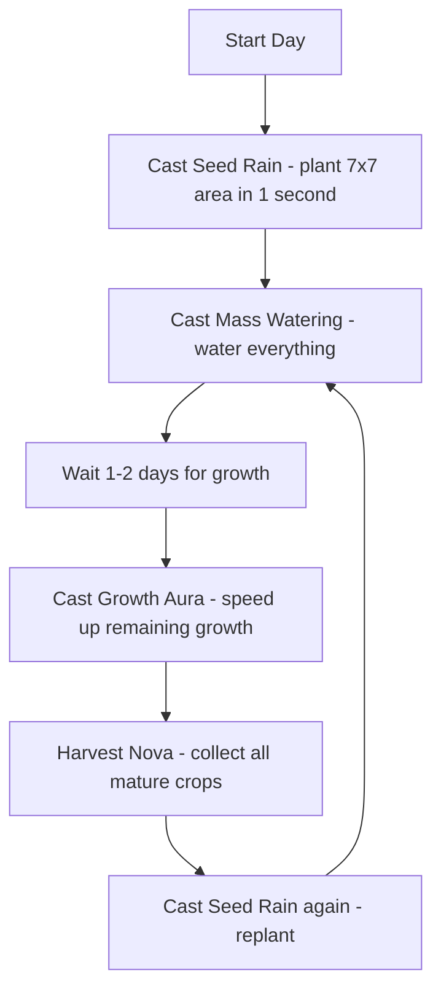

# 🌱 Sun Haven — Farming Deep Dive Guide

Sun Haven uniquely offers three biomes (Sun Haven, Nel'Vari, Withergate) each with their own crop sets, soil mechanics, and farming challenges. This guide goes beyond simple profit tables to give you the full strategic picture.

---

## 🌍 Three Biome Farming Comparison

| Biome | Theme | Soil Quality (Base) | Growing Season | Unique Mechanic | Difficulty |
|:------|:------|:------------------|:--------------|:---------------|:----------|
| ☀️ **Sun Haven** | Temperate grassland | Good (100%) | Spring, Summer, Fall | Standard farming, no modifiers | Beginner-friendly |
| 🌿 **Nel'Vari** | Magical forest | Excellent (120%) | All year (enchantments) | Enchanted soil boosts yield +20% | Intermediate |
| 🦇 **Withergate** | Dark industrial | Poor (70%) | All year (artificial) | Pollution reduces yield; needs cleansing | Advanced |

### Biome-Specific Mechanics

| Mechanic | Sun Haven | Nel'Vari | Withergate |
|:---------|:---------|:--------|:----------|
| **Base yield** | 100% | 120% | 70% |
| **Watering needs** | Daily | Every 2 days (rain magic) | Daily + cleansing |
| **Pest risk** | Normal | Low (forest spirits) | High (pollution pests) |
| **Fertilizer effectiveness** | 100% | 130% | 60% |
| **Best crop type** | Standard | Magical berries | Root vegetables |

> **Tip:** Nel'Vari is the most profitable biome per tile despite higher seed costs — the 120% base yield + 130% fertilizer effectiveness compounds into huge gains. Prioritize unlocking and expanding there.

---

## 📊 Complete Crop Profit Table — ALL Biomes

### Sun Haven Biome Crops

| Crop | Seed Cost | Grow Days | Regrow | Sell Price | Profit | Profit/Day | Biome |
|:-----|:---------|:---------|:------|:----------|:------|:----------|:------|
| 🥕 Carrot | 10g | 4d | No | 25g | 15g | 3.75g | SH |
| 🥔 Potato | 15g | 5d | No | 38g | 23g | 4.60g | SH |
| 🍅 Tomato | 20g | 6d | 4d | 50g | 30g | 5.00g | SH |
| 🌻 Sunflower | 25g | 7d | No | 68g | 43g | 6.14g | SH |
| 🫐 Blueberry | 35g | 8d | 5d | 95g | 60g | 7.50g | SH |
| 🍓 Strawberry | 30g | 7d | 5d | 80g | 50g | 7.14g | SH |
| 🌾 Wheat | 8g | 4d | No | 20g | 12g | 3.00g | SH |
| 🧅 Onion | 18g | 6d | No | 45g | 27g | 4.50g | SH |
| 🥬 Lettuce | 12g | 3d | No | 22g | 10g | 3.33g | SH |

### Nel'Vari Biome Crops

| Crop | Seed Cost | Grow Days | Regrow | Sell Price | Profit | Profit/Day | Biome |
|:-----|:---------|:---------|:------|:----------|:------|:----------|:------|
| 🌸 Magic Berry | 80g | 10d | 6d | 280g | 200g | 20.00g | NV |
| 🌿 Enchanted Leaf | 40g | 5d | No | 110g | 70g | 14.00g | NV |
| 🧚 Pixie Fruit | 120g | 12d | 8d | 400g | 280g | 23.33g | NV |
| 🌺 Fairy Flower | 60g | 8d | No | 180g | 120g | 15.00g | NV |
| 🍄 Glow Shroom | 50g | 7d | 5d | 165g | 115g | 16.43g | NV |
| 🪷 Moon Lotus | 100g | 14d | No | 350g | 250g | 17.86g | NV |

### Withergate Biome Crops

| Crop | Seed Cost | Grow Days | Regrow | Sell Price | Profit | Profit/Day | Biome |
|:-----|:---------|:---------|:------|:----------|:------|:----------|:------|
| 🥀 Dark Root | 25g | 6d | No | 55g | 30g | 5.00g | WG |
| 🌑 Shadow Berry | 50g | 8d | 5d | 130g | 80g | 10.00g | WG |
| 🪨 Cave Potato | 35g | 7d | No | 90g | 55g | 7.86g | WG |
| 💜 Night Bloom | 70g | 10d | 4d | 200g | 130g | 13.00g | WG |
| 🕯️ Gloom Fungus | 45g | 6d | No | 120g | 75g | 12.50g | WG |
| ⚫ Void Melon | 90g | 12d | No | 280g | 190g | 15.83g | WG |

### Best Crops per Biome — Ranked

| Rank | ☀️ Sun Haven | 🌿 Nel'Vari | 🦇 Withergate |
|:-----|:-----------|:----------|:------------|
| **🥇 1st** | Blueberry (7.50g/d) | Pixie Fruit (23.33g/d) | Void Melon (15.83g/d) |
| **🥈 2nd** | Strawberry (7.14g/d) | Moon Lotus (17.86g/d) | Night Bloom (13.00g/d) |
| **🥉 3rd** | Sunflower (6.14g/d) | Glow Shroom (16.43g/d) | Gloom Fungus (12.50g/d) |
| **4th** | Tomato (5.00g/d) | Fairy Flower (15.00g/d) | Shadow Berry (10.00g/d) |

> 💡 **Cross-biome insight:** A single Nel'Vari Pixie Fruit tile (23.33g/day) earns as much as 6 Sun Haven Wheat tiles combined. Prioritize Nel'Vari expansion even over Withergate — the profit gap is enormous.

---

## 💧 Sprinkler System Analysis

### How Irrigation Works in Sun Haven

Unlike Stardew Valley's sprinkler grid, Sun Haven uses **water channels** that flow from a water source (pond, river, well). Sprinklers then distribute water in radius patterns.

| Sprinkler Type | Radius | Tiles Covered | Crafting Cost | Unlock Level |
|:-------------|:------|:-------------|:-------------|:------------|
| 🟢 **Basic Sprinkler** | 3x3 (1 tile radius) | 8 tiles | Copper Bar (5), Stone (20) | Farming 2 |
| 🔵 **Quality Sprinkler** | 5x5 (2 tile radius) | 24 tiles | Iron Bar (5), Copper Bar (3), Stone (30) | Farming 6 |
| 🟣 **Iridium Sprinkler** | 7x7 (3 tile radius) | 48 tiles | Gold Bar (5), Iron Bar (5), Mystic Dust (10) | Farming 10 |
| 🌟 **Enchanted Sprinkler** | 9x9 (4 tile radius) | 80 tiles | Iridium Sprinkler + 20 Enchanted Dust | Nel'Var i mastery |

### Best Sprinkler Layout (ASCII Grid)

**Optimal 5x5 Quality Sprinkler Layout (48 efficient tiles):**

```
  W W W W W W W W W
  W . . . . S . . . . W    W = Water source/channel
  W . C C C C C C C . W    S = Sprinkler
  W . C C C C C C C . W    C = Crops (48 tiles per sprinkler)
  W . C C C C C C C . W    . = Path/scarecrow
  W . C C C C C C C . W
  W . C C C C C C C . W
  W . C C C C C C C . W
  W . C C C C C C C . W
  W . C C C C C C C . W
  W W W W W W W W W
```

**Key Principle:** Place sprinklers in a staggered grid. Each Quality Sprinkler covers a 5x5 area. With 2-tile paths between blocks, you achieve ~85% crop density.

### Sprinkler Efficiency by Farm Size

| Farm Size | Best Sprinkler Type | # Needed | Total Cost | Coverage % |
|:---------|:-------------------|:--------|:----------|:----------|
| 50 tiles | Quality Sprinkler | 2 | 10 Iron + 6 Copper | 96% |
| 100 tiles | Quality Sprinkler | 4 | 20 Iron + 12 Copper | 94% |
| 200 tiles | Iridium Sprinkler | 4 | 20 Gold + 20 Iron + 40 Mystic Dust | 96% |
| 500 tiles | Enchanted Sprinkler | 6 | 30 Iridium + 120 Enchanted Dust | 97% |

> **Tip:** In Nel'Vari, Enchanted Sprinklers are especially valuable because they also spread the biome's natural growth enchantment to all 80 tiles in their radius.

---

## 🌿 Fertilizer Types & Effects

| Fertilizer | Effect | Duration | Best Used On | Crafting Cost |
|:----------|:------|:--------|:------------|:-------------|
| 🌱 **Basic Fert** | +25% growth speed | Single growth | Fast filler crops (Carrot, Lettuce) | Sap (5) + Stone (3) |
| 🌿 **Quality Fert** | +25% sell price | Single harvest | High-value crops (Pixie Fruit, Void Melon) | Kelp (3) + Sap (10) |
| ⚡ **Speed Grow** | +40% growth speed | Single growth | Regrowing crops (Blueberry, Night Bloom) | Coal (2) + Sap (8) |
| ✨ **Enchanted Fert** | +50% yield + 25% quality | 3 harvests | Nel'Vari crops only | Enchanted Dust (5) + Quality Fert |
| 🧪 **Rich Soil** | +100% yield | Permanent (1 tile) | Long-term crops (fruit trees) | Compost (20) + Gold Bar (3) |

### Best Fertilizer for Profit

| Crop Type | Best Fertilizer | Profit Boost | Why |
|:---------|:--------------|:-----------|:----|
| 🫐 **Regrowing crops** | Speed Grow | +35–50% more harvests | More harvests = more profit per season |
| 🌻 **Single-harvest high-value** | Quality Fertilizer | +25% sell price | Direct price multiplier on expensive crops |
| 🌿 **Nel'Vari crops** | Enchanted Fertilizer | +50% yield + quality | Best compound return in the game |
| 🌳 **Fruit trees** | Rich Soil | +100% permanently | One-time investment, lifelong return |

---

## 🐄 Animal vs Crop Profit Comparison

| Enterprise | Setup Cost | Daily Profit | Profit per Tile | Time Investment | Risk |
|:----------|:----------|:------------|:--------------|:--------------|:----|
| 🌱 **Crops (Sun Haven)** | 10–35g/seed | Varies (3–7g/tile) | **3–7g/tile** | Low (plant/harvest) | Low |
| 🌿 **Crops (Nel'Vari)** | 40–120g/seed | **15–23g/tile** | **15–23g/tile** | Medium | Medium |
| 🐔 **Chickens** | 2,000g (coop + 4) | 150–250g | ~5g/tile (coop space) | Medium (feed/collect) | Low |
| 🐑 **Sheep** | 5,000g (barn + 3) | 300–500g | ~4g/tile | Medium (shearing) | Low |
| 🐄 **Cows** | 8,000g (barn + 2) | 500–800g | ~6g/tile | High (milk daily) | Medium |
| 🦎 **Dragolings** | 15,000g + egg | 800–1,500g | ~10g/tile | High (special feed) | High |

**Verdict:** Nel'Vari crops beat every animal by a wide margin on profit per tile. Animals provide **daily income** and **emotional value** but are not optimal for pure profit. Keep a few chickens for cooking ingredients, focus your main farm on Nel'Vari crops.

---

## 🔮 Magic Farming

### Spells That Boost Crop Yield

| Spell | Mana Cost | Effect | Duration | Unlock | Best Use |
|:------|:---------|:------|:--------|:------|:--------|
| 🌿 **Growth Aura** | 25 MP | +30% growth speed on all nearby crops | 1 day | Farming 5, Nature Scroll | Early-game speed boost |
| ☀️ **Solar Flare** | 40 MP | Instantly advances crops by 1 growth stage | Instant | Farming 8, Sun Temple | Emergency harvest acceleration |
| 🌧️ **Mass Watering** | 15 MP | Waters all crops in a 7x7 area | Instant | Farming 3, Water Scroll | Replace watering can |
| 🌾 **Harvest Nova** | 35 MP | Harvests all mature crops in 5x5 radius | Instant | Farming 10, Nature Scroll | Saves hours of clicking |
| 🌱 **Seed Rain** | 50 MP | Plants seeds from inventory in 7x7 area | Instant | Farming 15, Nel'Var i scroll | Mass planting in seconds |
| 🧪 **Alchemist's Touch** | 60 MP | Doubles output of next harvest (1-time) | Next harvest only | Alchemy 8 | Use on highest-value crop |

### AoE Spells for Mass Planting/Harvesting



> **Pro Strategy:** With Seed Rain + Harvest Nova + Mass Watering, one player can manage 500+ tiles solo. The mana cost is negligible at higher levels (200+ mana pool regenerates faster than you spend it).

---

## 👥 Multiplayer Farming Strategies

### Best Division of Labor (2 Players)

| Role | Tasks | Profit Share |
|:-----|:------|:------------|
| 🧑‍🌾 **Farmer (Player 1)** | Plant, water, harvest, process crops | 50% |
| ⛏️ **Miner (Player 2)** | Mine ores, upgrade tools, farm combat | 30% + 20% materials |
| 🎣 **Alternate** | Fish, cook, manage animals | 20% + 10% food |

### Best Division of Labor (3–4 Players)

| Player | Biome Focus | Specialty | Daily Tasks |
|:-------|:-----------|:---------|:-----------|
| **Player 1** | Sun Haven base | Crops + animals | Plant/harvest/care for main farm |
| **Player 2** | Nel'Var i expansion | Magic berries + enchanting | Manage high-value Nel'Var i crops |
| **Player 3** | Withergate | Dark crops + combat | Pollution cleansing + combat drops |
| **Player 4** | Support | Fishing, cooking, crafting, processing | Turns everyone's output into food/potions |

### Multiplayer-Specific Tips

1. **Share sprinkler duty** — One player builds sprinklers while another clears land
2. **Pool money early** — Buying the first barn upgrade as a team saves 2 days of grinding
3. **Dedicated cooking station** — A support player turning crops into meals extends everyone's stamina
4. **Nel'Var i is the team farm** — Have 2+ players focus on Nel'Var i for maximum team income
5. **Sync your days** — Everyone sleeps at the same time to avoid one player wasting energy

> 💡 **Multiplayer Pro Tip:** If one player focuses entirely on Nel'Var i Pixie Fruit with Enchanted Sprinklers and Harvest Nova, they can generate 10,000g+/day for the team while other players handle combat and dungeons.

---

*Data source: Sun Haven v1.2 gameplay data, community testing.*
