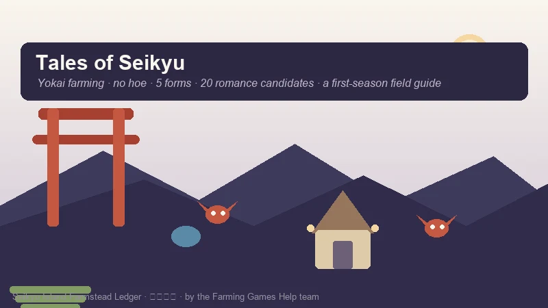
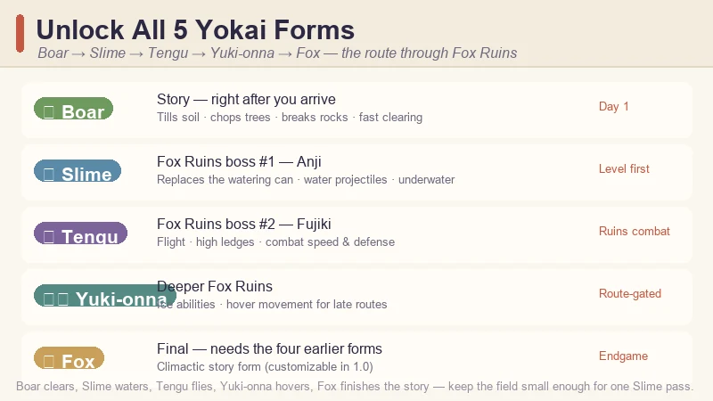
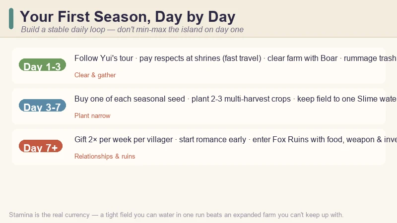
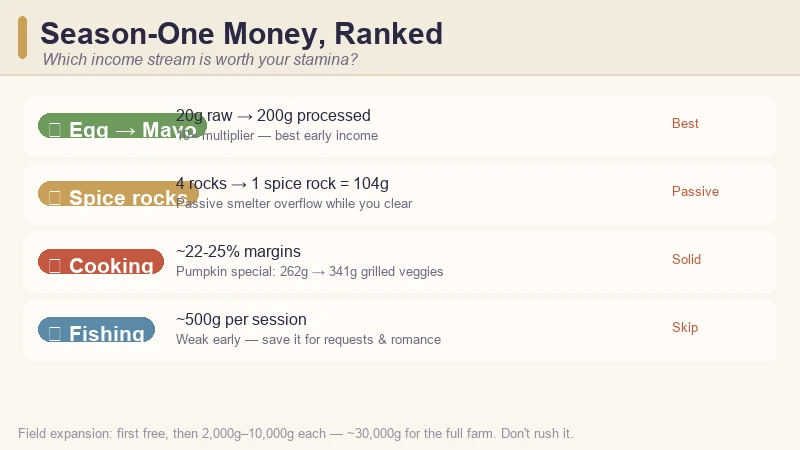
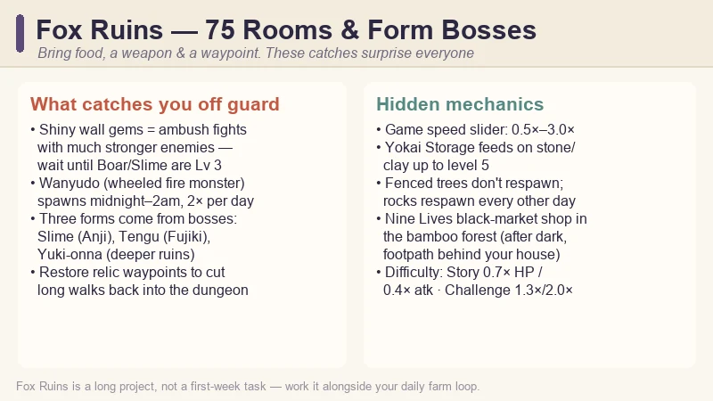

# Tales of Seikyu Beginner's Guide — Yokai Farming, First Season Tips & Money Making

> Game: Tales of Seikyu (青岚物语) | Developer: ACE Entertainment | Publisher: Fireshine Games | Release: June 11, 2026 (Steam 1.0, after a year of Early Access) | Price: $24.99 base ($17.49 launch week) | Platforms: PC

I did not expect to spend my first Seikyu night sprinting across a beach in boar form, smashing rocks with my head for construction materials — but that is exactly how this game wants you to farm. **Tales of Seikyu** launched its **1.0 version on June 11, 2026** at **$24.99** (**$17.49** during the launch-week discount) and immediately landed a **"Very Positive"** Steam rating. It is a cozy yokai farming sim from Taiwanese studio **ACE Entertainment** where you never pick up a hoe or a watering can — you *become* the tools.

This guide covers what I wish I knew before my first week: how the transformation system replaces every classic farming tool, the exact order to unlock all five yokai forms, a day-by-day first-season plan, which income streams are actually worth your stamina, how the 20-candidate romance system works, and the Fox Ruins traps nobody warns you about.

*Guide data gathered from the Steam store page, the 1.0 launch patch notes and SteamDB, launch-week reviews and community walkthroughs, and the Fox Ruins guide videos shared by the Chinese community on Bilibili. Prices and details reflect the June 2026 1.0 build — always check the Steam page before buying.*

---

## What Is Tales of Seikyu?

**Tales of Seikyu** is a yokai-filled farming and life-sim game set on Seikyu, a hidden island where spirits live openly as humans. You inherit a run-down farmhouse, rebuild it season by season, befriend the island's yokai residents, and uncover why the fox clan vanished.

| Fact | Detail |
|:-----|:-------|
| **Developer / Publisher** | ACE Entertainment / Fireshine Games |
| **Steam release** | June 11, 2026 (1.0) · Early Access from May 21, 2025 |
| **Price** | $24.99 base · **$17.49 during the launch-week discount** |
| **Rating** | "Very Positive" (~85–87% positive in the launch window) |
| **Forms** | 5 transformation forms: Boar · Slime · Tengu · Yuki-onna · Fox |
| **Romance** | 20 romance candidates (1.0 promo; ~18 confirmed marriageable) — up from 6 in Early Access |
| **Fox Ruins** | 75-room dungeon (1.0) — three forms are locked behind its bosses |
| **Genre** | Cozy farming · life sim · yokai RPG · romance |

The single biggest difference from Stardew-style games is the tool system. **There is no hoe, no watering can, no axe.** Everything on the farm runs through your yokai transformations, and once that clicks, the whole game opens up. The other surprise is that the game is *not* small — Fox Ruins alone has 75 rooms in 1.0, and the endgame (marriage, ranch facilities, the 75-room *Move Over, Yohji* achievement) is a genuinely long project.

---

## The Tool System — No Hoe, No Watering Can, Just Yokai Forms

The fastest way to get confused in Seikyu is to play it like Stardew. You don't equip tools; you **switch forms**, and each form *is* a set of tools with a stamina cost.

| Form | How to unlock | What it does | First-season priority |
|:-----|:--------------|:-------------|:----------------------|
| 🐗 **Boar** | Main story, right after you arrive on the island | Ground-slam tills soil, chops trees and breaks rocks in one move; fast travel on the farm | **Use it from day 1** — it is your clearing and gathering form |
| 🫧 **Slime** | Defeat **Anji**, the first Tanuki boss in Fox Ruins | Fires water projectiles that replace the watering can; refills from any water source; enables underwater movement | **Level it first** — it makes watering feel free |
| 🪶 **Tengu** | Defeat **Fujiki**, the second Tanuki boss in Fox Ruins | Flight and high ledges; good combat acceleration and defense bonuses | Level for ruins combat once unlocked |
| ❄️ **Yuki-onna** | Later in Fox Ruins, after the first three forms | Ice-based abilities and hover movement for late vertical routes | Route-gated — needed for some ruins rooms |
| 🦊 **Fox** | Final transformation; requires the four earlier forms (1.0 added a customizable Fox form) | The climactic form for the late story | Endgame goal |

The practical takeaway: **Boar clears, Slime waters, Tengu flies, Yuki-onna hovers, Fox finishes the story.** Several early guides still list only three forms because they were written against the Early Access build — the 1.0 form tree goes all the way to Fox.

Two form-specific rules I'd give anyone:

- **Keep your field small enough for Slime to water in one pass.** The first real efficiency decision in the game is "how big can my field be before watering costs my whole day?" A tight field you can water in one Slime run beats an expanded one that drains your stamina by late morning.
- **Don't spend form-upgrade amulets randomly.** Check the Forms menu after every major ruins boss and spend on the form that solves your *current* blocker — Slime for watering, Tengu for vertical access, Boar for clearing speed.

---

## Your First Season, Day by Day

The opening week is about building a stable daily loop, not min-maxing the whole island. Here's the route that worked for me:

### Day 1–3: Burn your stamina clearing

- Follow **Yui's town tour**, reach your farmhouse, and learn how the shipping box works.
- **Pay respects at the first fox shrines.** After you restore a couple, you unlock teleporting between them — your first fast-travel network, and it matters as soon as your day has to cover town, farm, ruins and requests.
- **Clear the farm with Boar form every day until your stamina runs out.** Wood, stone and clay are the bottleneck for everything in the first weeks: storage chests (10 wood planks each), field expansion, and ranch buildings all pull from the same pile.
- **Rummage every garbage can in town.** It is not flavor — the bins consistently drop eggs, and eggs are your first reliable income before crops yield.

### Day 3–7: Plant narrow, plant smart

- Buy **one of each seasonal seed** from Musashi's General Store so you learn what the current season grows.
- Pick **two or three multi-harvest crops** (strawberries and raspberries in spring) and plant a field small enough for Slime form to water in a single pass.
- **Take the fishing request off the Request Board** (near the town fountain) and unlock the **Basic Rod** from Torleone on the docks. You don't need to become a fishing completionist — just unlock the rod so fish, food and water requests aren't blocked later.

### Day 7+: Start the relationship clock

- **Begin gifting in week one.** You can give each villager **two gifts per week**, and the game enforces the cap — you can't stockpile to speed things up later. Event triggers are tied to heart level, not to a specific day, so every week you delay is progress you don't get back.

---

## Money in Season One — What's Actually Worth Your Stamina

The biggest trap in the first season is thinking "fishing is relaxing, I'll farm fish for money." Let the numbers change your mind:

| Income source | Return | Verdict |
|:--------------|:-------|:--------|
| 🥚 **Egg → Mayonnaise** | 20g raw → **200g processed** (10×) | **Best early multiplier** — the moment you have chickens, this chain beats most crops |
| 🪨 **Spice rocks (smelter)** | 4 rocks → **1 spice rock worth 104g** | Passive — you're gathering rocks anyway; overflow goes to the smelter |
| 🍳 **Cooking** | ~22–25% margins on average | Pumpkin special: 2 pumpkins (262g) → grilled veggies (**341g**) |
| 🎣 **Fishing** | ~500g per session | **Weak early income** — save it for request and relationship needs |

The egg-to-mayonnaise conversion is the standout: each egg is worth **20g raw**, but processed into mayonnaise it sells for **200g** — a **tenfold** increase. Combined with garbage-can eggs, that's your first real money loop before the fields mature.

Field expansion is a long game, not a day-one purchase: the **first expansion is free**, then upgrades cost **2,000g to 10,000g** progressively, and full farm development runs to about **30,000g**. Don't rush it — a tight farm you can manage in one morning generates steadier income than an expanded field that overwhelms your stamina.

---

## Romance & Relationships — Start From Day One

The 1.0 update turned romance from a side feature into a headline one: **20 romance candidates** per the 1.0 promo (community guides confirm around 18 as marriageable), up from just 6 in Early Access. Heart events run to level 10, and marriage unlocks at the **tenth heart event**, after which your spouse helps around the farm.

- **Two gifts per week per villager, max.** The game enforces this, so plan ahead. If a birthday is coming, gift once in the morning and save the second slot for a higher-value birthday item — two low-value gifts early in the day close the window.
- **White rocks are a universal fallback** that most villagers appreciate. The one exception: **Hephaestus prefers gold ore.** Craftspeople like Sasaki respond better to raw materials matching their trade (wood and stone over cooked food).
- **Tavern visits count.** Treating someone at the tavern means conversation and presence, not buying them a drink — it builds relationship points without touching your weekly gift quota.

Start gifting your chosen candidates in week one, even if marriage feels far away. Early momentum in this system is the difference between a first-year wedding and a second-year scramble.

---

## Fox Ruins — When to Go and What Catches You Off Guard

Fox Ruins is not optional. It's where **three of your five forms come from** (Slime, Tengu, Yuki-onna), and the bosses that gate them are the first real difficulty spike after the tutorial. Enter when you have food, a weapon, inventory space, and a shrine or relic waypoint nearby — then expect these gotchas:

- **Shiny gems are a trap.** A glowing gem embedded in a ruins wall is a combat encounter with a significantly stronger enemy. Don't interact until you've leveled Boar or Slime form to at least **level 3**.
- **Night monsters are a different category.** Wanyudo (the wheeled fire monster) can spawn **twice per day** in ruins and wilderness between **midnight and 2am**. If you're farming or exploring at night, expect interruptions.
- **The ruins are 75 rooms in 1.0** (post-launch updates push it toward ~95). Full completion is a long-form project, not a first-week task. Treat it as a secondary activity to your daily farm loop.
- **Restore relic waypoints as you find them.** They're teleport points that save you from repeating long walks into the dungeon.

---

## Hidden Mechanics the Game Doesn't Tell You

A handful of systems that most new players discover late — or don't discover at all:

- **Game speed is adjustable.** The settings menu has a slider from **0.5× to 3.0×**. The default pace is brisk, and new players miss heart events and market windows because the clock moves faster than expected. Slowing to 0.5× while you learn the seasonal calendar is a legitimate strategy.
- **Yokai Storage capacity matters.** Feed stone and clay to your Yokai Storage to level it (up to **level 5**). The capacity jump between level 1 and level 5 is substantial enough to be an early priority alongside Slime form.
- **Trees inside fenced areas don't respawn.** Rocks respawn every other day across the farm; thatch regenerates daily; but trees behind fences stay gone. Plan your farm layout before you close any fences.
- **Black Market rings at Nine Lives.** The shop in the bamboo forest — reachable after dark via the footpath behind your house, not the riverside route — sells stat-boosting rings. Nothing in the tutorial mentions it, and the rings make a real difference to Fox Ruins survival.
- **Difficulty modes are a choice, not a judgment.** Story Mode (0.7× monster HP, 0.4× attack) exists for a relaxed experience; Recommended is the standard; Challenge (1.3× HP, 2.0× attack) is for the masochists. Pick what keeps the farm cozy.

---

## Pro Tips & Common Mistakes

### ✅ Do This

- **Level Slime form first** — replacing your watering can is the single biggest quality-of-life unlock in the early game.
- **Rummage trash cans and clear with Boar daily** — eggs and raw materials are your first economy.
- **Plant narrow before Slime is leveled** — a field you can water in one pass wins over a huge one.
- **Take the fishing request early** to unlock the Basic Rod.
- **Gift twice a week from day one** to the villagers you want to romance.
- **Feed your Yokai Storage stone and clay** — the capacity jump is bigger than it looks.
- **Use the game-speed slider** if the clock feels frantic.

### ❌ Do Not Do This

- **Do not grind fishing for money in season one** — ~500g a session is poor next to egg-to-mayonnaise.
- **Do not touch shiny ruins gems unprepared** — they're combat ambushes.
- **Do not ignore the Request Board** — it's your direction system and unlocks the rod and early materials.
- **Do not expand the farm before your income and stamina can handle it** — expansions cost up to 10,000g each.
- **Do not spend upgrade amulets randomly** — spend on the form that solves your current blocker.

---

## FAQ

### Is Tales of Seikyu out of Early Access?
Yes. The **1.0 version launched June 11, 2026** on Steam, adding Chapter 3, the marriage system, 20 romance candidates (per 1.0 promo), yokai-powered farm automation, festivals, pets and ranch animals, and a crafting UI overhaul.

### How do I unlock all yokai forms in Tales of Seikyu?
Boar unlocks through the main story. **Slime** comes from defeating **Anji**, the first Tanuki boss in Fox Ruins; **Tengu** from defeating **Fujiki**, the second. **Yuki-onna** unlocks deeper in the ruins, and **Fox** is the final form requiring the four earlier ones.

### How do I till soil in Tales of Seikyu?
You don't use a hoe. Switch to **Boar form** and use the ground slam — it tills soil, chops trees, and breaks rocks in the same move. The same form handles clearing and gathering.

### How many romance candidates are in Tales of Seikyu 1.0?
**20 candidates per the 1.0 promo** (up from 6 in Early Access; guides confirm around 18 marriageable). Marriage becomes available after the **10th heart event**, and your spouse helps on the farm afterward.

### What's the best early money maker?
**Egg-to-mayonnaise conversion**: each egg is 20g raw but 200g processed — a tenfold increase. Spice rocks (104g per four rocks from the smelter) and cooking (~22–25% margins) round out a solid first-season income. Fishing is weak at ~500g per session.

### Is the field expansion worth it?
Only once your income and stamina are stable. The **first expansion is free**, then costs **2,000g to 10,000g** progressively (about 30,000g for full development). A tight field watered in one Slime pass beats an expanded one you can't keep up with.

### What gifts do villagers like?
**White rocks work universally** except for Hephaestus, who prefers gold ore. Craftspeople like Sasaki prefer raw materials matching their trade. Each villager accepts **two gifts per week** max.

### Is the Fox Ruins dungeon huge?
Yes — **75 rooms** in the 1.0 map (post-launch updates push it toward ~95), with bosses that unlock Slime, Tengu and Yuki-onna. Treat it as a long-term secondary activity, not a first-week task.

---

## 🔗 Related Guides

- 🌾 [Stardew Valley Complete Game Guide](/stardew/) — the cozy-farming benchmark for crop calendars and profit loops
- ✨ [Fields of Mistria Guide](/fields-mistria/) — another 2026 farming sim with romance and dungeons
- 🏝️ [Starsand Island Guide](/starsand-island/) — island farming, animals and community
- 👾 [Tiny Monster Haven Beginner's Guide](/tiny-monster-haven/) — the cozy creature-collector farming sim
- 🏘️ [Go-Go Town! Beginner's Guide](/go-go-town/) — the cozy city-builder + farming sim that launched 1.0 in July 2026
- ⚰️ [Grave Seasons Guide](/grave-seasons/) — the cozy-horror farming sim coming Fall 2026

---

*Guide data gathered from the Steam store page, the 1.0 patch notes and SteamDB, launch-week reviews and community walkthroughs, and Chinese community guide videos on Bilibili (e.g. the Fox Ruins walkthrough by fourtsu). Prices and details reflect the June 2026 1.0 build and may change with updates — always check the Steam page before buying.*
