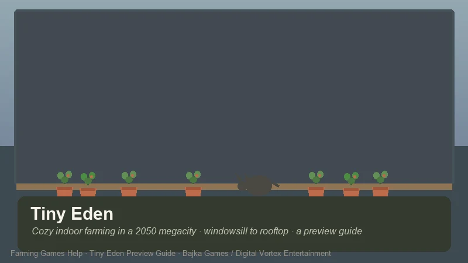
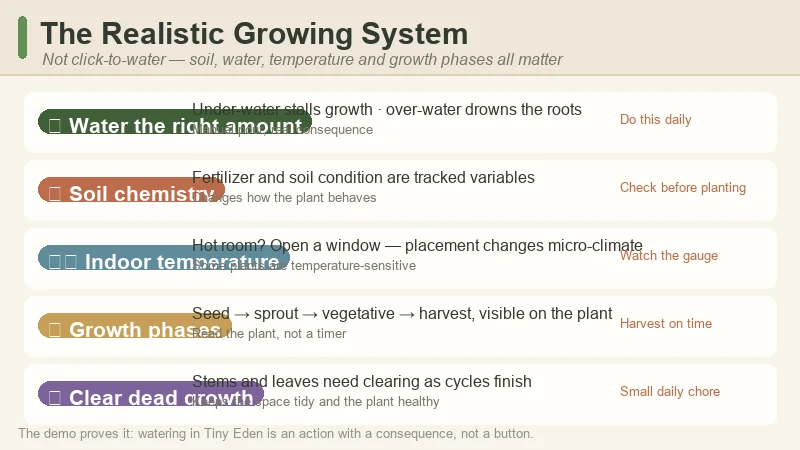
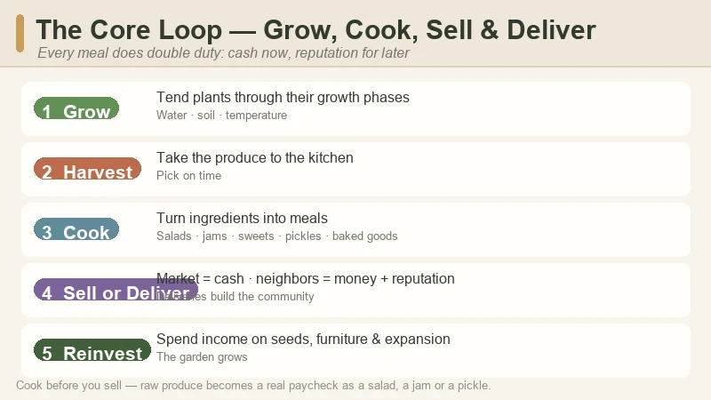
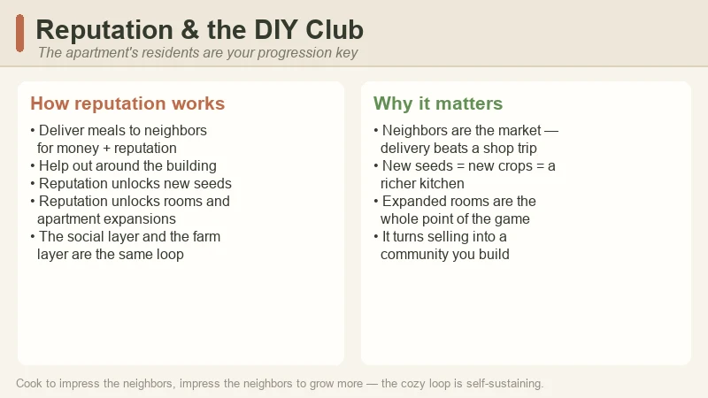
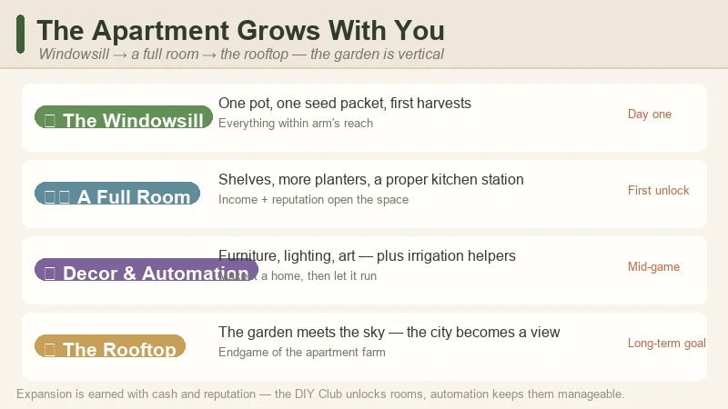

# Tiny Eden Preview Guide — Cozy Indoor Farming in a 2050 Megacity Apartment

> Game: Tiny Eden | Developer: Bajka Games (Warsaw studio) | Publisher: Digital Vortex Entertainment | Releasing: **September 7, 2026** (Steam PC; September 8 in some regions) | Platforms: PC (Windows) | Free demo: available now

I have been itching to write this one since the demo dropped. **Tiny Eden** is the coziest idea in farming games this year, and it is also the least "farm"-shaped: instead of a sprawling countryside plot, your entire garden lives inside a small apartment in a gray near-future megacity. You start with one pot on a windowsill and a single packet of seeds, and you build upward — from that sill to a whole room, and eventually to the rooftop — while a cat naps somewhere in the clutter.

It is made by **Bajka Games**, a Warsaw studio, and published by **Digital Vortex Entertainment**. It was announced under the working title *City Garden Harvest*, then rebranded to **Tiny Eden** — a name the developer and publisher say reflects "a clearer, warmer vision" of the experience after community feedback.

**One important note before you read on:** this is a **pre-release preview guide**, not a review of the finished game. Tiny Eden launches on **September 7, 2026** (September 8 in some regions), and everything below is built from what is actually playable or shown so far: the **free Steam demo**, the **official trailer and store page**, the **press announcements**, and **hands-on demo impressions**, cross-checked against a **31-minute Chinese community playthrough on Bilibili** that walks through the same systems the demo covers. I'll flag which details come from the developer's materials and which are observations from the demo itself.

---

## What Is Tiny Eden?

**Tiny Eden** is a first-person, cozy indoor farming and life sim set in a near-future (2050) megacity. You move into a bare, drab apartment that overlooks a gray city, and a single packet of seeds sets the whole story in motion. There's no big overworld, no mountain to climb and no town hall to rebuild — the "farm" is the apartment itself, and the game is entirely about turning that space into something alive.

| Fact | Detail |
|:-----|:-------|
| **Developer** | Bajka Games (Warsaw, Poland) |
| **Publisher** | Digital Vortex Entertainment |
| **Steam release** | September 7, 2026 (PC · Windows 10) — September 8 in some regions |
| **Working title** | *City Garden Harvest* (rebranded to Tiny Eden) |
| **Setting** | A bare apartment in a near-future (2050) megacity |
| **Perspective** | First-person |
| **Core loop** | Grow → harvest → cook → sell & deliver → reinvest in a bigger garden |
| **Growing style** | Realistic — soil chemistry, water amounts, growth phases, indoor temperature |
| **Crops** | Strawberries, tomatoes, peas, herbs, flowers, berries, cucumbers, watermelon, corn, peppers, cilantro |
| **Cooking** | Salads, baked goods, jams, sweets, pickles |
| **Automation** | Irrigation & equipment that cut down manual watering |
| **Pets** | A cat you can adopt and care for |
| **Free demo** | Available now on Steam — early demo reviews ~91% positive (SteamDB) |
| **Genre** | Cozy farming · indoor gardening · life sim · decoration |

**The pitch in one line:** Stardew Valley if it all happened on the windowsill of a city apartment — realistic enough that watering feels like real plant care, cozy enough that the lo-fi soundtrack and the cat do half the work.

> **First-person take, up front:** the demo sold me on the *texture* of the thing. The soil has chemistry, the plants have distinct growth phases, and the indoor temperature actually matters — open the wrong window and your peppers complain. It's the opposite of click-to-water farming. I'll get into the honest trade-offs (and the one repetitive part) at the end.

---

## The Premise — A Garden Inside Four Walls

The hook is the setting. Most farming sims hand you land and ask you to tame it; Tiny Eden hands you a **bare apartment** and asks you to *grow* it. You arrive with almost nothing — a seed packet, a windowsill, and a city that looks like it has given up on green entirely. The fantasy is horticulture as quiet rebellion: plant life where there shouldn't be any, one pot at a time.

A few things the official materials make clear about how it works:

- **The garden is vertical, not horizontal.** You don't expand outward into fields — you expand *upward and inward*: a pot on the sill, then shelves, then a full room, and eventually the rooftop.
- **The city is the backdrop.** The megacity skyline fills the windows, and the whole fantasy is turning a gray concrete space into a green one. Decoration and plant placement are part of the fantasy, not an afterthought.
- **The rhythm is small and daily.** Bajka's CEO **Aliaksandr Piskun** describes the game as built around the calming daily ritual of plant care — a meditative experience, not a min-maxing one. You're not racing a season clock so much as keeping a small ecosystem happy.
- **It's first-person.** You're in the apartment, looking at your plants at eye level. It changes how a farming sim *feels* — closer, more tactile, more personal.

This is the rare cozy game where the "small" scale is the entire point. The garden is small; the rituals are small; the wins are small. And that's exactly why it works.

---

## The Free Demo — What You Can Play Right Now

Before you read a single tip below, go play the demo. It's **free on Steam right now**, it's the best way to understand what Tiny Eden actually is, and early demo reviews are sitting around **~91% positive** on SteamDB — a strong sign for a pre-launch build.

What the demo covers:

- **The first-person apartment** — moving around, placing pots, and getting the feel for tending plants at eye level.
- **The full growing loop** — planting seeds, watering, watching growth phases, harvesting, and cooking.
- **A taste of the economy** — cooking meals and selling or delivering them for money and reputation.
- **The cat and the decorating** — the demo shows off how furniture, lighting and the pet slot fit into the apartment.
- **A hint of automation** — the demo teases the irrigation / helper-bot equipment that the full game builds on.

**The one honest criticism from demo players:** delivery quests get repetitive. Previewers (including Mike The Ferret's hands-on) note that delivering the same dishes to the same neighbors started to feel like a chore by the end of the demo. The full game is expected to flesh this out, but it's the weak spot to know about going in.

---

## The Realistic Growing System — Not Click-to-Water

The biggest surprise of the demo — and the reason Tiny Eden stands apart from the cozy-farming crowd — is how *real* the growing feels. This is not "click crop, wait, harvest." You are actively managing a small horticulture setup:

- **Manual planting.** You place each seed in the soil yourself, not press a "plant" button over a tile.
- **Water matters — the right amount.** Under-water and the plant stalls; over-water and you can drown the roots. Pouring is a physical action with a consequence.
- **Soil chemistry.** Fertilizer and soil condition are tracked as real variables, not a generic "quality" stat. What you add changes how the plant behaves.
- **Distinct growth phases.** Each plant moves through visible stages — seed, sprout, vegetative growth, harvest — and you can see the plant change shape as it matures.
- **Indoor temperature is a thing.** Some plants are temperature-sensitive. If the apartment gets too hot, you open a window; planter placement near the window vs. deeper in the room changes the micro-climate.
- **Dead growth needs clearing.** As plants finish their cycle, you clear dead stems and leaves — a small, oddly satisfying chore that keeps the space tidy.

The plants themselves skew to what actually grows indoors or on a balcony: **strawberries, tomatoes, peas, herbs, flowers, berries, cucumbers, watermelon, corn, peppers, and cilantro**. That list is what the store page and demo show, and it's a genuinely thoughtful indoor-friendly spread.

---

## The Core Loop — Grow, Cook, Sell & Deliver

Once you're harvesting, the loop opens up into Tiny Eden's economy:

1. **Grow** — tend your plants through their growth phases.
2. **Harvest** — take the produce to the kitchen.
3. **Cook** — turn ingredients into meals: salads, baked goods, jams, sweets, and pickles.
4. **Sell or deliver** — sell at the **market** for cash, or deliver directly to **neighbors** to earn money *and* reputation.
5. **Reinvest** — spend income on seeds, furniture, automation, and expanding your space.

The delivery option is the interesting one. Delivering to neighbors isn't just a nicer way to sell — it's how you build **reputation**, and reputation is what opens the door to the rest of the game (next section). So the loop is doing double duty: cash for the present, reputation for the future.

---

## Reputation & the DIY Club

The community layer of Tiny Eden is the **DIY Club** — the apartment complex's resident tinkerers and green-thumbs. Your reputation with them is the game's main progression key:

- **Building reputation** comes mostly from delivering food to neighbors and helping out around the building.
- **Reputation unlocks seeds** — new plant varieties that aren't available to a newcomer.
- **Reputation unlocks rooms and expansions** — the apartment's layout itself grows as the DIY Club trusts you with more space.

So the social layer and the farm layer are the same loop: cook to impress the neighbors, impress the neighbors to grow more. It's a neat way to make the "friendship" mechanic pay for the "farming" mechanic, and it keeps you invested in the building as a community rather than just a greenhouse.

---

## Expanding Your Apartment Farm

The clearest progression arc in the demo is **vertical expansion**, and it's worth knowing the shape of it before you start:

1. **The windowsill** — your first pot, your first seeds, your first harvests. Everything is within arm's reach.
2. **A full room** — as income and reputation grow, the garden takes over a whole room: shelves, more planters, a cooking station with more room to work.
3. **The rooftop** — the endgame of the apartment farm, where the garden finally meets the sky and the megacity stops being a wall and becomes a view.

Along the way, income gets reinvested into **furniture, floor treatments, light fixtures and art** — so the apartment stops being a gray box and becomes a home. The decorating layer is a full first-class system, not a cosmetic afterthought: the fantasy is as much about the space looking warm as it is about the plants growing.

---

## Automation & Your Cat

Two quality-of-life layers round out the experience, and both are more central than they first appear:

- **Automation / irrigation.** The demo teases equipment that waters for you, and the full game's pitch is that as your garden grows beyond one room, you're expected to automate the busywork. It's a smart-garden fantasy: set up the system, then enjoy the plants instead of babysitting them.
- **Your cat.** You can adopt and care for a cat that lives in the apartment with you. In a game about tending a small green world, a pet is the natural companion — and the Bilibili playthrough shows the cat hanging around the planters like it owns the place. (It does.)

Neither is a gimmick. Automation answers the one real pain point of a growing garden (time), and the cat answers the coziest question the game asks: once you've made a green home, who do you share it with?

---

## Tiny Eden vs. Other Cozy Farming Sims

| | **Tiny Eden** | **Stardew Valley** | **Fields of Mistria** | **Sun Haven** |
|:--|:--|:--|:--|:--|
| **Setting** | 2050 megacity apartment | Countryside farm town | Fantasy town | Fantasy realm |
| **Perspective** | First-person | Top-down | Pixel-art top-down | Top-down |
| **Scale** | Indoor — windowsill to rooftop | Large outdoor farm | Large outdoor farm | Large farm + zones |
| **Growing** | Realistic (soil chemistry, temp, water) | Simple (till, plant, water) | Simple + quality tiers | Simple + biomes |
| **Main hook** | Cozy indoor gardening & decoration | Life sim benchmark | Romance + dungeons | 8-player co-op, magic |
| **Release state** | Sept 7, 2026 (demo now) | Released (2016) | 1.0 (Aug 2026) | Released (EA) |

It's not trying to beat Stardew at scale — it's deliberately smaller and closer. If you're looking for a huge farm to min-max, Tiny Eden isn't that. If you want a cozy, tactile, *green* space that you build one pot at a time, there's nothing else quite like it.

---

## Pro Tips — Do & Don't

### ✅ Do This

- **Play the demo before deciding.** It's free, ~91% positive, and it tells you exactly whether the "realistic growing" style clicks with you.
- **Read your plants, not the calendar.** Water amounts, temperature, and soil are the real mechanics here — learn what each plant needs instead of treating it like a timer.
- **Open a window when it gets hot.** Temperature-sensitive plants reward you for paying attention to the room's micro-climate.
- **Cook before you sell.** Raw produce becomes a real paycheck once it's a salad, a jam, or a pickle.
- **Deliver to neighbors early.** Reputation is the unlock key for seeds and rooms — start building it from day one.
- **Buy a few of each seed.** Tiny Eden's realistic growing means variety is a hedge: if you can't keep one plant happy, the others keep your kitchen stocked.

### ❌ Do Not Do This

- **Do not expect a big outdoor farm.** The whole point is the small, indoor space. Min-maxers will bounce off it.
- **Do not over-water.** "Pour enough water" is a real mechanic — drowning roots is a thing.
- **Do not ignore soil chemistry.** Fertilizer and soil condition change how plants grow; treating them like a cosmetic stat leaves money on the table.
- **Do not grind the delivery quests if they bore you.** Previewers flag them as the repetitive part; the full game is expected to add variety — if it feels like a chore, do a little and move on.
- **Do not forget the cat.** It's not a mechanic to min-max — it's the whole point of the cozy fantasy.

---

## FAQ

### When does Tiny Eden release?
**September 7, 2026** on Steam (PC, Windows 10); **September 8** in some regions (e.g. Japan). A **free demo is available now**.

### Is Tiny Eden out yet?
No — it's a **pre-release preview guide**. The game launches September 7, 2026. Everything in this guide is based on the demo, the official trailer, press materials and hands-on impressions.

### What is Tiny Eden about?
You move into a bare apartment in a near-future megacity and turn it into an indoor garden — from a single windowsill pot to a full room and eventually the rooftop. Grow plants with realistic soil, water and temperature mechanics, cook meals, sell or deliver them, build reputation with the apartment's DIY Club, decorate your space, and care for a cat.

### What's the difference from other farming sims?
The scale and the realism. It's first-person, indoor, and vertical (windowsill → rooftop), with a growing system based on soil chemistry, water amounts and indoor temperature rather than simple click-to-plant farming.

### Can I play Tiny Eden now?
The **free Steam demo** is available now. Early demo reviews are around **~91% positive** on SteamDB.

### Does Tiny Eden have automation?
Yes — the demo teases irrigation and helper equipment, and the full game's pitch includes automating the busywork as your garden grows beyond one room.

### Is there a cat?
Yes. You can adopt and care for a cat that lives in the apartment with you.

### What are the system requirements?
Minimum: **Windows 10, i5 processor, 4 GB RAM, RTX 2070, 2 GB storage** (recommended: RTX 3070). Check the Steam page for the final list.

---

## 🔗 Related Guides

- 🏠 [Stardew Valley Complete Game Guide](/stardew/) — the cozy-farming benchmark for crop calendars and profit loops
- ✨ [Fields of Mistria Guide](/fields-mistria/) — another 2026 farming sim with a 1.0 launch
- ☀️ [Sun Haven Guide](/sun-haven/) — the fantasy farming sim with magic and co-op
- 🌵 [Sandrock Guide](/sandrock/) — My Time at Sandrock's crafting-heavy farming
- ⚰️ [Grave Seasons Guide](/grave-seasons/) — the cozy-horror farming sim coming Fall 2026
- 🏘️ [Go-Go Town! Beginner's Guide](/go-go-town/) — the cozy city-builder + farming sim that launched 1.0 in July 2026

---

*Guide data gathered from the official Steam store page and free demo, the developer and publisher press announcements (Stride PR / Simulation Daily / GameDaily), the Gamezebo rebrand article, hands-on demo impressions (Mike The Ferret), and a Chinese community playthrough on Bilibili (《从阳台到屋顶花园…【Tiny Eden】测试版试玩实况》, 远景视频, August 2026). Tiny Eden is not yet released — details reflect the September 2026 launch build and demo and may change before and after launch; always check the Steam page before buying.*
