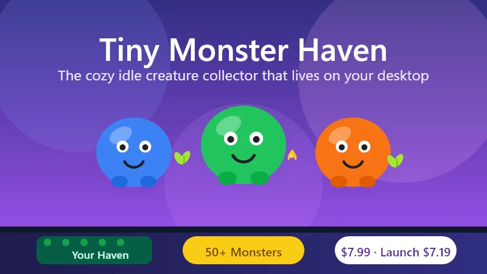
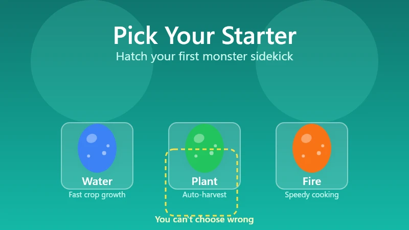
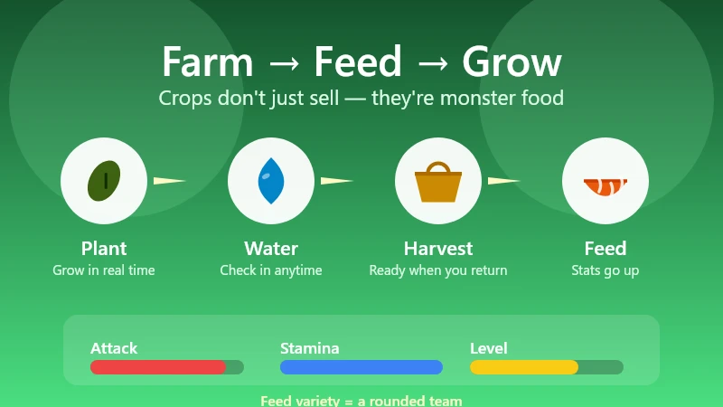
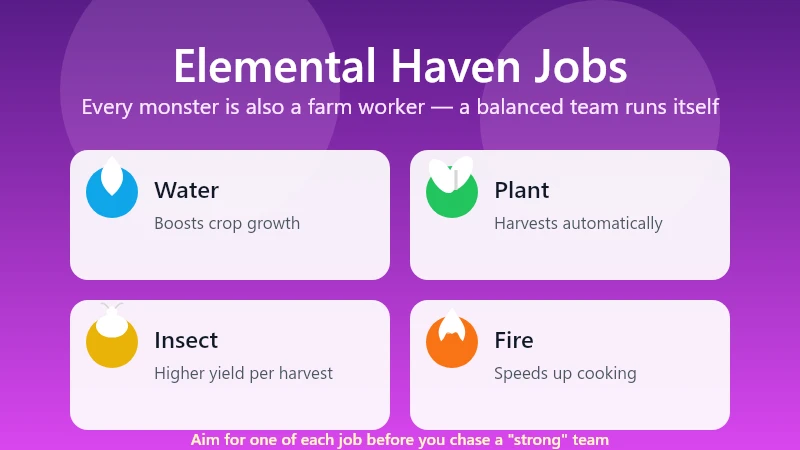
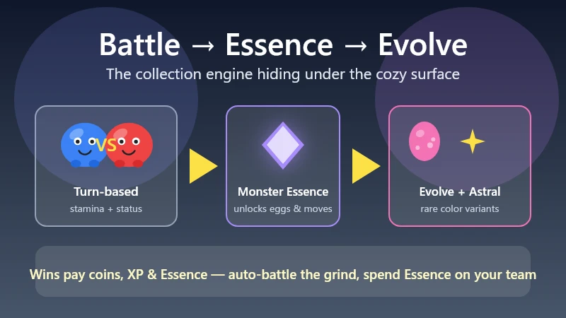

# Tiny Monster Haven Beginner's Guide — Idle Farming With 50+ Monsters

> Game: Tiny Monster Haven | Developer: Digging Dino (Belgian indie, solo dev Lodeman) | Release: August 11, 2026 (Steam) | Price: $7.99 base ($7.19 at launch) | Platforms: PC (Windows)

I have a confession: Tiny Monster Haven has been living at the bottom of my screen for three days, and it has quietly become the most relaxing thing I do all week. It launched on **August 11, 2026** for **$7.99** (or **$7.19** during the first week), and it takes the "desktop pet" idea seriously — the game runs as a tiny garden strip along the bottom edge of your monitor while you work, browse, or do literally anything else. You raise a team of **50+ monsters** that water crops, harvest, pollinate, and cook for you, and it somehow manages to be both a cozy farming sim and a proper creature collector at the same time.

This guide covers everything I wish I'd known in my first two hours: how the idle Haven actually works, which starter to pick, how the crop-to-stats feeding loop drives everything, which elemental types do which farm jobs, and how battles, evolutions, and the rarer Astral monsters fit into the loop.

*Guide data gathered from the Steam store page, the developer's launch announcement and press coverage, the Steam demo feedback threads (where Lodeman actively responds), and community walkthroughs from the launch week. Prices and details reflect the August 11, 2026 launch build — always check the Steam page before buying.*

---

## What Is Tiny Monster Haven?

**Tiny Monster Haven** is a cozy idle creature collector from **Digging Dino**, a small Belgian indie studio (the whole thing is built by solo developer Lodeman). The obvious inspirations are the **Chao garden from Sonic Adventure 2** and **Rusty's Retirement** — two games that proved people will happily maintain a tiny virtual world they can glance at without committing their full attention. Tiny Monster Haven takes that idea and gives it a full monster-collector RPG underneath.

| Fact | Detail |
|:-----|:-------|
| **Developer** | Digging Dino (Belgian indie studio, solo developer Lodeman) |
| **Steam release** | August 11, 2026 (Windows 10/11, ~354 MB) |
| **Price** | $7.99 base · **$7.19 during the launch discount** |
| **Monsters** | 50+ unique species to hatch and evolve |
| **Play style** | Idle desktop game — runs at the bottom of your screen |
| **Core loop** | Farm crops → feed monsters → battle for Essence → evolve & hatch new eggs |
| **Steam demo rating** | 100% positive (12 reviews) heading into launch |
| **Genre** | Cozy farming · creature collector · idle simulation |

The pitch in one line: **it's a Stardew-sized farming loop and a Pokémon-sized collection goal, both scaled down to fit on the bottom edge of your monitor.** Monsters keep working while you're away — they're not waiting for you. That "it runs itself" quality is the whole point, but there's real depth hiding under the idle surface.

---

## The Desktop Haven — How the Idle Game Works

The first thing that surprises everyone is that the game is genuinely *on your desktop*. After launch, your Haven renders as a horizontal strip pinned to the bottom of your screen — a little strip of farm, garden, and monster houses. It stays there while you work in other windows, and you can check in whenever you want.

- **It never demands your attention.** Crops grow, monsters work, and time passes whether you're looking or not. You can walk away for an hour and come back to a harvest waiting.
- **The game scales to a tiny window.** Everything is readable at a glance — you don't need to maximize anything to see what's happening.
- **Monsters idle-work on their own.** Watering, harvesting, pollinating, and cooking happen automatically once a monster is assigned to that job (more on jobs below).
- **You interact when you want to.** Hatching eggs, cooking recipes, sending monsters to battle, decorating the Haven — those are the hands-on moments between the idle stretches.

The genius of the format is that it's never "on" in the way a real farming sim is. You plant a crop, and it grows in real time while you do your actual job. Come back, harvest, feed your monsters, and decide what's next. It's the coziest possible version of "I'll just check my farm for a second" — except the farm never needs you to babysit it.

---

## Getting Started — Pick a Starter, Hatch Your First Egg

Your first real decision is the **starter monster**. You choose from a small set of starter types and **hatch your first monster egg** — and that little guy is your sidekick, the one monster that follows you around the menus and the face of your Haven until your team grows.

A few things the game doesn't spell out in the first ten minutes:

1. **Your starter's element matters for your first farm jobs.** Because elemental types map to Haven productivity (below), the starter you pick partly decides which farm chore is strongest from day one. It's not a trap — everything is rebalanced by the second monster — but it's worth picking a type you like.
2. **Hatch a second egg as soon as you can.** The demo feedback threads complained the game makes eggs almost too easy to come by early, and the developer leaned into that: early on, more monsters = more jobs covered = faster loop. Don't hoard Essence for the "best" monster — build your workforce.
3. **Every monster is worth raising.** There's no throwaway tier. Because monsters contribute to the Haven with productivity jobs *and* to battles, a "weak" battler can still be an excellent farmer. Collect first, optimize later.

---

## Crops, Feeding & the Stat Loop

The farming layer is what ties everything together. You plant crops in your Haven, they grow in real time, you harvest them, and you **feed them to your monsters**. That's the key loop: **crops don't just sell — they're monster food, and what you feed a monster changes its stats.**

- **Different crops affect different stats.** Some crops boost a monster's attack, others its stamina or growth. What you plant isn't just a money decision — it's a training decision.
- **Grow a variety.** If you only plant one crop, you can only buff one stat. A mixed plot lets you round out your team.
- **Feed regularly for faster leveling.** Well-fed monsters level noticeably faster, which matters because evolutions and stronger moves are gated behind levels.
- **Harvest on a schedule.** Because growth is real-time, a crop you planted before bed will be ready by morning. Check your Haven whenever you return to the desk — a full field of ready crops is the single easiest progress boost in the game.

The developer's own play recommendation mirrors the community's: **keep the farm running constantly and feed early and often.** In an idle game, the player who checks in regularly always outpaces the one who doesn't.

---

## Elemental Types & Haven Jobs

Here's where Tiny Monster Haven gets clever. Monsters aren't just battlers — each **elemental type is also a specialist farm worker**, and the type chart maps cleanly onto what needs doing in the Haven:

| Element | Haven job | What it means for your farm |
|:--------|:----------|:----------------------------|
| 💧 **Water** | Boosts crop growth | Crops mature faster — your single best early-game quality-of-life type |
| 🌿 **Plant** | Harvests crops | Picks ready crops automatically — frees you from checking constantly |
| 🐞 **Insect** | Pollinates / boosts yield | Higher yield per harvest — more food, more stat food, more coins |
| 🔥 **Fire** | Speeds up cooking | Meals finish faster — matters once recipes are part of your loop |

**The takeaway:** a balanced team is a fully automated Haven. One water type speeding growth, one plant type harvesting, one insect type boosting yield, and one fire type in the kitchen — and the farm basically runs itself while you handle battles and eggs.

This is also why the demo players' "just collect two monsters" strategy is a trap. Two monsters can't cover four jobs, so your Haven crawls. Aim for coverage before you aim for a "strong" team.

---

## Cooking — Recipes Are the Hidden Power Multiplier

Cooking is the mechanic people bounce off first and underrate most. **Recipes give monsters stat boosts and faster leveling**, and different meals affect different stats — so a monster that eats well before a battle genuinely fights better.

The one learning curve is the UI: in the demo, you had to **select a recipe first** before cooking (you can't just toss ingredients at the stove). The developer has since updated the cooking flow, but the habit is still worth building:

1. **Pick the recipe** you want to cook.
2. **Add the ingredients** it calls for.
3. **Cook it** (faster with a fire type assigned to the kitchen).
4. **Feed the meal to the monster** whose stat you want boosted.

Early on, cooking is more of a "treat" system than a core income source. But once your monsters hit the level where battles get serious, a well-timed meal is the difference between a close win and a sweep. The demo feedback thread noted there was no way to sell crops or cooked food for coins in the early build — the money in this game comes from *using* the food, not selling it.

---

## Battles, Monster Essence & Evolutions

Under the cozy exterior is a proper turn-based battle system, and it's the engine for your monster collection. Wild monsters will occasionally challenge you; you can also go looking for fights.

- **Combat is turn-based and stamina-driven.** Moves cost stamina, and status effects are in play — it's a real tactics layer, not an idle auto-battle.
- **You can auto-battle.** When you're just grinding Essence, toggle auto-battle and let the AI handle routine fights.
- **Battles pay in three things:** coins, XP, and — the big one — **Monster Essence**.
- **Essence is the collection currency.** You spend it to **teach new moves, trigger evolutions, and unlock new monster eggs.** It's the loop that keeps you coming back: fight → Essence → new monster → stronger team → bigger fights.
- **Overdrive and team fights.** Later battles open up **2v2 and 3v3** matches and the **Overdrive** ability, so your whole Haven's roster eventually matters, not just one monster.

**The endgame goal:** once your team is strong enough, you can leave your Haven and go on a **campaign across towns and routes**, challenging NPC tamers and **Elemental Gurus** in team battles, culminating in a **grand tournament** to become regional champion. The idle game quietly becomes a real monster-tamer RPG if you want it to.

---

## Astral Variants, Day/Night & Seasonal Spawns

Two systems keep the collection interesting past the first dozen monsters:

- **Astral variants.** Certain wild monsters spawn as rare **"Astral" versions**. Beat them and they can drop **Astral Gems** (Uncommon and Rare tiers). Give a gem to an egg and it hatches an **alternate-color Astral monster** — the collector's chase item of the game.
- **Day/night cycle and seasons.** Some wild monsters **only appear at certain times of day or in certain seasons**. If you're hunting a specific monster for its elemental coverage, check the clock — a monster that only shows up at night will not be there at noon.

Both systems reward the same behavior: **checking in regularly and battling whatever shows up.** The collection runs on presence, not on grinding one screen for hours.

---

## Decorations & Haven Efficiency

The decorating layer isn't just cosmetic. **Decorative scenery boosts both your Haven's efficiency and your monsters' effectiveness** — so that cute hedge or little pond you placed "for vibes" is also quietly making your farm better.

- Place decorations early — the efficiency bonus compounds with everything else in the loop.
- The boosts are passive: once placed, they keep working without upkeep.
- There's no wrong way to decorate, but there is a *better* order: place a few efficiency decorations before you expand your crop plot, and the whole loop speeds up from day one.

---

## Pro Tips & Common Mistakes

### ✅ Do This

- **Hatch a second monster early.** More monsters = all four Haven jobs covered = the farm runs itself.
- **Plant a variety of crops.** Different crops buff different stats — a mixed field trains a rounded team.
- **Feed your monsters every time you check in.** Well-fed monsters level faster, and levels unlock moves and evolutions.
- **Keep one of each elemental job covered** — water for growth, plant for harvest, insect for yield, fire for cooking.
- **Use auto-battle for Essence grinding.** Save your attention for the fights that matter.
- **Check the clock before hunting a specific monster.** Day/night and seasons gate the rare spawns.
- **Place decorations early.** The efficiency bonuses are passive and stack.

### ❌ Do Not Do This

- **Do not stop at two monsters.** The demo's "two is enough" trap leaves most of the Haven jobs unmanned.
- **Do not ignore cooking.** It looks like a side system, but recipes are the biggest stat multiplier in the game.
- **Do not feed the same single crop forever.** You'll build one stat and leave the rest behind.
- **Do not hoard Essence for a "perfect" monster.** The collection snowballs — spend Essence to grow the team, then keep spending.
- **Do not treat it like a game you have to sit and play.** The whole point is the idle loop. If you're alt-tabbing to check the farm every thirty seconds, you're doing it right.

---

## FAQ

### What is Tiny Monster Haven?
A cozy idle creature collector from Belgian indie studio Digging Dino. It runs as a tiny farm strip at the bottom of your desktop, where 50+ monsters water crops, harvest, pollinate, and cook while you work. It launched on Steam on **August 11, 2026** for **$7.99** (with a launch discount to **$7.19**).

### Is it actually idle?
Yes, but with hands-on moments. Crops grow in real time and monsters work automatically, but hatching eggs, cooking recipes, battling, and decorating are active activities you do whenever you check in.

### How do I get more monsters?
Earn **Monster Essence** from battles and minigames, then spend it to unlock new monster eggs. You can also hatch **Astral variants** by giving an egg an **Astral Gem** dropped by rare wild Astral monsters.

### Which starter should I pick?
Pick the element you like — the starter's type maps to a Haven job (water = faster crop growth, plant = auto-harvest, insect = higher yield, fire = faster cooking), but you'll cover all four jobs with your second and third monsters anyway. There's no wrong choice.

### How do I make my monsters stronger?
Feed them the right crops and cooked meals — different foods boost different stats. Well-fed monsters level faster, and levels unlock new moves and evolutions. Then spend Monster Essence to teach stronger moves.

### What are Astral monsters?
Rare colored variants of normal monsters. Beat an Astral in battle and it can drop an **Astral Gem**; give the gem to an egg and it hatches an Astral-colored monster. They're the collectible chase items of the game.

### Do seasons and time of day matter?
Yes. Some wild monsters only appear **at night or in specific seasons**, so the clock and calendar gate part of the collection.

### Is cooking worth learning?
Absolutely. Recipes give the biggest stat boosts in the game and speed up leveling. The early-build UI requires selecting a recipe before cooking — a habit worth building now, since the developer has already improved the flow.

---

*Guide data gathered from the Steam store page, the launch-week press coverage, Steam demo feedback threads, and community walkthroughs. Prices and details reflect the August 11, 2026 launch build and may change with updates — always check the Steam page before buying. This is not an affiliate link.*
