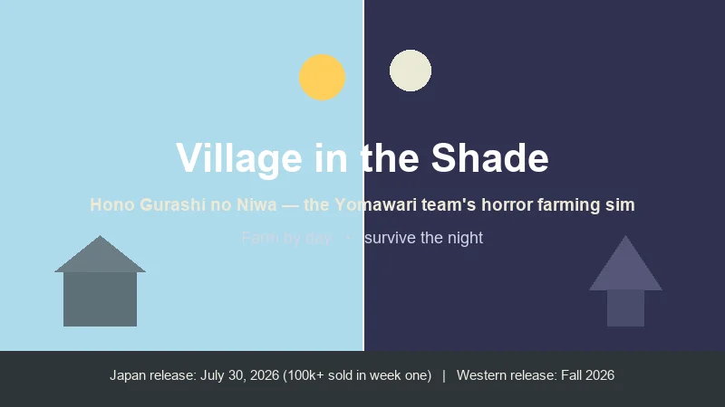
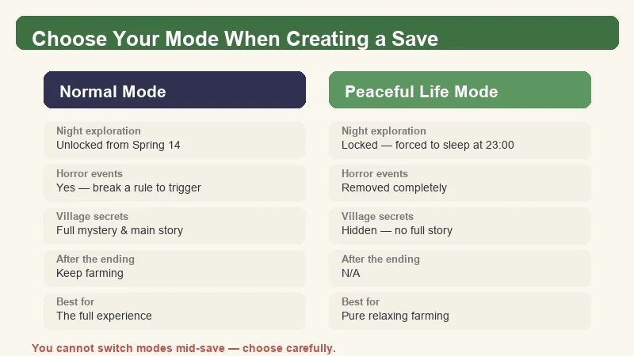
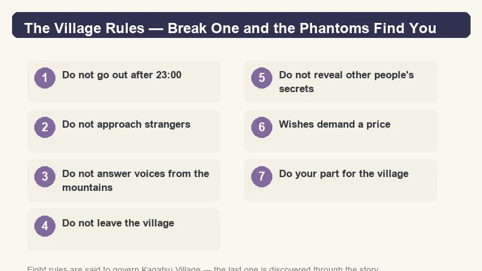
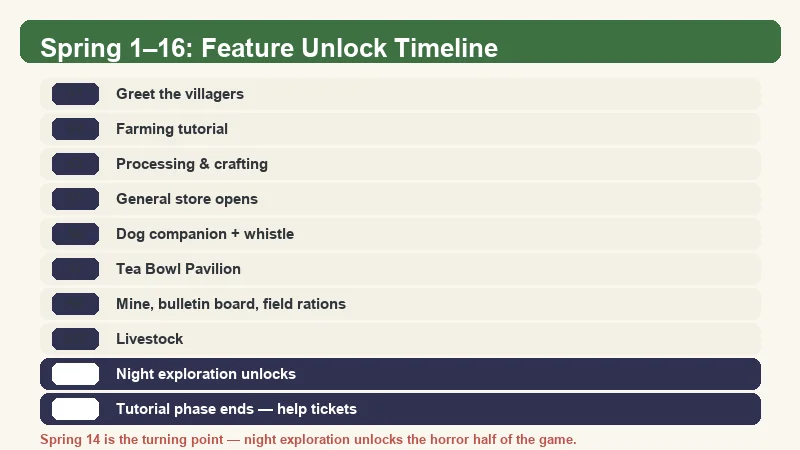
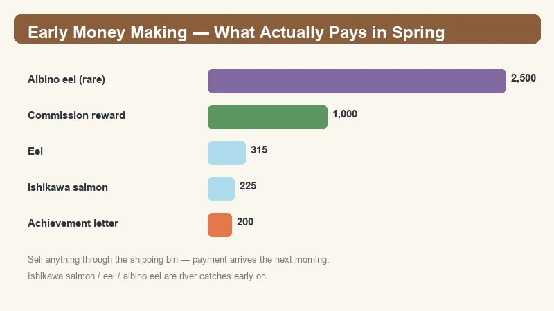
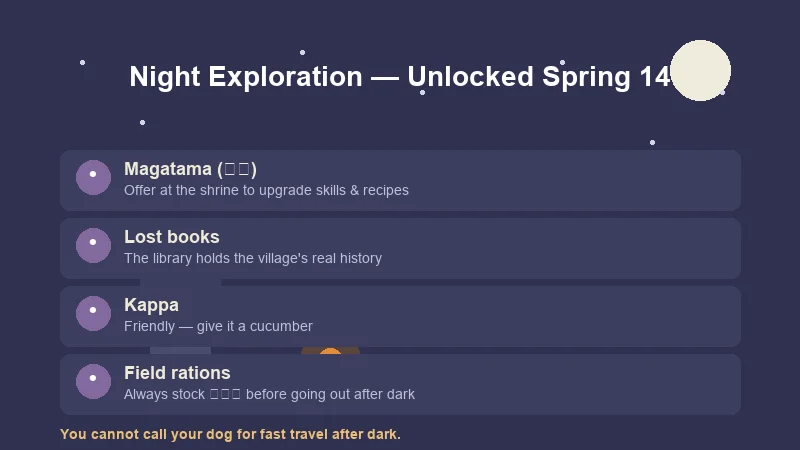

# Village in the Shade Beginner's Guide — How to Thrive in Kagatsu Village

> Game: Village in the Shade (*Hono Gurashi no Niwa*) | Developer: Nippon Ichi Software (Yomawari team) | Japan launch: July 30, 2026 · Western release: Fall 2026 | Platforms: PC (Steam), PS5, Switch, Switch 2

I have been following the Yomawari team's leap into the farming genre since the game was first teased back in 2025, and the Japanese launch did not disappoint — **Village in the Shade sold over 100,000 copies in its first week**. It is the rare cozy game that makes "peaceful" and "terrifying" share the same save file. During my time in Kagatsu Village I have mapped out the Spring unlock order, the money-making loop that actually works in the early game, and — most importantly — which village rules you absolutely cannot break if you want to sleep soundly.

*This guide is built from the Japanese launch build (July 2026), Chinese video guide coverage on Bilibili, and the official Japanese strategy material. The Western release in Fall 2026 may adjust names and numbers slightly — I flag anything that is worth double-checking in-game.*

---

## What Is Village in the Shade?

**Village in the Shade** (Japanese: **ほの暮しの庭 / Hono Gurashi no Niwa**) is a rural life simulation from **Nippon Ichi Software**, helmed by the team behind the *Yomawari* horror series. Planning and design are by *Yomawari* designer **Yu Mizokami**, with music by **Kazuya Takasu** (*Shin Hayarigami*).

You play a nameless orphan taken in by **Kagatsu Village** (彼津村), a remote mountain settlement that keeps its secrets behind eight village rules. To earn the right to stay, you work — farming, raising livestock, fishing, hunting, and helping villagers — while slowly uncovering why the village has so many taboos.

| Fact | Detail |
|:-----|:-------|
| **Developer** | Nippon Ichi Software (Yomawari team) |
| **Design** | Yu Mizokami (Yomawari designer) |
| **Music** | Kazuya Takasu |
| **Japan launch** | July 30, 2026 — 100,000+ copies in week one |
| **Western release** | Fall 2026 (NIS America), Steam page already live |
| **Platforms** | PC (Steam), PS5, Nintendo Switch, Switch 2 |
| **Japan price** | ¥8,200 (PS5/Switch 2/PC), ¥7,200 (Switch) |
| **Crops & flowers** | 80+ |
| **Craftable / decor items** | 1,500+ |
| **Core loop** | Farm by day, explore the village's secrets by night |

> **The hook:** by day this is a straightforward *Bokujo Monogatari*-style farming sim. At night it becomes the *Yomawari* horror you already know — but only if you break the rules.

---

## Normal Mode vs Safe Livelihood Mode

Before you even plant your first seed, Village in the Shade asks you to pick a mode — and **you cannot switch after the save is created**. This is the most important early decision in the game.

| | **Normal Mode** | **Safe Livelihood Mode** |
|:--|:----------------|:-------------------------|
| **Night exploration** | Unlocked from **Spring 14** | Locked — you are forced to sleep at 23:00 |
| **Horror events** | Yes — break a rule and Phantoms appear | Removed completely |
| **Village secrets & main story** | Full mystery, full ending | Hidden — no complete story |
| **After the ending** | Keep farming in the same save | N/A |
| **Best for** | Players who want the full experience | Players who want pure, relaxing farming |

If you choose Safe Livelihood Mode, Village in the Shade plays like a classic calm farming sim: nothing bad happens, and 23:00 just sends you to bed. You lose the story, the endings, and roughly half the game's identity. For a guide on the game *as designed*, this guide assumes **Normal Mode** — but the farming, money, and unlock sections below apply to both.

---

## The Village Rules — Follow Them to Stay Safe

The village's eight rules are the heart of Village in the Shade. **As long as you follow them, nothing terrible happens.** Break one and the game quietly flips into *Yomawari* mode — knocking on your door, shadows crawling across the kitchen, and something asking why you came to the village.

Seven of the eight rules are documented by players; the last one is part of the story:

1. **Do not go out after 11 PM** — the core night taboo.
2. **Do not approach strangers.**
3. **Do not answer voices from the mountains.**
4. **Do not leave the village.**
5. **Do not reveal other people's secrets.**
6. **Wishes demand a price.**
7. **Do your part for the village.**
8. *(Discovered through the main story.)*

> **Practical note:** you are *supposed* to break the curfew to advance the story — night exploration is the only way to reach the game's real content. Plan your rule-breaking: stock rations (兵粮丸), watch your stamina, and be back before the night goes badly wrong. Safe Livelihood Mode skips all of this entirely.

---

## Spring 1–16: Feature Unlock Timeline

Village in the Shade gates its systems behind a fixed calendar in the first season. The game stops feeling like a tutorial at **Spring 16**, when most of the sim opens up at once.

| Day | What unlocks |
|:---:|:-------------|
| **Spring 1** | Greet the villagers |
| **Spring 2** | Farming tutorial |
| **Spring 3** | Processing & crafting |
| **Spring 5** | Villager interactions, general store |
| **Spring 6** | Dog companion + summoning whistle |
| **Spring 7** | Tea Bowl Pavilion |
| **Spring 8** | Mine/quarry, bulletin board, field rations (兵粮丸) |
| **Spring 10** | Livestock (first animals) |
| **Spring 14** | First forced late-night outing → **night exploration unlocked** |
| **Spring 16** | Newbie phase ends — help tickets, gifting, prize gacha |

> 💡 **Why Spring 16 matters:** this is when "help tickets" (帮忙券) arrive. Each ticket is a small tutorial side-job from a specific villager, and they hand out **permanent tools and unlocks**. Prioritize these eight:
> - **驹子** — shrine access / skill-tree upgrades
> - **裕太** — insect catching / beehives
> - **洋** — fishing bait
> - **帷** — plow / paddy-field access
> - **四郎治** — hunting
> - **木助** — copper pickaxe
> - **堇怜** — bow
> - **莲实** — calendar

**Caution:** one villager's help ticket — **今野** — takes cash from you (up to 1,000 yen). Read the task before you accept it.

---

## Early Money Making — What Actually Pays in Spring

Money is tight in the first two weeks, and the land you want to expand costs real yen. Here is the early-game income data, ranked by what I found reliable:

| Method | Return | Notes |
|:-------|:-------:|:------|
| **Albino eel** (river, rare) | **2,500 yen** | Extremely rare catch — sell immediately |
| **Eel** | **315 yen** | Best reliable fish early on |
| **Ishikawa salmon** | **225 yen** | Common river catch, good volume |
| **Commissions** (bulletin board) | **up to 1,000 yen** | Most consistent repeatable income |
| **Achievement reward letters** | **100–200 yen each** | Mining, weeding etc. trigger mailed rewards — stacks up fast |
| **Shipping bin** | variable | Anything you put in sells next morning — always fill it before bed |

**My recommended Spring money loop:**

1. **Morning:** check the bulletin board, grab every commission you can complete today.
2. **Fish** the village river — salmon and eels bank the most reliable early cash. An albino eel is a jackpot; it covers your first land plot almost on its own.
3. **Do chores that complete achievements** (mining, clearing weeds) — the mailed reward letters arrive regularly.
4. **Before 23:00,** dump everything into the shipping bin so it pays out next morning.

---

## Land Expansion Costs

You start with a small plot, and expansion is the biggest early money sink. Confirmed first-tier prices:

| Plot | Cost |
|:----:|:----:|
| **Plot 1** | **5,000 yen** |
| **Plot 2** | **20,000 yen** |

Plot 1 is your single best early purchase — it roughly doubles your tillable space. Save Plot 2 for after you have the mine running. Prices are in yen (the in-game currency; the Western release may relabel it).

---

## Farming Basics

The farming layer is deep but the *first* hour is simple:

- **Till with the hoe**, plant, water daily. Crops that go unwatered for too long wilt.
- **Paddy fields need the plow** (unlocked via 帷's help ticket) — you cannot just hoe them.
- **Raised beds** come from the **shrine skill tree** (via 驹子's tickets) — they improve yield and are worth unlocking early.
- **Same crop, planted continuously, gains star quality** — starred crops sell for more. Rotating crops resets progress, so specialize in Spring.
- **Weeds:** use a sickle, or raise ducks — they auto-clear weeds for you.
- **Sprinklers** automate watering once you can craft them; long-press actions work in batches.
- **Season-end quality contest (品评会):** submit your best starred crop — winning pays well and raises reputation.

---

## Mining

Mining unlocks on **Spring 8**. Bring a pickaxe and a good stock of field rations.

- The **hammer/pickaxe repels the monsters** in the mine — you are not defenseless, but you are not a fighter either.
- Smashing rocks can reveal a **lower entrance** — the mine goes deep, not just wide.
- Every **10 floors** you hit a **minecart checkpoint** that saves progress and lets you return quickly.
- **木助's help ticket** gives the **copper pickaxe** — take it early, it makes mining dramatically faster.

---

## Hunting

Hunting is gated behind a **hunting license** bought at the hunter's hut.

- Use a **bow** (堇怜's ticket) or set **traps** (cage + bait) to take game.
- Each catch earns a **hunting proof** you trade at the hunter's hut for **meat, fur, and bones** — materials that feed both cooking and crafting.

Hunting is a mid-spring income and material source rather than a week-one priority, but it unlocks fast and pays for the bow almost immediately.

---

## Night Exploration (Spring 14+)

Once the first forced late-night outing happens on **Spring 14**, you can choose to stay out after curfew. This is where Village in the Shade becomes a different game.

- **Magatama (勾玉)** — found at night, offered at the shrine to **upgrade the skill tree and unlock crafting recipes**. This is the game's hidden progression currency.
- **The library** — collect books at night to piece together the village's history and the truth behind the rules.
- **Kappa** — not everything at night is hostile; a kappa will trade/ask for **cucumbers**. Worth keeping one in your inventory.
- **Bring rations (兵粮丸)** — night trips drain stamina, and you cannot call your dog for fast travel after dark.
- The reward for breaking curfew is real: the magatama and books are the only way to reach the game's best content.

> ⚠️ On the 4th night, something **knocks at your door** — even if you stay inside, shadows appear in the kitchen. This is the game telling you the mystery has started. It is scripted, not a punishment.

---

## Pro Tips & Common Mistakes

### ✅ Do This

- **Take 木助's ticket for the copper pickaxe** and 驹子's tickets for shrine skills as soon as they appear — both pay back immediately.
- **Always fill the shipping bin before bed** — it is free money every morning.
- **Buy Plot 1 as soon as you have 5,000 yen.** It more than doubles your space.
- **Keep a cucumber on you at night** — the kappa is friendly.
- **Stock field rations before Spring 14** so your first night trips do not end in fainting.

### ❌ Do Not Do This

- **Do not accept 今野's task blindly** — it takes up to 1,000 yen of your cash.
- **Do not rotate crops in the first month** — star quality only grows with repeated plantings.
- **Do not ignore the mine until "later"** — copper is the early bottleneck for tools.
- **Do not stay out past your stamina** — fainting at night can cost you items.
- **Do not expect to switch modes** — the Normal/Safe choice is locked at save creation.

---

## FAQ

### When does Village in the Shade release in English?
The Western release is scheduled for **Fall 2026**, published by NIS America. The Steam page is live now, and a Limited Edition is up for pre-order at $89.99. The Japanese version launched on July 30, 2026.

### What is the difference between Normal Mode and Safe Livelihood Mode?
Normal Mode includes the full horror story, night exploration, and endings. Safe Livelihood Mode removes all horror: you are forced to sleep at 23:00, village secrets stay hidden, and there is no full story or ending. The choice is made when creating the save and **cannot be changed later**.

### When can I explore at night?
Night exploration unlocks after the forced late-night outing on **Spring 14**. Before that, staying out past 23:00 is only dangerous, not useful.

### Is Village in the Shade actually scary?
Yes — by design. It is made by the *Yomawari* team, and night sections switch to that same tense, atmospheric horror. But the game is structured so that **if you follow the village rules, nothing happens**. The horror is mostly optional risk-taking for story progression.

### Do my pets die?
No. The developers have confirmed that **cats and dogs cannot die** in Village in the Shade, so you can bring them on your daily routines without worry.

### Are there bad endings?
The developers have stated there are no "bad" endings in the traditional sense — the main story reaches a conclusion, and you can keep farming in the same save afterward.

---

*Guide data gathered from the Japanese launch build, the official Japanese strategy material, and Chinese community video guides (Bilibili). Prices and unlock days are from the July 30, 2026 build and may shift slightly in the Fall 2026 Western release — always verify in-game before committing large amounts of yen.*
