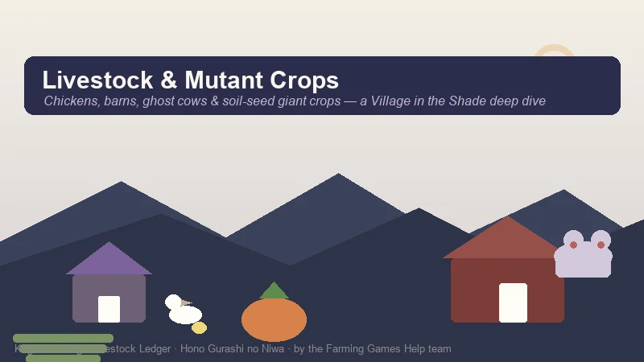
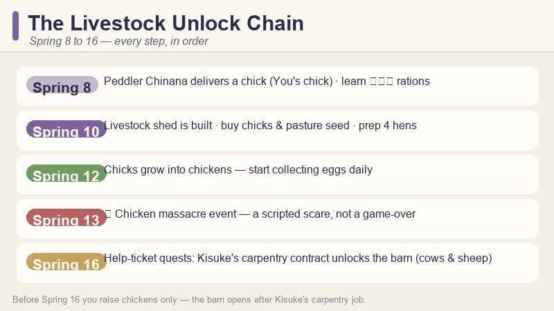
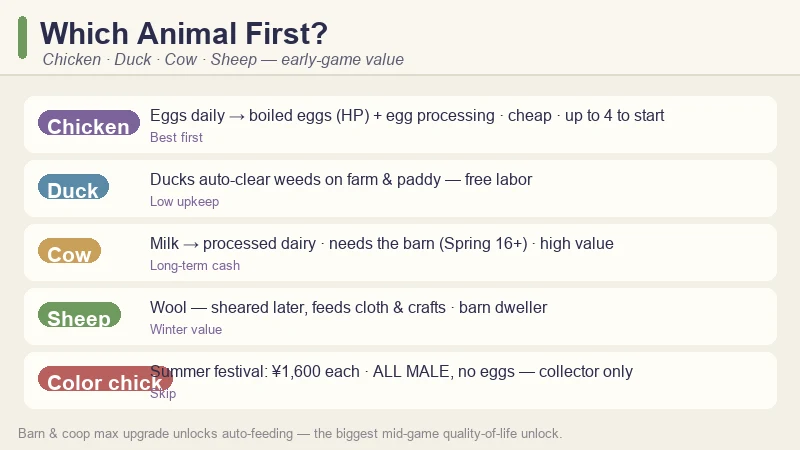
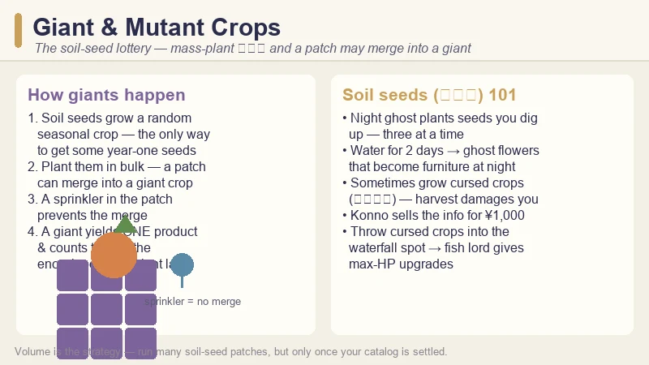
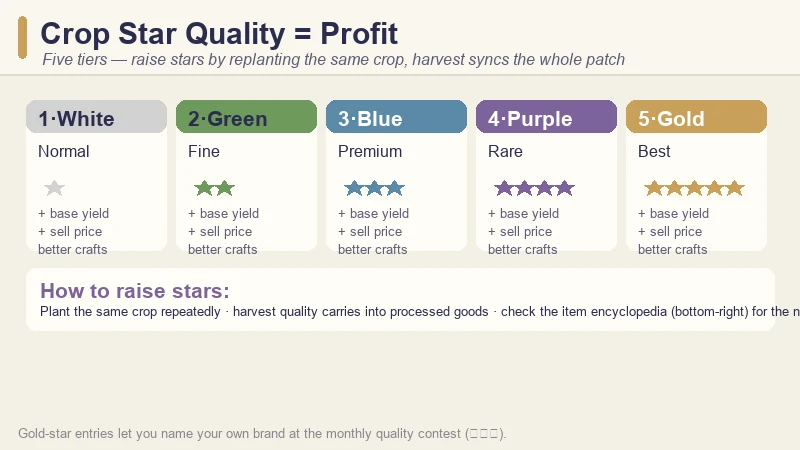

# Village in the Shade Livestock & Mutant Crops Guide — Barns, Chickens, Cows & Giant Crops

> Game: Village in the Shade (*Hono Gurashi no Niwa*) | Developer: Nippon Ichi Software (Yomawari team) | Japan launch: July 30, 2026 · Western release: Fall 2026 | Platforms: PC (Steam), PS5, Switch, Switch 2

When the peddler Chinana dumped a chick on my doorstep in Spring, I assumed livestock was a late-game luxury. It was not — the game hands you your first animal in **week one**, and the entire animal economy quietly becomes one of the strongest income and quality levers in Kagatsu Village. By Summer I was running a full coop plus a cow barn, and once I understood the **mutant-crop system** my harvests changed completely.

This is the guide I wish I had before Day 10. It covers the livestock unlock chain, which animals are actually worth your yen, daily care and friendship, the monthly quality contest, and the **soil-seed giant-crop lottery** — including the five-tier star quality system that sits underneath all of it.

*Guide data from the Japanese launch build (July 30, 2026), Chinese community video guides on Bilibili, and Japanese strategy articles. The Fall 2026 Western release may rename NPCs and shift prices slightly — the existing [Beginner's Guide](beginners-guide) covers the full Spring 1–16 unlock overview; this guide goes deep on the animal and mutant-crop systems.*

---

## When Livestock Actually Unlocks (Spring 8 → 16)

The animal systems unlock on a fixed calendar in your first season. If you have played the Beginner's Guide walkthrough, you know the shape — but the livestock-specific beat-sheet is worth seeing on its own:

| Day | Livestock milestone |
|:---:|:--------------------|
| **Spring 8** | Peddler **Chinana** appears and gives you a chick to raise; the clinic teaches the field-ration (兵糧丸) recipe |
| **Spring 10** | The **livestock shed** is built on your land; Chinana starts selling chicks (and other animals later) |
| **Spring 12** | Your chicks grow into **chickens** — egg collection starts |
| **Spring 13** | ⚠️ The **chicken massacre** event — a scripted horror beat, not a punishment |
| **Spring 16** | Help-ticket quests arrive; **Kisuke's carpentry contract** is what actually unlocks the **sheep & cow barn** |

Two things surprised me here:

1. **You do not need a coop building to start.** The shed comes with the story, and your first four chickens just live in it. The carpenter Kisuke only starts taking **expansion and renovation orders after the Spring 16 event** — that is also when his contract rewards let you commission the larger **barn**.
2. **Space is the hidden cost.** The barn for cows and sheep takes up a *lot* of land. Plan your crop layout around it, or you will be pickaxing fields you already watered.

> 💡 **Early-grab tip:** buy **pasture grass seed** from the general store and plant it in your yard right away. The animals need feed, and growing your own grass is dramatically cheaper than buying it.

---

## Raising Chickens First — the Smart Play

Chickens are your gateway animal, and they are genuinely the right first investment. Here is the early-game chicken data I gathered:

| Fact | Detail |
|:-----|:-------|
| **Starting flock** | Up to **4 hens** in the starter shed |
| **Egg use** | Boiled eggs (ゆで卵) restore **HP** — the best night-exploration food |
| **Boiled egg recipe** | From **Rokkaku's Spring 16 help ticket** (a camp stove, はんごう, is the tool) |
| **Hatching** | Eggs go into an **incubator** to hatch more chicks |
| **Processing** | Eggs → processed goods via the processing machines — sells for more than raw eggs |
| **Chicken colours** | Unlock after buying **two normal chickens** and reaching **1★ friendship** with them |

Why chickens first? Three reasons:

1. **They pay you every single morning.** A daily egg is a daily yen stream that never requires you to stop farming.
2. **Boiled eggs make the night game viable.** Night exploration (Spring 14+) drains stamina fast, and the best stamina recovery food in the early game is boiled eggs — the recipe comes from the same help-ticket batch that unlocks your barn.
3. **They teach you the friendship loop.** Livestock friendship rises from **feeding** even without petting (petting just speeds it up), and friendship drives produce quality — the same loop you will rely on for cows.

### The coloured-chick trap

At the **Summer festival** (Day 15), the stalls sell **coloured chicks for ¥1,600 each**. They look adorable. Do not buy a flock of them expecting eggs — **all coloured chicks are male and never lay eggs**. They are collector items, full stop. Spend the yen on a cow instead.

---

## Building the Barn: Cows, Sheep & Space Planning

The **barn** is the real livestock prize, and it is gated behind Kisuke's carpentry work:

1. Complete the **Kisuke help ticket** (Spring 16) — he hands you the **copper pickaxe**, and his *thanks* is the **carpentry contract** that lets you order the **sheep & cow barn**.
2. Clear a generous plot — the barn footprint is large, and you want grazing room around it.
3. Order the build from Kisuke, then keep feeding the shed.

Once the barn is up, cows and sheep become available:

| Animal | Produce | Processing | Early verdict |
|:-------|:--------|:-----------|:--------------|
| **Cow** | Milk | Processed dairy goods | The long-term cash animal |
| **Sheep** | Wool | Cloth & craft materials | Steady, best for winter prep |
| **Duck** | Eggs | — | **Auto-cleans weeds** on farm *and* paddy — free labor |

The **duck** is the sleeper pick. While cows are the obvious income animal, a single duck replacing your daily weeding saves hours each season — and the game's weeds will wreck a paddy field if you ignore them.

> 💡 **Milk is a springboard, not the endgame.** Cows → milk → **processed dairy** is the upgrade path, but the same processing logic applies to everything: *processed goods out-sell raw produce*. This is a core Village in the Shade rule, and it also explains why pickling barrels and brewing barrels are worth building in volume.

---

## Daily Care, Friendship & Auto-Feeding

Livestock upkeep is simple but non-optional:

- **Feed every day.** Animals left unfed lose mood, and mood drags down produce quality.
- **Pet and brush when you can.** Friendship rises from feeding alone, but interaction accelerates it — and high friendship unlocks **coloured chicken variants** and better produce.
- **Water the grass / keep feed stocked.** Grass regrows on your land; you can also buy feed.
- **Build toward auto-feeding.** At the **maximum coop and barn upgrade**, both buildings unlock **auto-feeding** — the single biggest mid-game quality-of-life upgrade in the animal system. Get there as soon as your wood stock allows.

One eerie (and useful) detail from the Yomawari side of the game: once your barn exists, a **red-eyed "ghost cow"** can appear among your grazing animals. At night, follow the mooing to the high ground behind the house, dig the raised mound, and you learn the **livestock whistle** — an unlock you cannot get any other way. The ghost cow disappears afterward, but it will eventually respawn.

The game is also gentler than its reputation: the developers have confirmed that **cats and dogs cannot die**, so your companions are safe on long workdays. Barn animals do need their feed, though — that part is real.

---

## The Monthly Quality Contest (品評会) — Livestock Counts Too

Every **27th of the month**, Kagatsu Village holds a **quality contest** — and it judges **crops *and* livestock**, not just produce.

| Contest fact | Detail |
|:-------------|:-------|
| **When** | Day 27 every month |
| **What you submit** | Your best-quality crop *or* animal product |
| **Silver star** | "So close" — the judge is impressed but not blown away |
| **Gold star** | You get to **name your own brand** |
| **Why it matters** | Winning pays well, raises reputation, and unlocks high-tier orders |

This is why star quality matters beyond the money. A gold-star submission is both a profit play and a progression play. So treat the contest calendar as a livestock deadline: by Day 27, you want your best-graded egg, milk, or crop on the town-square table.

---

## Giant & Mutant Crops — the Soil-Seed Lottery

The livestock guide would not be complete without the game's strangest farming system — **giant crops** (also called **mutant crops**). Bilibili guides have been obsessed with them since launch, and the trigger is not what you would expect: there are no "giant crop seeds." Giants come from the game's **wildcard seed — soil seeds (泥の種)**.

**How the mechanic works:**

1. **Soil seeds** grow into a **random seasonal crop** — and they are the only way to get some year-one seeds that never appear in the shop.
2. **Plant them in bulk** and a patch can merge into a single **giant (mutant) crop**. It is a lottery, so the more you plant, the more rolls you get.
3. **Place a sprinkler in the patch to prevent the merge.** If you are playing the seed lottery but do not want a giant (say, mid-encyclopedia), the sprinkler keeps the patch normal.
4. A giant crop yields **only one** product — and every mutant crop counts toward the **encyclopedia**. Trigger them *late*, after your first-year collection is comfortably settled, or you can lock yourself out of part of the catalog.

**Where soil seeds come from:**

Follow the **sludge-like ghost** you meet at night — it plants seeds you can dig up, **three at a time**. Two daytime waterings can also grow **ghost flowers** that become furniture when harvested at night. And beware the dark side of the lottery: soil crops occasionally grow **cursed crops** (祟られた crops). Harvesting one damages you, and the villager **Konno** will offer to sell you the explanation for **¥1,000** — buy it. Cursed crops are the key to a hidden reward: drop them into the **waterfall feeding spot**, and the fish lord there grants **max-HP upgrades**. The offering you need grows each time, so farm soil seeds steadily.

---

## Crop Star Quality = Profit

Underneath every money decision in Village in the Shade sits the **star quality system**. Every crop, flower, and fruit tree has a quality tier:

| Star | Tier | What it does |
|:----:|:-----|:-------------|
| ⭐ White | Normal | Baseline yield and price |
| ⭐⭐ Green | Fine | Higher base yield |
| ⭐⭐⭐ Blue | Premium | Higher sell price |
| ⭐⭐⭐⭐ Purple | Rare | Strongly boosted value |
| ⭐⭐⭐⭐⭐ Gold | Best | Max yield, price, and craft quality |

**How stars rise:** plant and harvest the **same crop repeatedly**. Each harvest season nudges the crop's quality up, and — crucially — **when you hit a quality threshold, every remaining plant in that patch syncs up to the new grade**. That is why the Beginner's Guide tells you not to rotate crops in Spring: specialization *is* the mechanic.

**How stars pay:** high-star crops sell for more, and — this is the important part — **processed goods inherit the raw material's star**. A gold-star crop run through a pickling or brewing barrel produces a gold-star product. The item encyclopedia shows your next threshold on the bottom-right of each entry.

---

## Livestock vs Crops vs Fishing — Where the Yen Really Is

I track my income every season, and the honest comparison looks like this:

| Method | Early income | Effort | Verdict |
|:-------|:------------:|:------:|:--------|
| **Fishing** | Eel **¥315** · Salmon **¥225** · White eel **¥2,500** (rare) | High (active) | Best early per-minute cash |
| **Crops (starred)** | Scaling with star tier | Medium | The compounding money engine |
| **Chickens** | Daily eggs → boiled eggs + egg processing | Low | Reliable passive income |
| **Cows** | Milk → processed dairy | Low | The mid-game upgrade |
| **Commissions** | Up to **¥1,000** each | Low | Best repeatable side income |
| **Processing** | Beats raw sales every time | Low | The universal multiplier |

The pattern I found: **fishing funds your first week, crops fund your first month, and livestock + processing funds everything after.** Land is the big sink — Plot 1 costs **¥5,000** and Plot 2 **¥20,000** — and both pay for themselves faster once you have a passive egg/milk income behind you.

> 💡 **One more processor to rush:** the **beehive**. Flowers → honey → **royal jelly** is one of the best yen-per-minute loops in the game, and it unlocks from Yuuta's help ticket.

---

## Pro Tips & Common Mistakes

### ✅ Do This

- **Buy pasture seed on Spring 10** — feeding your own grass beats buying feed.
- **Run four hens as soon as the shed is up** — the egg income compounds from Day 12.
- **Take Rokkaku's help ticket for the boiled-egg recipe** before your first big night trip.
- **Plan the barn's footprint before you plant Spring crops** — moving a paddy costs a day.
- **Check the encyclopedia before triggering giant crops** — collection comes first.
- **Submit your best animal product to the Day 27 quality contest** every month.

### ❌ Do Not Do This

- **Do not buy coloured chicks expecting eggs** — all male, ¥1,600 each.
- **Do not neglect animal feed to save money** — mood loss costs more in produce quality.
- **Do not mass-plant soil seeds if you are avoiding giant crops** — a sprinkler prevents them.
- **Do not rotate your crops in Year 1** — star quality resets when you switch.
- **Do not skip the ghost-cow event** — the livestock whistle is a permanent unlock.

---

## FAQ

### How do I get animals in Village in the Shade?
Chickens arrive through the story: Chinana brings your first chick on **Spring 8**, the livestock shed is built on **Spring 10**, and you can buy chicks from her stall. Cows and sheep need the **barn**, which unlocks after **Kisuke's Spring 16 carpentry contract**.

### How do I unlock the barn?
Complete Kisuke's help ticket on **Spring 16**. He gives you the copper pickaxe, and his reward is the carpentry contract that lets you commission the sheep-and-cow barn. Plan space for it — the building is large.

### What do chickens eat?
Chickens (and all livestock) need **feed every day**. You can buy feed or grow **pasture grass** from seed bought at the general store. At the **maximum coop/barn upgrade**, feeding becomes automatic.

### What are giant or mutant crops in Village in the Shade?
Giant crops are triggered by **mass-planting soil seeds (泥の種)** — the wildcard seed lottery that grows a random seasonal crop. A large patch has a chance to merge into one giant crop. **A sprinkler in the patch prevents the merge**, and every mutant crop counts toward the encyclopedia, so trigger them late in your first year.

### How do I raise crop star quality?
Plant and harvest the **same crop repeatedly**. When the patch hits a quality threshold, all remaining plants sync up to the new grade. Star quality raises yield, sell price, and the quality of processed goods.

### Do animals die in Village in the Shade?
Cats and dogs cannot die. Livestock need daily feeding — an unfed animal's mood drops and its produce quality suffers. The Spring 13 "chicken massacre" is a scripted story event, not something you caused.

### What is the monthly quality contest?
On the **27th of every month**, you submit your best crop or animal product. Silver-star entries are praised; **gold-star entries let you name your own brand** and raise your standing.

---

*Guide data gathered from the Japanese launch build, Japanese strategy articles (kanigame.jp), and Chinese community video guides on Bilibili. Prices and unlock days are from the July 30, 2026 build and may shift slightly in the Fall 2026 Western release — always verify in-game before committing large amounts of yen.*
