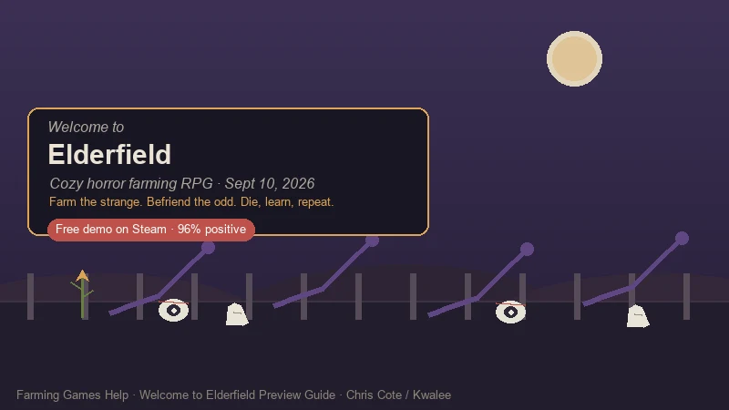
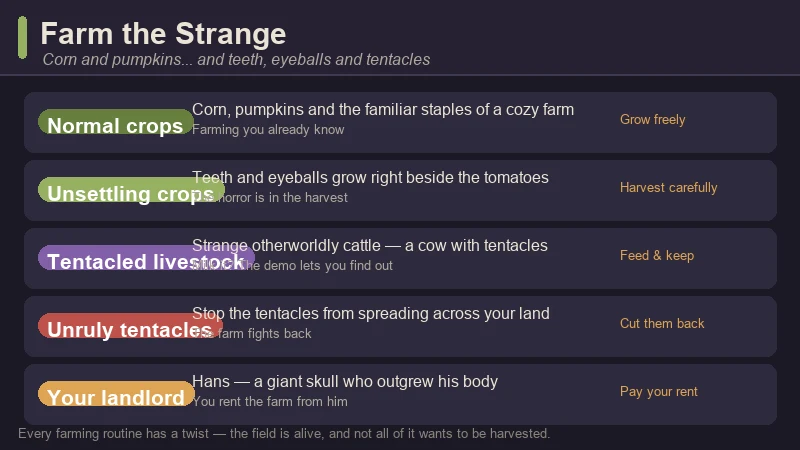
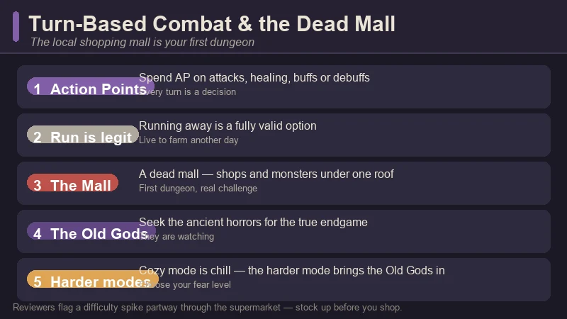

# Welcome to Elderfield Preview Guide — Cozy Horror Farming, the Strange Crops & the Dead Mall

> Game: Welcome to Elderfield | Developer: Chris Cote (solo) | Publisher: Kwalee | Releasing: **September 10, 2026** (Steam PC) | Platforms: PC (Windows) | Free demo: available now

I did not expect to feel *cozy* and *watched* at the same time. **Welcome to Elderfield** is the cozy-horror farming RPG everyone keeps describing as "Stardew Valley meets Welcome to Night Vale" — and for once the comparison is accurate. You inherit a small farm in a small town where the abnormal is the normal: you grow corn and pumpkins right next to teeth and eyeballs, your landlord is a giant skull who outgrew his body, and opening a trash can is a genuine gamble.

It is made by **Chris Cote**, a solo Canadian developer, and published by **Kwalee**, and it launches on **September 10, 2026** on PC via Steam. A **free demo is on Steam right now**, sitting at an **"Overwhelmingly Positive" ~96% rating** — the kind of number that usually means a word-of-mouth hit.

**One important note before you read on:** this is a **pre-release preview guide**, not a review of the finished game. Everything below is built from what is actually playable or shown so far: the **free Steam demo**, the **official trailer and store page**, the **launch press announcements**, and **hands-on demo impressions**, cross-checked against a **Chinese community playthrough on Bilibili** (《欢迎来到古原镇》经营农场 调查谜团 微恐Rpg新游, ~46 min) that walks through the same systems. I'll flag which details come from the developer's materials and which are observations from the demo.

---

## What Is Welcome to Elderfield?

**Welcome to Elderfield** is a cozy-horror RPG and farming sim. You inherit a farm on the edge of a small town where eldritch beings watch the streets, the local news grows stranger by the day, and the townsfolk are just odd enough to befriend — or romance. It is a full life sim on top of the farming: you grow crops, raise strange livestock, fish, mine, forage, cook, craft, decorate your home, investigate daily mysteries, and fight the ancient horrors with a deep turn-based combat system.

| Fact | Detail |
|:-----|:-------|
| **Developer** | Chris Cote (solo Canadian indie) |
| **Publisher** | Kwalee |
| **Steam release** | September 10, 2026 (PC) |
| **Free demo** | Available now — ~96% "Overwhelmingly Positive" (Steam, 500+ reviews), Simplified Chinese added |
| **Art** | Hand-drawn, horror manga-inspired (Junji Ito school) |
| **Music** | Dark lofi soundtrack by Dated |
| **Core loop** | Farm → forage → fish → mine → cook → befriend & romance → investigate → fight the Old Gods |
| **Farming** | Normal crops + unsettling crops (teeth, eyeballs), tentacled livestock |
| **Combat** | Turn-based with Action Points — attack, heal, buff, debuff, run |
| **Difficulty** | Cozy mode (relaxed) · harder mode where the Old Gods are waiting |
| **Tagline** | "Die, learn, farm, and forage… Then die again." |
| **Genre** | Cozy horror · farming · life sim · RPG |

**The pitch in one line:** Stardew Valley with a horror-manga soul — the daily rituals of farm life are all there, but every mundane action is one dice roll away from going wrong, and the farm gives the dread a structure you can actually live inside.

> **First-person take, up front:** the demo's trick is that the *horror is the stakes, not the set dressing*. Farming in a cozy game is usually relaxing *because* nothing can go wrong; here, cutting grass can start a fight and sleeping can end a curse — or start a worse one. The review consensus is that this is exactly why it works: the dread makes the cozy moments land harder. I'll get to the honest trade-offs at the end.

---

## The Premise — A Farm the Old Gods Noticed

The hook is the town. Elderfield is a place people rarely leave — not because they can't, but because the alternative isn't clearly better. The official materials lean into the Night Vale energy: unsettling local news programs, a radio and weather channel that gets stranger by the day, and eldritch beings that watch over the town without ever quite explaining themselves.

A few things the official materials make clear about how it works:

- **The farm is yours, but not really safe.** You cultivate land, harvest crops, and stop unruly tentacles from growing across your fields. The land itself pushes back.
- **The townsfolk are the cast.** Odd, hand-drawn, and each one a potential friend — or more. The store page and press materials stress that you can "befriend the odd townsfolk (or even marry one!)."
- **The mystery is the progression.** Daily mysteries, local news, and the search for the Old Gods sit on top of the farm loop. The demo gives you a taste; the full game is expected to expand the town to more than three times the demo's size with at least two more dungeon areas.
- **You can die in your sleep.** The store description lists it plainly, and the demo delivers. It's not a threat — it's a feature.

This is the rare cozy game where the "small town" framing is doing heavy lifting: the scale keeps you safe, and the horror makes sure you never feel it.

---

## The Free Demo — What You Can Play Right Now

Go play the demo. It is **free on Steam**, it has a **~96% positive rating** on 500+ reviews, and it is the best way to understand why everyone is talking about this game. The demo is a vertical slice — roughly **1/6 of the planned finished game** (one preview put it at about a third of the world) — and one reviewer reported spending **22 hours** completing most of what it offers.

What the demo covers:

- **One area of the town**, the farm and ranch, the first dungeon (the local dead mall), and several smaller places to explore.
- **The full farming loop** — planting normal and unsettling crops, dealing with tentacle growth, and tending the strange livestock.
- **The life sim layer** — fishing (a timing-based minigame), mining, foraging, cooking, home decoration, and a first look at befriending townsfolk.
- **Turn-based combat** — the mall is stocked with monsters and shops, and it is where the demo's difficulty curve lives.
- **A taste of the mystery** — the local news, the daily oddities, and the general "something is wrong here" texture.

**The one honest criticism from demo players:** the start is slow. Reviewers note the starting tools feel tedious, combat music is a little too upbeat for the mood, and there's a real difficulty spike partway through the supermarket. It's the kind of game where you should expect the first hour to be deliberately uneasy, not instantly gripping.

---

## The Farming — Corn, Pumpkins, Teeth and Eyeballs

The farming is familiar enough that any cozy-gamer can jump in, and strange enough that it never feels like a reskin. You till the land, plant seeds, water, wait, and harvest — but what comes up is not always a vegetable.

- **Normal crops anchor the loop.** Corn and pumpkins grow the way you'd expect, and they're your reliable early income and cooking fuel.
- **Unsettling crops are the twist.** Teeth and eyeballs grow right alongside the tomatoes — the horror is in the harvest, and the game never lets you forget the soil is weirder than it looks.
- **Tentacles grow back.** A recurring chore is stopping unruly tentacles from spreading across your land. The field fights back; cutting them down is part of the routine.
- **The livestock is otherworldly.** The ranch holds strange cattle — including a cow with tentacles (the demo's players have taken to calling them "tenacows"). You raise them like normal livestock; whether you milk them is a question the demo lets you answer yourself.
- **Your landlord is a giant skull.** Hans outgrew his body and rents you the farm. He's your introduction to the town's sense of humor.

The farming loop is deliberately the most familiar thing in the game — it's the anchor that makes the horror work. When you know exactly what a harvest should feel like, the crop that *shouldn't be there* lands harder.

---

## The Stakes — Everyday Tasks Roll Dice

This is the design decision that makes Welcome to Elderfield stand out: **mundane interactions use tabletop-style d6 dice rolls.** Nothing is safe, and the game wants you to feel that from the first trash can.

- **Most actions roll a die.** Opening a bin, looting a corpse, even sleeping — the d6 decides the outcome. It's a deliberate tabletop-RPG rhythm, and some reviewers find it a touch slow when you're checking many objects in a row.
- **Trash cans are a gamble.** A bin can hide a useful weapon — or a two-headed rat attack. A developer note says trash cans are a one-time early bonus, meant to help new players rather than reward backtracking.
- **Chores can trigger fights.** Cutting grass or breaking rocks has a chance to start a combat encounter. The demo's previews call this the "farming has stakes" hook.
- **The bath is a trade-off.** Soaking restores your health, but it resets the monsters onto the map. Recovery is real, and it's never free.
- **Sleep is a dice roll with consequences.** Sleeping can end a curse — or start a new one. Not sleeping at all is worse for your health. And yes: you can die in your sleep.

The reviewer line that stuck with me: the horror gives farming "stakes it otherwise lacks," while the farming gives the dread "a daily structure that makes it sustainable." That's the whole design in one sentence.

---

## Combat & the Dead Mall

When the dice go wrong, you fight — and the combat is a proper turn-based system, not a fluff minigame.

- **Action Points run every turn.** You spend AP on attacks, healing, buffs and debuffs, and the demo's previews stress that running away is a fully legitimate option. Not every fight is meant to be won.
- **Gathered resources feed your strategy.** The official materials say combat is about using what you've collected — crafted items, strategic buffs, and diverse equipment — to survive encounters with ancient, Lovecraftian horrors.
- **The dead mall is the first dungeon.** The local shopping mall is a full dungeon area: shops (useful in a fight) and monsters (less so) under one roof. It's where the demo's difficulty curve spikes.
- **The Old Gods are the endgame.** "Seek the Old Gods" is the mystery layer of the full game — and on the harder difficulty, they come looking for you.

**A fair warning from demo players:** the supermarket segment has a noticeable difficulty spike, and some encounters in the mall feel unavoidable, forcing repeated combat. Plan to enter the mall stocked and leveled, not on a whim.

---

## The Life Sim Layer — Befriend the Odd Townsfolk

Underneath the horror, Welcome to Elderfield is a full cozy life sim, and the relationship layer is where the "cozy" half of the genre name earns its keep.

- **Befriend or romance the townsfolk.** The cast is deliberately odd — one preview describes a skeleton among them — and the store materials confirm you can marry a local. Romance is a core feature, not an afterthought.
- **Fish, mine, forage, cook and craft.** Fishing is a timing-based minigame; mining and foraging feed crafting; cooking turns ingredients into food that can **heal, bless — or curse** you.
- **Customize everything.** Character and home customization, plus decorating, are first-class systems. The fantasy is making a home in a place that doesn't want you comfortable.
- **Unravel daily mysteries.** The local news and radio grow stranger by the day, and investigating them is the game's long-term thread.

The relationship and mystery layers aren't separate from the farming — they're the same loop. Cook food to impress (or survive) the townsfolk, befriend them to unlock the town's secrets, and use what you learn to keep the farm alive another day.

---

## Welcome to Elderfield vs. Other Cozy Farming Sims

| | **Welcome to Elderfield** | **Stardew Valley** | **Grave Seasons** | **Village in the Shade** |
|:--|:--|:--|:--|:--|
| **Setting** | A small horror-tinged town | Countryside farm town | Ashenridge, a killer among neighbors | A shaded mountain village |
| **Art** | Hand-drawn, horror-manga | Pixel art | Pixel art | Hand-drawn, Yomawari studio |
| **Horror style** | Cozy dread, dice-roll stakes | None | Slasher mystery | Yōkai / night-scary |
| **Combat** | Turn-based, Action Points | Light | Investigative | Night exploration |
| **Romance** | Befriend / marry the odd townsfolk | Full marriage system | Romance some candidates | Full relationships |
| **Release state** | Sept 10, 2026 (demo now) | Released (2016) | Fall 2026 (preview) | 2026 |

It's not trying to beat Stardew at breadth — it's deliberately smaller, odder, and closer. If you want a farm you can relax into without a hint of danger, Elderfield isn't that. If you want a farm where the cozy and the creepy feed each other, there's nothing else quite like it.

---

## Pro Tips — Do & Don't

### ✅ Do This

- **Play the demo before deciding.** It's free, ~96% positive, and it tells you exactly whether "cozy with stakes" clicks with you.
- **Roll with the dice.** The d6 is the game's heartbeat — don't fight the randomness, budget for it.
- **Check trash cans early.** They're a one-time new-player bonus, and a good weapon can carry your first dungeon trip.
- **Cook before you sell or gift.** Cooked food heals, blesses — or curses — so know what you're eating before you eat it.
- **Stock up before the mall.** Reviewers flag a real difficulty spike partway through the supermarket; go in prepared.
- **Befriend the townsfolk early.** Romance and mystery progression both start with the cast.
- **Try the harder difficulty eventually.** The Old Gods are the game's real endgame; cozy mode is the tutorial with a safety net.

### ❌ Do Not Do This

- **Do not treat every fight as a fight to the death.** Running away is a fully legitimate option.
- **Do not ignore the tentacles.** They grow back, and a field you stop tending becomes a field that tends itself — badly.
- **Do not hoard every trash-can gamble.** They're a one-time bonus; the game explicitly wants you to stop backtracking for them.
- **Do not sleep carelessly.** It can end a curse — or start a new one. And you can die in your sleep.
- **Do not expect a big, safe farm.** The whole point is the small, *unsafe* one.
- **Do not judge the game by its first hour.** The slow start is the demo's most common complaint, and it picks up fast.

---

## FAQ

### When does Welcome to Elderfield release?
**September 10, 2026** on Steam (PC). A **free demo is available now**.

### Is Welcome to Elderfield out yet?
No — it's a **pre-release preview guide**. The game launches September 10, 2026. Everything in this guide is based on the free demo, the official trailer and store page, press announcements and hands-on impressions.

### What is Welcome to Elderfield about?
You inherit a farm in a small town where eldritch beings watch the streets and the abnormal is normal. Grow normal crops alongside unsettling ones (teeth, eyeballs), raise strange livestock, cut back the tentacles, fish, mine, cook, befriend or romance the odd townsfolk, investigate daily mysteries, and fight ancient horrors with turn-based combat.

### Is the demo any good?
Yes — it's sitting at roughly **96% "Overwhelmingly Positive"** on Steam from 500+ reviews, and one reviewer reported ~22 hours of content in the demo alone.

### Can you romance characters in Welcome to Elderfield?
Yes. The official materials say you can befriend the odd townsfolk "or even marry one!" — romance and marriage are core features.

### What's the combat like?
**Turn-based with an Action Point (AP) system** — attacks, healing, buffs, debuffs, and running away are all valid. The dead mall is the first dungeon, and the harder difficulty brings in the Old Gods.

### Is there a cozy mode?
Yes. **Cozy mode** is a laid-back farming/exploration experience; a harder difficulty offers a tougher challenge where the Old Gods are waiting.

### What are the system requirements?
Check the Steam page for the final list — the game is PC (Windows) via Steam, with a free demo you can run right now.

---

## 🔗 Related Guides

- 🌾 [Stardew Valley Complete Game Guide](/stardew/) — the cozy-farming benchmark for crop calendars and profit loops
- ⚰️ [Grave Seasons Preview Guide](/grave-seasons/) — the other cozy-horror farming sim coming Fall 2026
- 🌘 [Village in the Shade Guide](/village-in-the-shade/) — NIS's horror-tinged farming sim by the Yomawari team
- 🏘️ [Go-Go Town! Beginner's Guide](/go-go-town/) — the cozy city-builder + farming sim that launched 1.0 in July 2026
- ✨ [Fields of Mistria Guide](/fields-mistria/) — another 2026 farming sim with a fresh full release

---

*Guide data gathered from the official Steam store page and free demo, the launch press announcements (Kwalee / GamesPress), the release-date coverage (IGN, Bloody Disgusting, GameRant, Simulation Daily, ScreenRant), hands-on demo impressions (UMGamer, nevermoreniche), and a Chinese community playthrough on Bilibili (《欢迎来到古原镇》经营农场 调查谜团 微恐Rpg新游, ~46 min). Welcome to Elderfield is not yet released — details reflect the September 2026 launch build and demo and may change; always check the Steam page before buying.*
